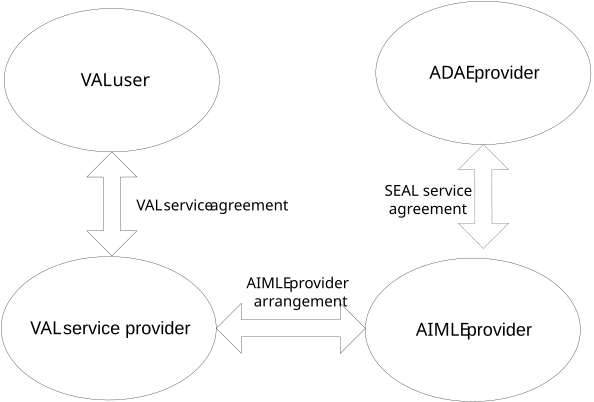
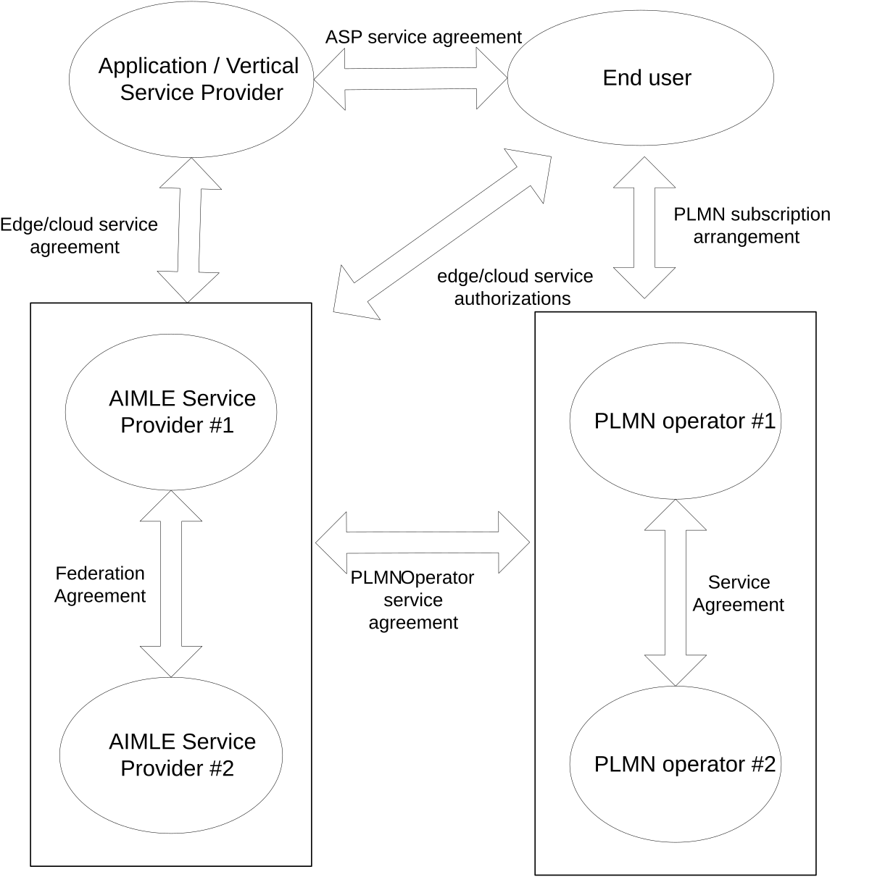

# Annex B (informative): Business Scenarios

Figure B-1 shows the business relationships that exist for the AIMLE functionality and that are needed to support a single VAL user.

Figure B-1: Business relationships for VAL services

The VAL user belongs to a VAL service provider based on a VAL service agreement between the VAL user and the VAL service provider. The VAL service provider can have VAL service agreements with several VAL users. The VAL user can have VAL service agreements with several VAL service providers.

The VAL service provider can have AIMLE provider arrangements with multiple AIMLE providers.

The AIMLE server is part of the AIMLE provider. The AIMLE provider can have SEAL service agreements with other SEAL service providers and in particular ADAE provider if needed for utilizing AIMLE services for ADAE analytics. Such arrangements allow the ADAE provider to utilize the AIMLE provider services.

The AIMLE and ADAE providers can either be part of the PLMN or have service arrangements with PLMN operators.

NOTE: The ADAE provider can have further arrangements with PLMN operator and VAL service provider; however, this is not shown in the figure.

## B.1 Business Relationship for federation and roaming

There can be different business relationships with respect to federation and roaming. In Figure B.1-1, the enhanced business relationships for federated AIMLE services are illustrated.

Figure B.1-1: Relationships involved in AIMLE service – federation and roaming

The end user is the consumer of the applications provided by the ASP. The End user:

\- can have ASP service agreement with a single or multiple application service providers.

\- has a PLMN subscription arrangement with a PLMN operator (HPLMN), and the UE used by the end user can register on the HPLMN network and network of its roaming partners; or has a SNPN subscription arrangement with a SNPN operator (subscribed SNPN), and the UE used by the end user can register on the subscribed SNPN and a serving SNPN.

> \- can have authorization to access edge services of a single or multiple ECSPs.

The ASP consumes the AIMLE services provided by the AIMLE service provider. The ASP:

\- can have AIMLE service provider service agreement with a single or multiple AIMLE service providers.

The PLMN operator provides connectivity between the end user and the AIMLE services provided by the AIMLE service provider. The PLMN operator:

\- can have the PLMN operator service agreement with a single or multiple AIMLE service providers.

\- can have service agreement for roaming including agreements for AIMLE services, and/or federation with a single or multiple PLMN operators.

The AIMLE service provider provides the AIMLE services. The AIMLE server:

\- can have PLMN operator service agreement with a single or multiple PLMN operators which provide AIML support service.

\- can have federation partnership to share AIMLE services with a single or multiple AIMLE service providers.

The AIMLE service provider and the PLMN operator can be part of the same organization.
