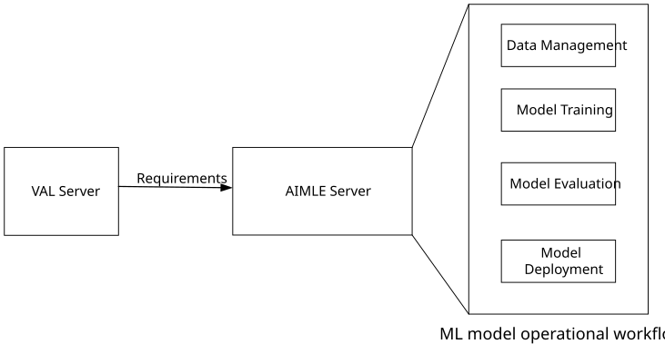
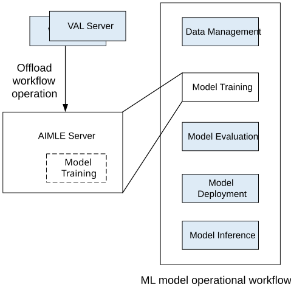
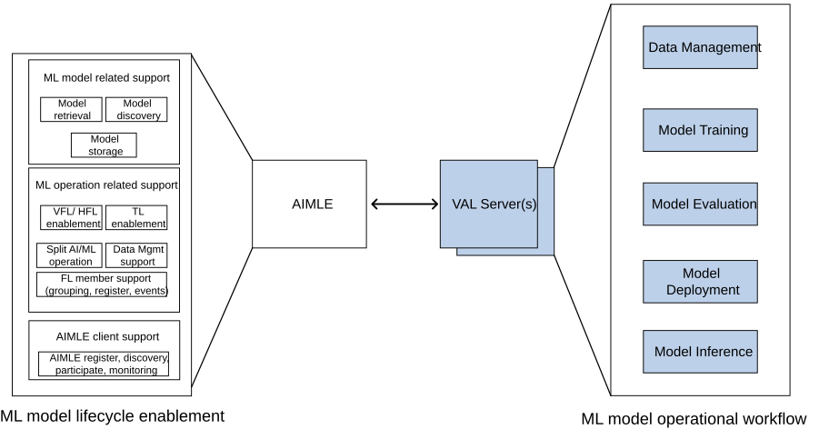

# Annex C (informative): Role of AIMLE in ML Model Lifecycle

## C.1 General

ML model lifecycle (aka ML model operation workflow) contains several parts including ML model training, ML model testing, AI/ML inference emulation, ML model deployment, AI/ML inference, Data Management, intermediate model aggregation, Trained AI/ML model delivery, and so on. The consumer can delegate all or part of ML model lifecycle to the AIML enablement layer. In doing so the AIML enablement layer can take over some AI/ML related work for the consumer and reduce the complexity of implementation for consumers. In the below sub-clauses, some options for the role of AIMLE in the ML model lifecycle are provided.

## C.2 Role#1 of AIMLE in ML Model Lifecycle

In this scenario, the consumer completely rely on the AIML enablement layer for managing the ML operational workflow. That is, the consumer send the requirements of the AI/ML application, then the AIML enablement layer can perform ML operational workflows and determine the required AI/ML model to send to the consumer. Such role of AIMLE is captured in the capability related to AIML service operations control and management as described in clause 8.20.

Figure C.2-1: Example of Role#1

## C.3 Role#2 of AIMLE in ML Model Lifecycle

In this scenario, consumer would like to perform part of the ML operational workflow, then consumer partially rely on the AIML enablement layer to assist with ML operational workflowss. Due to different ML operational workflow division, the AIML enablement layer can provide different levels of assistance on ML workflows for consumers.

Such capability is captured for example for ML model training (as in clause 8.3), HFL training (as in clause 8.12), model evaluation (which is captured in clause 8.19 in model capability evaluation, and 8.22 in model performance monitoring procedures). Figure C.3-1 illustrates an example where ML model training is handled by the AIMLE where the other operations are performed by the VAL / ASP.

Figure C.3-1: Example of Role#2

## C.4 Role#3 of AIMLE in ML Model Lifecycle

In this scenario, the AIMLE is not performing part of the ML operational workflow; however it serves as a platform to enable the AI/ML apps to utilize ML operational workflows which are provided by VAL. In this role, the AIMLE supports tasks like the discovery, registration, storage, grouping and selection of entities to be performing the ML operations in the lifecycle. Such role is more applicable to ML model lifecycle enablement which provides assistance for use cases where an ASP/VAL wants to find other application entities to perform some ML operations (e.g. ML model inference) and AIMLE server as a mediator to accomplish this.

An example including some capabilities is illustrated in Figure C.4-1. In this figure, the support capabilities are based on AIMLE capabilities identified in this specification. In particular, AIMLE is undertaking:

\- ML model related support capabilities such as model retrieval, discovery and storage (as covered in procedures in clauses 8.2 and 8.11 )

\- ML operation related support capabilities such as VFL/ HFL and TL enablement, Split AI/ML Operation support, Data management assistance, AI/ML task transfer, FL assistance in member grouping, registration and event notification (as covered in procedures in clauses 8.4, 8.6, 8.12, 8.14, 8.15-8.18).

\- AIMLE client related support capabilities, including AIMLE client registration, discovery, participation, monitoring, selection (as covered in procedures in clauses 8.7-8.10, 8.13).

Figure C.4-1: Example of Role#3
