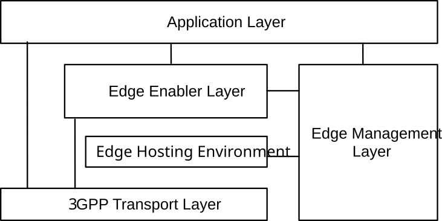

# 4 Overview

## 4.1 General

For edge computing, it is essential that the ACs are able to locate and connect with the most suitable application server available in the EDN, depending on the needs of the application. The edge enabler layer exposes APIs to support such capabilities.

The edge computing capabilities supported by 3GPP are illustrated in the figure 4.1-1.

Figure 4.1-1: Overview of 3GPP edge computing

The application layer is a consumer of 3GPP specified edge computing capabilities. The 3GPP edge computing capabilities are typically organized as follows:

\- Edge enabler layer, specified in this specification;

\- Edge hosting environment, details of which are outside the scope of 3GPP;

\- 3GPP transport layer, specified in 3GPP TS 23.401 \[11\] and 3GPP TS 23.501 \[2\]; and

\- Edge management layer, specified in 3GPP TS 28.538 \[22\].

Following clauses provide an overview of the features of edge enabler layer.

The edge computing features defined in this specification are applicable to PLMN(s) and to SNPN(s) as 3GPP transport layer. In this specification, when PLMN is mentioned, it is also applicable for SNPN unless stated otherwise.

## 4.2 Service provisioning

Service provisioning procedures supply the information required by the UE to access the edge services. The procedure takes UE's location, service requirements, service preferences and connectivity information into account to provide the required configuration. Service provisioning procedures are specified in clause 8.3.

## 4.3 Registration

Registration procedures specified in clause 8.4, allow entities (e.g. UE and Application Server) in the edge enabler layer to provide information about itself to other entities of the edge enabler layer.

## 4.4 EAS discovery

EAS discovery procedures enable the UE to obtain information about suitable EASs of interest (specified as discovery filters) in the EDN. EAS discovery procedures are specified in clause 8.5.

## 4.5 Capability exposure to EAS and EEC

The edge enabler layer exposes services towards the EASs and EECs. The exposed capabilities include the services of the Edge Enabler Layer and the re-exposed and enhanced services of the 3GPP core network. The capabilities exposed by the edge enabler layer are specified in clause 8.6 and the 3GPP network capability exposure is specified in clause 8.7. Other application layer capabilities like application enabler services and SEAL services may be exposed via edge enabler layer as per CAPIF as illustrated in Annex A.4.

The edge enabler layer also supports for an EAS to expose its Service APIs (i.e., EAS Service APIs) towards the other EASs via CAPIF as specified in 3GPP TS 23.222 \[6\] by deploying CAPIF core function within the EES to support publish and discovery of EAS Service APIs. The details are provided in Annex A.5.4.

## 4.6 Support for service continuity

When a UE moves to a new location, different EASs can be more suitable for serving the UE. When no suitable EAS can be found for serving the UE, the service session may transition to a CAS. Such transitions can result from a non-mobility event of UE also, requiring support from the edge enabler layer to maintain the continuity of the service. Support for service continuity provides several features for minimizing the application layer service interruption by replacing the S-EAS connected to the AC in the UE, with a T-EAS or CAS. Support for service continuity is further specified in clause 8.8.

When an ACR event occurs, the UE’s application context is transferred from the S-EAS to T-EAS. This procedure is termed the Application Context Transmission (ACT) is out of the scope of this specification.

## 4.7 Security

The edge enabler layer supports secure communication amongst the enabler layer entities. The security aspects for the edge enabler layer are specified in 3GPP TS 33.558 \[23\]. Clause 8.11 provides details on EEC authentication and authorization.

## 4.8 Dynamic EAS instantiation triggering

The Edge Enabler Layer can interact with the ECSP management system to trigger instantiation of a suitable EAS as per application needs. Details of the EAS instantiation triggering are specified in clause 8.12.

## 4.9 Charging

The general architecture and principles applicable for charging of Edge enabling services provided by an ECSP to an ASP, is specified in 3GPP TS 32.240 \[24\].

## 4.10 Common EAS discovery

For the purpose of Common EAS discovery, it is relevant whether the deployment is with or without ECS-ER.

## 4.11 Bundle EAS

The bundle EAS contains two scenarios: direct bundle, proxy bundle. Both type of bundles are provided by the ASP

Direct bundle EAS: the AC interact with multiple EASs, so that the AC can obtain services from multiple EAS, then AC can process the data from multiple EASs and calculate the result based on the data obtained from multiple EASs.

Proxy bundle EAS: the AC interact with one EAS (i.e. main EAS) of the EAS bundle, and the main EAS interact with other EASs, the main EAS can process the data from other EASs and calculate the result based on the data obtained from other EASs, then main EAS can provide the result to the AC.

### 4.11.1 Direct bundle

For the purpose of direct bundle EAS discovery, the AC profile is configured the bundle type (direct bundle), bundle ID, list of EAS IDs which belongs to the direct bundle. Accordingly, the EAS profile is configured with the bundle type (direct bundle), bundle ID. The ECS identifies the EES(s) which support all the direct bundle EASs as described in clause 8.3.3.2.2. Then the EES(s) identifies the direct bundle EAS as described in clause 8.5.2.2.

### 4.11.2 Proxy bundle

For the purpose of proxy bundle EAS discovery, the AC profile is configured with the bundle type (proxy bundle), bundle ID, main EAS ID. Accordingly, the main EAS profile is configured with the bundle type (proxy bundle), bundle ID, and list of EASIDs which belongs to the proxy bundle. The ECS identifies the EES which the main EAS registered to as described in clause 8.3.3.2.2. Then the EES identifies main EAS as described in clause 8.5.2.2. Then the main EAS could interact with other proxy bundle EASs.

## 4.12 Federation and Roaming

Federation and Roaming is a scenario that UE consumes edge service involving two or more ECSPs. For example, two ECSPs (ECSP#1, ECSP#2) has business relationship that is the ECSP#2 can provide edge service to subscriber of ECSP#1, as for subscriber of ECSP#1, the ECSP#2 can be seen as partner ECSP. When ECSP#1' subscriber requires the edge service, the ECSP#1' subscriber could obtain service from ECSP#2’s ECS, EES and EAS.

For the purpose of EAS discovery in federation and roaming, the partner ECS discovery is described in clause 8.17.2.3. The service provisioning information retrieval procedure is used for obtaining partner ECSP’s EDN information as described in clause 8.17.2.4.

## 4.13 EAS content synchronization and Application context

When a group of UEs with a common Application Group ID requires application service, the group of UE in different EDNs may connect to multiple common EASs; in such case, EAS content synchronization is required between the common EASs in different EDNs for the UEs in the group.
