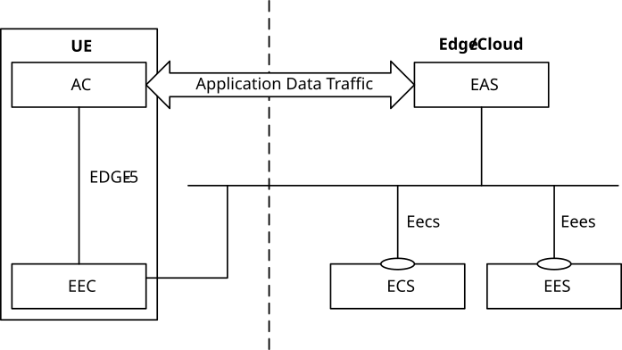
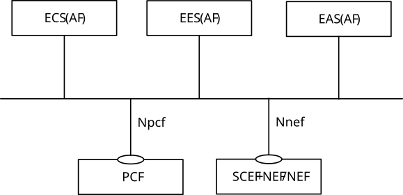
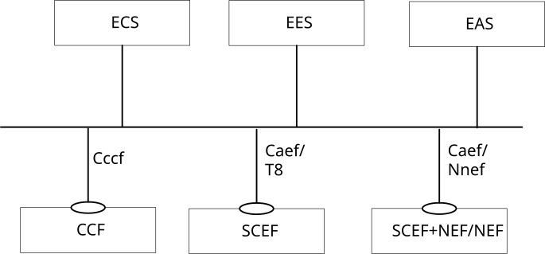
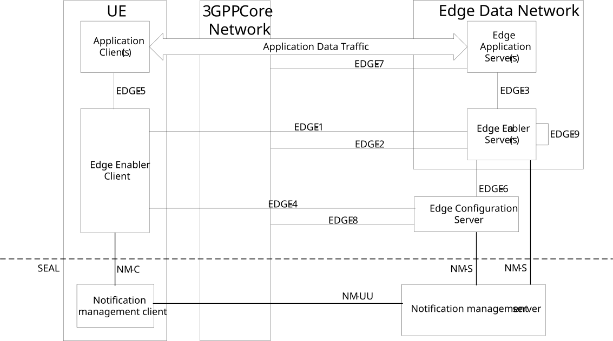

# 6.2 Architecture

This clause describes the architecture for enabling edge applications in the following representations:

\- A service-based representation, where the Edge Enabler Layer functions (e.g. ECS) enable other authorized Edge Enabler Layer functions (e.g. EES) to access their services. This representation also includes point-to-point reference points where necessary;

\- A service-based representation as specified in 3GPP TS 23.501 \[2\], where the Network Functions (e.g. NEF) enable authorized Edge Enabler Layer functions (e.g. ECS) i.e. Application Functions, to access their services;

\- A service-based representation, where the Core Network Northbound APIs as specified in 3GPP TS 23.501 \[2\] and 3GPP TS 23.502 \[3\], are utilized by authorized Edge Enabler Layer functions via CAPIF core function specified in 3GPP TS 23.222 \[6\]; and

\- A reference point representation, where existing interactions between any two functions (e.g. EES, ECS) is shown by an appropriate point-to-point reference point (e.g. EDGE-6, EDGE-7).

Edge Enabler Layer functions shown in the service-based representation of the edge architecture shall only use service-based interfaces for their interactions.

Figure 6.2-1 illustrates the service based representation of architecture for enabling edge applications.

Figure 6.2-1: Architecture for enabling edge applications - service-based representation

NOTE: The EEC function and EAS function in figure 6.2-1 do not expose any service to the other functions.

The mechanisms for service discovery in the service-based representation depicted in figure 6.2-1 are as follows:

\- The EES discovers the ECS via pre-configuration or by using CAPIF as specified in 3GPP TS 23.222 \[6\];

\- The EAS discovers the EES via pre-configuration or by using CAPIF as specified in 3GPP TS 23.222 \[6\];

\- The EAS discovers the other EAS(s) as specified in clause 8.8.3.2;

\- The EEC discovers the ECS as specified in clause 8.3.2; and

\- The EEC discovers the EES via service provisioning as specified in clause 8.3.3.

Figure 6.2-2 illustrates the service-based representation for utilization of the 5GS network services based on the 5GS SBA specified in 3GPP TS 23.501 \[2\].

Figure 6.2-2: Utilization of 5GS network services based on the 5GS SBA – service based representation

The ECS, EES and EAS act as AFs for consuming network services from the 3GPP 5G Core Network entities over the Service Based Architecture specified in 3GPP TS 23.501 \[2\].

Figure 6.2-3 illustrates the service-based representation for utilization of the Core Network (5GC, EPC) northbound APIs via CAPIF.

Figure 6.2-3: Utilization of Core Network Northbound APIs via CAPIF – service based representation

The ECS, EES and EAS act as authorized API invoker to consume services from the Core Network (5GC, EPC) northbound API entities like SCEF, NEF, SCEF+NEF which act as API Exposing Function as specified in 3GPP TS 23.222 \[6\].

The mechanism for northbound APIs discovery using the service-based interfaces depicted in figure 6.2-3 is as specified in 3GPP TS 23.222 \[6\].

Figure 6.2-4 illustrates the reference point representation of the architecture for edge enabling applications.

Figure 6.2-4: Architecture for enabling edge applications - reference points representation

The EDN is a local Data Network. EAS(s) and the EES are contained within the EDN. The ECS provides configurations related to the EES, including details of the EDN hosting the EES. The UE contains AC(s) and the EEC. The EAS(s), the EES and the ECS can interact with the 3GPP Core Network. When SEAL notification management service is used, the EES and the ECS interact with the SEAL notification management server and the SEAL EEC interacts with SEAL Notification management client.
