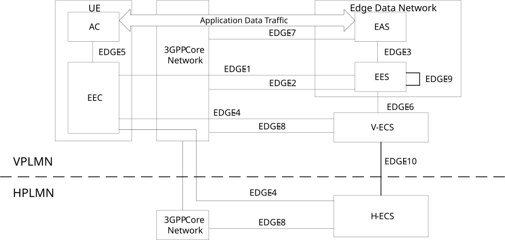
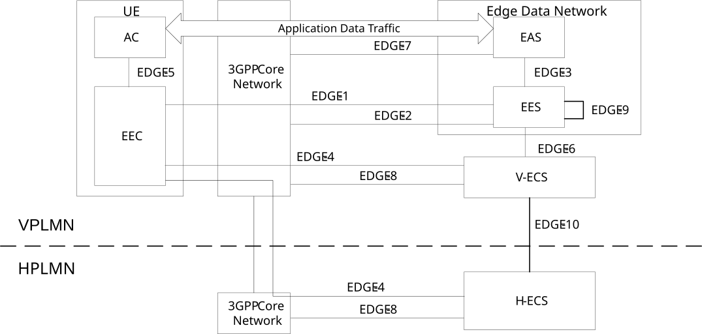

# 6.2a Architecture for Roaming support

## 6.2a.1 General

This clause describes the architectures for roaming UEs. To support UEs that are roaming, the EEL uses ECSs provided in HPLMN and VPLMN. The EEC in the UE obtains edge enabler layer services from V-ECS and V-EES. EDGE-10 reference point is used between the H-ECS and the V-ECS. Two roaming models are supported for edge enabling applications:

\- Local breakout (LBO)roaming architecture; and

\- Home routed (HR) roaming architecture.

In both architecture options, the EDN is located in the V-PLMN and is accessed via an LBO or HR-SBO session.

NOTE: H-ECS, H-EES and V-ECS, V-EES can be provided by the same ECSP.

## 6.2a.2 Local breakout roaming architecture: Local breakout to access H-ECS

Figure 6.2a.2-1 shows the roaming architecture for enabling edge applications as the reference point representation when the local breakout (LBO) PDU Session is used for routing EDGE-4 traffic between the EEC and the H-ECS.

Figure 6.2a.2-1: Architecture for enabling edge applications for local breakout roaming scenarios

## 6.2a.3 Home-routed EDGE-4 access to H-ECS

Figure 6.2a.3-1 shows the roaming architecture for enabling edge applications as the reference point representation when the home routed (HR) PDU Session is used for routing EDGE-4 traffic between the EEC and the H-ECS.

The traffic toward the EDN of the VPLMN (i.e. EDGE-1 traffic and application data traffic) is not routed via the HPLMN while the traffic between the EEC and H-ECS is routed via VPLMN toward HPLMN. Such a local access to the EDN of the VPLMN in the scenario is supported when a home routed session breakout (HR-SBO) PDU Session is used as described in clause 6.7 of 3GPP TS 23.548 \[20\].

Figure 6.2a.3-1: Architecture for enabling edge applications for home routed roaming scenarios
