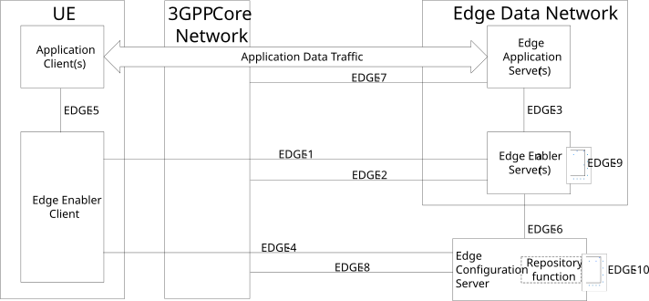

# 6.2b Architecture for Federation support

## 6.2b.1 General

This clause describes the architecture for support of Federation. To support Federation, EDGE-10 reference point is used between the ECSs to exchange ECS profile and EDN configuration information.

NOTE: ECS profile of partner ECSs can be preconfigured in the ECS or can be configured by the OAM system. For cases where the preconfigured and OAM configured information is not sufficient or not available, the ECS may communicate with other ECSs, e.g. ECS with edge repository functionality, to obtain the information.

If the ECSP is required to support service provisioning for a certain EAS whose information is not within the pre-configuration or OAM configuration, the ECS can use Edge repository functions as defined in clause 6.3.4 to support ECS discovery via ECS-ER.

## 6.2b.2 Architecture

Figure 6.2b.2-1 shows the architecture for support of federation. EDGE-10 reference point is introduced between the ECSs. ECSs interfacing over EDGE-10 reference point can be provided by different or the same ECSP.

EDGE-10 interface is used for exchange of EDN configuration information.

When one of the ECS is enhanced as an edge repository (ECS-ER) as defined in clause 6.3.4, making it the center of information for edge deployments, the ECS-ER receives information about edge deployments from other ECSs and stores it. In such deployments, EDGE-10 interface is used both for exchanging of ECS profile during ECS discovery and for exchanging EDN configuration information during service provisioning information retrieval.

Figure 6.2b.2-1: Architecture for Federation support
