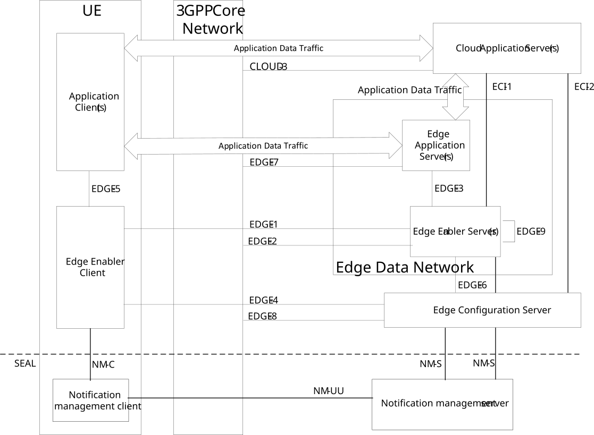

# 6.2c Architecture for enabling cloud applications with edge applications

Figure 6.2c-1 illustrates the architecture for enabling cloud applications along with the edge applications.

Figure 6.2c-1: Architecture for enabling cloud application with edge applications

Cloud application server (CAS) residing outside the EDN may need to interact with the EEL entities e.g. for service continuity. The CAS and EAS interaction is Application Data Traffic, which is out-of-scope of this specification.
