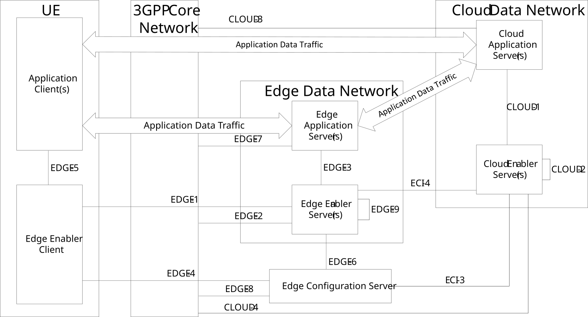

# 6.2d Architecture for enabling cloud applications with edge applications, with CES support

Figure 6.2d-1 illustrates the architecture for enabling cloud applications along with the edge applications, when CES is used.

NOTE: Edge and cloud servers can utilize SEAL NM service but for simplicity such an interaction is not depicted in the figure.

Figure 6.2d-1: Architecture for enabling cloud application with edge applications

Cloud Application Server (CAS) residing in the cloud DN may need to interact with the Cloud Enabler Server (CES) which is part of the EEL for interworking, e.g. for service continuity. The CAS and EAS interaction is Application Data Traffic, which is out-of-scope of this specification.
