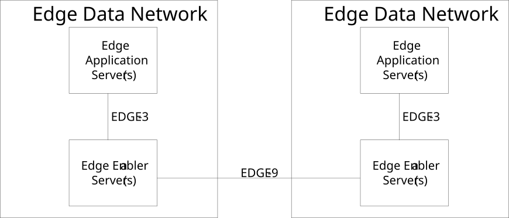
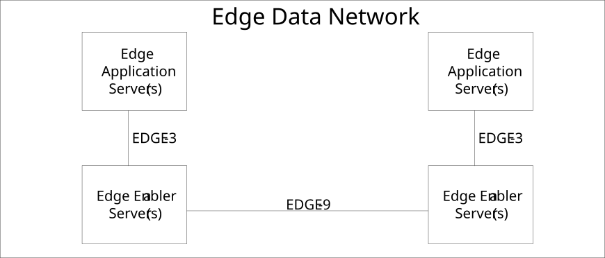

# 6.5 Reference Points

## 6.5.1 General

This clause describes the reference points of the architecture for enabling edge applications.

## 6.5.2 EDGE-1

EDGE-1 reference point enables interactions between the EES and the EEC. It supports:

a\) registration and de-registration of the EEC to the EES;

b\) retrieval and provisioning of EAS configuration information;

c\) discovery of EASs available in the EDN; and

d\) service continuity procedures (e.g. ACR initiation).

## 6.5.3 EDGE-2

EDGE-2 reference point enables interactions between the EES and the 3GPP Core Network functions and APIs for retrieval of network capability information. It supports:

\- access via SCEF and NEF APIs as defined in 3GPP TS 23.501 \[2\], 3GPP TS 23.502 \[3\], 3GPP TS 29.522 \[4\], 3GPP TS 23.682 \[17\], 3GPP TS 29.122 \[5\]; or

\- direct access to core network functions with the EES deployed within the MNO trust domain (see 3GPP TS 23.501 \[2\] clause 5.13, 3GPP TS 23.503 \[12\], 3GPP TS 23.682 \[17\]).

NOTE: EDGE-2 reference point reuses 3GPP reference points or interfaces of EPS or 5GS considering different deployment models.

## 6.5.4 EDGE-3

EDGE-3 reference point enables interactions between the EES and the EASs. It supports:

a\) registration of EASs with availability information (e.g. time constraints, location constraints);

b\) de-registration of EASs from the EES;

c\) discovery of T-EAS information to support ACT;

d\) providing access to network capability information (e.g. location information);

e\) requesting the setup of a data session between AC and EAS with a specific QoS and receiving QoS related information; and

f\) service continuity procedures (e.g. ACR status).

NOTE: Optimized distribution of events across the EDGE-3 interface is out of scope of this specification.

## 6.5.5 EDGE-4

EDGE-4 reference point enables interactions between the ECS and the EEC. It supports:

a\) provisioning of Edge configuration information to the EEC.

## 6.5.6 EDGE-5

EDGE-5 reference point enables interactions between AC(s) and the EEC. It supports:

a\) registration, registration update and de-registration of AC to the EEC;

b\) EAS discovery by the AC;

c\) ACR triggering by the AC;

d\) EEC services subscription; and

e\) UE ID request.

## 6.5.7 EDGE-6

EDGE-6 reference point enables interactions between the ECS and the EES. It supports:

a\) registration of EES information to the ECS;

b\) de-registration of EES information from the ECS; and

c\) retrieval of the T-EES information from the ECS; and

d\) subscription and notification for service continuity related events.

## 6.5.8 EDGE-7

EDGE-7 reference point enables interactions between the EAS and the 3GPP Core Network functions and APIs for retrieval of network capability information. It supports:

\- access via SCEF and NEF APIs as defined in 3GPP TS 23.501 \[2\], 3GPP TS 23.502 \[3\], 3GPP TS 29.522 \[4\], 3GPP TS 23.682 \[17\], 3GPP TS 29.122 \[5\]; or

\- direct access to core network functions with the EAS deployed within the MNO trust domain (see 3GPP TS 23.501 \[2\] clause 5.13, 3GPP TS 23.682 \[17\]).

NOTE: EDGE-7 reference point reuses 3GPP reference points or interfaces of EPS or 5GS considering different deployment models.

## 6.5.9 EDGE-8

EDGE-8 reference point enables interactions between the ECS and the 3GPP Core Network functions and APIs for retrieval of network capability information. It supports:

\- access via SCEF and NEF APIs as defined in 3GPP TS 23.501 \[2\], 3GPP TS 23.502 \[3\], 3GPP TS 29.522 \[4\], 3GPP TS 23.682 \[17\], 3GPP TS 29.122 \[5\]; or

\- direct access to core network functions with the ECS deployed within the MNO trust domain (see 3GPP TS 23.501 \[2\] clause 5.13, 3GPP TS 23.682 \[17\]).

NOTE: EDGE-8 reference point reuses 3GPP reference points or interfaces of EPS or 5GS considering different deployment models.

## 6.5.10 EDGE-9

EDGE-9 reference point enables interactions between two EESs. EDGE-9 reference point may be provided between EES within different EDN (Figure 6.5.10-1) and within the same EDN (Figure 6.5.10-2).

Figure 6.5.10-1: Inter-EDN EDGE-9

Figure 6.5.10-2: Intra-EDN EDGE-9

EDGE-9 supports:

a\) discovery of T-EAS information to support ACR;

b\) EEC context relocation procedures; and

c\) transparent transfer of the application context during EELManagedACR.

## 6.5.11 NM-UU

NM-UU reference point is as specified in 3GPP TS 23.434 \[13\].

## 6.5.12 NM-S

NM-S reference point is as specified in 3GPP TS 23.434 \[13\], where EES or ECS acts VAL server.

## 6.5.13 NM-C

NM-C reference point is as specified in 3GPP TS 23.434 \[13\], where EEC acts as VAL client.

## 6.5.14 ECI-1

ECI-1 enables interaction between CAS and EES. ECI-1 supports:

a\) notifying the CAS about selection of an EES to provide edge enabler services;

b\) discovery of T-EAS to support ACT from CAS to T-EAS; and

c\) selected T-EAS declaration where CAS acts as S-EAS.

ECI-1 supports:

a\) ACR status update between EES and CAS as specified in clause 8.8.2A.6; and

b\) T-EAS discovery procedure initiated by CAS as specified in clause 8.8.2A.6.

## 6.5.15 ECI-2

ECI-2 enables interaction between CAS and ECS.

NOTE: ECI-2 functionalities are not specified in the current release.

## 6.5.16 ECI-3

ECI-3 enables interaction between CES and ECS.

ECI-3 supports:

a\) T-EES retrieval procedure.

## 6.5.17 ECI-4

ECI-4 enables interaction between CES and EES.

ECI-4 supports:

a\) EEC context relocation procedure; and

b\) ACR parameter information procedure.

## 6.5.18 CLOUD-1

CLOUD-1 enables interaction between CAS and CES.

CLOUD-1 supports:

a\) providing access to network capability information (e.g. location information);

b\) requesting the setup of a data session between AC and CAS with a specific QoS and receiving QoS related information; and

c\) service continuity procedures (e.g. ACR status).

## 6.5.19 CLOUD-2

CLOUD-2 enables interaction between CES and CES.

NOTE: CLOUD-2 functionalities are not specified in the current release.

## 6.5.20 CLOUD-3

CLOUD-3 enables interaction between CAS and the 3GPP core network.

## 6.5.21 CLOUD-4

CLOUD-4 enables interaction between CES and the 3GPP core network.

## 6.5.22 EDGE-10

EDGE-10 reference point enables interactions between the ECS and another ECS. It supports:

a\) service provisioning information retrieval.

b\) registration and de-registration of the ECS to the ECS acting as edge repository; and

c\) retrieval or discovery of information about other ECS(s) of the federation.
