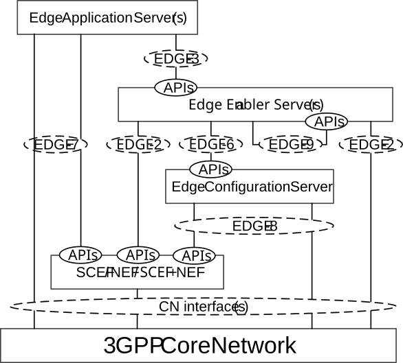

# 6.7 Capability exposure for enabling edge applications

## 6.7.1 General

The Figure 6.7.1-1 shows the capability exposure for enabling edge applications.

Figure 6.7.1-1: Capability exposure for enabling edge applications

Capability exposure includes the 3GPP core network (i.e. 5GC, EPC), ECS and the EES capability exposure, to fulfil the needs of the edge service operations. The capability exposure functionality is utilized by the functional entities (i.e. EES, EAS and ECS) depicted in the architecture for enabling the edge applications.

NOTE: The edge enabling layer also supports the exposure of EAS Service APIs using CAPIF, which is not explicitly depicted in the Figure 6.7.1-1.

## 6.7.2 APIs provided by the Edge Enabler Layer

Table 6.7.2-1 summarizes the APIs exposed by the ECS.

Table 6.7.2-1: APIs provided by the ECS

| API Name                    | Known Consumers | References |
|-----------------------------|-----------------|------------|
| Eecs_ServiceProvisioning    | EEC             | 8.3        |
| Eecs_EESRegistration        | EES             | 8.4.4      |
| Eecs_TargetEESDiscovery     | EES, CES        | 8.8.3.3    |
| Eecs_ECSRegistration        | ECS             | 8.17.2.2   |
| Eecs_ECSDiscovery           | ECS             | 8.17.2.3   |
| Eecs_ECSServiceProvisioning | ECS             | 8.17.2.4   |
| Eecs_EASInfoManagement      | EES             | 8.20.2     |
| Eecs_ACREvents              | EES             | 8.8.3.11   |

Table 6.7.2-2 summarizes the APIs exposed by the EES.

Table 6.7.2-2: APIs provided by the EES

| API Name                        | Known Consumers    | References |
|---------------------------------|--------------------|------------|
| Eees_EECRegistration            | EEC                | 8.4.2      |
| Eees_EASRegistration            | EAS                | 8.4.3      |
| Eees_EASDiscovery               | EEC, EAS, CAS, EES | 8.5        |
| Eees_UELocation                 | EAS                | 8.6.2      |
| Eees_ACRManagementEvent         | EAS, EES, CAS      | 8.6.3      |
| Eees_AppClientInformation       | EAS                | 8.6.4      |
| Eees_UEIdentifier               | EEC, EAS           | 8.6.5      |
| Eees_SessionWithQoS             | EAS                | 8.6.6      |
| Eees_TrafficInfluenceEAS        | EAS                | 8.6.7      |
| Eees_AppContextRelocation       | EEC, EAS, EES      | 8.8.3.4    |
| Eees_ACREvents                  | EEC                | 8.8.3.5    |
| Eees_EELManagedACR              | EES, EAS           | 8.8.3.6    |
| Eees_SelectedTargetEAS          | EAS, CAS, EES      | 8.8.3.7    |
| Eees_ACRStatusUpdate            | EAS, CAS, EES      | 8.8.3.8    |
| Eees_ACRParameterInformation    | EES, CES           | 8.8.3.9    |
| Eees_EECContextPull             | EES                | 8.9.4.2    |
| Eees_EECContextPush             | EES, CES           | 8.9.4.3    |
| Eees_EASInformationProvisioning | EEC, EES           | 8.15       |
| Eees_CommonEasAnnouncement      | EES                | 8.19       |

NOTE: The event exposure related APIs (e.g. Eees_EASDiscovery and Eees_ACREvents) can be realized as single event subscription API.

Table 6.7.2-3 summarizes the APIs exposed by the CAS.

Table 6.7.2-3: APIs provided by the CAS

| API Name         | Known Consumers | References |
|------------------|-----------------|------------|
| Ecas_SelectedEES | EES             | 8.8.3.10   |

Table 6.7.2-4 summarizes the APIs exposed the EEC.

Table 6.7.2-4: APIs provided by the EEC

| API Name            | Known Consumers | References |
|---------------------|-----------------|------------|
| Eeec_ACRegistration | AC              | 8.14.4.2   |
| Eeec_EASDiscovery   | AC              | 8.14.4.3   |
| Eeec_ACRTrigger     | AC              | 8.14.4.4   |
| Eeec_Services       | AC              | 8.14.4.5   |
| Eeec_UEId           | AC              | 8.14.4.6   |

Table 6.7.2-5 summarizes the EES APIs re-used by the CES.

Table 6.7.2-5: APIs re-used by the CES

| API Name                     | Known Consumers | References |
|------------------------------|-----------------|------------|
| Eees_EASRegistration         | CAS             | 8.4.3      |
| Eees_UELocation              | CAS             | 8.6.2      |
| Eees_ACRManagementEvent      | CAS             | 8.6.3      |
| Eees_AppClientInformation    | CAS             | 8.6.4      |
| Eees_UEIdentifier            | CAS             | 8.6.5      |
| Eees_SessionWithQoS          | CAS             | 8.6.6      |
| Eees_TrafficInfluenceEAS     | CAS             | 8.6.7      |
| Eees_EASDiscovery            | EES             | 8.8.3.2    |
| Eees_AppContextRelocation    | CAS             | 8.8.3.4    |
| Eees_ACREvents               | EEC             | 8.8.3.5    |
| Eees_SelectedTargetEAS       | CAS             | 8.8.3.7    |
| Eees_ACRStatusUpdate         | CAS             | 8.8.3.8    |
| Eees_ACRParameterInformation | EES             | 8.8.3.9    |
| Eees_EECContextPush          | EES             | 8.9.4.3    |
