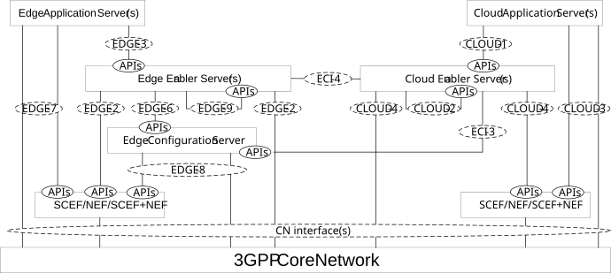

# 6.8 Capability exposure for enabling cloud applications with edge applications, with CES support

## 6.8.1 General

The Figure 6.8.1-1 shows the capability exposure for enabling cloud applications with edge applications, when CES is used.

Figure 6.8.1-1: Capability exposure for enabling cloud applications with edge applications with CES

To enable the interworking with Cloud Application Server (CAS) and Cloud Enabler Server (CES) residing in the cloud DN, the edge enablement layer may include, in addition to the capability exposure described in clause 6.7.1, the CES capability exposure, which is utilized by the CAS for enabling edge applications.
