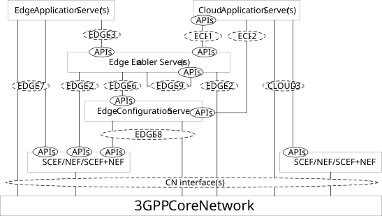

# 6.9 Capability exposure for enabling cloud applications with edge applications

## 6.9.1 General

The Figure 6.9.1-1 shows the capability exposure for enabling cloud applications with edge applications.

Figure 6.9.1-1: Capability exposure for enabling cloud applications with edge applications

The Cloud Application Server residing in the cloud DN, outside the EDN, may need to interact with the EEL entities for enabling edge applications.
