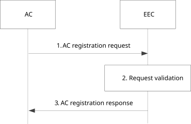
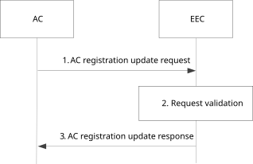
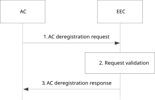
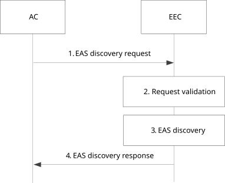
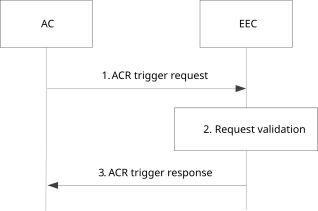
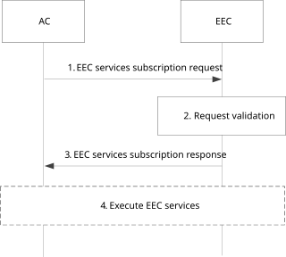
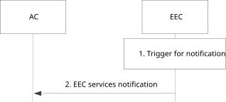
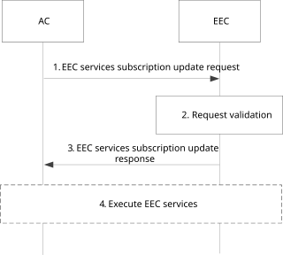
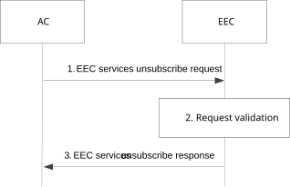
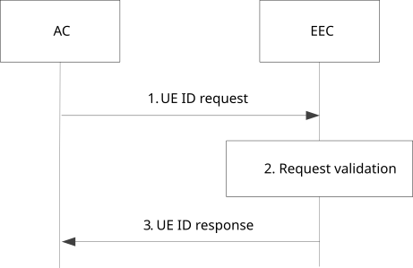

# 8.14.2 Procedures

## 8.14.2.1 General

Following procedures are specified for EDGE-5:

\- Registration;

\- EAS discovery;

\- ACR trigger request;

\- EEC services subscription; and

\- UE ID request.

## 8.14.2.2 Registration

### 8.14.2.2.1 General

Following are supported for AC registration:

\- AC registration procedure;

\- AC registration update procedure; and

\- AC de-registration procedure.

### 8.14.2.2.2 AC registration

Figure 8.14.2.2.2-1 illustrates AC registration procedure.

Pre-conditions:

1\. AC can communicate with the EEC.

Figure 8.14.2.2.2-1: AC registration procedure

1\. The AC sends an AC registration request to the EEC. The request includes the AC profile, AC's security credentials and optionally the EAS characteristics. The request may also include a list of EEC's services that AC requires the EEC to handle. The request additionally includes ECS configuration information if the AC is edge-aware and configured with the ECS configuration information.

NOTE 1: The ASP providing the AC and the ECSP providing the ECS can have edge computing service provider service agreement as described in Annex B. The ECS configuration information configured in the AC is based on the service agreement.

2\. The EEC checks AC's security credentials and validates the request.

3\. If the request is successfully validated, the EEC registers the information provided in the request and responds back to the AC with AC registration response. The AC registration response includes the list of EEC's services that AC is authorized for.

NOTE 2: The mechanisms used for authentication and authorization between AC and EEC is out of scope of this specification. EEC can use local policies, user preferences, ASP services agreement(s) (see Annex B) to authorize the request from the AC.

NOTE 3: When the ECS configuration information is provided from an AC, the EEC can use the ECS configuration for initial service provisioning for the AC that provided the ECS configuration information if there is no ECS configuration information is provided from the 5GC.

### 8.14.2.2.3 AC registration update

Figure 8.14.2.2.3-1 illustrates AC registration update procedure.

Pre-conditions:

1\. AC is registered with the EEC.

Figure 8.14.2.2.3-1: AC registration update procedure

1\. The AC sends an AC registration update request to the EEC. The request includes the registration ID, AC's security credentials, and may include the updated AC profile, EAS discovery filters, list of requested EEC services and list of ECS information.

2\. The EEC checks AC's security credentials and validates the request.

3\. If the request is successfully validated, the EEC sends a successful registration update response, which includes an updated list of EEC services that AC is authorized for.

### 8.14.2.2.4 AC deregistration

Figure 8.14.2.2.4-1 illustrates AC deregistration procedure.

Pre-conditions:

1\. AC is registered with the EEC.

Figure 8.14.2.2.4-1: AC deregistration procedure

1\. The AC sends an AC deregistration request to the EEC. The request includes the registration ID and AC's security credentials.

2\. The EEC checks AC's security credentials and validates the request.

3\. Upon successful authorization, the EEC deregisters the AC and sends a successful de-registration response.

## 8.14.2.3 EAS discovery

Pre-conditions:

1\. The AC can communicate with the EEC.

Figure 8.14.2.3-1: EAS discovery request procedure

1\. The AC sends an EAS discovery request to the EEC. The request includes AC profile and AC's security credentials and may include EAS discovery filters.

2\. The EEC checks AC's security credentials and validates the request.

3\. If the request is successfully validated, the EEC determines if the required EAS is available or not. The EEC may use information cached or preconfigured at the EEC or may use the EAS discovery procedures to query the EES. If step 1 includes the AC profile or EAS discovery filters, then the EEC may utilize the provided AC profile and filters, to form the EAS discovery request towards EES. If step 1 does not include any of the optional IEs of the AC profile and EAS discovery filters, and AC registration was performed, the EEC may utilize the AC profile provided by the AC during AC registration. The EEC also needs to take user privacy requirements, e.g., regarding the disclosure of location information towards the network into account. If required, e.g., when EAS discovery procedures return a list of EASs, the EEC performs EAS selection based on the information received in step 1 and the AC profile. The EEC can perform EAS discovery with different EESs before selecting an EAS.

NOTE 1: If required, the EEC can perform service provisioning procedure, or EEC registration procedure or both, before performing the EAS discovery procedures. EEC may already have captured EESs and EASs availability for present location; so that the AC's request (step 1) can be replied to quickly and efficiently.

NOTE 2: The EEC can include AC profiles of more than one AC in the EAS discovery request sent to the EES.

NOTE 3: It is outside the scope of this release of this specification how the user or the AC can consent, e.g., to the disclosure of location information and the use of the AC ID in the signalling towards the network.

4\. The EEC responds back to the AC with the EAS discovery response. The response includes the EAS profile(s) of the available EAS(s).

## 8.14.2.4 ACR trigger request

Pre-conditions:

1\. AC has subscribed for "ACR notifications" as specified in clause 8.14.2.5.2.

Figure 8.14.2.4-1: ACR trigger request procedure

1\. The AC sends an ACR trigger request to the EEC. The request includes AC profile, AC's security credentials, type of requested operation (i.e., ACR detection, ACR initiation) and S-EAS information as described in clause 8.14.3.10. If the request is to initiate the ACR, the request may also include the target EAS information.

2\. The EEC checks AC's security credentials and validates the request.

3\. If the request is successfully validated, the EEC sends an ACR trigger response to the AC indicating if the request was successful as described in 8.14.3.11. The EEC process the request from the AC. If the type of requested operation in the request received in step 1 is:

\- ACR detection, then the EEC determines if ACR is required or not. If it is required, the EEC uses one of the EEC initiated ACR scenarios or launches ACR with action "determination", leading to S-EES executed ACR;

\- ACR initiation, then the EEC uses one of the EEC initiated ACR scenarios and initiate ACR. If the request in step 1 also includes target information, the EEC uses it to select the ACR targets.

NOTE: EEC notifies the AC to trigger ACT as required, or EEC notifies ACR execution result as specified in clause 8.14.2.5.3.

## 8.14.2.5 EEC services subscription

### 8.14.2.5.1 General

Following are supported for EEC services subscription:

\- Subscribe;

\- Notify;

\- Subscription update; and

\- Unsubscribe.

### 8.14.2.5.2 Subscribe

Pre-conditions:

1\. The AC can communicate with the EEC.

Figure 8.14.2.5.2-1: EEC services subscription procedure

1\. The AC sends an EEC services subscription request to the EEC. The request includes AC profile, AC's security credentials, a list of EEC's services that AC requires the EEC to handle, and related parameters as described in 8.14.3.12. If the subscription request includes:

\- EAS discovery or EAS dynamic information subscription, then the request may include a list of EAS characteristics and a list of EAS dynamic information filters respectively;

\- ACR, then the request includes a list of S-EAS information and corresponding type of ACR operations:

\- ACR notifications, where the EEC notifies the AC with respect to the "ACR detection" and "ACR initiation" requests as specified in clause 8.14.2.5.3;

\- ACR monitoring, where the EEC monitors the need for ACR and notifies the AC as and when required e.g., on receiving ACR related notifications on EDGE-1 interface; and

\- EEC managed ACR, where the EEC monitors the need for ACR. If need for ACR is detected, then the EEC decides and initiates ACR using one of the EEC initiated ACR scenarios. The EEC notifies the AC about the imminent ACR and may include the target information.

2\. The EEC checks AC's security credentials and validates the request.

3\. If the request is successfully validated, the EEC creates the subscription and sends an EEC services subscription response message to the AC. The response includes the list of services that the EEC will handle and related details.

4\. The EEC executes the services e.g., EAS discovery, ACR, and notifies the AC with information as necessary. The EEC may use locally cached information or configurations while providing services to the AC.

### 8.14.2.5.3 EEC services notification

Pre-conditions:

1\. The AC has subscribed to the EEC.

Figure 8.14.2.5.3-1: EEC services notification procedure

1\. An event occurs at the EEC that satisfies the trigger conditions for notifying a AC e.g., EEC detects a need for Application Context Relocation, unavailability of suitable T-EES and/or unavailability of suitable T-EAS.

NOTE: Upon receiving a EEC services notification indicating no suitable T-EES/T-EAS was available, the AC may decide to initiate DNS query to obtain CAS information to prepare and move the application context to the CAS.

2\. The EEC sends an EEC services notification to the AC with relevant information related to the event triggered in step 1.

### 8.14.2.5.4 EEC services subscription update

Figure 8.14.2.5.4-1 illustrates EEC services subscription update procedure.

Pre-conditions:

1\. The AC has subscribed to the EEC.

Figure 8.14.2.5.4-1: EEC services subscription update procedure

1\. The AC sends an EEC services subscription update request to the EEC. The request includes the subscription ID, AC's security credentials, and may include updated notification related details or updated list of required EEC services.

2\. The EEC checks AC's security credentials and validates the request.

3\. If the request is successfully validated, the EEC updates the subscription and sends a successful subscription update response.

4\. The EEC executes the services e.g., EAS discovery, ACR, and notifies the AC with information as necessary. The EEC may use locally cached information or configurations while providing services to the AC.

### 8.14.2.5.5 Unsubscribe

Figure 8.14.2.5.5-1 illustrates the unsubscribe procedure.

Pre-conditions:

1\. The AC has subscribed to the EEC.

Figure 8.14.2.5.5-1: EEC services unsubscribe procedure

1\. The AC sends EEC services unsubscribe request to the EEC. The request includes the subscription ID and AC's security credentials.

2\. The EEC checks AC's security credentials and validates the request.

3\. Upon successful authorization, the EEC sends a successful de-registration response.

## 8.14.2.6 UE ID request

Pre-conditions:

1\. The AC can communicate with the EEC.

Figure 8.14.2.6-1: UE ID request procedure

1\. The AC sends an UE ID request to the EEC. The request includes AC's security credentials and the EAS ID list for which the AC needs to know the associated Edge UE ID or AF-specific UE ID(s).

2\. The EEC checks AC's security credentials and validates the request.

3\. If the request is successfully validated, the EEC process the request from the AC. The EEC uses the UE Identifier API procedure (see clause 8.6.5) to query the EES.

NOTE: This procedure may be used to support the retrieval of the UE ID for AC’s (and EAS's) dealing with IPv4 NATed IP address issue (i.e. EAS's direct invocation of UE Identifier API procedure due to NATed IP address fails to identify the UE). Under such a scenario then it is understood that, the AC through application signalling which is outside the scope of this document, would pass on the UE ID (received in step 3) to the EAS so that it can be used to invoke capability APIs over EDGE-3 or EDGE-7.
