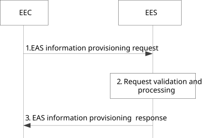

# 8.15 EAS Information provisioning

## 8.15.1 General

EAS information provisioning procedure allows the EEC to exchange information with the EES about selected EAS and/or ACR scenario selection, and allows the EES exchange information with another EES about selection of the EAS for the service consumption as described in clause 8.18.2.4.5.

When service continuity is required, ACR scenarios may be combined to perform ACR detection in one or more of the EEC, the EES and the EAS; the related procedures are specified in clauses 8.15.2, 8.6.3 and referred to in clause 8.8.2. The selection of ACR scenario(s) may be performed by the EEC or the EES for a given AC and the selected EAS from the common supported ACR scenarios of AC, EEC, selected EES and selected EAS. The selection of ACR scenario(s) for each EAS in EAS bundles may be performed separately by the EEC or the EES (or the main EES in case of bundle EAS served by multiple EESs, which is the EES registering the main EAS) for a given AC and the selected EAS(s) in a bundle, based on the service continuity support by AC, EEC, EES(s) and EAS(s) when the coordinated ACR need to be performed for the bundle EAS. In addition, the EEC or EES can further determine the one or more ACR scenario(s) for the selected EAS based on the AC service KPI.

NOTE: How to select ACR scenario(s) at the EEC or EES considering AC service KPI is implementation specific.

Instantiable EAS Information may be provided to the EEC in EAS discovery response and EAS discovery notification, as specified in clause 8.5.3.3 and 8.5.3.6. Triggering the instantiation of an EAS by the EEC may be announced to the EES by including the selected EASID in the EAS information provisioning request without including the selected EAS endpoint.

The EAS information provisioning request types supported are:

\- "ACR scenario selection announcement". Inform the EES about the EAS that has been selected by the EEC and may provide the selected ACR scenario list to the EES. For the EAS bundles scenario, the selected bundled EAS(s) and the selected ACR scenario list for EAS bundles by EEC are included and notified to the EES.

\- "ACR scenario selection request". Inform the EES to perform ACR scenario selection. For the EAS bundles scenario, the request may inform the EES to determine the ACR scenario list for EAS bundles.

\- "EAS selection request". Inform the EES of EAS selection, e.g. for Application Group.

## 8.15.2 Procedure

### 8.15.2.1 General

### 8.15.2.2 EAS Information provisioning

Pre-conditions:

1\. The EEC has performed service provisioning procedure

2\. The EEC has performed the EAS discovery procedure

Figure 8.15.2.2-1: EAS information provisioning

1\. The EEC sends the EAS information provisioning request to the EES:

> a- "ACR scenario selection announcement". The request may include ACR scenario list selected by the EEC, EEC security credentials, selected EASID, selected EAS endpoint, EECID and ACID. For the EAS bundles scenario, the request may include the ACR scenario list for EAS bundles selected by the EEC.
>
> b- "ACR scenario selection request". The request may include AC profile, EEC service continuity support, EEC security credentials, EECID and ACID.
>
> c- " EAS selection". Informs the EES of EAS selection. When Application Group information is included in the request, the EAS provided is considered Common EAS for Application Group.

The EAS information provisioning request may include associated EES(s) endpoint and the DNAIs and service area of the selected EAS(s).

> NOTE 1: It is up to implementation how it is determined that EES no longer serves the application group.

If the EEC has selected an EAS which is instantiable but not yet instantiated, the EEC includes the selected EASID without including the selected EAS endpoint in the request.

The request may contain the associated EES(s) information along with the bundle EAS information (i.e. list of EASID) and the bundle EAS type indicating direct bundle, each associated EES(s) is along with part of or all the list of EASID, when EEC determines the associated EES(s) based on the EDN configuration information and bundle EAS information (e.g. list of EASID and direct bundle type).

2\. Upon receiving the request from the EEC, the EES validates the EEC information request and verifies if the EEC is authorized for this operation.

> a- "ACR scenario selection announcement". The EES may send the ACR Selection notification to the selected EAS if the EAS has subscribed and if EES allows EEC based ACR scenario selection. Otherwise, EES may respond with status failure and include appropriate reason. For the EAS bundles scenario, the EES may send the ACR selection notification to the bundled EAS(s).
>
> b- "ACR scenario selection request". The EES selects the ACR scenario list and may send the ACR Selection notification to the selected EAS if the EAS has subscribed. The EES may include the ACR scenario list in the EAS information provisioning response. For the EAS bundles scenario, the EES selects the ACR scenario list for EAS bundles based on the AC/EEC/EES(s)/EAS(s) service continuity support, and sends the ACR scenario list to the bundled EAS(s).
>
> c- "EAS selection". When Application Group information is not provided, the EES determines that the EAS in the request is providing services to the AC with the indicated ACID e.g. for EEC Context handling purposes as described in clause 8.9. When Application Group information is included in the request, the EAS provided is considered Common EAS for the Application Group.

NOTE 2: Further clarification for EAS selection may be needed.

> If the EEC or EES selected ACR scenario list for EAS bundle includes EAS executed ACR scenario (as described in 8.8.2.8), the EES also sends DNAIs and service area of the selected EAS(s) to the main EAS in the ACR selection notification.

The request may contain the associated EES(s) information along with the bundle EAS information (i.e. list of EASID) and the bundle EAS type indicating direct bundle, each associated EES(s) is along with part of or all the list of EASID, when EEC determines the associated EES(s) based on the EDN configuration information and bundle EAS information (e.g. list of EASID and direct bundle type).

If the request contains selected EAS ID and selected EAS Endpoint, the EES may apply the EAS traffic influence with the N6 routing information of the EAS in the 3GPP Core Network, based on application KPIs and if the EAS traffic influence was not done before (e.g. neither in EAS discovery procedure nor the EAS perform traffic influence).

When the selection is that of a common EAS for application group, the request message may contain the list of EESs for a certain Application Group ID, received from the ECS in the service provisioning response message. This application group related information may be used for further common EAS announcement(s) between EES(s). In the case of no ECS-ER, if the request message does not contain the list of EESs for a certain Application Group ID, then the EES determines the other EESs to which announce common EAS request needs to be sent as described in clause 8.8.3.3. If there is ECS-ER, the EEC selected EAS is used in interaction between the EES and ECS-ER, as described in clause 8.20.2.3 to store the common EAS information., If the ECS-ER provides a different common EAS information in the response it is forwarded to the EEC in the EAS information provisioning response. If the ECS-ER-provided common EAS is registered to another EES, then the EES endpoint of the EES where the common EAS is registered is also included in the EAS information provisioning response.

If the request contains the selected EASID and the selected EAS endpoint is not included, the EES verifies if instantiation of EAS is needed and may trigger the ECSP management system to instantiate the EAS as in clause 8.12.

When the request contains EEC Service Continuity Support IE and the EEC context has been established, the EES includes the IE into the EEC context described in Table 8.2.8-1.

> NOTE 2: EES can also influence the EAS traffic in advance.
>
> NOTE 3: It is up to the AC to decide when to connect to the selected EAS (either immediately or wait for a while) once the AC knows the selected EAS.

3\. If the processing of the request was successful, the EES sends an EAS information provisioning response to the EEC indicating a successful status. If an EEC context has been established, the response also includes the list of selected ACR scenario(s) into the session context IE within EEC context as described in Table 8.2.8-2; otherwise, the EES shall indicate a failure status and include appropriate reasons. If the EES has triggered EAS instantiation based on the EAS information provisioning request and obtained the newly instantiated EAS information, the response contains information about the newly instantiated EAS, including the EAS endpoint information.

The EEC, EES and EAS (or the bundled EAS(s)) use the selected ACR scenario list to determine if they should perform ACR detection and/or ACR decision.

Upon receiving the EAS information provisioning response, if the response includes instantiated EAS information, the EEC uses the endpoint information to subscribe to ACR event notification, as needed, and provides necessary notifications to the AC.

NOTE 4: Other ACR selection criteria are out of scope of the current specification.

NOTE 5: The common supported ACR scenarios is decided as part of the EAS discovery and selection procedure.

For the "EAS selection" case, in the case of no ECS-ER, the selected common EAS shall be announced to other relevant EES(s) as per procedure in clause 8.19.

## 8.15.3 Information flows

### 8.15.3.1 General

The information flows are specified for EAS information provisioning request and response.

### 8.15.3.2 EAS information provisioning request

Table 8.15.3.2-1 describes the information elements for EAS information provisioning request from the EEC to the EES.

Table 8.15.3.2-1: EAS information provisioning request

<table>
<colgroup>
<col style="width: 37%" />
<col style="width: 12%" />
<col style="width: 50%" />
</colgroup>
<tbody>
<tr class="odd">
<td>Information element</td>
<td>Status</td>
<td>Description</td>
</tr>
<tr class="even">
<td>EECID</td>
<td>M</td>
<td>The identifier of the EEC.</td>
</tr>
<tr class="odd">
<td>ACID</td>
<td>M</td>
<td>The identifier of the AC.</td>
</tr>
<tr class="even">
<td>Security credentials</td>
<td>M</td>
<td>Security credentials resulting from a successful authorization for the edge computing service.</td>
</tr>
<tr class="odd">
<td>Selected EAS ID(s)</td>
<td>O</td>
<td>The identifier(s) of the selected EAS or the selected EAS(s) for EAS bundles, which is either instantiated or instantiable.</td>
</tr>
<tr class="even">
<td>Application Group ID (NOTE 4)</td>
<td>O</td>
<td>Application group identifier as defined in 7.2.11.</td>
</tr>
<tr class="odd">
<td>List of EES(s) (NOTE 4)</td>
<td>O</td>
<td>List of EES information (e.g. address information) corresponding to the Application group ID which is used for the common EAS announcement between these EESs as provided by ECS during service provisioning.</td>
</tr>
<tr class="even">
<td>Selected EAS Endpoint(s)</td>
<td>O</td>
<td>The endpoint(s) of the selected EAS or the selected EAS(s) for EAS bundles</td>
</tr>
<tr class="odd">
<td>DNAIs and service area of the selected EAS(s)</td>
<td>O</td>
<td>For each selected EAS ID, it includes the DNAIs and/or service area for EAS bundles, as described in "EAS Geographical Service Area" IE, "EAS Topological Service Area" IE and "List of EAS DNAI(s)" IE of Table 8.2.4-1.</td>
</tr>
<tr class="even">
<td>Request type</td>
<td>O</td>
<td>
Request types:

- ACR scenario selection announcement

- ACR scenario selection request

- EAS selection
</td>
</tr>
<tr class="odd">
<td>Selected ACR scenario list (NOTE 1)</td>
<td>O</td>
<td>The list of ACR scenarios (or the list of ACR scenarios for EAS bundles) selected by the EEC</td>
</tr>
<tr class="even">
<td>AC Profile (NOTE 2, NOTE 3)</td>
<td>O</td>
<td>AC Profile as described in Table 8.2.2-1</td>
</tr>
<tr class="odd">
<td>EEC Service Continuity Support (NOTE 2, NOTE 5)</td>
<td>O</td>
<td>Indicates if the EEC supports service continuity or not. The IE indicates which ACR scenarios are supported by the EEC, also indicates the EEC ability (e.g. EAS bundle information) of handling bundled EAS ACR.</td>
</tr>
<tr class="even">
<td>Associated EES(s) endpoint</td>
<td>O</td>
<td>EES information of the other EES(s) which support the direct bundled EAS, within the same EDN, and associated with the EASID list.</td>
</tr>
<tr class="odd">
<td>CAS information</td>
<td>O</td>
<td>Target CAS information received from AC.</td>
</tr>
<tr class="even">
<td>Leading EES ID (NOTE 6)</td>
<td>O</td>
<td>The identifier of the leading EES.</td>
</tr>
<tr class="odd">
<td>Leading EES Endpoint (NOTE 6)</td>
<td>O</td>
<td>The endpoint of the leading EES.</td>
</tr>
<tr class="even">
<td colspan="3">
NOTE 1: The IE may be present only if Selected EASID(s) and Selected EAS Endpoint(s) are present and Request type is "ACR scenario selection announcement"

NOTE 2: The IEs are present only if request type is “ACR scenario selection request”

NOTE 3: The IE is present if AC Profile is not shared to EES previously

NOTE 4: This IE may be present only if the request type is "EAS selection".

NOTE 5: The EAS bundle information is not applicable for proxy type of EAS bundle.

NOTE 6: The IEs shall be present only if the request is from leading EES.
</td>
</tr>
</tbody>
</table>

### 8.15.3.3 EAS information provisioning response

Table 8.15.3.2-1 describes the information elements for EAS information provisioning response from the EES to the EEC.

Table 8.15.3.3-1: EAS information provisioning response

<table>
<colgroup>
<col style="width: 33%" />
<col style="width: 16%" />
<col style="width: 50%" />
</colgroup>
<tbody>
<tr class="odd">
<td>Information element</td>
<td>Status</td>
<td>Description</td>
</tr>
<tr class="even">
<td>Successful response (NOTE 1)</td>
<td>O</td>
<td>Indicates that the request was successful.</td>
</tr>
<tr class="odd">
<td>&gt; Selected ACR scenario list (NOTE 2)</td>
<td>O</td>
<td>The list of ACR scenarios (or the list of ACR scenarios for EAS bundles) selected by the EES</td>
</tr>
<tr class="even">
<td>
&gt; Instantiated EAS Information

(NOTE 3)
</td>
<td>O</td>
<td>Instantiated EAS information. Each element includes the information described below.</td>
</tr>
<tr class="odd">
<td>&gt;&gt; EAS Profile</td>
<td>M</td>
<td>The profile of the instantiated EAS.Each element is described in clause 8.2.4.</td>
</tr>
<tr class="even">
<td>&gt;&gt; EES Endpoint</td>
<td>O</td>
<td>The endpoint address (e.g. URI, IP address) of the EES</td>
</tr>
<tr class="odd">
<td>&gt;&gt; Lifetime</td>
<td>O</td>
<td>Time interval or duration during which the information elements in the EAS profile is valid and supposed to be cached in the EEC (e.g. time-to-live value for an EAS Endpoint)</td>
</tr>
<tr class="even">
<td>&gt; Common EAS endpoint (NOTE 4)</td>
<td>O</td>
<td>This IE includes common EAS endpoint. This IE shall be provided only when the EEC indicates EAS selection for an application group in the request and if the EES determines a different common EAS (e.g. from ECS-ER).</td>
</tr>
<tr class="odd">
<td>&gt; Common EES endpoint (NOTE 4)</td>
<td>O</td>
<td>This IE includes common EES endpoint. It shall be provided when common EAS endpoint IE is included and the common EAS is registered to a different EES than the EES responding to the EEC.</td>
</tr>
<tr class="even">
<td>Failure response (NOTE 1)</td>
<td>O</td>
<td>Indicates that the request failed.</td>
</tr>
<tr class="odd">
<td>&gt; Cause</td>
<td>O</td>
<td>Indicates the failure cause.</td>
</tr>
<tr class="even">
<td colspan="3">
NOTE 1: One of these IEs shall be present in the message.

NOTE 2: Only if request type is "ACR scenario selection request".

NOTE 3: Only if request does not include selected EAS endpoint.

NOTE 4: Only if request type is "EAS selection".
</td>
</tr>
</tbody>
</table>

## 8.15.4 APIs

### 8.15.4.1 General

Table 8.15.4.1-1 illustrates the API for EAS Information provisioning.

Table 8.15.4.1-1: Eees_EASInformationProvisioning API

<table>
<colgroup>
<col style="width: 40%" />
<col style="width: 21%" />
<col style="width: 20%" />
<col style="width: 18%" />
</colgroup>
<thead>
<tr class="header">
<th>API Name</th>
<th>API Operations</th>
<th>
Operation

Semantics
</th>
<th>Consumer(s)</th>
</tr>
</thead>
<tbody>
<tr class="odd">
<td>Eees_EASInformationProvisioning</td>
<td>Declare</td>
<td>Request/Response</td>
<td>EEC</td>
</tr>
</tbody>
</table>

### 8.15.4.2 Eees_EASInformationProvisioning_Declare operation

**API operation name:** Eees_EASInformationProvisioning_Declare

**Description:** The consumer declares EAS information to the EES.

**Inputs:** See clause 8.15.3.2.

**Outputs:** See clause 8.15.3.3*.*

See clause 8.15.2.2 for details of usage of this operation.
