# 8.17.2 Procedures

## 8.17.2.1 General

Following sets of procedures are defined to support roaming and federation:

\- Registration;

\- ECS discovery via ECS-ER; and

\- Service provisioning information retrieval.

## 8.17.2.2 Registration

### 8.17.2.2.1 General

Following procedures are defined for ECS registration:

\- ECS registration procedure;

\- ECS registration update procedure; and

\- ECS de-registration.

### 8.17.2.2.2 ECS registration

ECS registers with the ECS-ER and provides the information included in the ECS profile. Figure 8.17.2.2.2-1 illustrates the procedure.

Pre-conditions:

1\. The ECS has the address (e.g. URI) of the ECS-ER.

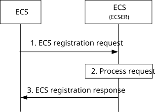

Figure 8.17.2.2.2-1: ECS registration procedure

1\. The ECS sends the ECS registration request to the ECS-ER. The request from the ECS includes ECS profile and security credentials. The request may include a proposed expiration time for the registration, and may include list of partner ECSPs that are allowed to receive its information. The request may also include DNN and S-NSSAI information for roaming UEs to establish a PDU session towards the ECS as specified in 3GPP TS 23.548 \[20\].

2\. Upon receiving the request from the ECS, the ECS-ER verifies the security credentials of the ECS and stores the ECS registration information received in step 1.

3\. The ECS-ER sends an ECS registration response indicating success or failure of the registration operation. The ECS-ER may provide an expiration time to indicate to the ECS when the registration will automatically expire. To maintain the registration, the ECS sends a registration update request prior to the expiration time. If a registration update request is not received prior to the expiration time, the ECS-ER treats the ECS as implicitly de-registered.

### 8.17.2.2.3 ECS registration update

Figure 8.17.2.2.3-1 illustrates the ECS registration update procedure.

Pre-conditions:

1\. The ECS is registered with the ECS-ER.

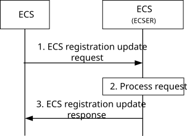

Figure 8.17.2.2.3-1: ECS registration update procedure

1\. The ECS sends the ECS registration update request to the ECS-ER. The request from the ECS includes security credentials and may include updated ECS profile that may include updated DNN and S-NSSAI information, and an updated list of partner ECSPs that are allowed to receive its information. The request may also include a proposed expiration time for the updated registration.

2\. Upon receiving the request from the ECS, the ECS-ER verifies the security credentials of the ECS and updates the stored the ECS registration information as received in step 1.

3\. The ECS-ER sends an ECS registration update response indicating success or failure of the registration update operation. The ECS-ER may provide an updated expiration time to indicate to the ECS when the updated registration will automatically expire. To maintain the registration, the ECS sends another registration update request prior to the expiration time. If a registration update request is not received prior to the expiration time, the ECS-ER treats the ECS as implicitly de-registered.

### 8.17.2.2.4 ECS de-registration

Figure 8.17.2.2.4-1 illustrates the ECS de-registration procedure.

Pre-conditions:

1\. The ECS is registered with the ECS-ER.

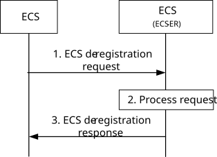

Figure 8.17.2.2.4-1: ECS de-registration procedure

1\. The ECS sends the ECS de-registration request to the ECS-ER. The request from the ECS includes its security credentials.

2\. Upon receiving the request from the ECS, the ECS-ER verifies the security credentials of the ECS and de-registers the ECS.

3\. The ECS-ER sends an ECS de-registration response indicating success or failure of the de-registration operation.

## 8.17.2.3 ECS discovery via ECS-ER

### 8.17.2.3.1 General

Following procedures are supported for ECS discovery via ECS-ER:

\- Request-response procedure;

\- Subscribe-notify procedures, including:

\- Subscription procedure;

\- Notification procedure;

\- Subscription update procedure; and

\- Unsubscribe procedure.

### 8.17.2.3.2 Request-response model

When required to find a suitable partner ECS, the ECS queries the ECS-ER by providing information such as the location of the UE, applications required by the UE etc. In response the ECS-ER provides ECS profile of partner ECS(s) providing the required application at the location indicated by the ECS. Figure 8.17.2.3.2-1 illustrates the procedure. The procedure is also applicable between ECS of leading ECSP and ECS of partner ECSP.

Pre-conditions:

1\. The ECS has the address (e.g. URI) of the ECS-ER.

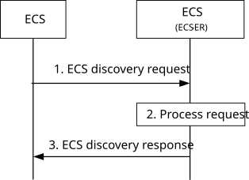

Figure 8.17.2.3.2-1: ECS querying ECS-ER

1\. The ECS sends a ECS discovery request to the ECS-ER. The request contains security information of the ECS, and optionally AC profile(s) and UE's current location to filter ECS. If the UE hosting the EEC is roaming in a V-PLMN (determined using the serving PLMN information in the received service provisioning request, or by interacting with the H-PLMN), then the ECS discovery request includes the information of the serving PLMN i.e. the V-PLMN.

2\. The ECS-ER authorizes the received request. If authorized, the ECS-ER processes the request and gathers the information of partner ECS(s) that can satisfy the query parameters received in step 1.

3\. The ECS-ER sends a ECS discovery response to the ECS. The response includes ECS profile of the Partner ECS(s) available in the H-PLMN and/or the V-PLMN, depending on the serving PLMN of the UE as indicated in step 1 and may include DNN and S-NSSAI information for roaming UEs to establish a PDU session to the Partner ECS as specified in 3GPP TS 23.548 \[20\]. The ECS caches the received information for further use.

NOTE: The ECS sending the ECS discovery request can also be an ECS-ER.

### 8.17.2.3.3 Subscribe-notify model

#### 8.17.2.3.3.1 General

#### 8.17.2.3.3.2 Subscribe

Figure 8.17.2.3.3.2-1 illustrates the procedure.

Pre-conditions:

1\. The ECS has the address (e.g. URI) of the ECS-ER.

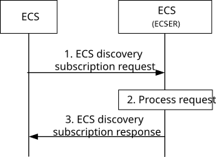

Figure 8.17.2.3.3.2-1: ECS discovery subscription procedure

1\. The ECS sends a ECS discovery subscription request to the ECS-ER. The request contains security information of the ECS. The request optionally contains AC profile(s), UE's location information and the PLMN information.

2\. The ECS-ER authorizes the received request. If authorized, the ECS-ER creates and stores the subscription.

3\. The ECS-ER sends a ECS discovery subscription response to the ECS which includes the subscription identifier and may include the expiration time, indicating when the subscription will automatically expire. To maintain the subscription, the EEC shall send a ECS discovery subscription update request prior to the expiration time. If a ECS discovery subscription update request is not received prior to the expiration time, the ECS-ER shall treat the ECS as implicitly unsubscribed.

#### 8.17.2.3.3.3 Notify

Figure 8.17.2.3.3.3-1 illustrates the procedure.

Pre-conditions:

1\. The ECS has subscribed for ECS discovery.

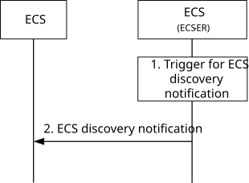

Figure 8.17.2.3.3.3-1: ECS discovery notification

1\. An event occurs at the ECS-ER that satisfies trigger conditions for ECS discovery notification, e.g. after new ECS registration.

2\. The ECS-ER sends a ECS discovery notification to the ECS. The notification includes the ECS profile of the Partner ECS(s) as requested in the subscription and may include information for roaming UEs to establish a PDU session to the Partner ECS as specified in 3GPP TS 23.548 \[20\]. The ECS caches the information for further use.

#### 8.17.2.3.3.4 Subscription update

Figure 8.17.2.3.3.4-1 illustrates the procedure.

Pre-conditions:

1\. The ECS has subscribed for ECS discovery.

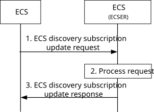

Figure 8.17.2.3.3.4-1: ECS discovery subscription update procedure

1\. The ECS sends a ECS discovery subscription update request to the ECS-ER. The request contains security information of the ECS and may include an AC profile(s), UE's location information and the PLMN information.

2\. The ECS-ER authorizes the received request. If authorized, the ECS-ER updates the stored subscription.

3\. The ECS-ER sends an ECS discovery subscription update response indicating success or failure of the subscription update operation. The ECS-ER may provide an updated expiration time to indicate to the ECS when the updated subscription will automatically expire. To maintain the subscription, the ECS needs to send another subscription update request prior to the expiration time. If a subscription update request is not received prior to the expiration time, the ECS-ER treats the ECS as implicitly unsubscribed.

#### 8.17.2.3.3.5 Unsubscribe

Figure 8.17.2.3.3.5-1 illustrates the procedure.

Pre-conditions:

1\. The ECS has subscribed for ECS discovery.

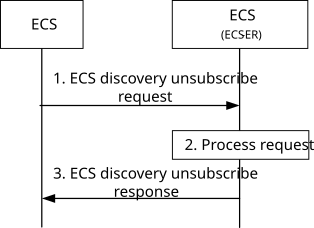

Figure 8.17.2.3.3.5-1: ECS discovery unsubscribe procedure

1\. The ECS sends a ECS discovery unsubscribe request to the ECS-ER. The request contains security information of the ECS and the subscription identifier.

2\. The ECS-ER authorizes the received request. If authorized, the ECS-ER cancels the stored subscription.

3\. The ECS-ER sends an ECS unsubscribe response indicating success or failure of the subscription update operation.

## 8.17.2.4 Service provisioning information retrieval

### 8.17.2.4.1 General

When required to retrieve Service provisioning information from a partner ECS, the ECS queries the partner ECS by providing information such as required applications, location, service continuity support information and connectivity information. In response the partner ECS provides Service provisioning information of EDNs satisfying the requirements.

The following clauses specify procedures, information flows and APIs for service provisioning information retrieval.

In the following procedures, ECS sending the request can be an ECS-ER of an ECSP and Partner ECS receiving the request can be the ECS-ER of the partner ECSP.

NOTE: Partner ECS can also be a V-ECS based on the roaming status of the UE for which the service provisioning information is being retrieved.

### 8.17.2.4.2 Procedures

#### 8.17.2.4.2.1 General

Following procedures are supported for service provisioning:

\- Request-response model; and

\- Subscribe-notify model.

#### 8.17.2.4.2.2 Request-response model

Figure 8.17.2.4.2.2-1 illustrates service provisioning procedure based on request/response model.

Pre-condition(s):

1\. ECS has received a service provisioning request from an EEC or T-EES discovery request from an EES.

2\. The ECS has the ECS profile of the partner ECS (e.g. through pre-configuration, OAM configuration or ECS discovery).

3\. Required federation agreement exists between the ECSPs.

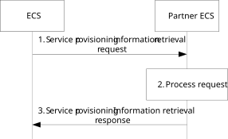

Figure 8.17.2.4.2.2-1: Service provisioning information retrieval – Request/Response

1\. The ECS sends a service provisioning information retrieval request to the partner ECS. The request contains security information of the ECS, and optionally AC profile(s) and UE's current location. If the UE hosting the EEC is roaming in a V-PLMN (determined using the serving PLMN information in the received service provisioning request, or by interacting with the H-PLMN), then the service provisioning information retrieval request includes the information of the serving PLMN i.e. the V-PLMN.

2\. The partner ECS authorizes the received request. If authorized, the partner ECS processes the request and gathers the provisioning information of the EDNs that can satisfy the query parameters received in step 1.

3\. The partner ECS sends a service provisioning information retrieval response to the ECS. The response includes provisioning information of the EDNs that can satisfy the query parameters received in step 1 and may include lifetime information. The ECS caches the received information for further use. If the Lifetime IE is included, then the ECS may reuse the retrieved information only for the duration specified by the Lifetime IE, without the need to repeat step 1. When Application group profile is provided in the request for common EAS, procedure as described in clause 8.3.3.2.2 applies.

NOTE: Only the information allowed by the federation agreement is included in the service provisioning information response.

#### 8.17.2.4.2.3 Subscribe-notify model

##### 8.17.2.4.2.3.1 General

##### 8.17.2.4.2.3.2 Subscribe

Figure 8.17.2.4.2.3.2-1 illustrates service provisioning information subscription request between an ECS and its partner ECS.

Pre-condition(s):

1\. The ECS has the ECS configuration information of the partner ECS (e.g. through pre-configuration, OAM configuration or ECS discovery).

2\. Required federation agreement exists between the ECSPs.

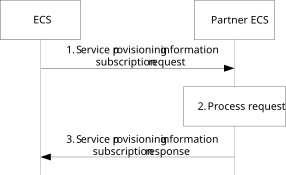

Figure 8.17.2.4.2.3.2-1: Service provisioning information retrieval – Subscribe

1\. The ECS sends a service provisioning information subscription request to the partner ECS. The request contains security information of the ECS, Notification Target Address (e.g. URL), federation information, Service Provisioning filters.

2\. The partner ECS authorizes the received request. If authorized, the partner ECS creates a subscription and stores the subscription.

3\. The partner ECS sends a service provisioning information subscription response to the ECS. The response includes the subscription identifier and may include the expiration time, indicating when the subscription will automatically expire. To maintain the subscription, the ECS shall send a service provisioning information subscription update request prior to the expiration time. If a service provisioning information subscription update request is not received prior to the expiration time, the partner ECS shall treat the ECS as implicitly unsubscribed.

##### 8.17.2.4.2.3.3 Notify

Figure 8.17.2.4.2.3.3-1 illustrates the service provisioning information notification procedure between an ECS and its partner ECS.

Pre-conditions:

1\. ECS has subscribed for service provisioning information from the partner ECS as specified in clause 8.17.2.4.2.3.2.

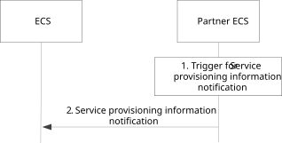

Figure 8.17.2.4.2.3.3-1: Service provisioning information notification

1\. An event occurs at the partner ECS that satisfies trigger conditions for notifying (e.g. to provide a change in information about available EASs) a subscribed ECS.

2\. The Partner ECS sends a service provisioning information notification to the ECS. The notification includes updated provisioning information of the EDNs that can satisfy the query parameters received during subscription and may include lifetime information. The ECS caches the received information for further use. If the Lifetime IE is included, then the ECS may reuse the received information only for the duration specified by the Lifetime IE.

NOTE: Only the information allowed by the federation agreement is included in the service provisioning information notification.

##### 8.17.2.4.2.3.4 Subscription update

Figure 8.17.2.4.2.3.4-1 illustrates service provisioning information subscription update request between an ECS and its partner ECS.

Pre-condition(s):

1\. ECS has subscribed for service provisioning information from the partner ECS as specified in clause 8.17.2.4.2.3.2.

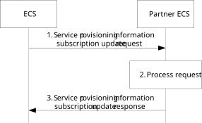

Figure 8.17.2.4.2.3.4-1: Service provisioning information retrieval – Subscription update

1\. The ECS sends a service provisioning information subscription update request to the partner ECS. The request contains security information of the ECS and subscription identifier, and may include updated Notification Target Address (e.g. URL), federation information, Service Provisioning filters, location information and PLMN information.

2\. The partner ECS authorizes the received request. If authorized, the partner ECS updates the stored subscription.

3\. The partner ECS sends a service provisioning information subscription update response to the ECS. The response may include updated expiration time, indicating when the subscription will automatically expire. To maintain the subscription, the ECS shall send a service provisioning information subscription update request prior to the expiration time. If a service provisioning information subscription update request is not received prior to the expiration time, the partner ECS shall treat the ECS as implicitly unsubscribed.

##### 8.17.2.4.2.3.5 Unsubscribe

Figure 8.17.2.4.2.3.5-1 illustrates service provisioning subscription update request between an ECS and its partner ECS.

Pre-condition(s):

1\. ECS has subscribed for service provisioning information from the partner ECS as specified in clause 8.17.2.4.2.3.2.

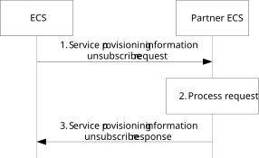

Figure 8.17.2.4.2.3.5-1: Service provisioning information retrieval – Unsubscribe

1\. The ECS sends a service provisioning information unsubscribe request to the partner ECS. The request contains security information of the ECS and the subscription identifier.

2\. The partner ECS authorizes the received request. If authorized, the partner ECS cancels the subscription.

3\. The partner ECS sends a service provisioning information unsubscribe response to the ECS.
