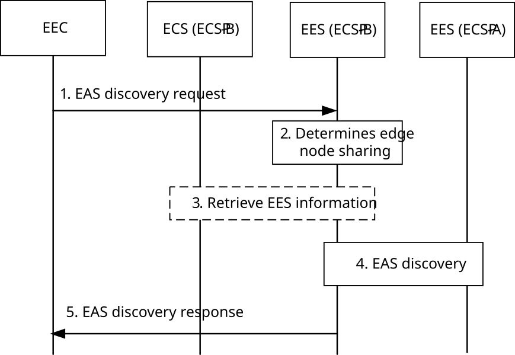

# 8.18 Edge Node Sharing

## 8.18.1 General

In the following clauses, ECSP-A is an ECSP partner of ECSP-B and ECSP-B is the leading ECSP which is serving the UE.

NOTE: An operator platform (OP) as described in GSMA PRD OPG.02 \[19\] is provided by an ECSP.

## 8.18.2 Procedures

### 8.18.2.1 General

Following procedures are defined to support ENS:

\- Application information sharing between ECSPs; and

\- EAS discovery for ENS.

NOTE: Service continuity for ENS via leading ECSP is described in clause 8.18.2.4.

### 8.18.2.2 Application information sharing between ECSPs

NOTE: The security aspect of application information sharing between ECS-ER (ECSP-B) and ECS-ER (ECSP-A) is outside the scope of this release of this specification.

Editor's note: Whether more procedures & operations are needed between ECS-ERs is FFS.

#### 8.18.2.2.1 General

To exchange EES and application information between ECSPs, allowed by the federation agreement for the purpose of ENS, the procedures defined in clause 8.17 are used.

When the ECS determines to query a partner ECSP for the purpose of ENS, e.g., upon receiving a service provisioning request from the EEC as specified in clause 8.3 or periodically, the ECS uses -

\- the procedures defined in clause 8.17.2.3, if it needs to obtain or subscribe for ECS information of partner ECSP; and

\- the procedures defined in clause 8.17.2.4, to obtain or subscribe for the EES information from the partner ECS.

To obtain EES and application information using

\- a request-response model the procedures defined in clause 8.17.2.4.2.2.

\- a subscribe-notify model the procedures defined in clause 8.17.2.4.2.3.

If the query was initiated as a result of a service provisioning request from the EEC as specified in clause 8.3.3.2.2, the service provisioning response to the EEC includes EES information of the partner ECSP along with the EES information of the ECSP serving the UE. The EES of the ECSP serving the UE is determined based on SLA(s) between the ECSPs such that it can be authorized by the EES of the partner ECSP. The endpoint of EES of partner ECSP is provided by the ECS in a way that is transparent to EEC.

### 8.18.2.3 EAS discovery for ENS

#### 8.18.2.3.1 General

Following procedures are defined for EAS discovery with respect to ENS:

\- EAS discovery via leading ECSP;

\- EEC triggered EAS discovery via partner ECSP; and

\- EES triggered EAS discovery via partner ECSP.

#### 8.18.2.3.2 EAS discovery via leading ECSP

Pre-conditions:

1\. ECSP-A and ECSP-B have a service level agreement to share edge services.

Figure 8.18.2.3.2-1: EAS discovery for ENS

1\. The EEC sends EAS discovery request to EES (ECSP-B) as specified in clause 8.5 and may include the endpoint of EES (ECSP-A) in the request, if provided by the ECS as specified in clause 8.18.2.2.1.

2\. If the EAS discovery request contains EES information of a partner ECSP (ECSP-A) or the required EAS is not available with the EES the EES may determine to use ENS. If the EAS discovery request contains EES information of a partner ECSP, the EES can use it after validating the information.

NOTE 1: To validate the information of partner ECSPs, EES (ECSP-B) can use the federation agreement between ECSPs.

3\. If the EAS discovery request does not contain EES information of a partner ECSP, the EES may use the EES retrieval procedures as specified in clause 8.8.3.3 to obtain EES information of a partner ECSP. The Retrieve EES request may include an ENS indication so that the ECS (ECSP-B) can skip checking T-EES(s) locally registered in the ECS (ECSP-B).

4\. Once EES information of the partner ECSP is available, the EES (ECSP-B) sends the EAS discovery request to the EES (ECSP-A) as described in step 3 of clause 8.8.3.2. The EAS discovery request includes the information of the MNO serving the UE (e.g. MNO name, PLMN ID).

> The EES (ECSP-A) validates the request and returns EAS discovery response including the discovered candidate EAS(s) to the EES (ECSP-B). In addition to step 4 of clause 8.8.3.2, the candidate EAS(s) are discovered based on the serving MNO information received from the EES (ECSP-B) and allowed MNO information registered by the EAS.

NOTE 2: To validate the EAS discovery request, EES (ECSP-A) can use the federation agreement between ECSPs.

5\. EES (ECSP-B) provides the discovered information to the EEC as part of the EAS discovery response as specified in clause 8.5.

#### 8.18.2.3.3 EAS discovery via Partner ECSP, EEC triggered

The EEC can use the service provisioning procedure specified in clause 8.3.3.2.2 to obtain the EES information of the partner ECSP from leading ECS, the leading ECS identifies the EES based on the UE serving PLMN ID and EES allowed MNO information.

NOTE: To enhance the Service provisioning information retrieval procedure for the edge node sharing case considering multiple federations is not specified in the present document.

If the EEC has the EES information of the partner ECSP and the required security credentials to communicate with the partner ECSP, the EEC can use the EAS discovery procedures specified in clause 8.5 to directly obtain the EAS information from the EES of the partner ECSP. Upon receiving the request from the EEC, the EES of the partner ECSP identifies the EAS(s) considering the allowed MNO information of the registered EASs and UE’s serving MNO information.

#### 8.18.2.3.4 EAS discovery via Partner ECSP, EES triggered

The S-EES can use the Retrieve T-EES procedure specified in clause 8.8.3.3 to obtain the T-EES information of the partner ECSP from leading ECS, the leading ECS identifies the T-EES based on the UE serving PLMN ID and EES allowed MNO information.

NOTE: Enhancing the Service provisioning information retrieval procedure for the edge node sharing case considering multiple federations by an operator is not specified in the present document.

When service continuity is required, the EES can trigger the T-EAS discovery procedures as defined in clause 8.8.3.2 with the EES of the partner ECSP to find an EAS with respect to ENS. The EAS discovery request includes UE'’s serving MNO information (e.g. MNO name, PLMN ID). Upon receiving the request from the S-EES, the T-EES of the partner ECSP identifies the EAS(s) considering the allowed MNO information of the registered EASs and UE's serving MNO information.

### 8.18.2.4 Service continuity for ENS via leading ECSP

#### 8.18.2.4.1 General

The AC connected EAS may be changed when the UE moves within the same partner ECSP' service coverage or to a different partner ECSP' service coverage or back to leading ECSP' service coverage.

S-EAS and T-EAS can be both provided by partner ECSP.

Some EEC request/response (over EDGE-1) or EAS request/response (over EDGE-3) may be relayed between leading EES and partner EES (over EDGE-9), with necessary modification (e.g. along with the ECSP ID and EES ID of the sender). The following identifies a list of relayed procedures:

\- ACR launching

\- Selected T-EAS declaration

\- ACR status update

\- EAS Information provisioning

\- ACR management events

\- EELManagedACR procedure

#### 8.18.2.4.2 ACR launching procedure

The S-EES of the leading ECSP uses the procedure as defined in clause 8.8.3.4 to forward the ACR request with ACR action indicating ACR initiation from the EEC towards the partner EES over EDGE-9 reference point, and then forwards the ACR response from the partner EES to the EEC.

#### 8.18.2.4.3 Selected T-EAS declaration procedure

Upon receiving the Selected target EAS declaration request from the S-EAS, the partner EES uses the procedure as defined in clause 8.8.3.7 to send the request to the leading EES over EDGE-9 reference point. Upon receiving the response from the leading EES, the partner EES sends the response back to the S-EAS.

#### 8.18.2.4.4 ACR status update procedure

Upon receiving ACR status update request from the EAS (either S-EAS or T-EAS), the partner EES uses the procedure as defined in clause 8.8.3.8 to send the request to the leading EES over EDGE-9 reference point. Upon receiving the response from the leading EES, the partner EES sends the response back to the EAS.

#### 8.18.2.4.5 EAS Information provisioning procedure

Upon receiving EAS Information provisioning request from the EEC, if the request contains selected EAS ID and selected EAS Endpoint and if the selected EAS is not registered the leading EES, then the leading EES uses the procedure as defined in clause 8.15.2.2 to send the EAS Information provisioning request to the partner EES over EDGE-9 reference point to indicate about selection of the EAS for the service consumption. The request includes EES ID and EES endpoint address along with the information sent by the EEC. Upon receiving the response from the partner EES, the leading EES sends the response back to the EEC.

#### 8.18.2.4.6 ACR management events

Upon receiving ACR management event subscribe request from the EAS (either S-EAS or T-EAS), based on subscribed events:

\- for "ACT start/stop" or "ACR Selection" event, the partner EES uses the procedure as defined in clause 8.6.3.2.2 to send the subscribe request to the leading EES over EDGE-9 reference point. Upon receiving the response from the leading EES, the partner EES sends the response back to the EAS.

Upon receiving notification from the leading EES, the partner EES sends the notification to the S-EAS.

\- for "user plane path change" or "ACR monitoring" or "ACR facilitation" event,

\- if based on policy, the partner EES can subscribed to the core network of the leading operator, then the partner EES may interacts with the core network of the leading operator per event needs. For S-EAS decided ACR, once the partner EES selects T-EAS, the partner EES sends Selected T-EAS declaration request to the leading EES over EDGE-9 reference point using the procedure as defined in clause 8.8.3.7. The partner EES further sends the notification to the S-EAS.

\- If based on policy, the partner EES can not subscribe to the core network of the leading operator, the partner EES uses the procedure as defined in clause 8.6.3.2.2 to send the ACR management event subscribe request to the leading EES over EDGE-9 reference point. Upon receiving the response from the leading EES, the partner EES sends the response back to the EAS. Upon receiving ACR management event notification from the leading EES, the partner EES sends the notification to the S-EAS.

#### 8.18.2.4.7 EELManagedACR procedure

Upon receiving EELManagedACR service request from the EAS S-EAS, the partner EES uses the procedure as defined in clause 8.8.3.6 to send the request to the leading EES over EDGE-9 reference point. Upon receiving the response from the leading EES, the partner EES sends the response back to the EAS.

## 8.18.3 APIs

### 8.18.3.1 General

The APIs as defined in clause 8.5.4 are used to perform EAS discovery in partner ECSP.

See clause 8.18.2.3.2, clause 8.18.2.3.3 and clause 8.18.2.3.4 for details of usage of this operation.
