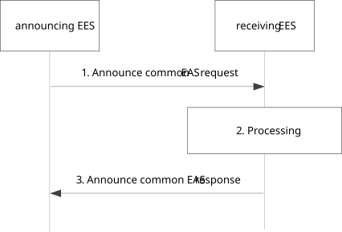

# 8.19 Common EAS announcement

## 8.19.1 General

Common EAS announcement procedure enables an EES to exchange selected common EAS information with other EES(s).

## 8.19.2 Procedure

Pre-conditions:

1\. The announcing EES may be pre-configured with the EES information of other receiving EES(s), which belongs to the same EDN; or

2\. The announcing EES may receive the list of receiving EES(s) information (e.g. address information) from the EEC during the EAS information provisioning procedure.

Figure 8.19.2-1: Announce common EAS procedure

1\. The announcing EES sends Announce common EAS request message to the receiving EES. The request message includes the requestor identifier \[EESID\], the security credentials, the selected common EAS information, the announcing EES endpoint, including common EAS endpoint, common EAS service KPI as specified in table 8.2.5 and the Application group ID. When ACR happens, and announcing EES is targed EES, which can announce the determined EAS information.

2\. Upon receiving the request from the announcing EES, the receiving EES checks if the announcing EES is authorized to provide the selected common EAS. The receiving EES stores the received selected EAS information and announcing EES endpoint along with the Application group ID. When receiving selected T-EAS and T-EES information, the receiving EES can determine whether to relocate the UE to the newly received EAS based on the newly received EAS KPI and EDN information, registered EAS KPI and EDN information, and inter-EAS communication performance of these EASs.

3\. If the processing of the request was successful, the receiving EES sends Announce common EAS response to the announcing EES indicating a successful status; otherwise, the receiving EES shall indicate a failure status and include appropriate reasons. The response message contains the group connection information to indicate the whether the UE connect to the common EAS or not.

## 8.19.3 Information flows

### 8.19.3.1 General

The information flows are specified for Announce common EAS request and response.

### 8.19.3.2 Announce common EAS request

Table 8.19.3.2-1 describes the information elements for Announce common EAS request from the announcing EES to the receiving EES.

Table 8.19.3.2-1: Announce common EAS request

|                                     |        |                                                                                                |
|-------------------------------------|--------|------------------------------------------------------------------------------------------------|
| Information element                 | Status | Description                                                                                    |
| Requestor identifier                | M      | The identifier of the announcing EES.                                                          |
| Security credentials                | M      | Security credentials resulting from a successful authorization for the edge computing service. |
| Selected common EAS ID              | M      | The identifier of the Selected Common EAS                                                      |
| Selected common EAS endpoint        | M      | The endpoint of the Selected Common EAS                                                        |
| Selected common EAS service KPI     | O      | EAS service KPI as specified in table 8.2.5                                                    |
| Selected common EAS EDN information | M      | Information of EDN where the EAS resides.                                                      |
| \> DNN                              | M      | Data network name to identify the EDN.                                                         |
| \> DNAI(s)                          | O      | DNAI(s) associated with the EDN.                                                               |
| EES endpoint                        | O      | The endpoint address (e.g., URI, IP address) of the announcing EES.                            |
| Application Group ID                | M      | Application group identifier as defined in 7.2.11.                                             |

### 8.19.3.3 Announce common EAS response

Table 8.19.3.2-1 describes the information elements for Announce common EAS response from the receiving EES to the announcing EES.

Table 8.19.3.3-1: Announce common EAS response

|                                        |        |                                                                               |
|----------------------------------------|--------|-------------------------------------------------------------------------------|
| Information element                    | Status | Description                                                                   |
| Successful response                    | O      | Indicates that the request was successful.                                    |
| UE ID                                  | O      | The identifier of the UE (i.e. GPSI or identity token)                        |
| \> indication of common EAS connection |        | Indicates whether the UE connect to the common EAS or not.                    |
| Failure response                       | O      | Indicates that the request has failed.                                        |
| Cause                                  | O      | Indicates the failure cause. Only included when Failure Response is included. |

## 8.19.4 APIs

### 8.19.4.1 General

Table 8.19.4.1-1 illustrates the API for common EAS announcement.

Table 8.19.4.1-1: Eees_CommonEASAnnouncement API

<table>
<colgroup>
<col style="width: 40%" />
<col style="width: 21%" />
<col style="width: 20%" />
<col style="width: 18%" />
</colgroup>
<thead>
<tr class="header">
<th>API Name</th>
<th>API Operations</th>
<th>
Operation

Semantics
</th>
<th>Consumer(s)</th>
</tr>
</thead>
<tbody>
<tr class="odd">
<td>Eees_CommonEasAnnouncement</td>
<td>Declare</td>
<td>Request/Response</td>
<td>EES</td>
</tr>
</tbody>
</table>

### 8.19.4.2 Eees_CommonEasAnnouncement_Declare operation

**API operation name:** Eees_CommonEasAnnouncement_Declare

**Description:** The consumer declares common EAS information to the EES.

**Inputs:** See clause 8.19.3.2.

**Outputs:** See clause 8.19.3.3*.*

See clause 8.19.2 for details of usage of this operation.
