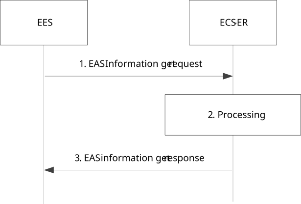
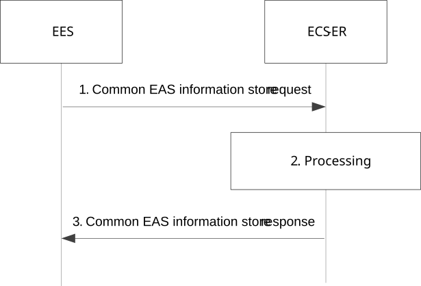
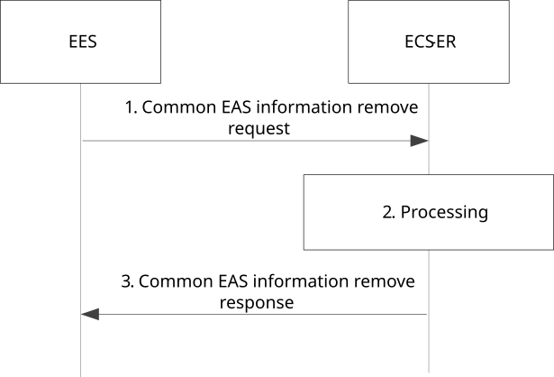
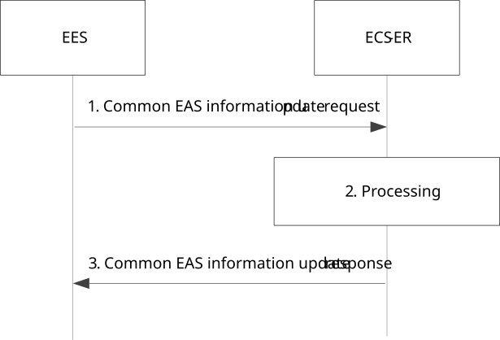

# 8.20 Interaction with ECS with Repository function

## 8.20.1 General

This clause describes procedures and services provided by the ECS with Repository function (ECS-ER), which is applicable when the ECS-ER is available.

NOTE: ECS can support repository function as ECS-ER.

## 8.20.2 Procedure

### 8.20.2.1 General

Clause 8.20.2.2, clause 8.20.2.3, clause 8.20.2.4, and clause 8.20.2.5 illustrate the application group specific EAS information retrieval procedures.

The procedures for Common EAS information store/removal/update in clause 8.20.2.2, clause 8.20.2.3, clause 8.20.2.4, and clause 8.20.2.5 enable an EES to exchange selected common EAS information or common EAS bundle information with other EES(s) via ECS-ER, if ECS-ES is available.

### 8.20.2.2 Obtain EAS information

Figure 8.20.2.2-1: Obtain EAS information

1\. The EES sends EAS information get request message to the ECS-ER. The request message includes EAS ID and Application Group ID, and may include bundled EAS ID list and main EAS ID or EAS bundle ID.

2\. Upon receiving the request, the ECS-ER checks if there are any stored EAS(s) serving the application group for the EAS ID, bundled EAS ID list (if received) and main EAS ID (if received) or EAS bundle ID (if received).

3\. If the processing of the request was successful, the ECS-ER responds the EES with EAS information identified in step 2. If EES indicated the support for EDN information and EAS service KPI information in step 1, the ECS-ER also responds the EES with these information.

### 8.20.2.3 Common EAS information storage

Pre-condition:

1\. The EES is registered in the ECS supporting repository function.

Figure 8.20.2.3-1: Common EAS information storage

1\. The EES sends Common EAS information store request message to the ECS-ER. The request message includes EDN information, EES ID, EAS ID, EAS endpoint and Application Group ID, and may include EAS service KPIs. If the EES performed Common EAS bundle discovery during EAS discovery procedure in clause 8.5, then the EES include in the Common EAS information store request message the Common EAS bundle information, which contains bundled EAS ID and endpoint list, and either main EAS ID or EAS bundle ID.

2\. Upon receiving the request, the ECS-ER checks if there is any stored EAS serving the application group for the EAS ID, bundled EAS ID list (if received) and main EAS ID (if received) or EAS bundle ID (if received) within the same EDN. If no common EAS is identified, the ECS-ER stores the received information for subsequent binding requests.

NOTE: Common EASs for a bundle is supported in this procedure by additionally using bundled EAS ID list and main EAS ID or EAS bundle ID.

3\. The ECS-ER responds the EES with Common EAS information store response message. The ECS-ER may reject the request with common EAS information identified in step 2 or accept the request. For enabling the EEC to further communicate with common EES, the common EES endpoint is also provided with common EAS information.

### 8.20.2.4 Common EAS information removal

Pre-condition:

1\. Common EAS is deregistered from the common EES.

Figure 8.20.2.4-1: Common EAS information removal

1\. The common EES sends Common EAS information remove request message to the ECS-ER. The request message includes EES ID, EAS ID, EAS endpoint and Application Group ID.

2\. Upon receiving the request, the ECS-ER removes the stored information associated with the common EAS identified in the request.

3\. The ECS-ER responds the common EES with Common EAS information remove response message.

### 8.20.2.5 Common EAS information update

Figure 8.20.2.5-1: Common EAS information update

1\. The EES sends Common EAS information update request message to the ECS-ER. The request message includes EDN information, EES ID, EAS ID, EAS endpoint and Application Group ID.

2\. Upon receiving the request, the ECS-ER checks if there is any stored EAS serving the application group for the EAS ID within the same EDN. If existing common EAS is found, the ECS-ER updates the EAS endpoint information for subsequent binding; otherwise, the ECS-ER rejects the EES request in step 3.

3\. The ECS-ER responds the EES with Common EAS information update response message.

## 8.20.3 Information flows

### 8.20.3.1 General

The information flows are specified for EAS information service.

### 8.20.3.2 EAS information get request

Table 8.20.3.2-1 describes the information elements for EAS information get request from the EES to the ECS-ER.

Table 8.20.3.2-1: EAS information get request

|                                                                        |        |                                                                                                |
|------------------------------------------------------------------------|--------|------------------------------------------------------------------------------------------------|
| Information element                                                    | Status | Description                                                                                    |
| Requestor identifier                                                   | M      | The identifier of the EES.                                                                     |
| Security credentials                                                   | M      | Security credentials resulting from a successful authorization for the edge computing service. |
| EAS ID                                                                 | M      | The identifier of the EAS.                                                                     |
| Application Group ID                                                   | M      | Application group identifier as defined in 7.2.11.                                             |
| Bundled EAS ID list                                                    | O      | A list of associated EAS IDs in an EAS bundle.                                                 |
| EAS bundle ID (NOTE)                                                   | O      | Bundle ID as described in clause 7.2.10.                                                       |
| Main EAS ID (NOTE)                                                     | O      | The main EAS ID in an EAS bundle.                                                              |
| NOTE: If present, only one of these IEs may be present in the message. |        |                                                                                                |

### 8.20.3.3 EAS information get response

Table 8.20.3.3-1 describes the information elements for EAS information get response from the ECS-ER to the EES.

Table 8.20.3.3-1: EAS information get response

<table>
<colgroup>
<col style="width: 33%" />
<col style="width: 16%" />
<col style="width: 50%" />
</colgroup>
<tbody>
<tr class="odd">
<td>Information element</td>
<td>Status</td>
<td>Description</td>
</tr>
<tr class="even">
<td>Successful response (NOTE 1)</td>
<td>O</td>
<td>Indicates that the request was successful.</td>
</tr>
<tr class="odd">
<td>&gt; EAS information (NOTE 2)</td>
<td>M</td>
<td>This IE includes a list of EAS endpoints and optionally its associated EAS endpoint(s), corresponding to the requested EAS ID(s).</td>
</tr>
<tr class="even">
<td>&gt; EDN information</td>
<td>O</td>
<td>This IE includes a list of EDN information corresponding to EAS in the response, as described in Table 8.20.3.4-1.</td>
</tr>
<tr class="odd">
<td>&gt; EAS service KPIs</td>
<td>O</td>
<td>This IE includes EAS service KPIs (see Table 8.2.5-1) for the EAS in the response.</td>
</tr>
<tr class="even">
<td>Failure response (NOTE 1)</td>
<td>O</td>
<td>Indicates that the request has failed.</td>
</tr>
<tr class="odd">
<td>&gt; Cause</td>
<td>O</td>
<td>Indicates the failure cause. Only included when Failure response is included.</td>
</tr>
<tr class="even">
<td colspan="3">
NOTE 1: One of these IEs shall be present in the message.

NOTE 2: This IE supports common EAS information for a bundle.
</td>
</tr>
</tbody>
</table>

### 8.20.3.4 Common EAS information store request

Table 8.20.3.4-1 describes the information elements for common EAS information store request from the EES to the ECS-ER.

Table 8.20.3.4-1: Common EAS information store request

|                                                                        |        |                                                                                                                                                                                      |
|------------------------------------------------------------------------|--------|--------------------------------------------------------------------------------------------------------------------------------------------------------------------------------------|
| Information element                                                    | Status | Description                                                                                                                                                                          |
| Requestor identifier                                                   | M      | The identifier of the EES.                                                                                                                                                           |
| Security credentials                                                   | M      | Security credentials resulting from a successful authorization for the edge computing service.                                                                                       |
| EAS ID                                                                 | M      | The identifier of the EAS.                                                                                                                                                           |
| EAS endpoint                                                           | M      | Endpoint information (e.g. URI, FQDN, IP address) used to communicate with the EAS.                                                                                                  |
| Common EAS bundle information                                          | O      | EAS bundle information to which the EAS belongs                                                                                                                                      |
| \> Bundled EAS ID and endpoint list                                    | M      | A list of associated EAS IDs and the corresponding EAS endpoints in an EAS bundle.                                                                                                   |
| \> Main EAS ID (NOTE)                                                  | O      | The main EAS ID in an EAS bundle.                                                                                                                                                    |
| \> EAS bundle ID (NOTE)                                                | O      | Bundle ID as described in clause 7.2.10.                                                                                                                                             |
| Application Group ID                                                   | M      | Application group identifier as defined in 7.2.11. If main EAS ID or EAS bundle ID is provided, it identifies the group of UEs associated with the main EAS ID or the EAS bundle ID. |
| EDN information                                                        | M      | Information of EDN where the EAS resides.                                                                                                                                            |
| \> DNN                                                                 | M      | Data network name to identify the EDN.                                                                                                                                               |
| \> DNAI(s)                                                             | O      | DNAI(s) associated with the EDN.                                                                                                                                                     |
| EAS service KPIs                                                       | O      | Service characteristics provided by EAS, detailed in Table 8.2.5-1.                                                                                                                  |
| NOTE: If present, only one of these IEs may be present in the message. |        |                                                                                                                                                                                      |

### 8.20.3.5 Common EAS information store response

Table 8.20.3.5-1 describes the information elements for common EAS information store response from the ECS-ER to the EES.

Table 8.20.3.5-1: Common EAS information store response

|                                                         |        |                                                                                                                               |
|---------------------------------------------------------|--------|-------------------------------------------------------------------------------------------------------------------------------|
| Information element                                     | Status | Description                                                                                                                   |
| Successful response (NOTE)                              | O      | Indicates that the request was successful.                                                                                    |
| Failure response (NOTE)                                 | O      | Indicates that the request has failed.                                                                                        |
| \> Cause                                                | O      | Indicates the failure cause. Only included when Failure response is included.                                                 |
| \> Common EAS information                               | O      | This IE includes common EAS endpoint and optionally its associated EAS endpoint(s), corresponding to the requested EAS ID(s). |
| \> Common EES endpoint                                  | O      | This IE includes common EES endpoint address. It shall be provided when common EAS information is provided.                   |
| NOTE: One of these IEs shall be present in the message. |        |                                                                                                                               |

### 8.20.3.6 Common EAS information remove request

Table 8.20.3.6-1 describes the information elements for common EAS information remove request from the EES to the ECS-ER.

Table 8.20.3.6-1: Common EAS information remove request

|                      |        |                                                                                                |
|----------------------|--------|------------------------------------------------------------------------------------------------|
| Information element  | Status | Description                                                                                    |
| Requestor identifier | M      | The identifier of the EES.                                                                     |
| Security credentials | M      | Security credentials resulting from a successful authorization for the edge computing service. |
| EAS ID               | M      | The identifier of the EAS.                                                                     |
| Application Group ID | M      | Application group identifier as defined in clause 7.2.11.                                      |
| EAS endpoint         | M      | Endpoint information (e.g. URI, FQDN, IP address) used to communicate with the EAS.            |

### 8.20.3.7 Common EAS information remove response

Table 8.20.3.7-1 describes the information elements for common EAS information remove response from the ECS-ER to the EES.

Table 8.20.3.7-1: Common EAS information remove response

|                                                         |        |                                                                               |
|---------------------------------------------------------|--------|-------------------------------------------------------------------------------|
| Information element                                     | Status | Description                                                                   |
| Successful response (NOTE)                              | O      | Indicates that the request was successful.                                    |
| Failure response (NOTE)                                 | O      | Indicates that the request has failed.                                        |
| \> Cause                                                | O      | Indicates the failure cause. Only included when Failure response is included. |
| NOTE: One of these IEs shall be present in the message. |        |                                                                               |

### 8.20.3.8 Common EAS information update request

Table 8.20.3.8-1 describes the information elements for common EAS information update request from the EES to the ECS-ER.

Table 8.20.3.8-1: Common EAS information update request

|                      |        |                                                                                                |
|----------------------|--------|------------------------------------------------------------------------------------------------|
| Information element  | Status | Description                                                                                    |
| Requestor identifier | M      | The identifier of the EES.                                                                     |
| Security credentials | M      | Security credentials resulting from a successful authorization for the edge computing service. |
| EAS ID               | M      | The identifier of the EAS.                                                                     |
| EAS endpoint         | M      | Endpoint information (e.g. URI, FQDN, IP address) used to communicate with the EAS.            |
| Application Group ID | M      | Application group identifier as defined in clause 7.2.11.                                      |
| EDN information      | M      | Information of EDN where the EAS resides.                                                      |
| \> DNN               | M      | Data network name to identify the EDN.                                                         |
| \> DNAI(s)           | O      | DNAI(s) associated with the EDN.                                                               |

### 8.20.3.9 Common EAS information update response

Table 8.20.3.9-1 describes the information elements for common EAS information update response from the ECS-ER to the EES.

Table 8.20.3.9-1: Common EAS information update response

|                                                         |        |                                                                               |
|---------------------------------------------------------|--------|-------------------------------------------------------------------------------|
| Information element                                     | Status | Description                                                                   |
| Successful response (NOTE)                              | O      | Indicates that the request was successful.                                    |
| Failure response (NOTE)                                 | O      | Indicates that the request has failed.                                        |
| \> Cause                                                | O      | Indicates the failure cause. Only included when Failure response is included. |
| NOTE: One of these IEs shall be present in the message. |        |                                                                               |

## 8.20.4 APIs

### 8.20.4.1 General

Table 8.20.4.1-1 illustrates the API for EAS information management.

Table 8.20.4.1-1: EAS information management APIs

<table>
<colgroup>
<col style="width: 40%" />
<col style="width: 23%" />
<col style="width: 19%" />
<col style="width: 16%" />
</colgroup>
<thead>
<tr class="header">
<th>API Name</th>
<th>API Operations</th>
<th>
Operation

Semantics
</th>
<th>Consumer(s)</th>
</tr>
</thead>
<tbody>
<tr class="odd">
<td rowspan="4">Eecs_EASInfoManagement</td>
<td>Store</td>
<td>Request/Response</td>
<td>EES</td>
</tr>
<tr class="even">
<td>Update</td>
<td>Request/Response</td>
<td>EES</td>
</tr>
<tr class="odd">
<td>Remove</td>
<td>Request/Response</td>
<td>EES</td>
</tr>
<tr class="even">
<td>Get</td>
<td>Request/Response</td>
<td>EES</td>
</tr>
</tbody>
</table>

### 8.20.4.2 Eecs_EASInfoManagement_Store operation

**API operation name:** Eecs_EASInfoManagement_Store

**Description:** The consumer requests EAS information storage service from the ECS.

**Inputs:** See clause 8.20.3.4.

**Outputs:** See clause 8.20.3.5*.*

See clause 8.20.2.3 for details of usage of this operation.

### 8.20.4.3 Eecs_EASInfoManagement_Get operation

**API operation name:** Eecs_EASInfoManagement_Get

**Description:** The consumer obtains EAS information from the ECS.

**Inputs:** See clause 8.20.3.2.

**Outputs:** See clause 8.20.3.3*.*

See clause 8.20.2.2 for details of usage of this operation.

### 8.20.4.4 Eecs_EASInfoManagement_Remove operation

**API operation name:** Eecs_EASInfoManagement_Remove

**Description:** The consumer requests to remove EAS information from the ECS.

**Inputs:** See clause 8.20.3.6.

**Outputs:** See clause 8.20.3.7*.*

See clause 8.20.2.4 for details of usage of this operation.

### 8.20.4.5 Eecs_EASInfoManagement_Update operation

**API operation name:** Eecs_EASInfoManagement_Update

**Description:** The consumer requests EAS information update service from the ECS.

**Inputs:** See clause 8.20.3.8.

**Outputs:** See clause 8.20.3.9*.*

See clause 8.20.2.5 for details of usage of this operation.
