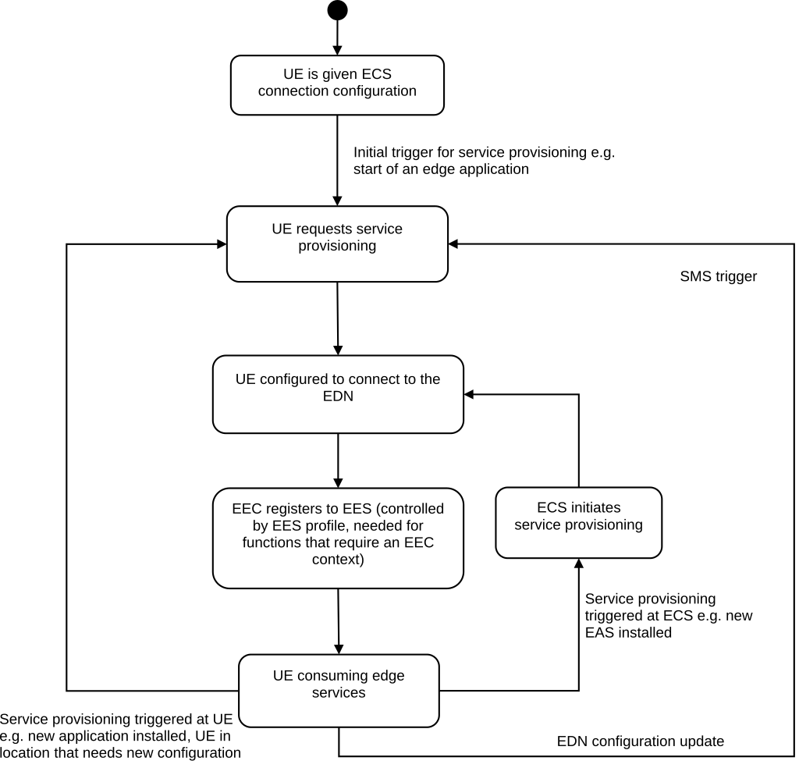

# 8.3.1 General

Service provisioning allows configuring the EEC with information about available Edge Computing services, based on the hosting UEs location, service requirements, service preferences and connectivity. This configuration includes the necessary address information for the EEC to establish connection with the EES(s).

If the ECS deployed by MNO is contracted with one or more ECSP(s), the ECS provides EES configuration information of MNO owned and ECSP owned EESs via MNO ECS as described in clause 8.3.3.3.3.

If the ECS is deployed by a non-MNO ECSP, the ECS endpoint address may be configured with the EEC. An EEC that is aware of multiple ECSP's ECS endpoint addresses may perform the service provisioning procedure per ECS of each ECSP multiple times.

Figure 8.3.1-1 illustrates an overview of service provisioning. Service provisioning procedures support the following models:

\- Request/Response model; and

\- Subscribe/Notify model.

Figure 8.3.1-1: Overview of Service provisioning

The UE is given configuration information enabling it to connect to the ECS. The UE can then request initial provisioning from the ECS to obtain configuration required to connect to the EDN. Once provisioned, the EEC of the UE registers with the selected EES(s) from the list of provisioned EES(s) it received from the ECS(s), if the EEC registration configuration in EES profile indicates that EEC registration is required. The UE further consumes the edge computing services and performs various operations such as EAS discovery, Edge application communications, ACR, etc. While the UE is consuming the edge computing services, the UE or ECS may be triggered to re-request service provisioning.

The triggers for service provisioning are classified as:

a\. Triggers at UE - Some examples are:

\- AC related updates available at the EEC due to AC installation/re-installation, AC requesting application server access (e.g. via internet browser);

\- EEC supporting one or more ACs may be updated due to EEC re-installation; and

\- Lifetime of EDN Configuration Information is expired or the EEC detects that the UE moves out of EDN Service Area in the EDN Configuration Information.

b\. Triggers at ECS – Some examples are:

\- EES updates received due to EAS installation/re-installation/re-location; and

\- ECS receives the EDN/DNAI change notification of the UE from 5GC when the ECS subscribes to the user plane path management events as specified in clause 8.10.2.
