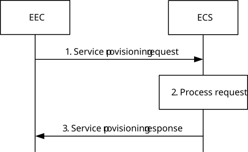

# 8.3.3.2.2 Request-response model

Figure 8.3.3.2.2-1 illustrates service provisioning procedure based on request/response model.

Pre-conditions:

1\. The EEC has been pre-configured or has discovered the address (e.g. URI) of the ECS;

2\. The EEC has been authorized to communicate with the ECS;

3\. The UE Identifier is either preconfigured or resulted from a successful authorization; and

4\. The ECS is configured with ECSP's policy for service provisioning.

NOTE 1: Details of ECSP's policy are out of scope.

Figure 8.3.3.2.2-1: Service provisioning – Request/Response

1\. The EEC sends a service provisioning request to the ECS. The service provisioning request includes the security credentials of the EEC received during EEC authorization procedure and may include the UE identifier such as GPSI, connectivity information, UE location, EEC service continuity support and AC profile(s) information. EEC may provide its desired ECSP identifier(s) in the service provisioning request based on EEC preference. If an e2e tunnel is used in the UE for applications (e.g. user configured tunnel service), and if the tunnel service provider and the ECSP are from the same organization and only if user grants the permission, then the EEC provides the tunnel information for the associated applications in the request to the ECS.

NOTE 2: The e2e tunnel case is limited to case where the tunnel service is deployed in home domain in the present release.

2\. Upon receiving the request, the ECS performs an authorization check to verify whether the EEC has authorization to perform the operation. The ECS may utilize the capabilities (e.g. UE location) of the 3GPP core network as specified in clause 8.10.2. If the UE serving PLMN identifier is not provided by the EEC in the connectivity information of the service provisioning request, the ECS may invoke the NEF monitoring event API as described in 3GPP TS 23.502 \[43\] and 3GPP TS 23.682 \[17\] to obtain the UE roaming status and serving PLMN identifier. If the UE is roaming, the ECS may use the serving PLMN identifier to determine the roaming partner ECS (i.e. V-ECS) information to be provided to the EEC in the service provisioning response. If the Prediction expiration time is provided then the ECS may determine whether to identify EES with the instantiable but not instantiated EAS based on the Prediction expiration time and predicted EAS deployment time information obtained from ADAES as specified in clause 8.11 of TS 23.436 \[28\] or from local configured maximum EAS deployment time. If AC profile(s) are provided by the EEC, and the Application group profile is not provided, the ECS identifies the EES(s) based on the provided AC profile(s) and the UE location.

> When Application group profile is provided in the request, which applies to the common EAS case:

\- if the ECS-ER is not available, then

\- the ECS identifies EES(s) based on the information contained in the request (e.g.AC profile, Application group profile, UE location), specifically, the ECS identify the EES(s) based on the EASID and expected group geographical service area in the application group profile and the EAS ID supported by the EES and EES(s) service area in EES profile(s); The ECS may also subscribe and get the notifications of candidate DNAIs for the UEs of the group as described in 3GPP TS 23.548 \[20\], 3GPP TS 23.501 \[2\], the ECS also identifies the EES(s) taking the candidate DNAIs into account, e.g., an EES where the its DNAI in the EES profile is common to all UEs in the group.

\- if the ECS-ER is available, and:

\- EES information is not available corresponding to the Application Group ID, then the ECS identifies EES(s) and stores the identified EES(s)'s information and related Application group ID into the ECS-ER; specifically, the ECS identify the EES(s) based on the EASID and expected group geographical service area in the application group profile and the EAS ID supported by the EES and EES(s) service area in EES profile(s); The ECS may also subscribe and get the notifications of candidate DNAIs for the UEs of the group as described in 3GPP TS 23.548 \[20\], 3GPP TS 23.501 \[2\], the ECS also identifies the EES(s) taking the candidate DNAIs into account, e.g., an EES where the its DNAI in the EES profile is common to all UEs in the group. or

\- EES information is available corresponding to the Application Group ID, then the ECS retrieves the EES (s) information corresponding to the Application Group ID from the ECS-ER.

> NOTE 3: It is up to the ASP or the EES to determine validity of the application group.
>
> The ECS may take Group Geographical Service Area information and KPI requirements of the AC to determine the EES(s) corresponding to the Application group ID.
>
> When neither Application group profile nor AC profiles(s) are provided, then:

\- if available, the ECS identifies the EES(s) based on the UE-specific service information at the ECS and the UE location;

\- ECS identifies the EES(s) by applying the ECSP policy (e.g. based only on the UE location),

> Furthermore, the ECS may identify the EES based on the EEC service continuity support information and EES service continuity support information.
>
> The ECS may take the EAS(s) load information corresponding to the EASIDs registered with EES in the EDN(s) to determine the EES(s) corresponding to the provided AC profile(s).

NOTE 4: Considering system impact of using EAS load info registered in ECS is not specified in the present document.

NOTE 5: Details of the UE-specific service information and how it is available at the ECS is out of scope.

NOTE 6: Both steps are evaluated prior to sending a response.

If desired ECSP identifier(s) is provided by the EEC, the ECS identifies the EES(s) to be sent in step 3 based on registered ECSP identifier in EES profile and the desired ECSP identifier(s).

NOTE 7: For EEC desired ECSP identifier usage, it is assumed that the ECSP providing the EES and PLMN operator are the same organization and an ECSP providing the EES (desired by the EEC) registers its EES in ECS provided by another ECSP based on service agreement to provide services to EEC.

The ECS also determines other information that needs to be provisioned, e.g. EDN connection information, EDN service area, EES endpoints (see details in Table 8.3.3.3.3-2).

For the roaming and federation case, if ECS does not identify any suitable EES(s) based on EDN configuration available at the ECS and UE's location, the ECS determines a partner ECS that may satisfy the requirements. Based on ECSP policy, the ECS may use preconfigured or OAM configured information about the partner ECSs or ECS discovery via ECS-ER as specified in clause 8.17.2.3 or both.

If required by the ECSP policies, the ECS may use service provisioning information retrieval procedure as specified in clause 8.17.2.4 to obtain service provisioning information from the partner ECS.

NOTE 8: ECSP policies can restrict sharing partner ECSP's information with the EEC.

When the bundle EAS information is provided, which applies to the bundle EAS case then

\- If bundle EAS information includes EAS bundle identifier, the ECS identifies all the EES(s) providing the same EAS bundle identifier.

\- If bundle EAS information includes a list of EASIDs, the ECS identifies the one or more EES which support all of the EASs within the same EDN based on the EDN information obtained in the EES profile.

If both Application group profile and bundle EAS information are provided in the request, then ECS considers them as common EAS bundle information and identifies all the EES(s) by utilizing both Application group profile and bundle EAS information.

If the tunnel information is received, the ECS additionally takes the tunnel information into consideration in identifying EES(s). If no tunnel information is received, the ECS additionally takes the N6 tunnel (e.g. L2TP) information from 3GPP core network (via NEF user plane path management service as described in 3GPP TS 23.501 \[2\], clause 5.6.7) or NATed UE IP address (e.g. by local UPF based on local configuration) and EES IP address information into consideration in identifying EES(s). For instance, the IP address(es) of identified EES(s) needs to be topologically close to the IP address of the tunnel server, local UPF (based on NATed UE IP address) or NATed UE for optimal N6 route.

3\. If the processing of the request was successful, the ECS responds to the EEC's request with a service provisioning response. If the ECS has identified the relevant EES(s) information, the service provisioning response includes a list of EDN configuration information, e.g. EDN connection information, EDN service area, and the required information (e.g. URI, IP address) for establishing a connection to the EES (see details in Table 8.3.3.3.3-2).

The ECS may provide associated EES(s) information (one or more EES information) in the service provisioning response along with the bundle EAS information.

If the alternative ECS(s) has been identified in step 2, the ECS sends a successful response including the Redirect information element containing the list of ECS(s) configuration information indicating that alternative ECS(s) is available for service provisioning request. The response may include information such as DNN and S-NSSAI for roaming UEs to establish a PDU session with the ECS as specified in 3GPP TS 23.548 \[20\].

If the ECS is not provisioned with any EDN configuration information or is unable to determine either the EES information or the partner ECS information using the inputs in service provisioning request, UE-specific service information at the ECS or the ECSP's policy, the ECS shall reject the service provisioning request and respond with an appropriate failure cause.

If the service provisioning response contains a list of ECS configuration information, the EEC may initiate service provisioning procedure with one or more ECS(s) provided in the response. If the UE is roaming to a V-PLMN and the ECS configuration information includes V-PLMN ID in the list of Supported PLMN ID(s), the EEC may establish a connection with the V-ECS based on parameters such as UE serving PLMN ID and supported PLMN ID(s) of the V-ECS received in the response message as specified in 3GPP TS 23.548 \[20\]. The connection with the V-ECS can be a HR-SBO PDU session or an LBO PDU session based on the information received from the ECS.

If the EDN configuration information includes an LADN DNN as an identifier for the EDN, the EEC considers the LADN as the EDN. Therefore, the service area of EDN is the LADN Service Area which can be discovered using the UE Registration Procedure.

The EEC may cache the service provisioning information (e.g. EES endpoint) for subsequent use and avoid the need to repeat step 1. If the Lifetime IE is included in the Service provisioning response, then the EEC may cache and reuse the Service provisioning information only for the duration specified by the Lifetime IE, without the need to repeat step 1.

If the ECS provided information regarding the service continuity support of individual EESs, the EEC may take this information into account when selecting an EES for EEC registration, EAS discovery or T-EAS discovery, respectively.

If for multiple EES(s), the instantiable EAS information IE for an EAS is not available or the instantiable EAS information IE is set to instantiated or instantiable, the EEC can select one or more such EES to perform EAS discovery. For EAS discovery to mitigate the waste of EDN resources EEC considers the instantiable EAS information and the associated instantiation criteria, the EEC selects one EES, if the EAS instantiation status corresponding to the EASID requested by AC/EEC is instantiable but not yet instantiated (i.e. no instantiated EAS).

NOTE 9: If the service provisioning request fails, the EEC can resend the service provisioning request again, taking into account the received failure cause.

After the EEC establishes a connection to an EES using information received in step 3, the EES can issue an AF request to influence traffic routing as specified in 3GPP TS 23 501 \[2\] clause 5.6.7 in order to influence the user plane path to this connected EES.

For example, using a particular DNAI to reach the data network containing the EES might be necessary to meet AC service KPIs.

NOTE 10: If the EAS instantiation fails based on the selected EES, the EEC may retry the EAS discovery request to another EES (e.g. selecting another one EES based on the instantiable EAS information).
