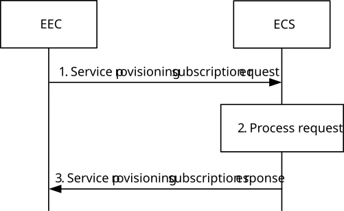
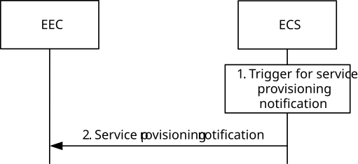
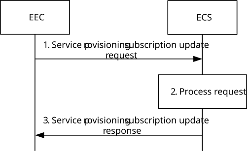
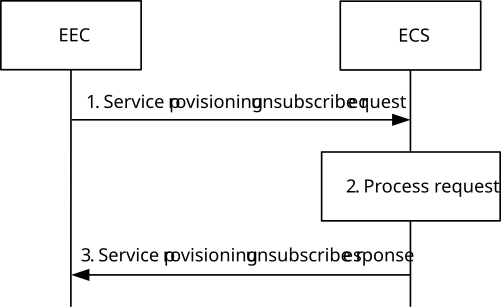

# 8.3.3.2.3 Subscribe-notify model

## 8.3.3.2.3.1 General

Clause 8.3.3.2.3.2 and clause 8.3.3.2.3.3 together illustrate the service provisioning procedure based on Subscribe/Notify model.

Clause 8.3.3.2.3.4 illustrates the service provisioning update procedure.

Clause 8.3.3.2.3.5 illustrates the service provisioning unsubscribe procedure.

## 8.3.3.2.3.2 Subscribe

Figure 8.3.3.2.3.2-1 illustrates the service provisioning subscription procedure between the EEC and the ECS.

Pre-conditions:

1\. The EEC has been pre-configured or has discovered the address (e.g. URI) of the ECS;

2\. The EEC has been authorized to communicate with the ECS as specified in clause 8.11;

3\. The UE Identifier is either preconfigured or resulted from a successful authorization;

4\. The ECS is configured with ECSP's policy for service provisioning; and

5\. The EEC has optionally acquired a Notification Target Address to be used in its subscriptions to notifications.

NOTE 1: Details of ECSP's policy are out of scope.

NOTE 2: How the EEC acquires the notification target address or a notification channel URI to receive the notifications is out of scope of this release. The notification target address can terminate at the EEC (e.g. in an IoT device) if the deployment supports EEC reachability, or it can terminate at a push notification service. Details of the push notification service are out of scope of this release.

Figure 8.3.3.2.3.2-1: Service provisioning subscription

1\. The EEC sends a service provisioning subscription request to the ECS. The service provisioning subscription request includes the security credentials of the EEC received during EEC authorization procedure and Notification Target Address (e.g. URL) and may include the UE identifier such as GPSI, connectivity information, proposed expiration time and AC Profile information. EEC may provide its desired ECSP identifier(s) in the service provisioning request based on EEC preference.

> If the application triggering is supported and required by the EEC, the EEC may include the EEC Triggering Request information element instead of the Notification Target Address in the request message.

2\. Upon receiving the request, the ECS performs an authorization check to verify whether the EEC has authorization to perform the operation. If required, the ECS may utilize the capabilities (e.g. UE location or user plane management event notification service if available) of the 3GPP core network as specified in clause 8.10.2. If the request is authorized, the ECS creates and stores the subscription for provisioning.

NOTE 3: The ECS can monitor the user plane path change for EDGE-1 traffic toward EES(s) by utilizing the user plane management event notification service specified in 3GPP TS 23.501 \[2\]. Based on target DNAI and/or target tunnel information reported from 5GC the ECS can notify more suitable EES(s) to the EEC.

3\. If the processing of the request was successful, the ECS responds with a service provisioning subscription response, which includes the subscription identifier and may include the expiration time, indicating when the subscription will automatically expire. To maintain the subscription, the EEC shall send a Service provisioning subscription update request prior to the expiration time. If a Service provisioning subscription update request is not received prior to the expiration time, the ECS shall treat the EEC as implicitly unsubscribed.

If the ECS is unable to determine the EES information using the inputs in service provisioning subscription request, UE-specific service information at the ECS or the ECSP policy, the ECS shall reject the service provisioning subscription request and respond with an appropriate failure cause.

NOTE 4: If the service provisioning subscription request fails, the EEC can resend the service provisioning subscription request again, taking into account the received failure cause.

## 8.3.3.2.3.3 Notify

Figure 8.3.3.2.3.3-1 illustrates the service provisioning notification procedure between the EEC and the ECS.

Pre-conditions:

1\. The EEC has subscribed with the ECS for the provisioning information as specified in clause 8.3.3.2.3.2.

Figure 8.3.3.2.3.3-1: Service provisioning notification

1\. An event occurs at the ECS that satisfies trigger conditions for updating service provisioning of a subscribed EEC. If UE's location information is not available, the ECS may obtain the UE location by utilizing the capabilities of the 3GPP core network as specified in clause 8.10.2. If the UE serving PLMN identifier is not provided by the EEC in the connectivity information of the service provisioning request, the ECS may invoke the NEF monitoring event API as described in 3GPP TS 29.522 \[4\] and 3GPP TS 29.122 \[5\] to obtain the UE roaming status and serving PLMN identifier. If the UE is roaming, the ECS may use the serving PLMN identifier to determine the partner ECS information to be provided to the EEC in the service provisioning notification. If AC profile(s) were provided by the EEC during subscription creation, the ECS identifies the EES(s) based on the provided AC profile(s) and the UE location. If AC profiles(s) were not provided, then:

\- if available, the ECS identifies the EES(s) based on the UE-specific service information at the ECS and the UE location;

\- ECS identifies the EES(s) by applying the ECSP policy (e.g. based only on the UE location);

NOTE 1: Details of the UE-specific service information and how it is available at the ECS is out of scope.

NOTE 2: Both steps are evaluated prior to sending a response.

If desired ECSP identifier(s) provided by the EEC, the ECS identifies the EES(s) to be sent in step 2 based on registered ECSP identifier in EES profile and the desired ECSP identifier(s).

NOTE 3: For EEC desired ECSP identifier usage, it is assumed that the ECSP providing the EES and PLMN operator are the same organization and an ECSP providing the EES (desired by the EEC) registers its EES in ECS provided by another ECSP based on service agreement to provide services to EEC.

The ECS also determines other information that needs to be provisioned, e.g. identification of the EDN, EDN service area, EES endpoints.

If ECS does not identify any suitable EES(s) based on EDN configuration available at the ECS and UE’s location, the ECS determines a partner ECS that may satisfy the requirements. Based on ECSP policy, the ECS may use preconfigured or OAM configured information about the partner ECSs or ECS discovery via ECS-ER as specified in clause 8.17.2.3 or both. If required by the ECSP policies, the ECS may use service provisioning information retrieval procedure as specified in clause 8.17.2.4 to obtain service provisioning information from the partner ECS.

NOTE 4: ECSP policies can restrict sharing partner ECSP's information with the EEC.

When the bundle EAS information is provided, then;

\- If bundle EAS information included EAS bundle identifier, the ECS identifies all the EES(s) providing the same EAS bundle identifier.

\- If bundle EAS information includes a list of EASIDs, the ECS identifies the one or more EES which support all of the EASs within the same EDN based on the EDN information obtained in the EES profile.

If the application triggering is supported and required by the EEC as indicated in EEC Triggering Request IE of the Service Provisioning Subscription Request, then the ECS performs the EEC triggering service as described in the clause 8.16.1 and skips the step 2.

2\. The ECS sends a provisioning notification to the EEC. If the ECS has identified the relevant EES(s) information, the service provisioning notification includes the list of EDN configuration information determined in step 1. If the ECS has determined suitable partner ECS(s), the service provisioning notification includes a list of ECS configuration information and may include information for roaming UEs to establish PDU session with the ECS as specified in 3GPP TS 23.548 \[20\]. The ECS may provide associated EES(s) information (one or more EES information) in the service provisioning response along with the bundle EAS information.

If the service provisioning notification contains a list of ECS configuration information, the EEC may initiate service provisioning procedure with one or more ECS(s) provided in the notification. If the UE is roaming to a V-PLMN and the ECS configuration information includes V-PLMN ID in the list of Supported PLMN ID(s), the EEC establishes a PDU session with the V-PLMN to access the ECS in the visited network as specified in 3GPP TS 23.548 \[20\].

If the EDN configuration information in the service provisioning notification includes an LADN DNN as an identifier for the EDN, the EEC considers the LADN as the EDN. Therefore, the service area of EDN is the LADN Service Area, which can be discovered using the UE Registration Procedure.

If the ECS provided information regarding the service continuity support of individual EESs, the EEC may take this information into account when selecting an EES for EEC registration, EAS discovery or T-EAS discovery, respectively.

After the EEC establishes a connection to an EES using information received in step 2, the EES can issue an AF request to influence traffic routing as specified in 3GPP TS 23.501 \[2\] clause 5.6.7 in order to influence the user plane path to this connected EES.

NOTE 5: For example, using a particular DNAI to reach the data network containing the EES might be necessary to meet AC service KPIs.

## 8.3.3.2.3.4 Subscription update

Figure 8.3.3.2.3.4-1 illustrates the service provisioning subscription update procedure between the EEC and the ECS.

Pre-conditions:

1\. The EEC has subscribed with the ECS for the provisioning information as specified in clause 8.3.3.2.3.2.

Figure 8.3.3.2.3.4-1: Service provisioning subscription update

1\. The EEC sends a service provisioning subscription update request to the ECS. The service provisioning subscription update request includes the security credentials of the EEC received during EEC authorization procedure along with the subscription identifier and may include the UE identifier such as GPSI, connectivity information, proposed expiration time for the updated subscription and AC profile(s).

2\. Upon receiving the request, the ECS performs an authorization check to verify whether the EEC has authorization to perform the operation. If required, the ECS may utilize the capabilities (e.g. UE location) of the 3GPP core network as specified in clause 8.10.2. If authorized, the ECS updates the stored subscription for provisioning as requested in step 1.

3\. The ECS responds with a service provisioning subscription update response, which may include the expiration time, indicating when the updated subscription will automatically expire. To maintain the subscription, the EEC shall send a Service provisioning subscription update request prior to the expiration time. If a Service provisioning subscription update request is not received prior to the expiration time, the ECS shall treat the EEC as implicitly unsubscribed.

## 8.3.3.2.3.5 Unsubscribe

Figure 8.3.3.2.3.5-1 illustrates the service provisioning unsubscribe procedure between the EEC and the ECS.

Pre-conditions:

1\. The EEC has subscribed with the ECS for the provisioning information as specified in clause 8.3.3.2.3.2.

Figure 8.3.3.2.3.5-1: Service provisioning unsubscribe

1\. The EEC sends a service provisioning unsubscribe request to the ECS. The service provisioning unsubscribe request includes the security credentials of the EEC received during EEC authorization procedure along with the subscription identifier.

2\. Upon receiving the request, the ECS performs an authorization check to verify whether the EEC has authorization to perform the operation. If authorized, the ECS cancels the subscription for provisioning as requested in step 1.

3\. The ECS responds with a service provisioning unsubscribe response.
