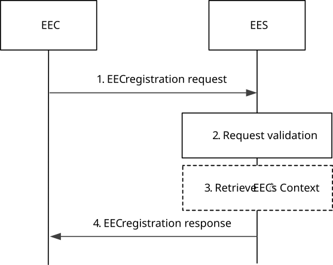
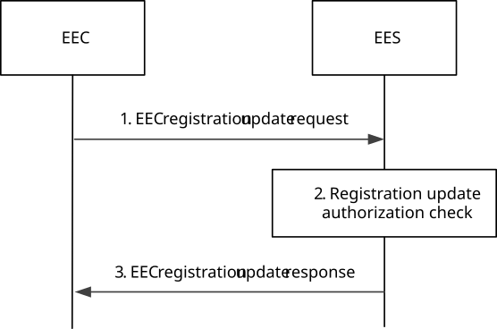
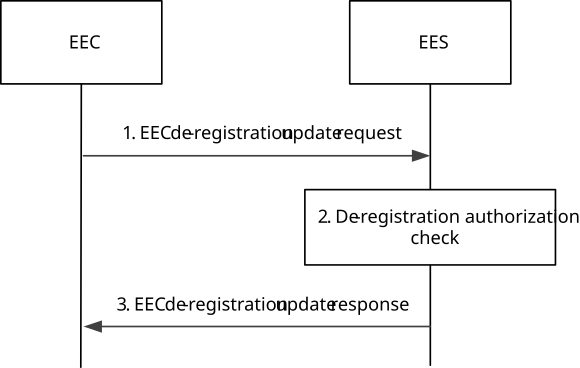

# 8.4.2 EEC Registration

## 8.4.2.1 General

An EEC performs registration with an EES in order to provide information that can be used by the EES in Edge Computing services. The procedure also enables initialization, update and removal of the EEC context information at the EES. The context may be further used for edge-specific operations or processing, e.g. analytics.

An EEC may be registered with one or more EESs on behalf of one or more ACs simultaneously.

In deployments with bundled EAS(s) registered to different EESs, to perform EEC registration (if needed) the EEC sends the EEC registration message to all the associated EES for the EAS bundle.

## 8.4.2.2 Procedures

### 8.4.2.2.1 General

Following are supported for EEC registration:

\- EEC registration procedure;

\- EEC registration update procedure;

\- EEC de-registration procedure; and

\- EEC Context relocation procedure.

NOTE: In this version of specification, each registration procedure provides for registering a single EEC per UE.

### 8.4.2.2.2 EEC registration

Figure 8.4.2.2.2-1 illustrates EEC registration procedure.

Pre-conditions:

1\. The EEC is authorized to access the EES for the purpose of performing registration and has received relevant security credentials as specified in clause 8.11; and

2\. The EEC has received service provisioning information from the ECS, including information for accessing the EES.

Figure 8.4.2.2.2-1: EEC registration procedure

1\. The EEC sends EEC registration request to the EES. The request from the client includes the security credentials received after successful authorization for edge computing services and may include a proposed expiration time. The request also optionally includes information indicating to the EES how the EEC expects to use the services of the EES. The EEC may include indication for UE mobility support requirement to the EES.

If the EEC is moving to this EES from the purview of another EES, called S-EES, the request from the EEC may include the identity and endpoint of the S-EES and an EEC context ID that was provided by the S-EES to maintain continuity of the EEC context and to authorize EEC context relocation. If the EEC registration is being performed as part of ACR, the EEC shall not include the S-EES endpoint and the EEC context ID.

2\. Upon receiving the request from the EEC, the EES validates the registration request and verifies the security credentials. The EES further determines whether the requirements that were indicated in the AC Profile(s) can be fulfilled e.g., without failing to meet the requirements of the already registered EECs, and reserves corresponding resources (e.g., for EASs). If the AC Profile(s) include EAS bundle information the reserved EAS resources are apportioned among the EASs in the bundle, based on the indicated requirements and local policies.

> NOTE 1: Resource reservation at EEC registration ensures that the EES provides services for the duration of the registration.
>
> If the EEC provides in the registration request the EAS selection request indicator and based on EES local policies, the EES selects EASs providing the capabilities required by the AC Profile(s), reserves the corresponding resources, and provides the information to the EEC in the registration response.
>
> If bundle EAS information (either as EAS bundle identifier or as a list of EASIDs) is included and the EAS selection request indicator is set, then the EES determines whether all or a subset of the EAS(s) in the bundle are registered and instantiated. If only a subset of bundle EASs is found, the EES may determine whether instantiable but not yet instantiated EASs match the subset of remaining (i.e. not yet found) bundle EASs and performs the dynamic EAS instantiation triggering procedure in clause 8.12 for this subset.
>
> If the EEC provides in the registration request a UE type, the EES may use this information to apply UE-type-specific local policies.
>
> NOTE 2: Without any indication from UE (either EAS selection request indication or UE type), the EES handling is as per R17 procedure.
>
> NOTE 3: The "UE type" IE as present in EEC registration request message can be used by EES to identify "constrained device".

3\. Upon successful validation of the request, if the received EEC registration request contains an EEC context ID and a S-EES Endpoint, the EES performs an EEC Context Pull relocation (clause 8.9.2.2) from the S-EES. The source and target EES perform EEC Context handling as detailed in clause 8.9.1.

> NOTE 4: Only a single EEC Context ID may be provided in the EEC registration request.
>
> NOTE 5: In this version of specification, each registration procedure relocates a single EEC context.
>
> NOTE 6: Step 3 is executed when EEC determines to change its connection from S-EES to T-EES and ACR is not required.

If the EEC registration request fails after the EEC Context Pull relocation, e.g., the EES cannot reserve the necessary resources while meeting the capability requirements of the existing registered EECs, the EES shall determine the EEC Context information stale and send a failure response with a corresponding cause.

4\. The EES sends a successful EEC registration response, which includes the registration ID and may include a newly assigned EEC context ID. If the EEC registration request contains AC Profile(s), and the EES determines that the requirements indicated in the AC profile(s) cannot be fulfilled for some of the AC profile(s), the EES shall include the list of ACIDs of such AC Profile(s) and may include appropriate reasons. If step 3 was executed, the EEC registration response also includes EEC context retrieval result. The EEC stores the new EEC context ID and uses it if and when it registers with another EES. The EES may also provide an expiration time to indicate to the EEC when the registration will automatically expire. To maintain the registration, the EEC shall send a registration update request prior to the expiration. If a registration update request is not received prior to the expiration time, the EES shall treat the EEC as implicitly de-registered.

If the EEC context relocation status indicates that the EEC context relocation was not successful, then the EEC performs the required EDGE-1 subscriptions at the T-EES.

### 8.4.2.2.3 EEC registration update

Figure 8.4.2.2.3-1 illustrates EEC registration update procedure.

Pre-conditions:

1\. EEC has already registered with the EES.

Figure 8.4.2.2.3-1: EEC registration update procedure

1\. The EEC sends EEC registration update request to the EES. The request from the client includes the security credentials received after successful authorization for edge computing services and may include a proposed expiration time and AC profile(s) parameters, including new or updated selected EAS information. The EEC may include indication for UE mobility support requirement to the EES.

2\. Upon receiving the request from the EEC, the EES validates the registration update request and verifies the security credentials.

3\. Upon successful validation of the request, the EES sends a successful registration update response, which may include updated expiration time to indicate to the EEC when the updated registration will automatically expire. If the EEC registration update request contains AC Profile(s), and the EES determines that the requirements indicated in the AC profile(s) cannot be fulfilled for some of the AC profile(s), the EES shall include the list of ACIDs of such AC Profile(s) and may include appropriate reasons. To maintain the registration, the EEC shall send a registration update request prior to the expiration time. If a registration update request is not received prior to the expiration time, the EES shall treat the EEC as implicitly de-registered.

### 8.4.2.2.4 EEC de-registration

Figure 8.4.2.2.4-1 illustrates EEC de-registration procedure.

Pre-conditions:

1\. EEC has already registered with the EES.

Figure 8.4.2.2.4-1: EEC de-registration procedure

1\. The EEC sends EEC de-registration request to the EES. The request from the client includes the security credentials received after successful authorization for edge computing services.

2\. Upon receiving the request from the EEC, the EES validates the de-registration request and verifies the security credentials.

3\. Upon successful authorization, the EES sends a successful de-registration response.

## 8.4.2.3 Information flows

### 8.4.2.3.1 General

The following information flows are specified for EEC registration:

\- EEC registration request and response;

\- EEC registration update request and response; and

\- EEC registration de-registration request and response.

### 8.4.2.3.2 EEC registration request

Table 8.4.2.3.2-1 describes information elements in the EEC registration request from the EEC to the EES.

Table 8.4.2.3.2-1: EEC registration request

|                                                                                       |        |                                                                                                                              |
|---------------------------------------------------------------------------------------|--------|------------------------------------------------------------------------------------------------------------------------------|
| Information element                                                                   | Status | Description                                                                                                                  |
| EECID                                                                                 | M      | Unique identifier of the EEC.                                                                                                |
| UE Identifier                                                                         | O      | The identifier of the hosting UE (i.e., GPSI)                                                                                |
| Security credentials                                                                  | M      | Security credentials resulting from a successful authorization for the edge computing service.                               |
| AC Profile(s)                                                                         | O      | Profiles of ACs for which the EEC provides edge enabling services. AC Profiles are further described in Table 8.2.2-1.       |
| EEC Service Continuity Support                                                        | O      | Indicates if the EEC supports service continuity or not. The IE also indicates which ACR scenarios are supported by the EEC. |
| EAS selection request indicator                                                       | O      | Indicates the request for EAS selection support from the EES (e.g., for constrained device).                                 |
| UE type                                                                               | O      | Indicates UE or device type (e.g. constrained device)                                                                        |
| Proposed expiration time                                                              | O      | Proposed expiration time for the registration.                                                                               |
| EEC context ID (NOTE)                                                                 | O      | Identifier of the EEC context obtained from a previous registration.                                                         |
| Source EESID (NOTE)                                                                   | O      | Identifier of the EES that provided EEC context ID.                                                                          |
| Source EES Endpoint (NOTE)                                                            | O      | The endpoint address (e.g. URI, IP address) of the EES that provided EEC context ID.                                         |
| UE Mobility Support Requirement                                                       | O      | Indicates UE requires mobility support or not                                                                                |
| NOTE: This IE shall not be present when EEC registration is performed as part of ACR. |        |                                                                                                                              |

### 8.4.2.3.3 EEC registration response

Table 8.4.2.3.3-1 describes information elements in the EEC registration response from the EES to the EEC.

Table 8.4.2.3.3-1: EEC registration response

|                                                                                                                                               |        |                                                                                                                                                                                                                                                                |
|-----------------------------------------------------------------------------------------------------------------------------------------------|--------|----------------------------------------------------------------------------------------------------------------------------------------------------------------------------------------------------------------------------------------------------------------|
| Information element                                                                                                                           | Status | Description                                                                                                                                                                                                                                                    |
| Successful response                                                                                                                           | O      | Indicates that the registration request was successful.                                                                                                                                                                                                        |
| \> Registration ID                                                                                                                            | M      | Identifier of the EEC registration.                                                                                                                                                                                                                            |
| \> Expiration time (NOTE)                                                                                                                     | O      | Indicates the expiration time of the registration. To maintain an active registration status, a registration update is required before the expiration time.                                                                                                    |
| \> EEC context ID                                                                                                                             | O      | Identifier of the EEC Context information available at the EES that performed the registration.                                                                                                                                                                |
| \> EEC Context Relocation status                                                                                                              | O      | Indicates whether the EEC context retrieval from the S-EES was successful or not.                                                                                                                                                                              |
| \> Discovered EAS list                                                                                                                        | O      | List of EASs discovered to provide the capabilities required by the AC Profiles. If the request includes the EAS selection request indicator, then Discovered EAS list shall contain only one selected EAS. If the EES selects no EASs, the list may be empty. |
| \>\> EAS profile                                                                                                                              | M      | Profile of the EAS. Each element is described in clause 8.2.4.                                                                                                                                                                                                 |
| \> list of unfulfilled AC information                                                                                                         | O      | List of ACIDs of the AC Profile(s) for which the requirements indicated in the AC profile(s) cannot be fulfilled                                                                                                                                               |
| \>\> ACID                                                                                                                                     | M      | Application Identifier                                                                                                                                                                                                                                         |
| \>\> reason                                                                                                                                   | O      | Reason indicating the cause (e.g. EAS not available, requirements cannot be fulfilled)                                                                                                                                                                         |
| Failure response                                                                                                                              | O      | Indicates that the registration request failed.                                                                                                                                                                                                                |
| \> Cause                                                                                                                                      | M      | Provides the cause for registration request failure.                                                                                                                                                                                                           |
| NOTE: The Expiration time IE shall be included if based on the ECSP policy the EES requires EEC to periodically refresh the EEC registration. |        |                                                                                                                                                                                                                                                                |

### 8.4.2.3.4 EEC registration update request

Table 8.4.2.3.4-1 describes information elements in the EEC registration update request from the EEC to the EES.

Table 8.4.2.3.4-1: EEC registration update request

|                                 |        |                                                                                                |
|---------------------------------|--------|------------------------------------------------------------------------------------------------|
| Information element             | Status | Description                                                                                    |
| Registration ID                 | M      | Identifier of the EEC registration.                                                            |
| Security credentials            | M      | Security credentials resulting from a successful authorization for the edge computing service. |
| AC profile(s)                   | O      | AC Profile as described in Table 8.2.2-1                                                       |
| Proposed expiration time        | O      | Proposed expiration time for the updated registration.                                         |
| UE Mobility Support Requirement | O      | Indicates UE requires mobility support or not                                                  |

### 8.4.2.3.5 EEC registration update response

Table 8.4.2.3.5-1 describes information elements in the EEC registration update response from the EES to the EEC.

Table 8.4.2.3.5-1: EEC registration update response

|                                                                                                                                               |        |                                                                                                                                                             |
|-----------------------------------------------------------------------------------------------------------------------------------------------|--------|-------------------------------------------------------------------------------------------------------------------------------------------------------------|
| Information element                                                                                                                           | Status | Description                                                                                                                                                 |
| Successful response                                                                                                                           | O      | Indicates that the registration update request was successful.                                                                                              |
| \> Expiration time (NOTE)                                                                                                                     | O      | Indicates the expiration time of the registration. To maintain an active registration status, a registration update is required before the expiration time. |
| \> list of unfulfilled AC information                                                                                                         | O      | List of ACIDs of the AC Profile(s) for which the requirements indicated in the AC profile(s) cannot be fulfilled                                            |
| \>\> ACID                                                                                                                                     | M      | Application Identifier                                                                                                                                      |
| \>\> reason                                                                                                                                   | O      | Reason indicating the cause (e.g. EAS not available, requirements cannot be fulfilled)                                                                      |
| Failure response                                                                                                                              | O      | Indicates that the registration update request failed.                                                                                                      |
| NOTE: The Expiration time IE shall be included if based on the ECSP policy the EES requires EEC to periodically refresh the EEC registration. |        |                                                                                                                                                             |

### 8.4.2.3.6 EEC de-registration request

Table 8.4.2.3.6-1 describes information elements in the EEC de-registration request from the EEC to the EES.

Table 8.4.2.3.6-1: EEC de-registration request

|                      |        |                                                                                                |
|----------------------|--------|------------------------------------------------------------------------------------------------|
| Information element  | Status | Description                                                                                    |
| Registration ID      | M      | Identifier of the EEC registration.                                                            |
| Security credentials | M      | Security credentials resulting from a successful authorization for the edge computing service. |

### 8.4.2.3.7 EEC de-registration response

Table 8.4.2.3.7-1 describes information elements in the EEC de-registration response from the EES to the EEC.

Table 8.4.2.3.7-1: EEC registration update response

|                     |        |                                                            |
|---------------------|--------|------------------------------------------------------------|
| Information element | Status | Description                                                |
| Successful response | O      | Indicates that the de-registration request was successful. |
| Failure response    | O      | Indicates that the de-registration request failed.         |
| \> Cause            | M      | Provide the cause for de-registration request failure.     |

## 8.4.2.4 APIs

### 8.4.2.4.1 General

Table 8.4.2.4.1-1 illustrates the API for EEC registration.

Table 8.4.2.4.1-1: Eees_EECRegistration API

<table>
<colgroup>
<col style="width: 35%" />
<col style="width: 22%" />
<col style="width: 20%" />
<col style="width: 21%" />
</colgroup>
<thead>
<tr class="header">
<th>API Name</th>
<th>API Operations</th>
<th>
Operation

Semantics
</th>
<th>Consumer(s)</th>
</tr>
</thead>
<tbody>
<tr class="odd">
<td rowspan="3"><strong>Eees_EECRegistration</strong></td>
<td>Request</td>
<td rowspan="3">Request/Response</td>
<td rowspan="3">EEC</td>
</tr>
<tr class="even">
<td>Update</td>
</tr>
<tr class="odd">
<td>Deregister</td>
</tr>
</tbody>
</table>

### 8.4.2.4.2 Eees_EECRegistration_Request operation

**API operation name:** Eees_EECRegistration_Request

**Description:** The consumer requests to register the EEC on the EES.

**Inputs:** See clause 8.4.2.3.2.

**Outputs:** See clause 8.4.2.3.3*.*

See clause 8.4.2.2.2 for details of usage of this operation.

### 8.4.2.4.3 Eees_EECRegistration_Update operation

**API operation name:** Eees_EECRegistration_Update

**Description:** The consumer requests to update the registered information of the EEC on the EES.

**Inputs:** See clause 8.4.2.3.4.

**Outputs:** See clause 8.4.2.3.5*.*

See clause 8.4.2.2.3 for details of usage of this operation.

### 8.4.2.4.4 Eees_EECRegistration_Deregister operation

**API operation name:** Eees_EECRegistration_Deregister

**Description:** The consumer requests to de-register the EEC from the EES.

**Inputs:** See clause 8.4.2.3.6.

**Outputs:** See clause 8.4.2.3.7*.*

See clause 8.4.2.2.4 for details of usage of this operation.
