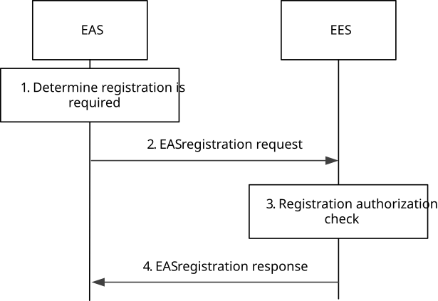
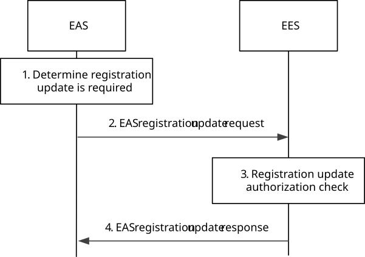
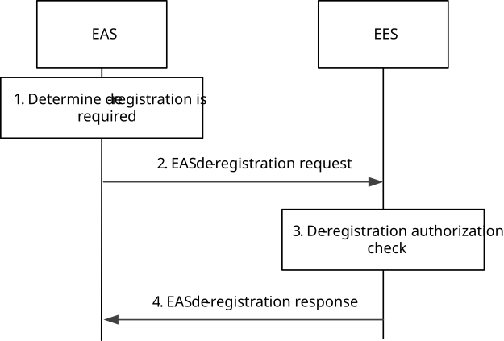

# 8.4.3 EAS Registration

## 8.4.3.1 General

The EAS Registration procedure allows an EAS to provide its information to an EES in order to enable its discovery.

If there is a change in the requirements or the information of an EAS, it uses the EAS registration update procedure to update the EES.

The EAS uses the EAS de-registration procedure to remove its information from the EES.

EAS registration at the EES can be time bound. So, to maintain the registration, the EAS needs to send a registration update request prior to the registration expiration time. If a registration update request is not received prior to the registration expiration time, the EES treats the EAS as implicitly de-registered.

NOTE 1: For registered EAS(s), the EES can request AF traffic influence for any UE, which is implementation specific.

NOTE 2: If N6 delay measurement assistance information is provided by the EAS in its profile at registration or registration update, the EES makes the corresponding EAS Deployment Information available to the 3GPP core network via the Nnef_EASDeployment service as specified in 3GPP TS 23.502 \[3\] thereby enabling the EES to provide “Indication of considering N6 delay” when requesting AF traffic influence. The same service is used to remove the EAS Deployment Information at EAS de-registration.

## 8.4.3.2 Procedures

### 8.4.3.2.1 General

Following are supported for EAS registration:

\- EAS registration procedure;

\- EAS registration update procedure; and

\- EAS de-registration procedure.

### 8.4.3.2.2 EAS registration

Pre-conditions:

1\. The EAS has been configured with an EASID;

2\. The EAS has been configured with the address (e.g. URI) of the EES; and

3\. Both the EAS and EES have the necessary credentials to enable communications.

Figure 8.4.3.2.2-1: EAS Registration procedure

1\. The EAS determines that registration to the EES is needed (e.g. the EAS is instantiated and started up).

2\. The EAS sends an EAS registration request to the EES. The request shall include the EAS profile and may include proposed expiration time for the registration.

3\. The EES performs an authorization check to verify whether the EAS has the authorization to register on the EES.

4\. Upon successful authorization, the EES stores the EAS Profile for later use (e.g. for serving EAS discovery requests received from EECs, etc.) and replies to the EAS with an EAS registration response. If the request includes bundle ID, the EES stores the received information. The EES may provide an expiration time to indicate to the EAS when the registration will automatically expire. To maintain the registration, the EAS shall send a registration update request prior to the expiration time. If a registration update request is not received prior to the expiration time, the EES shall treat the EAS as implicitly de-registered.

### 8.4.3.2.3 EAS registration update

Pre-conditions:

1\. The EAS has already registered with the EES.

Figure 8.4.3.2.3-1: EAS registration update procedure

1\. The EAS determines that its existing registration needs to be updated (e.g. because the EAS's status or availability schedule has changed, or EAS's registration is about to expire).

2\. The EAS sends an EAS registration update request to the EES. The request shall include the registration ID and may include the EAS profile and proposed expiration time for the updated registration.

3\. The EES performs an authorization check to verify whether the EAS has the authorization to update the registration on the EES.

4\. Upon successful authorization, the EES updates the registered EAS Profile and replies to the EAS with an EAS registration update response. If the request includes updated bundle ID, the EES updates the stored information. The EES may provide an updated expiration time to indicate to the EAS when the updated registration will automatically expire. To maintain the registration, the EAS shall send a registration update request prior to the expiration time. If a registration update request is not received prior to the expiration time, the EES shall treat the EAS as implicitly de-registered.

### 8.4.3.2.4 EAS de-registration

Pre-conditions:

1\. The EAS has already registered with the EES.

Figure 8.4.3.2.4-1: EAS de-registration procedure

1\. The EAS determines that its existing registration needs to be terminated (e.g. because the services of the EAS are not needed anymore).

2\. The EAS sends an EAS de-registration request to the EES. The request shall include the registration ID.

3\. The EES performs an authorization check to verify whether the EAS has the authorization to de-register explicitly.

4\. Upon successful authorization, the EES removes the registered EAS Profile and replies to the EAS with an EAS de-registration response.

## 8.4.3.3 Information flows

### 8.4.3.3.1 General

The following information flows are specified for EAS registration:

\- EAS registration request and response;

\- EAS registration update request and response; and

\- EAS registration de-registration request and response.

### 8.4.3.3.2 EAS registration request

Table 8.4.3.3.1-2 describes information elements in the EAS registration request from the EAS to the EES.

Table 8.4.3.3.2-1: EAS registration request

|                          |        |                                               |
|--------------------------|--------|-----------------------------------------------|
| Information element      | Status | Description                                   |
| EAS Profile              | M      | EAS Profile as described in Table 8.2.4-1     |
| Security credentials     | M      | Security credentials of the EAS.              |
| Proposed expiration time | O      | Proposed expiration time for the registration |

### 8.4.3.3.3 EAS registration response

Table 8.4.3.3.3-1 describes information elements in the EAS registration response from the EES to the EAS.

Table 8.4.3.3.3-1: EAS registration response

<table>
<colgroup>
<col style="width: 33%" />
<col style="width: 16%" />
<col style="width: 50%" />
</colgroup>
<tbody>
<tr class="odd">
<td>Information element</td>
<td>Status</td>
<td>Description</td>
</tr>
<tr class="even">
<td>Successful response</td>
<td>O</td>
<td>Indicates that the registration request was successful.</td>
</tr>
<tr class="odd">
<td>&gt; Registration ID</td>
<td>M</td>
<td>Identifier of the registration.</td>
</tr>
<tr class="even">
<td>&gt; Expiration time</td>
<td>O</td>
<td>
Indicates the expiration time of the registration. To maintain an active registration status, a registration update is required before the expiration time.

If the Expiration time IE is not included, it indicates that the registration never expires.
</td>
</tr>
<tr class="odd">
<td>Failure response</td>
<td>O</td>
<td>Indicates that the registration request failed.</td>
</tr>
<tr class="even">
<td>&gt; Cause</td>
<td>O</td>
<td>Indicates the cause of registration request failure</td>
</tr>
</tbody>
</table>

### 8.4.3.3.4 EAS registration update request

Table 8.4.3.3.4-1 describes information elements in the EAS registration update request from the EAS to the EES.

Table 8.4.3.3.4-1: EAS registration update request

|                                            |        |                                                                                                                             |
|--------------------------------------------|--------|-----------------------------------------------------------------------------------------------------------------------------|
| Information element                        | Status | Description                                                                                                                 |
| Registration ID                            | M      | Identifier of the registration.                                                                                             |
| Security credentials                       | M      | Security credentials of the EAS                                                                                             |
| Updated EAS Profile (NOTE)                 | O      | EAS Profile as described in Table 8.2.4-1 with updated information. Included only if there is an update in EAS information. |
| Proposed expiration time (NOTE)            | O      | Proposed expiration time for the registration                                                                               |
| NOTE: At least one of the IEs is included. |        |                                                                                                                             |

### 8.4.3.3.5 EAS registration update response

Table 8.4.3.3.5-1 describes information elements in the EAS registration update response from the EES to the EAS.

Table 8.4.3.3.5-1: EAS registration update response

<table>
<colgroup>
<col style="width: 33%" />
<col style="width: 16%" />
<col style="width: 50%" />
</colgroup>
<tbody>
<tr class="odd">
<td>Information element</td>
<td>Status</td>
<td>Description</td>
</tr>
<tr class="even">
<td>Successful response</td>
<td>O</td>
<td>Indicates that the registration update request was successful.</td>
</tr>
<tr class="odd">
<td>&gt; Expiration time</td>
<td>O</td>
<td>
Indicates the expiration time of the updated registration. To maintain an active registration status, a registration update is required before the expiration time.

If the Expiration time IE is not included, it indicates that the updated registration never expires.
</td>
</tr>
<tr class="even">
<td>Failure response</td>
<td>O</td>
<td>Indicates that the registration update request failed.</td>
</tr>
<tr class="odd">
<td>&gt; Cause</td>
<td>O</td>
<td>Indicates the cause of registration update request failure</td>
</tr>
</tbody>
</table>

### 8.4.3.3.6 EAS de-registration request

Table 8.4.3.3.6-1 describes information elements in the EAS de-registration request from the EAS to the EES.

Table 8.4.3.3.6-1: EAS de-registration request

|                      |        |                                 |
|----------------------|--------|---------------------------------|
| Information element  | Status | Description                     |
| Registration ID      | M      | Identifier of the registration. |
| Security credentials | M      | Security credentials of the EAS |

### 8.4.3.3.7 EAS de-registration response

Table 8.4.3.3.7-1 describes information elements in the EAS de-registration response from the EES to the EAS.

Table 8.4.3.3.7-1: EAS de-registration response

|                     |        |                                                            |
|---------------------|--------|------------------------------------------------------------|
| Information element | Status | Description                                                |
| Successful response | O      | Indicates that the de-registration request was successful. |
| Failure response    | O      | Indicates that the de-registration request failed.         |
| \> Cause            | O      | Indicates the cause of de-registration request failure     |

## 8.4.3.4 APIs

### 8.4.3.4.1 General

Table 8.4.3.4.1-1 illustrates the API for EAS registration.

Table 8.4.3.4.1-1: Eees_EASRegistration API

<table>
<colgroup>
<col style="width: 40%" />
<col style="width: 21%" />
<col style="width: 20%" />
<col style="width: 18%" />
</colgroup>
<thead>
<tr class="header">
<th>API Name</th>
<th>API Operations</th>
<th>
Operation

Semantics
</th>
<th>Consumer(s)</th>
</tr>
</thead>
<tbody>
<tr class="odd">
<td rowspan="3">Eees_EASRegistration</td>
<td>Request</td>
<td rowspan="3">Request/Response</td>
<td rowspan="3">EAS</td>
</tr>
<tr class="even">
<td>Update</td>
</tr>
<tr class="odd">
<td>Deregister</td>
</tr>
</tbody>
</table>

### 8.4.3.4.2 Eees_EASRegistration_Request operation

**API operation name:** Eees_EASRegistration_Request

**Description:** The consumer requests to register the EAS on the EES.

**Inputs:** See clause 8.4.3.3.2.

**Outputs:** See clause 8.4.3.3.3*.*

See clause 8.4.3.2.2 for details of usage of this operation.

### 8.4.3.4.3 Eees_EASRegistration_Update operation

**API operation name:** Eees_EASRegistration_Update

**Description:** The consumer requests to update the registered information of the EAS on the EES.

**Inputs:** See clause 8.4.3.3.4.

**Outputs:** See clause 8.4.3.3.5*.*

See clause 8.4.3.2.3 for details of usage of this operation.

### 8.4.3.4.4 Eees_EASRegistration_Deregister operation

**API operation name:** Eees_EASRegistration_Deregister

**Description:** The consumer requests to deregister the EAS from the EES.

**Inputs:** See clause 8.4.3.3.6.

**Outputs:** See clause 8.4.3.3.7*.*

See clause 8.4.3.2.4 for details of usage of this operation.
