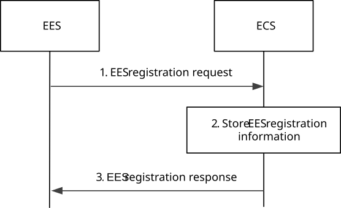
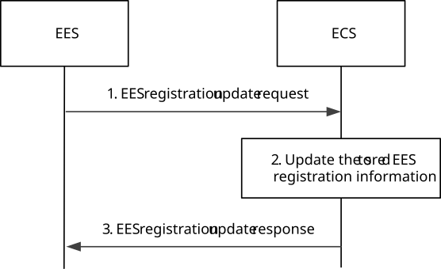
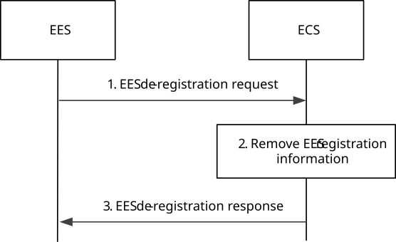

# 8.4.4 EES Registration

## 8.4.4.1 General

The EES Registration procedure allows an EES to provide information to an ECS in order to enable provisioning EES(s) to an EEC.

The EES registration update procedure allows an EES to update the ECS, if there is a change in the information at the EES.

The EES uses the EES de-registration procedure to remove its information from the ECS.

## 8.4.4.2 Procedures

### 8.4.4.2.1 General

### 8.4.4.2.2 EES registration

Pre-conditions:

1\. The EES has the address (e.g. URI) of the ECS;

2\. Both, the EES and ECS, have the necessary credentials to enable communications.

Figure 8.4.4.2.2-1: EES Registration procedure

1\. The EES sends the EES registration request to the ECS. The request from the EES includes the EES profile and EES security credentials. The request may include a proposed expiration time for the registration.

2\. Upon receiving the request from the EES, the ECS verifies the security credentials of the EES and stores the EES registration information obtained in step 1. If the EES profile includes bundle ID, the ECS stores the information and associates the EES with other EESs providing the same EAS bundle information.

3\. The ECS sends an EES registration response indicating success or failure of the registration operation. The ECS may provide an updated expiration time to indicate to the EES when the registration will automatically expire. To maintain the registration, the EES shall send a registration update request prior to the expiration time. If a registration update request is not received prior to the expiration time, the ECS shall treat the EES as implicitly de-registered.

### 8.4.4.2.3 EES registration update

Pre-conditions:

1\. The EES has already registered on the ECS.

Figure 8.4.4.2.3-1: EES registration update procedure

1\. The EES sends the EES registration update request to the ECS. The request from the EES includes the registration identity and EES security credentials, and may include proposed expiration time and updated EES profile.

2\. Upon receiving the request from the EES, the ECS verifies the security credentials of the EES and stores the updated EES registration information obtained in step 1. If the request includes updated bundle ID, the ECS updates the stored information and EES associations.

3\. The ECS sends an EES registration update response indicating success or failure of the registration update operation. The ECS may provide an updated expiration time to indicate to the EES when the updated registration will automatically expire. To maintain the registration, the EES shall send a registration update request prior to the expiration time. If a registration update request is not received prior to the expiration time, the ECS shall treat the EES as implicitly de-registered.

### 8.4.4.2.4 EES de-registration

Figure 8.4.4.2.4-1: EES de-registration procedure

1\. The EES sends the EES de-registration request to the ECS. The request from the EES includes the registration identity and EES security credentials.

2\. Upon receiving the request from the EES, the ECS verifies the security credentials of the EES and removes the corresponding EES registration information.

3\. The ECS sends an EES de-registration response indicating success or failure of the de-registration operation.

## 8.4.4.3 Information elements

### 8.4.4.3.1 General

The following information flows are specified for EES registration:

\- EES registration request and response;

\- EES registration update request and response; and

\- EES registration de-registration request and response.

### 8.4.4.3.2 EES registration request

Table 8.4.4.3.2-1 describes information elements for an EES registration request from the EES to the ECS.

Table 8.4.4.3.2-1: EES registration request

|                          |        |                                                   |
|--------------------------|--------|---------------------------------------------------|
| Information element      | Status | Description                                       |
| EES Profile              | M      | Profile information as specified in Table 8.2.6-1 |
| Security credentials     | M      | Security credentials of the EES.                  |
| Proposed expiration time | O      | Proposed expiration time for the registration     |

### 8.4.4.3.3 EES registration response

Table 8.4.4.3.3-1 describes information elements for an EES registration response from the ECS to the EES.

Table 8.4.4.3.3-1: EES registration response

<table>
<colgroup>
<col style="width: 33%" />
<col style="width: 16%" />
<col style="width: 50%" />
</colgroup>
<tbody>
<tr class="odd">
<td>Information element</td>
<td>Status</td>
<td>Description</td>
</tr>
<tr class="even">
<td>Successful response</td>
<td>O</td>
<td>Indicates that the registration request was successful.</td>
</tr>
<tr class="odd">
<td>&gt; Registration ID</td>
<td>M</td>
<td>Identifier of the registration.</td>
</tr>
<tr class="even">
<td>&gt; Expiration time</td>
<td>O</td>
<td>
Indicates the expiration time of the registration. To maintain an active registration status, a registration update is required before the expiration time.

If the Expiration time IE is not included, it indicates that the registration never expires.
</td>
</tr>
<tr class="odd">
<td>Failure response</td>
<td>O</td>
<td>Indicates that the registration request failed.</td>
</tr>
<tr class="even">
<td>&gt; Cause</td>
<td>O</td>
<td>Indicates the cause of registration request failure</td>
</tr>
</tbody>
</table>

### 8.4.4.3.4 EES registration update request

Table 8.4.4.3.4-1 describes information elements for an EES registration update request from the EES to the ECS.

Table 8.4.4.3.4-1: EES registration update request

|                                            |        |                                                   |
|--------------------------------------------|--------|---------------------------------------------------|
| Information element                        | Status | Description                                       |
| Updated EES Profile (NOTE)                 | O      | Profile information as specified in Table 8.2.6-1 |
| Security credentials                       | M      | Security credentials of the EES.                  |
| Registration ID                            | M      | Identifier of the registration.                   |
| Proposed expiration time (NOTE)            | O      | Proposed expiration time for the registration     |
| NOTE: At least one of the IEs is included. |        |                                                   |

### 8.4.4.3.5 EES registration update response

Table 8.4.4.3.5-1 describes information elements for an EES registration update response from the ECS to the EES.

Table 8.4.4.3.5-1: EES registration update response

<table>
<colgroup>
<col style="width: 33%" />
<col style="width: 16%" />
<col style="width: 50%" />
</colgroup>
<tbody>
<tr class="odd">
<td>Information element</td>
<td>Status</td>
<td>Description</td>
</tr>
<tr class="even">
<td>Successful response</td>
<td>O</td>
<td>Indicates that the registration update request was successful.</td>
</tr>
<tr class="odd">
<td>&gt; Expiration time</td>
<td>O</td>
<td>
Indicates the expiration time of the updated registration. To maintain an active registration status, a registration update is required before the expiration time.

If the Expiration time IE is not included, it indicates that the updated registration never expires.
</td>
</tr>
<tr class="even">
<td>Failure response</td>
<td>O</td>
<td>Indicates that the registration update request failed.</td>
</tr>
<tr class="odd">
<td>&gt; Cause</td>
<td>O</td>
<td>Indicates the cause of registration update request failure</td>
</tr>
</tbody>
</table>

### 8.4.4.3.6 EES de-registration request

Table 8.4.4.3.6-1 describes information elements for an EES de-registration request from the EES to the ECS.

Table 8.4.4.3.6-1: EES de-registration request

|                      |        |                                 |
|----------------------|--------|---------------------------------|
| Information element  | Status | Description                     |
| Registration ID      | M      | Identifier of the registration. |
| Security credentials | M      | Security credentials of the EES |

### 8.4.4.3.7 EES de-registration response

Table 8.4.4.3.7-1 describes information elements for an EES de-registration response from the ECS to the EES.

Table 8.4.4.3.7-1: EES de-registration response

|                     |        |                                                            |
|---------------------|--------|------------------------------------------------------------|
| Information element | Status | Description                                                |
| Successful response | O      | Indicates that the de-registration request was successful. |
| Failure response    | O      | Indicates that the de-registration request failed.         |
| \> Cause            | O      | Indicates the cause of de-registration request failure     |

## 8.4.4.4 APIs

### 8.4.4.4.1 General

Table 8.4.4.4.1-1 illustrates the API for EES registration.

Table 8.4.4.4.1-1: Eecs_EESRegistration API

<table>
<colgroup>
<col style="width: 40%" />
<col style="width: 21%" />
<col style="width: 20%" />
<col style="width: 18%" />
</colgroup>
<thead>
<tr class="header">
<th>API Name</th>
<th>API Operations</th>
<th>
Operation

Semantics
</th>
<th>Consumer(s)</th>
</tr>
</thead>
<tbody>
<tr class="odd">
<td rowspan="3">Eecs_EESRegistration</td>
<td>Request</td>
<td rowspan="3">Request/Response</td>
<td rowspan="3">EES</td>
</tr>
<tr class="even">
<td>Update</td>
</tr>
<tr class="odd">
<td>Deregister</td>
</tr>
</tbody>
</table>

### 8.4.4.4.2 Eecs_EESRegistration_Request operation

**API operation name:** Eecs_EESRegistration_Request

**Description:** The consumer requests to register the EES on the ECS.

**Inputs:** See clause 8.4.4.3.2.

**Outputs:** See clause 8.4.4.3.3*.*

See clause 8.4.4.2.2 for details of usage of this operation.

### 8.4.4.4.3 Eecs_EESRegistration_Update operation

**API operation name:** Eecs_EESRegistration_Update

**Description:** The consumer requests to update the registered information of the EES on the ECS.

**Inputs:** See clause 8.4.4.3.4.

**Outputs:** See clause 8.4.4.3.5*.*

See clause 8.4.4.2.3 for details of usage of this operation.

### 8.4.4.4.4 Eecs_EESRegistration_Deregister operation

**API operation name:** Eecs_EESRegistration_Deregister

**Description:** The consumer requests to deregister the EES from the ECS.

**Inputs:** See clause 8.4.4.3.6.

**Outputs:** See clause 8.4.4.3.7*.*

See clause 8.4.4.2.4 for details of usage of this operation.
