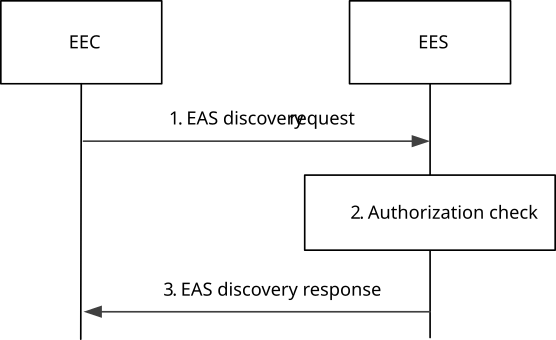

# 8.5.2.2 Request-response model

Pre-conditions:

1\. The EEC has received information (e.g. URI, IP address) related to the EES;

2\. The EEC has received appropriate security credentials authorizing it to communicate with the EES as specified in clause 8.11; and

3\. The EES is configured with ECSP's policy for EAS discovery.

NOTE 1: Details of ECSP's policy are out of scope.

Figure 8.5.2.2-1: EAS Discovery procedure

1\. The EEC sends an EAS discovery request to the EES. The EAS discovery request includes the requestor identifier \[EECID\] along with the security credentials and may include EAS discovery filters, EEC service continuity support, and may also include UE location to retrieve information about particular EAS(s) or a category of EASs, e.g. gaming applications, or Edge Applications Server(s) available in certain service areas, e.g. available on a UE's predicted or expected route. The request may include an EAS selection request indicator. If an e2e tunnel is used in the UE for applications (e.g. user configured tunnel service), and if the tunnel service provider and the ECSP are from the same organization and only if user grants the permission, then the EEC provides the tunnel information for the associated applications in the request to the EES considering user consent. The EAS discovery filter may include energy requirements to the EAS, e.g., support for renewable energy or not.

NOTE 2: The e2e tunnel case is limited to case where the tunnel service is deployed in home domain in the present release.

2\. Upon receiving the request from the EEC, the EES checks if the EEC is authorized to discover the requested EAS(s). The authorization check may apply to an individual EAS, a category of EASs or to the EDN, i.e. to all the EASs. If EAS discovery filters contain energy requirements, the EES checks whether the EAS satisfy the requirements on Energy preference in the EAS discovery requests. If the EAS fulfil the energy requirements, then EES adds the identified EAS(s) into the list of discovered EAS(s). If UE's location information is not already available, the EES obtains the UE location by utilizing the capabilities of the 3GPP core network as specified in clause 8.10.3. If EAS discovery filters are provided by the EEC, but it does not contain Application group profile, the EES identifies the EAS(s) based on the provided EAS discovery filters and the UE location. For the identified EAS(s) if EAS profile indicates the list of associated devices required in order to serve the UE, then EES checks whether the UE has required associated devices with it or not based on AC profile received in EAS discovery request. If the UE has the required associated devices then EES adds the identified EAS(s) into the list of discovered EAS(s).

When the bundle EAS information is provided, then

\- If bundle EAS information includes EAS bundle identifier, the EES identifies all or part of the EAS(s) associated with the same EAS bundle identifier.

\- If bundle EAS information includes a list of EASIDs, the EES identifies the EASs which are all or part of the EAS bundle.

If the EEC indicates that service continuity support is required, when identifying the EAS, the EES shall take the indication which ACR scenarios are supported by the AC, the EEC, the EES and the EAS and which of these are preferred by the AC into consideration. The EES may select one EAS and determine whether to perform application traffic influence for this EAS in advance based on AC's service KPI or EAS’s service KPI in desired response time, when the EAS does not perform traffic influence in advance. If the EES determines to perform application traffic influence for this EAS in advance, then the EES will applies the AF traffic influence of the EAS in the 3GPP Core Network before sending EAS discovery response.

If the Prediction expiration time is provided then the EES may determine whether to identify the instantiable but not instantiated EAS as T-EAS based on Prediction expiration time and the predicted EAS deployment time information obtained from ADAES as specified in clause 8.11 of TS 23.436 \[28\] or from local configured maximum EAS deployment time. The EES determines remaining EAS instantiation time or EAS instantiation completion time based on the timing receiving EAS instantiation is in progress from ECSP management system and the predicted EAS deployment time. Furthermore, if EES received the indication which the EAS instantiation is in progress, then the EES determines whether to identify the EAS which instantiation in progress as T-EAS based on Prediction expiration time and remaining EAS instantiation time information.

When EAS discovery filters are not provided, then:

\- if available, the EES identifies the EAS(s) based on the UE-specific service information at the EES and the UE location;

\- EES identifies the EAS(s) by applying the ECSP policy (e.g. based only on the UE location),

> When EAS discovery filters contain Application group profile, the EES checks whether information about common EAS and related Application Group ID is available or not. If the common EAS information related to the Application Group ID is:

\- not available at the EES, then based on the policy if EES needs to select the common EAS, the EES identifies an EAS for the Application Group ID based on the provided EAS discovery filters such as KPIs, UE-specific service information or the ECSP policy. Furthermore, the EES stores the common EAS information and related Application Group ID. The EES may also subscribe and get the notifications of candidate DNAIs for the UEs of the group as described in 3GPP TS 23.548 \[20\], 3GPP TS 23.501 \[2\], the EES identifies the EAS(s) taking the candidate DNAIs into account, e.g., an EAS where its DNAI in the EAS profile is common to all UEs in the group.

\- available at the EES, then the EES provides information of that EAS as result for EAS discovery, or the EES identifies the EAS based on the provided EAS discovery filters and the UE location when E2E response time is received, furthermore:

\- when the UE in the overlapping area between the EDNs of common EAS and EAS registered to this EES (e.g. UE can connect either common EAS or EAS registered to this EES which is UE is in the common EAS service area), the EES identifies either common EAS or EAS registered to this EES for the UE based on the UE location, EAS discovery filters, application group profile, common EAS KPI as specified in table 8.2.5 and EDN information, registered EAS KPI as specified in table 8.2.5 and EDN information, and inter-EAS communication performance of these EASs and checks whether the common EAS or EAS registered to this EES can provide better E2E response time.

\- When the UE is not in the overlapping area between the EDNs of common EAS and EAS registered to this EES (e.g. UE is not in the common EAS service area), then the EES identifies candidate EAS(s) for the group from its registered EASs based on UE location, EAS discovery filters and application group profile and checks if the candidate EAS(s) can satisfy the E2E response time considering the response time of the candidate EAS(s), the response time of available common EASs in other EDNs and the inter-EAS communication latency. If the E2E response time cannot be satisfied, the EES will respond the EEC in step 3 indicating such a rejection reason; otherwise, the EES selects a candidate EAS and interacts with the ECS-ER to store it as common EAS as described in clause 8.20.2.3.

> NOTE 3: The EES can use ADAE analytics service in 3GPP TS 23.436 \[28\] or local configuration to obtain application performance (e.g. latency) for inter-EAS communication.
>
> NOTE 4: If the current EDN has overlapping area (where UE resides) with other EDN and both EDNs has available common EAS which can satisfy E2E response time, which EAS to select can take number of UEs in the group connected to available common EAS into consideration.
>
> NOTE 5: The EES may have previously determined and stored the common EAS for Application group ID, or the EES may have received the common EAS selection information for Application group ID during the common EAS announcement procedure.
>
> When the ECS-ER is not available and the EES selects the common EAS, the selected common EAS shall be announced to other EES(s) as per procedure specified in clause 8.19.
>
> When the ECS-ER is available, if the common EAS information related to the Application Group ID is:

\- not available at the ECS-ER, the EES identifies one EAS for the group and interacts with the ECS-ER to store the common EAS information as described in clause 8.20.2.3. The EES may also subscribe and get the notifications of candidate DNAIs for the UEs of the group as described in 3GPP TS 23.548 \[20\], 3GPP TS 23.501 \[2\], the EES identifies the EAS(s) taking the candidate DNAIs into account, e.g., an EAS where DNAI in the EAS profile is common to all UEs in the group.

\- available at the ECS-ER, then the ECS-ER returns the common EAS information to the EES as described in clause 8.20.2.3, or the EES identifies the EAS based on the provided EAS discovery filters and the UE location when E2E response time is received, furthermore:

> \- When the UE is in the overlapping area between the EDNs of common EAS and EAS registered to this EES (e.g. UE can connect either common EAS or EAS registered to this EES, which is UE is in the common EAS service area), the EES identifies either common EAS or EAS registered to this EES for the UE based on the UE location, EAS discovery filters, application group profile, common EAS KPI as specified in table 8.2.5 and EDN information, registered EAS KPI as specified in table 8.2.5 and EDN information, and inter-EAS communication performance of these EASs and checks whether the common EAS or EAS registered to this EES can provide better E2E response time.

\- When the UE is not in the overlapping area between the EDNs of common EAS and EAS registered to this EES (e.g. UE is not in the common EAS service area), the EES checks with the ECS-ER about all available common EASs and their corresponding EDNs by using procedure defined in clause 8.20.2.2. If no common EAS is available for the group, EES identifies one EAS for the group and interacts with the ECS-ER to store the common EAS information as described in clause 8.20.2.3. If current EDN already has available common EAS, the EES selects such common EAS considering UE location, EAS discovery filters, application group profile and the required E2E response time. If there are available common EASs in other EDNs, the EES identifies candidate EAS(s) for the group from its registered EASs and checks if the candidate EAS(s) can satisfy the E2E response time considering UE location, EAS discovery filters, application group profile, and the response time of the candidate EAS(s), the response time of available common EASs in other EDNs and the inter-EAS communication latency. If the E2E response time cannot be satisfied, the EES will respond the EEC in step 3 indicating such a rejection reason; otherwise, the EES selects a candidate EAS and interacts with the ECS-ER to store it as common EAS as described in clause 8.20.2.3.

NOTE 6: The EES can use ADAE analytics service in 3GPP TS 23.436 \[28\] or local configuration to obtain application performance (e.g. latency) for inter-EAS communication.

NOTE 7: Details of the UE-specific service information and how it is available at the EES is out of scope.

NOTE 8: Both steps are evaluated prior to sending a response.

Upon receiving the request from the EEC, the EES may also collect edge load analytics from ADAES (as specified in clause 8.8.2 of TS 23.436 \[28\]) or performance data from OAM to find whether the EAS(s) satisfies the Expected AC service KPIs or the Minimum required AC Service KPIs.

Upon receiving the request from the EEC, if the EEC does not indicate EAS Instantiation Triggering Suppress in the EAS Discovery request, the EES may trigger the ECSP management system to instantiate the EAS that matches with EAS discovery filter IEs (e.g. ACID) as in clause 8.12.

Otherwise, upon receiving the request from the EEC, if the EEC indicates EAS Instantiation Triggering Suppress in the EAS Discovery request and the EES supports such capability, the EES determines not triggering the ECSP management system to instantiate the EAS and may determine Instantiable EAS Information for EAS(s) that are instantiable but not yet instantiated and match the EAS discovery filter IEs. Instantiable EAS Information is provided in the EAS Discovery response and includes the EASID(s) and, for each EASID, the status indicating whether the EAS is instantiated or instantiable but not yet instantiated.

If the EEC provides in the EAS discovery request the EAS selection request indicator, the EES selects EAS satisfying the EAS discovery filter or based on other information (e.g. ECSP policy) as described above (if no EAS discovery filter received), and then provides the selected EAS information to the EEC in the discovered EAS list of EAS discovery response.

NOTE 9: Without EAS selection request indication, the EES handling is as per R17 procedure.

If the tunnel information is received, the EES additionally takes it into consideration in identifying EAS(s). If no tunnel information is received, the EES additionally takes the N6 tunnel (e.g. L2TP) information from 3GPP core network (via NEF user plane path management service as described in 3GPP TS 23.501 \[2\], clause 5.6.7) or NATed UE IP address (e.g. by local UPF based on local configuration) and EAS IP address information into consideration in identifying EAS(s). For instance, the IP address(es) of identified EAS(s) needs to be topologically close to the IP address of the tunnel server, local UPF (based on NATed UE IP address) or NATed UE for optimal N6 route.

If the EEC provides energy requirements in the EAS discovery filter, the EES selects EAS satisfying energy requirements, e.g. EAS support the renewable energy, as described in EAS profiles, and then provides the selected EAS to the EEC in the EAS discovery response.

3\. If the processing of the request was successful, the EES sends an EAS discovery response to the EEC, which includes information about the discovered EASs and Instantiable EAS Information. For discovered EASs, this includes endpoint information. If the EES perform traffic influence for EAS(s) in step 2, then the discovered EAS(s) is with optimized traffic route. Depending on the EAS discovery filters received in the EAS discovery request, the response may include additional information regarding matched capabilities, e.g. service permissions levels, KPIs, AC locations(s) that the EASs can support, ACR scenarios supported by the EAS, and regarding satisfied energy requirements, e.g., support renewable energy or not, etc. The EAS discovery response may contain a list of EASs and Instantiable EAS Information with EAS instantiation completion time. This list may be based on EAS discovery filters containing a Geographical or Topological Service Area, e.g. a route, included in the EAS discovery request by the EEC. When the discovered EAS is for a certain application group, then the Application Group ID is also included in the response message. If the discovered EAS is registered to another EES, then the EES endpoint of the EES where the discovered EAS is registered is also included in the response message.

> When the EES accepts the request and determines to trigger the EAS instantiation, then the response may indicate that the EAS instantiation is in progress so that the detailed EAS profile information will be available later. Then the EES determines the remaining EAS instantiation time or EAS instantiation completion time based on the timing receiving EAS instantiation in progress ECSP management system and the predicted EAS deployment time. When EEC receives the EAS instantiation in progress indication, the EEC may send EAS discovery subscription request message if not subscribed yet or send EAS discovery request message later to the EES for obtaining updated EAS information.

If the EES is unable to determine the EAS information using the inputs in the EAS discovery request, UE-specific service information at the EES or the ECSP policy, the EES shall reject the EAS discovery request and respond with an appropriate failure cause.

> If the EEC is not registered with the EES, and ECSP policy requires the EEC to perform EEC registration prior to EAS discovery, the EES shall include an appropriate failure cause in the EAS discovery response indicating that EEC registration is required.

If the UE location and predicted/expected UE locations, provided in the EAS discovery request, are outside the Geographical or Topological Service Area of an EAS, then the EES shall not include that EAS in the discovery response. The discovery response may include EAS(s) that cannot serve the UE at its current location if a predicted/expected UE location was provided in the EAS discovery request.

Upon receiving the EAS discovery response, if the EEC selects an EAS which is instantiated (i.e., an EAS profile was provided), the EEC uses the endpoint information for routing of the outgoing application data traffic to EAS(s), as needed, and may provide necessary notifications to the AC(s). The EEC may use the border or overlap between EAS Geographical Service Areas for service continuity purposes. The EEC may cache the EAS information (e.g. EAS endpoint) for subsequent use and avoid the need to repeat step 1. If the Lifetime IE is included in the response, the EEC may cache the EAS information only for the duration specified by the Lifetime IE.

Upon receiving the EAS discovery response, if the EEC selects an EAS which is instantiable but not yet instantiated (i.e. an EAS profile is not provided), the EEC sends the EAS information provisioning request indicating the selected EASID as in clause 8.15. If the EAS discovery response message contains the EAS(s) information along with r EAS instantiation completion time which the EAS instantiation in progress, then the EEC determines whether to identify the EAS which instantiation in progress as T-EAS based on Prediction expiration time and remaining EAS instantiation time/EAS instantiation completion time. If the EEC determines to identify the EAS for which instantiation is in-progress, the EEC may retry to discover the EAS and send the EAS discovery request again after waiting for the time as included in the response message, otherwise, the EAS discovery may fail.

NOTE 10: Within the duration specified by the Lifetime IE, the cached EAS Profile can be updated (e.g. according to notifications from the EES for changes of EAS information due to EAS status change) or the cached EAS Profile can be invalidated due to new EAS information discovery (e.g. due to UE mobility). The EEC can update or invalidate the cached EAS information (e.g. on PDU Session Release or Modification Command).

NOTE 11: The AC can cache the EAS information (e.g. EAS endpoint) for subsequent use. In the case of the cached information needing to be updated or invalidated, the mechanisms for the EEC to notify the AC is up to implementation and is not specified in the current release of the present document.

NOTE 12: The EEC can use the EAS information provided by the discovery procedure to perform service continuity planning, for example when ultra-low latency ACR is required.

If the EAS discovery request fails, the EEC may resend the EAS discovery request, taking into account the received failure cause. If the failure cause indicated that EEC registration is required, the EEC shall perform an EEC registration before resending the EAS discovery request.

NOTE 13: As long as a proper EAS (e.g. considering expected AC service KPIs included in EAS discovery request) is discovered and selected by the EES, EEC of a constraint UE can stop sending EAS discovery to rest candidate EES(s), and provide the selected EAS information to AC.
