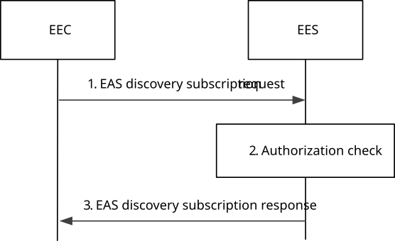
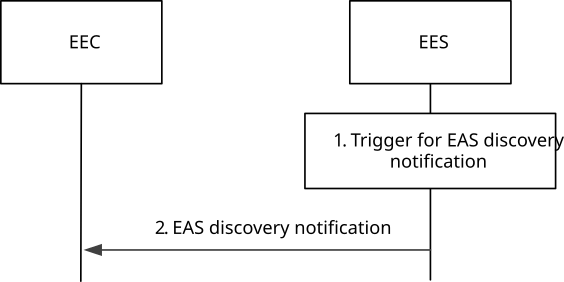
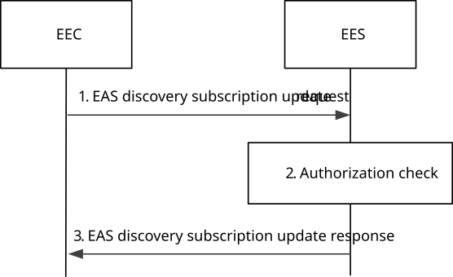

# 8.5.2.3 Subscribe-notify model

## 8.5.2.3.1 General

Clause 8.5.2.3.2 and clause 8.5.2.3.3 together illustrate the EAS discovery procedure based on Subscribe/Notify model.

Clause 8.5.2.3.4 illustrates the EAS discovery update procedure.

Clause 8.5.2.3.5 illustrates the EAS discovery unsubscribe procedure.

## 8.5.2.3.2 Subscribe

Figure 8.5.2.3.2-1 illustrates the EAS discovery subscription procedure between the EEC and the EES. This subscription enables EES to inform EEC of various EAS discovery related events of interest to EEC (e.g. EAS discovery notification and EAS dynamic information).

Pre-conditions:

1\. The EEC has received information (e.g. URI, IP address) related to the EES;

2\. The EEC has received appropriate security credentials authorizing it to communicate with the EES as specified in clause 8.11;

3\. The EES is configured with ECSP's policy for EAS discovery; and

4\. The EEC has optionally acquired a Notification Target Address to be used in its subscriptions to notifications.

NOTE 1: Details of ECSP's policy are out of scope.

NOTE 2: How the EEC acquires the notification target address or a notification channel URI to receive the notifications is out of scope of this release. The notification target address can terminate at the EEC (e.g. in an IoT device) if the deployment supports EEC reachability, or it can terminate at a push notification service. Details of the push notification service are out of scope of this release.

Figure 8.5.2.3.2-1: EAS discovery subscription

1\. The EEC sends an EAS discovery subscription request to the EES. The EAS discovery subscription request includes the EECID along with the security credentials, Event ID, and may include EAS discovery filters and EAS dynamic information filters to subscribe to information about particular EAS(s) or a category of EASs (e.g. gaming applications) or dynamic information about EAS(s).

> If the application triggering is supported and required by the EEC, the EEC may include the EEC Triggering request information element instead of the Notification Target Address in the request message.

2\. Upon receiving the request from the EEC, the EES checks if the EEC is authorized to subscribe for information of the requested EAS(s). The authorization check may apply to an individual EAS, a category of EASs or to the EDN, i.e. to all the EASs. The EES may utilize the capabilities (e.g. UE location) of the 3GPP core network as specified in clause 8.10.3. If the request is authorized, the EES creates and stores the subscription for EAS discovery.

3\. If the processing of the request was successful, the EES sends an EAS discovery subscription response to the EEC, which includes the subscription identifier and may include the expiration time, indicating when the subscription will automatically expire. To maintain the subscription, the EEC shall send an EAS discovery subscription update request prior to the expiration time. If an EAS discovery subscription update request is not received prior to the expiration time, the EES shall treat the EEC as implicitly unsubscribed.

In the case of subscription to an EAS availability change event, if there is no instantiated EAS that matches the requested EAS discovery filters and such EAS is instantiable based on the information about instantiable EASs, the request is treated as successful. If the EEC indicates EAS Instantiation Triggering in the EAS discovery subscription request and the EAS instantiation is not in progress for the requested EASID, the EES may trigger dynamic instantiation of the EAS as specified in the clause 8.12; if the EEC indicates EAS Instantiation Triggering Suppress in the EAS discovery subscription request, the EES determines not triggering the ECSP management system to instantiate the EAS and Instantiable EAS Information (e.g. instantiated, instantiable but not be instantiated yet) is provided; otherwise, the EES does not trigger the EAS instantiation nor returns the Instantiable EAS Information.

In the case of subscription to an EAS dynamic information change event, if the EES is unable to determine the instantiated EAS information using the inputs in the EAS discovery subscription request, UE-specific service information at the EES or the ECSP policy, the EES shall reject the EAS discovery subscription request and respond with an appropriate failure cause.

If the EEC is not registered with the EES, and ECSP policy requires the EEC to perform EEC registration prior to EAS discovery, the EES shall include an appropriate failure cause in the EAS discovery response indicating that EEC registration is required.

If the EAS discovery subscription request fails, the EEC may resend the EAS discovery subscription request again, taking into account the received failure cause. If the failure cause indicated that EEC registration is required, the EEC shall perform an EEC registration before resending the EAS discovery subscription request.

## 8.5.2.3.3 Notify

Figure 8.5.2.3.3-1 illustrates the EAS discovery notification procedure between the EEC and the EES.

Pre-conditions:

1\. The EEC has subscribed with the EES for the EAS discovery information as specified in clause 8.5.2.3.2.

Figure 8.5.2.3.3-1: EAS discovery notification

1\. An event occurs at the EES that satisfies trigger conditions for notifying (e.g. to provide EAS discovery information or EAS dynamic information) a subscribed EEC. If UE's location information is not already available, the EES obtains the UE location by utilizing the capabilities of the 3GPP core network as specified in clause 8.10.3. If EAS discovery filters were provided by the EEC during subscription creation, the EES identifies the EAS(s) based on the provided EAS discovery filters and the UE location.

For EAS dynamic information change event, the EES, based on local policy, may use received EAS endpoints from EEC or all registered EAS endpoints to get edge load analytics information from ADAES services (e.g. as specified in clause 8.8 of TS 23.436 \[28\]) to monitor EAS service status like EAS status and EAS schedule.

When the bundle EAS information is provided, then;

\- If EAS bundle identifier was provided, the EES identifies all or part of the EAS(s) associated with the same EAS bundle identifier.

\- If a list of EASIDs is provided, the EES identifies the EASs which are all or part of the EAS bundle.

If the EEC indicates that service continuity support is required, the EES shall take the indication which ACR scenarios are supported by the AC and the EEC and which of these are preferred by the AC into consideration.

If EAS discovery filters were not provided, then:

\- if available, the EES identifies the EAS(s) based on the UE-specific service information at the EES and the UE location;

\- EES identifies the EAS(s) by applying the ECSP policy (e.g. based only on the UE location);

> If EAS discovery filters contain Application group profile, the EES checks whether information about common EAS and related Application Group ID is available or not. If the common EAS information related to the Application Group ID is available at the EES, then the EES provides information of that EAS as result for EAS discovery.

NOTE 1: The EES may have previously determined and stored the common EAS for Application group ID, or the EES may have received the common EAS selection information for Application group ID during the common EAS announcement procedure.

NOTE 2: Details of the UE-specific service information and how it is available at the EES is out of scope.

NOTE 3: Both steps are evaluated prior to sending a response.

If the UE is located outside the Geographical or Topological Service Area of an EAS, then the EES shall not include this EAS in the EAS discovery notification.

If the application triggering is supported and required by the EEC as indicated in EEC Triggering Request IE of the EAS Discovery Subscription Request, then the EES performs the EEC triggering service as described in the clause 8.16.1 and skips the step 2.

2\. The EES sends an EAS discovery notification to the EEC with the EAS information determined in step 1, which includes information about the discovered EASs and Instantiable EAS Information. For discovered EASs, this includes endpoint information. Depending on the event type and EAS discovery filters received in the EAS discovery subscription request, the notification may include additional information regarding matched capabilities, e.g. service permissions levels, KPIs, AC locations(s) that the EASs can support, ACR scenarios supported by the EAS, etc. The EAS discovery notification may contain a list of EASs and Instantiable EAS Information. This list may be based on EAS discovery filters containing a Geographical or Topological Service Area, e.g. a route, included in the EAS discovery subscription request by the EEC. When the discovered EAS is for a certain application group, then the Application Group ID is also included in the notification message. If the discovered EAS is registered to another EES, then the EES endpoint of the EES where the discovered EAS is registered is also included in the notification message.

Upon receiving the EAS discovery notification, if the EEC selects an EAS which is instantiated (i.e., an EAS profile was provided), the EEC uses the endpoint information for routing of the outgoing application data traffic to EAS(s), as needed, and may provide necessary notifications to the AC(s). The EEC may use the border or overlap between EAS Geographical Service Areas for service continuity purposes. The EEC may cache the EAS information (e.g. EAS endpoint) for subsequent use. If the Lifetime IE is included in the notification, the EEC may cache the EAS information only for the duration specified by the Lifetime IE.

NOTE 4: Within the duration specified by the Lifetime IE, the cached EAS Profile can be updated (e.g. according to notifications from the EES for changes of EAS information due to EAS status change) or the cached EAS Profile can be invalidated due to new EAS information discovery (e.g. due to UE mobility). The EEC can update or invalidate the cached EAS information (e.g. on PDU Session Release or Modification Command).

NOTE 5: The AC can cache the EAS information (e.g. EAS endpoint) for subsequent use. In the case of the cached information needing to be updated or invalidated, the mechanisms for the EEC to notify the AC is up to implementation and is not specified in the current release of the present document.

NOTE 6: The EEC can use the EAS information provided by the discovery procedure to perform service continuity planning, for example when ultra-low latency ACR is required.

Upon receiving the EAS discovery notification, if the EEC selects an EAS which is instantiable but not yet instantiated (i.e. an EAS profile is not provided), the EEC may send the EAS information provisioning request indicating the selected EASID as in clause 8.15.

## 8.5.2.3.4 Subscription update

Figure 8.5.2.3.4-1 illustrates the EAS discovery subscription update procedure between the EEC and the EES.

Pre-conditions:

1\. The EEC has subscribed with the EES for the EAS discovery information as specified in clause 8.5.2.3.2

Figure 8.5.2.3.4-1: EAS discovery subscription update

1\. The EEC sends an EAS discovery subscription update request to the EES. The EAS discovery subscription update request includes the security credentials and the subscription identifier. It may also include EAS discovery filters, EAS dynamic information filters and/or proposed expiration time for the updated subscription.

2\. Upon receiving the request from the EEC, the EES checks if the EEC is authorized to update the subscription information. The EES may utilize the capabilities (e.g. UE location) of the 3GPP core network as specified in clause 8.10.3. If the request is authorized, the EES updates the stored subscription for EAS discovery.

3\. The EES sends an EAS discovery subscription update response to the EEC, which may include the expiration time, indicating when the updated subscription will automatically expire. To maintain the subscription, the EEC shall send an EAS discovery subscription update request prior to the expiration time. If an EAS discovery subscription update request is not received prior to the expiration time, the EES shall treat the EEC as implicitly unsubscribed.

## 8.5.2.3.5 Unsubscribe

Figure 8.5.2.3.5-1 illustrates the EAS discovery unsubscribe procedure between the EEC and the EES.

Pre-conditions:

1\. The EEC has subscribed with the EES for notification (e.g. EAS discovery information and EAS dynamic information) as specified in clause 8.5.2.3.2

Figure 8.5.2.3.5-1: EAS discovery unsubscribe

1\. The EEC sends an EAS discovery unsubscribe request to the EES. The EAS discovery unsubscribe request includes the security credentials of the EEC along with the subscription identifier.

2\. Upon receiving the request, the EES performs an authorization check to verify whether the EEC has authorization to perform the operation. If authorized, the EES cancels the subscription for provisioning as requested in step 1.

3\. The EES responds with an EAS discovery unsubscribe response.
