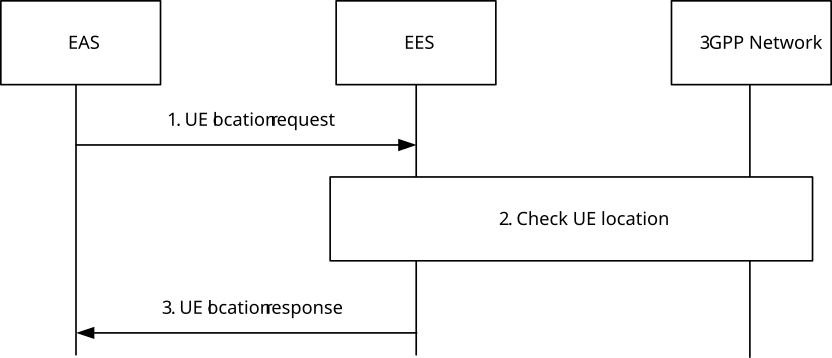
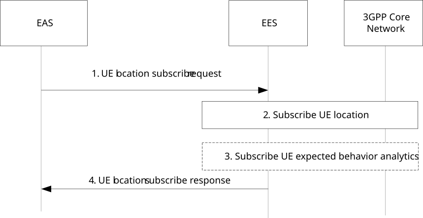
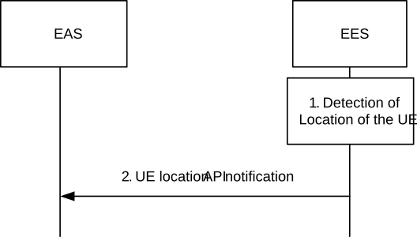
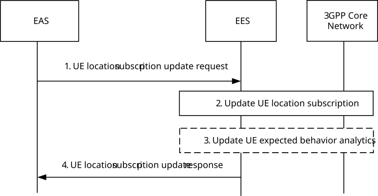
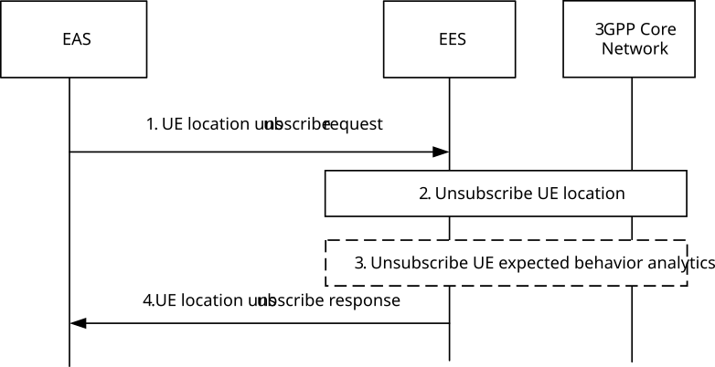

# 8.6.2 UE location API

## 8.6.2.1 General

The EES exposes the UE location API to the EAS in order to support tracking or checking the valid location of the UE. The UE location API exposed by the EES relies on the 3GPP core network capabilities as specified in clause 8.10.3.

The EAS can request UE location API for one-time reporting to check current UE location and for continuous reporting to track UE's location.

The UE location API supports both request-response for one-time queries (in order to check UE's current location) as well as subscribe-notify models for providing UE's location to EAS on a continuous basis and enabling the EAS to track UE's location (as UE location changes).

## 8.6.2.2 Procedures

### 8.6.2.2.1 General

### 8.6.2.2.2 Request-response model

Figure 8.6.2.2.2-1 illustrates the interactions between the EES and the EAS for one-time location report.

Pre-conditions:

1\. The EAS is authorized to discover and to use UE location API provided by the EES.

2\. The EES is authorized to use Nnef Event Exposure API for UE location, based on service level agreement with MNO.

3\. UE Identifier between EAS and the EES is authorized for the UE location API.

Figure 8.6.2.2.2-1: UE location API request-response model

1\. The EAS sends UE location request to the EES. The UE location request shall include the UE Identifier. It may also include location granularity to indicate requested format of the location e.g. GPS Coordinates, Cell ID, Tracking Area ID, or civic addresses (e.g. streets, districts, etc.), which can be understood by the EAS and location QoS.

NOTE 1: The trigger condition of the UE location API is up to application service logic, which is out of scope of this specification.

2\. The EES checks the UE location:

a\. If the UE location request from the EAS includes the location granularity, the EES considers the location granularity parameter for checking the location of the UE.

b\. If the EES has a valid locally cached location of the UE, the EES may use this cached UE location to respond to the EAS. Otherwise, the EES utilizes the capabilities of the 3GPP core network as specified in clause 8.10.3.

c\. The EES may modify the format of the UE location to fit to the location granularity requested from the EAS in the step 1, if supported. For example, if the EES receives the UE location in a format of tracking area ID or cell ID, the EES can modify the representation of the location information to the GPS Coordinates, or civic addresses (e.g. streets, districts, etc.) as requested by the EAS.

NOTE 2: Format modification mechanism of the UE location to fit the location granularity is outside the scope of this specification. Step 2.c. can be performed if the EES is deployed by the PLMN operator.

3\. If successful, the EES responds to the EAS with the location of the UE, and optionally the timestamp of the location.

### 8.6.2.2.3 Subscribe-notify model

#### 8.6.2.2.3.1 General

#### 8.6.2.2.3.2 Subscribe

Figure 8.6.2.2.3.2-1 illustrates the subscribe operation between the EAS and the EES for continuous UE location reporting.

Pre-conditions:

1\. The EAS is authorized to discover and to use UE location API provided by the EES;

2\. The EES is authorized to use 3GPP network exposure capability (e.g. Nnef Event Exposure API) for UE location, based on service level agreement with MNO; and

3\. UE Identifier or UE Group ID between EAS and the EES is authorized for the UE location API.

Figure 8.6.2.2.3.2-1: UE location API: Subscribe operation

1\. The EAS sends UE location subscribe request to the EES for tracking a UE's location continuously. The UE location subscribe request shall include the UE Identifier or UE Group ID and may include proposed expiration time. It may also include location granularity to indicate requested format of the location e.g. GPS Coordinates, Cell ID, Tracking Area ID, or civic addresses (e.g. streets, districts, etc.), which can be understood by the EAS and location QoS.

2\. The EES checks if the request from the EAS is authorized. If authorized, the EES sends success response to the EAS and utilizes the UE location exposure capability of the 3GPP core network as specified in clause 8.10.3. The EES requests continuous location reporting from the 3GPP system to have up to date location information of the UE(s).

3\. The EES may subscribe to UE expected behaviour analytics (UE mobility) as described in 3GPP TS 23.288 \[18\].

4\. The response includes the subscription identifier and may include the expiration time, indicating when the subscription will automatically expire. To maintain the subscription, the EAS shall send a UE location subscription update request prior to the expiration time. If a UE location subscription update request is not received prior to the expiration time, the EES shall treat the EAS as implicitly unsubscribed. If it is not authorized, the EES sends failure response with rejection cause.

#### 8.6.2.2.3.3 Notify

Figure 8.6.2.2.3.3-1 illustrates the notify operation between the EES and the EAS for continuous location.

Pre-conditions:

1\. The EAS has subscribed to UE location API provided by the EES.

Figure 8.6.2.2.3.3-1: UE location API: Notify operation

1\. The EES detects the location of a UE e.g., receiving location of a UE from the 3GPP system. The EES may cache the detected location information locally with timestamp as the latest location information of the UE(s) and start the notification aggregation for a group of UEs. The EES decides whether to aggregate and the aggregation period based on the analytics result received from the 3GPP Core Network, local policy and UE location subscription information received from the EAS. The EES determines to notify the location information of the UE(s) to the EAS which has subscribed for UE(s)'s location.

2\. The EES sends UE location notification to the EAS. The EES includes the location of the UE(s). Each UE location includes UE ID and location type and may include the location accuracy and the timestamp of the location.

The EES may modify the format of location information to fit to the location granularity requested from the EAS during the subscribe operation, if supported. For example, if the EES receives the UE location in a format of tracking area ID or cell ID, the EES can modify the representation of the location information to the GPS Coordinates, or civic addresses (e.g. streets, districts, etc.) as requested from the EAS.

#### 8.6.2.2.3.4 Subscription update

Figure 8.6.2.2.3.4-1 illustrates the subscription update operation between the EAS and the EES.

Pre-conditions:

1\. The EAS has subscribed to UE location API provided by the EES.

Figure 8.6.2.2.3.4-1: UE location API: Subscription update operation

1\. The EAS sends UE location subscription update request to the EES. The request includes the subscription identifier of the subscription to be updated. The UE location subscription update request may also include proposed expiration time for the updated subscription, updated Location granularity and Location QoS.

2\. The EES checks if the request from the EAS is authorized. If authorized, the EES updates the subscription request and may update the UE location subscription in the 3GPP Core Network.

3\. The EES may update the subscription to the UE expected behaviour analytics.

4\. The EES sends the UE location subscription update response to the EAS.

#### 8.6.2.2.3.5 Unsubscribe

Figure 8.6.2.2.3.5-1 illustrates the unsubscribe operation between the EAS and the EES to stop the UE location notifications.

Pre-conditions:

1\. The EAS has subscribed to UE location API provided by the EES.

Figure 8.6.2.2.3.5-1: UE location API: unsubscribe operation

1\. The EAS sends the UE location unsubscribe request to the EES.

2\. The EES checks if the EAS is authorized or not. If authorized, the EES terminates the subscription of the EAS and unsubscribes the UE location from the 3GPP Core Network.

3\. The EES unsubscribes from the UE expected behaviour analytics, if applicable.

4\. The EES responds to the EAS.

## 8.6.2.3 Information flows

### 8.6.2.3.1 General

The following information flows are specified for UE location API:

\- UE location request and response; and

\- UE location subscription, notification, subscription update and unsubscribe.

### 8.6.2.3.2 UE location request

Table 8.6.2.3.2-1: UE location request

| Information element  | Status | Description                                                                                                                                                        |
|----------------------|--------|--------------------------------------------------------------------------------------------------------------------------------------------------------------------|
| UE ID                | M      | Identifies the UE for which location will be reported (i.e., GPSI)                                                                                                 |
| Security credentials | M      | Security credentials of the EAS                                                                                                                                    |
| Location granularity | O      | Indicates format of location e.g. GPS Coordinates, Cell ID, Tracking Area ID, or civic addresses (e.g. streets, districts, etc.) that can be understood by the EAS |
| Location QoS         | O      | Indicates the location quality of service as described in clause 4.1b of 3GPP TS 23.273 \[9\].                                                                     |

### 8.6.2.3.3 UE location response

Table 8.6.2.3.3-1: UE location response

| Information element  | Status | Description                                           |
|----------------------|--------|-------------------------------------------------------|
| Successful response  | O      | Indicates that the UE location request was successful |
| \> UE location       | M      | Location of the UE                                    |
| \> Timestamp         | O      | Indicates the age of the UE's location information    |
| \> Location accuracy | O      | Indicates accuracy of the location information        |
| Failure response     | O      | Indicates that the subscription request failed        |
| \> Cause             | O      | Indicates the cause of request failure                |

### 8.6.2.3.4 UE location subscribe request

Table 8.6.2.3.4-1: UE location subscribe request

| Information element                                  | Status | Description                                                                                                                                                        |
|------------------------------------------------------|--------|--------------------------------------------------------------------------------------------------------------------------------------------------------------------|
| EASID                                                | M      | The identifier of the EAS                                                                                                                                          |
| UE ID (NOTE)                                         | O      | Identifies the UE for which location will be reported (i.e., GPSI)                                                                                                 |
| UE Group ID (NOTE)                                   | O      | Identifies a group of UEs as defined in clause 7.2.7                                                                                                               |
| Security credentials                                 | M      | Security credentials of the EAS                                                                                                                                    |
| Notification Target Address                          | M      | Notification Target Address of the EAS where the notification is to be sent by the EES                                                                             |
| Event reporting information                          | O      | Event Reporting Information as specified in Table 4.15.1-1 of 3GPP TS 23.502 \[3\], e.g. event reporting mode.                                                     |
| Proposed expiration time                             | O      | Proposed expiration time for the subscription                                                                                                                      |
| Location Granularity                                 | O      | indicates format of location e.g. GPS Coordinates, Cell ID, Tracking Area ID, or civic addresses (e.g. streets, districts, etc.) that can be understood by the EAS |
| Location QoS                                         | O      | Indicate the location quality of service as described in clause 4.1b of 3GPP TS 23.273 \[9\].                                                                      |
| NOTE: Either UE ID or UE Group ID shall be provided. |        |                                                                                                                                                                    |

### 8.6.2.3.5 UE location subscribe response

Table 8.6.2.3.5-1: UE location subscribe response

| Information element | Status | Description                                                                                                                                          |
|---------------------|--------|------------------------------------------------------------------------------------------------------------------------------------------------------|
| Successful response | O      | Indicates that the subscription request was successful.                                                                                              |
| \> Subscription ID  | M      | Subscription identifier corresponding to the subscription.                                                                                           |
| \> Expiration time  | O      | Indicates the expiration time of the subscription. To maintain an active subscription, a subscription update is required before the expiration time. |
| Failure response    | O      | Indicates that the subscription request failed.                                                                                                      |
| \> Cause            | O      | Indicates the cause of subscription request failure                                                                                                  |

### 8.6.2.3.6 UE location notification

Table 8.6.2.3.6-1: UE location notification

| Information element         | Status | Description                                                                                 |
|-----------------------------|--------|---------------------------------------------------------------------------------------------|
| Subscription ID             | M      | Subscription identifier corresponding to the subscription stored in the EES for the request |
| List of event notifications | M      | A list of event notifications for one or more UEs.                                          |
| \> UE ID                    | M      | The identifier of each UE (i.e., GPSI)                                                      |
| \> UE location              | M      | Location of the UE                                                                          |
| \> Timestamp                | O      | Indicates the age of the location information                                               |
| \> Location accuracy        | O      | Indicates accuracy of the location information                                              |
| \> Location type            | M      | Indicates whether it is a predictive or actual UE location change.                          |

### 8.6.2.3.7 UE location subscription update request

Table 8.6.2.3.7-1: UE location subscription update request

| Information element                         | Status | Description                                                                                                                                                        |
|---------------------------------------------|--------|--------------------------------------------------------------------------------------------------------------------------------------------------------------------|
| Subscription ID                             | M      | Subscription identifier corresponding to the subscription to be updated                                                                                            |
| Security credentials                        | M      | Security credentials of the EAS                                                                                                                                    |
| Event reporting information (NOTE)          | O      | Event Reporting Information as specified in Table 4.15.1-1 of 3GPP TS 23.502 \[3\], e.g. event reporting mode.                                                     |
| Proposed expiration time (NOTE)             | O      | Proposed expiration time for the subscription                                                                                                                      |
| Notification Target Address (NOTE)          | O      | Notification Target Address of the EAS where the notification is to be sent by the EES                                                                             |
| Location Granularity (NOTE)                 | O      | indicates format of location e.g. GPS Coordinates, Cell ID, Tracking Area ID, or civic addresses (e.g. streets, districts, etc.) that can be understood by the EAS |
| Location QoS (NOTE)                         | O      | Indicate the location quality of service as described in clause 4.1b of 3GPP TS 23.273 \[9\].                                                                      |
| NOTE: At least one of these IEs is present. |        |                                                                                                                                                                    |

### 8.6.2.3.8 UE location subscription update response

Table 8.6.2.3.8-1: UE location subscription update response

| Information element | Status | Description                                                                                                                                          |
|---------------------|--------|------------------------------------------------------------------------------------------------------------------------------------------------------|
| Successful response | O      | Indicates that the subscription request was successful.                                                                                              |
| \> Expiration time  | O      | Indicates the expiration time of the subscription. To maintain an active subscription, a subscription update is required before the expiration time. |
| Failure response    | O      | Indicates that the subscription request failed.                                                                                                      |
| \> Cause            | O      | Indicates the cause of subscription request failure                                                                                                  |

### 8.6.2.3.9 UE location unsubscribe request

Table 8.6.2.3.9-1: UE location unsubscribe request

| Information element  | Status | Description                                                                                 |
|----------------------|--------|---------------------------------------------------------------------------------------------|
| Subscription ID      | M      | Subscription identifier corresponding to the subscription stored in the EES for the request |
| Security credentials | M      | Security credentials of the EAS                                                             |

### 8.6.2.3.10 UE location unsubscribe response

Table 8.6.2.3.10-1: UE location unsubscribe response

| Information element | Status | Description                                            |
|---------------------|--------|--------------------------------------------------------|
| Successful response | O      | Indicates that the unsubscribe request was successful. |
| Failure response    | O      | Indicates that the unsubscribe request failed.         |
| \> Cause            | O      | Indicates the cause of unsubscribe request failure     |

## 8.6.2.4 APIs

### 8.6.2.4.1 General

Table 8.6.2.4.1-1 illustrates the API for UE location.

Table 8.6.2.4.1-1: Eees_UELocation API

<table>
<colgroup>
<col style="width: 40%" />
<col style="width: 21%" />
<col style="width: 20%" />
<col style="width: 18%" />
</colgroup>
<thead>
<tr class="header">
<th>API Name</th>
<th>API Operations</th>
<th>
Operation

Semantics
</th>
<th>Consumer(s)</th>
</tr>
</thead>
<tbody>
<tr class="odd">
<td rowspan="5">Eees_UELocation</td>
<td>Get</td>
<td>Request/Response</td>
<td>EAS</td>
</tr>
<tr class="even">
<td>Subscribe</td>
<td rowspan="4">Subscribe/Notify</td>
<td rowspan="4">EAS</td>
</tr>
<tr class="odd">
<td>Notify</td>
</tr>
<tr class="even">
<td>UpdateSubscription</td>
</tr>
<tr class="odd">
<td>Unsubscribe</td>
</tr>
</tbody>
</table>

### 8.6.2.4.2 Eees_UELocation_Get operation

**API operation name:** Eees_UELocation_Get

**Description:** The consumer requests one time report of a UE's location.

**Inputs:** See clause 8.6.2.3.2.

**Outputs:** See clause 8.6.2.3.3*.*

See clause 8.6.2.2.2 for details of usage of this operation.

### 8.6.2.4.3 Eees_UELocation_Subscribe operation

**API operation name:** Eees_UELocation_Subscribe

**Description:** The consumer subscribes for continuous reporting of a UE's location.

**Inputs:** See clause 8.6.2.3.4.

**Outputs:** See clause 8.6.2.3.5*.*

See clause 8.6.2.2.3.2 for details of usage of this operation.

### 8.6.2.4.4 Eees_UELocation_Notify operation

**API operation name:** Eees_UELocation_Notify

**Description:** The consumer is notified with report of the UE's location.

**Inputs:** See clause 8.6.2.3.6.

**Outputs:** None*.*

See clause 8.6.2.2.3.3 for details of usage of this operation.

### 8.6.2.4.5 Eees_UELocation_UpdateSubscription operation

**API operation name:** Eees_UELocation_UpdateSubscription

**Description:** The consumer updates an existing subscription for continuous reporting of a UE's location.

**Inputs:** See clause 8.6.2.3.7.

**Outputs:** See clause 8.6.2.3.8*.*

See clause 8.6.2.2.3.4 for details of usage of this operation.

### 8.6.2.4.6 Eees_UELocation_Unsubscribe operation

**API operation name:** Eees_UELocation_Unsubscribe

**Description:** The consumer cancels an existing subscription for continuous reporting of a UE's location.

**Inputs:** See clause 8.6.2.3.9.

**Outputs:** See clause 8.6.2.3.10*.*

See clause 8.6.2.2.3.5 for details of usage of this operation.
