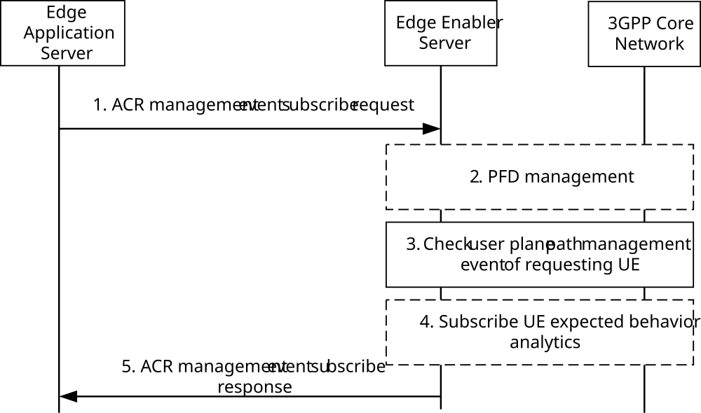
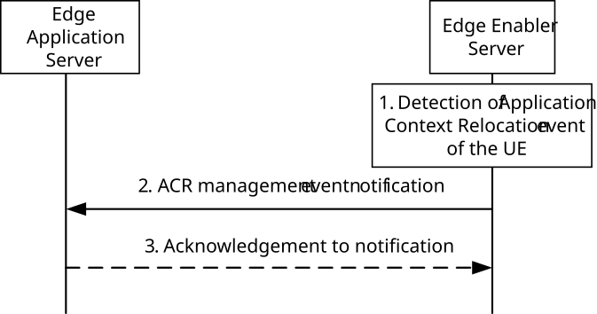
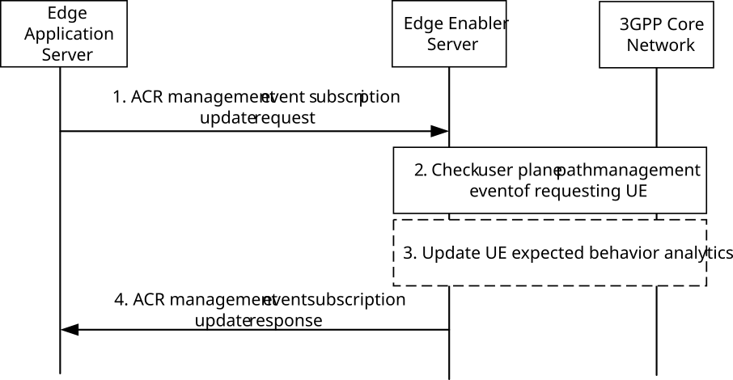
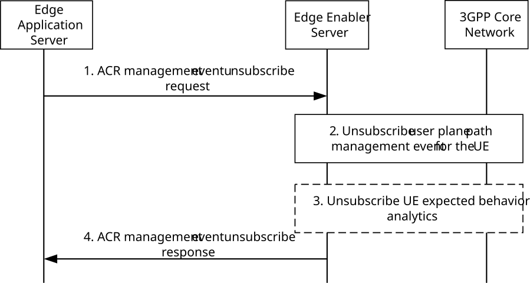

# 8.6.3.2 Procedures

## 8.6.3.2.1 General

## 8.6.3.2.2 Subscribe

Figure 8.6.3.2.2-1 illustrates the subscribe operation between the EAS and the EES for ACR management event notifications.

Figure 8.6.3.2.2-1: ACR management event API: Subscribe operation

1\. The EAS sends ACR management event subscribe request (e.g. tracking the UE's user plane path change continuously). The EAS shall include UE Identifier or UE Group ID for "user plane path change", "out of service area", "ACR monitoring" and "ACR facilitation" events.

a\. The EAS may include the "user plane path change" event to indicate the EES to notify the EAS when the EES detects there is a user plane path change for the application traffic and the EAS may include Subscription Type (Early and/or Late notification defined in clause 5.6.7 of 3GPP TS 23.501 \[2\]) and/or Indication of EAS Acknowledgement in the event subscription.

b\. The EAS may include the "out of service area" event to indicate the EES to notify the EAS when the EES detects that a UE has moved into or is out of the subscribed EAS service area.

c\. The EAS may include the "ACR monitoring" event to indicate the EES to notify the EAS when the EES detects there is a need for the ACR (e.g. when T-EAS is available at the target DNAI). The EAS may also include the Event Filters as defined in clause 5.3.4.4 of 3GPP TS 23.501 \[2\] to specify the conditions to match for notifying the event, e.g., inter-EDN mobility, intra-EDN mobility.

d\. The EAS may include the "ACR facilitation" event to request the EES to make the decision for ACR, discover the T-EAS(s), influence the traffic for the selected T-EAS and notify the S-EAS of the selected T-EAS. If required, the EAS can add an indication to request service continuity planning.

e\. The EAS may include the "ACT start/stop" event to indicate the EES to notify the EAS of the need for start or stop ACT to or from another EAS for a particular UE. The EES may also use "ACT start" event to notify the EAS of the ACR parameters.

f\. The EAS may include the “ACR Selection” event to indicate the EES to notify the EAS of the selected ACR scenario list applicable to ACs using the EAS.

2\. The EES checks if the EAS is authorized for this operation.

> If authorized, and if the subscription in step 1 includes at least one of the "user plane path change", "ACR monitoring", "out of service area" and "ACR facilitation" events, the EES may invoke the PFD management procedure with the 3GPP Core Network as described in 3GPP TS 23.682 \[17\] and 3GPP TS 23.502 \[3\] with an application id. The traffic filter information sent by the EAS is used in requesting PFD management service. Further the EES provides the same application id for requesting user plane path management event service.

NOTE 1: PFD management can be optionally supported in MNO. If EES cannot invoke step 2, it responds EAS with appropriate error.

NOTE 2: The EES can map the EASID into the application id that is used to invoke the PFD management procedure.

3\. If the subscription in step 1 includes at least one of the "user plane path change", "ACR monitoring", "out of service area" and "ACR facilitation" events, the EES checks if there exists a subscription with the 3GPP core network for the user plane path management event notifications corresponding to the UE information obtained in step 1 as described in 3GPP TS 23.501 \[2\] and 3GPP TS 23.502 \[3\], which may be triggered by other EAS for the same UE. The EES checks the availability of the user plane path management event service for the UE(s).

a\. if a subscription with 3GPP core network does not exist, then the EES subscribes with the 3GPP core network (PCF, NEF or SCEF+NEF) for the user plane path management event notifications of the UE(s) as described in 3GPP TS 23.501 \[2\] and 3GPP TS 23.502 \[3\] If the EAS provides Subscription Type and/or Indication of EAS Acknowledgement, the EES include the type of subscription and/or the indication of "AF acknowledgement to be expected" as information on AF subscription to corresponding SMF events within the AF Request;

b\. if a subscription with 3GPP core network exists, then the EES uses the locally cached user plane path management event notification information of the UE(s) to respond to the EAS.

The EES stores the subscription related to the EAS.

If the subscription in step 1 is for "out of service area", the EES checks for an existing subscription with the 3GPP core network for area of interest UE mobility event monitoring notifications as described in TS 23.502 \[3\] clause 4.15.3 corresponding to the UE information obtained in step 1.

4\. If the event is "user plane path change" or "out of service area", the EES may subscribe to UE expected behaviour analytics (UE mobility and UE communication) for the group of UEs as described in 3GPP TS 23.288 \[18\].

5\. If EAS is authorized, the EES responds with ACR management event subscribe response. If EAS is not authorized, the EES provides a rejection response with cause information.

If the target UE(s) and the 3GPP network support mobility between 5GC and EPC, the EES monitors the availability of the user plane path management event notification from the 3GPP network by utilizing Nnef_APISupportCapability or Availability of service APIs event notifications provided by the CAPIF core function.

## 8.6.3.2.3 Notify

Figure 8.6.3.2.3-1 illustrates the notify operation between the EES and the EAS for continuous ACR management event notifications.

Figure 8.6.3.2.3-1: ACR management event API: Notify operation

1\. The EES detects the ACR management event of a UE (i.e. receiving User plane path management event notification for a UE or a monitoring event notification for UE mobility for area on interest from the 3GPP core network), or receiving ACR request from the EEC, or when the selected ACR scenario list for a particular AC changes.

a\. If "user plane path change" Event is subscribed, the EES may cache the detected User plane path management event notification locally with timestamp as the latest information of the UE(s) and start the notification aggregation for a group of UEs. The EES decides whether to aggregate and the aggregation period based on the analytics result received from the 3GPP Core Network, local policy and User Plane path management subscription information received from the EAS. The EES determines to notify the user plane path management event notification information (e.g., DNAI) to the EASs which has subscribed for the "user plane path management" event.

b\. If "out of service area" Event is subscribed, the EES may cache the detected UE mobility monitoring event notification locally with timestamp as the latest information of the UE(s) and start the notification aggregation for a group of UEs. The EES decides whether to aggregate and the aggregation period based on the analytics result received from the 3GPP Core Network, local policy and UE mobility monitoring event subscription for area of interest information received from the EAS. The EES determines which service area event notification (e.g., out of service area) to send to the EAS(s) which has subscribed for the "out of service area" event.

c\. If "ACR monitoring" Event is subscribed, based on the detected user plane path change report sent from the 3GPP core network, the EES checks whether any T-EAS is available as described in steps 2-4 of clause 8.8.3.2. If a T-EAS is available, the EES notifies the EAS with T-EAS endpoint; otherwise this event notification will not be sent. Also, when the EES receives the ACR request from the EEC, the EES decides to send the notification to the EAS.

d\. If "ACR facilitation" Event is subscribed, based on the detected user plane path change report sent from the 3GPP core network, the EES checks whether any T-EAS is available as described in steps 2-4 of clause 8.8.3.2. If a T-EAS is available, the EES selects the T-EAS from the discovered EAS list and applies the AF traffic influence with the N6 routing information of the selected T-EAS in the 3GPP Core Network. The EES also notifies the S-EAS with the selected T-EAS endpoint.

e\. If "ACT start/stop" event is subscribed, during the ACR launch if the EEC indicates the need to notify the EAS in the ACR request as described in clause 8.8.3.4, the EES shall send notification to the EAS to inform it about the need to start or stop the ACT to or from another EAS. The EES may include a service continuity planning indication so that the EES will monitor UE location. The notification message includes ACR identity (ACID, UE ID, S-EAS endpoint and T-EAS endpoint).

f\. If “ACR Selection” event is subscribed, the EES shall send notification to the EAS to update the selected ACR scenario list applicable for a particular AC (ACID, UE ID) if an update was received as described in clause 8.15.2.2.

2\. The EES sends ACR management event notification to the EAS. The EES includes the ACR management event notification information of the UE(s), and optionally the timestamp. If the event triggering the notification is user plane path change or serving area of interest change due to UE mobility area of interest change, the timestamp can be included to indicate the age of the user plane path management or mobility event notification information. The EES may only provide part of information included in the user plane path management event notification from 3GPP network (e.g. target DNAI, target tunnel information). If the EAS had provided "Indication of EAS acknowledgement", the EES waits for acknowledgement from the EAS before it sends AF acknowledgement to the 3GPP core network.

> If the event is "ACT start/stop", the notification shall include the endpoint address of the other EAS and the UE ID. The "ACT start" notification may include ACR parameters as per clause 8.8.3.9. Upon receiving the notification about the start of the ACR execution with "ACT start" event, the S-EAS avoids triggering a second ACR execution for the same identity (ACID, UE ID, S-EAS endpoint and T-EAS endpoint) until the current ACR execution is completed.

NOTE: How long the detection entity should wait for current ACT to complete in order to start to detect or to decide another ACR is up to the implementation.

If the event is “ACR Selection”, the notification shall include the selected ACR scenario list, ACID and UE ID. Upon receiving the notification, the EAS determines if it should perform ACR detection and/or ACR decision for a particular AC (ACID, UE ID).

3\. If the EAS had included Indication of EAS Acknowledgement within ACR management event subscribe request described in clause 8.6.3.2.1, the EAS sends EAS Acknowledgement as a response to ACR management event notification to the EES either immediately or after the required ACT is completed. The EAS may reply in negative, e.g., the EAS may determine not to perform ACR. Then, the EES sends the AF acknowledgement to the 3GPP core network.

> If the EAS had included Indication of EAS acknowledgement for service continuity planning within ACR management event subscribe request described in clause 8.6.3.2.1, the EAS sends EAS Acknowledgement as a response to ACR management event notification for service continuity planning of which detailed procedure is described in step 4 of clause 8.8.3.9.

## 8.6.3.2.4 Subscription update

Figure 8.6.3.2.4-1 illustrates the subscription update operation between the EAS and the EES for ACR management event notifications.

Figure 8.6.3.2.4-1: ACR management event API: Subscription update operation

1\. The EAS sends ACR management event subscription update request to update an existing subscription. The subscription update request may include Event ID, Event Filter, Event Report, Subscription Type (Early and/or Late notification defined in clause 5.6.7 of 3GPP TS 23.501 \[2\]) and/or Indication of EAS Acknowledgement.

2\. The EES checks if the EAS is authorized for the operation.

> If authorized and if the subscription in step 1 includes only "ACT start/stop" event, the EES stores the updated subscription related to the EAS and step 3 is skipped.
>
> If authorized, and if the subscription in step 1 includes at least one of the "user plane path change", "out of service area", "ACR monitoring" and "ACR facilitation" events, the EES checks if there exists a subscription with the 3GPP core network for the user plane path management event or UE mobility event for area of interest notifications corresponding to the updated information obtained in step 1 as described in 3GPP TS 23.501 \[2\] and 3GPP TS 23.502 \[3\], which may be triggered by other EAS for the same UE.

a\. if a subscription with 3GPP core network does not exist corresponding to the updated information, then the EES subscribes with the 3GPP core network (PCF, NEF or SCEF+NEF) for the user plane path management event or UE mobility event notifications of the UE(s) as described in 3GPP TS 23.501 \[2\] and 3GPP TS 23.502 \[3\] If the EAS provides Subscription Type and/or Indication of EAS Acknowledgement, the EES includes the type of subscription and/or the indication of "AF acknowledgement to be expected" as information on AF subscription to corresponding SMF events within the AF Request;

b\. if a subscription with 3GPP core network exists corresponding to the updated information, then the EES uses the locally cached user plane path management event notification information of the UE(s) to respond to the EAS.

> The EES stores the updated subscription related to the EAS.

3\. The EES may update the subscription to the UE expected behaviour analytics.

4\. The EES responds with ACR management event subscription response.

## 8.6.3.2.5 Unsubscribe

Figure 8.6.3.2.5-1 illustrates the unsubscribe operation between the EAS and the EES for ACR management event notifications.

Figure 8.6.3.2.5-1: ACR management event API: Unsubscribe operation

1\. The EAS sends ACR management event unsubscribe request to the EES to cancel the ACR management event subscription.

2\. The EES checks if another EAS requires to track the UE's user plane path change or not. If not, the EES unsubscribes the user plane path management event notifications from the 3GPP core network for the corresponding UE.

3\. The EES unsubscribes from the UE expected behaviour analytics, if applicable.

4\. The EES checks if the EAS is authorized for the operation. If authorized, the EES removes the subscription related to the EAS and sends ACR management event unsubscribe response to the EAS.
