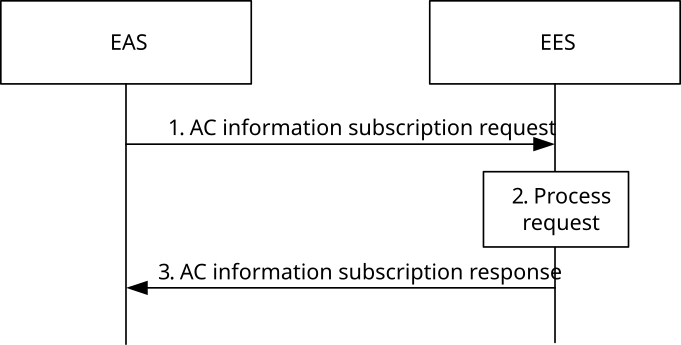
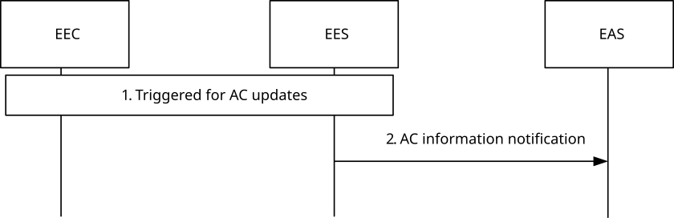
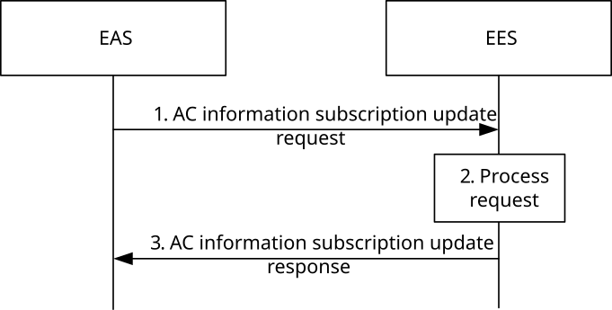
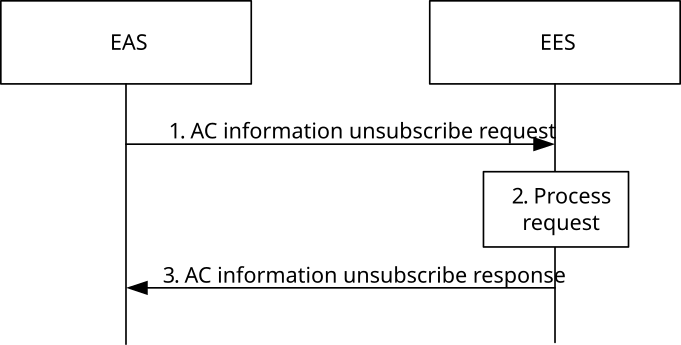

# 8.6.4 AC information exposure API

## 8.6.4.1 General

AC information exposure enables EASs to obtain information about capabilities of ACs from the EESs. This information may facilitate communications between EASs and ACs, e.g. push notifications. The information shared is subject to access control as well as privacy and security mechanisms.

## 8.6.4.2 Procedures

### 8.6.4.2.1 General

### 8.6.4.2.2 Subscribe

Figure 8.6.4.2.2-1 illustrates the AC information subscription procedure between the EAS and the EES.

Pre-conditions:

1\. The EAS is registered with the EES; and

2\. The AC Profiles of the ACs on the UE are available at the EEC on the UE.

Figure 8.6.4.2.2-1: AC information subscription

1\. The EAS sends an AC information subscription request to the EES. The request may contain filters to retrieve information about particular ACs e.g. AC profile parameters or parameter ranges to be matched, specific UE Identifiers, location ranges, etc.

NOTE: The trigger conditions of the AC information API (e.g. resource load predictive analytics) are up to service logic, which is out of scope of this specification.

2\. Upon receiving the request from the EAS, the EES performs an authorization check to verify whether the EAS has authorization to perform the operation. The EES determines the matching AC information corresponding to the filter provided and composes a result. The EES stores the subscription information for future processing.

3\. The EES sends an AC information subscription response to the EAS with the result composed in step 2.

### 8.6.4.2.3 Notify

Figure 8.6.4.2.3-1 illustrates the AC information notification procedure between the EES and the EAS.

Pre-conditions:

1\. The EAS subscribed for AC information at the EES.

Figure 8.6.4.2.3-1: AC information notification

1\. The EES is triggered for AC information updates, e.g. it receives an EEC registration request, it determines if it matches the filter provided by the EAS, e.g. if the AC Geographical Service Area is included in the EAS provided Geographical Service Area.

2\. The EES sends an AC information notification to the EAS.

### 8.6.4.2.4 Subscription update

Figure 8.6.4.2.4-1 illustrates the AC information subscription update procedure between the EAS and the EES.

Pre-conditions:

1\. The EAS has subscribed for AC information as described in clause 8.6.4.2.2.

Figure 8.6.4.2.4-1: AC information subscription update

1\. The EAS sends an AC information subscription update request to the EES. The request may contain updated filters to retrieve information about particular ACs e.g. AC profile parameters or parameter ranges to be matched, specific UE Identifiers, location ranges, etc.

2\. Upon receiving the request from the EAS, the EES performs an authorization check to verify whether the EAS has authorization to perform the operation. If authorized, the EES updates the stored subscription information.

3\. The EES sends an AC information subscription update response to the EAS.

### 8.6.4.2.5 Unsubscribe

Figure 8.6.4.2.5-1 illustrates the AC information unsubscribe procedure between the EAS and the EES.

Pre-conditions:

1\. The EAS has subscribed for AC information as described in clause 8.6.4.2.2.

Figure 8.6.4.2.5-1: AC information unsubscribe

1\. The EAS sends an AC information unsubscribe request to the EES.

2\. Upon receiving the request from the EAS, the EES performs an authorization check to verify whether the EAS has authorization to perform the operation. If authorized, the EES cancels the subscription as requested in step 1.

3\. The EES sends an AC information unsubscribe response to the EAS.

## 8.6.4.3 Information flows

### 8.6.4.3.1 General

### 8.6.4.3.2 AC information subscription request

Table 8.6.4.3.2-1 describes the information flow for an AC information subscription request from the EAS to the EES.

Table 8.6.4.3.2-1: AC information subscription request

|                             |        |                                                                                                                        |
|-----------------------------|--------|------------------------------------------------------------------------------------------------------------------------|
| Information element         | Status | Description                                                                                                            |
| EASID                       | M      | The identifier of the EAS                                                                                              |
| Security credentials        | M      | Security credentials of the EAS                                                                                        |
| Subscription type           | M      | Choice of "One time" or "Event based" determining the type of processing requested                                     |
| Notification Target Address | M      | The Notification Target Address (e.g. URL) where the notifications destined for the EAS should be sent to.             |
| Filters                     | O      | List of characteristics for discovery purposes, as detailed in Table 8.6.4.3.2-2.                                      |
| Event conditions            | O      | Parameters indicating notification event conditions e.g. number of notifications instances, subscription timeout, etc. |
| Trigger parameters          | O      | Parameters indicating notification triggering conditions e.g. EEC registration, EAS discovery.                         |

Table 8.6.4.3.2-2: Filters

<table>
<colgroup>
<col style="width: 33%" />
<col style="width: 16%" />
<col style="width: 50%" />
</colgroup>
<tbody>
<tr class="odd">
<td>Information element</td>
<td>Status</td>
<td>Description</td>
</tr>
<tr class="even">
<td>ACID(s)</td>
<td>O</td>
<td>List of identities of AC(s) to be matched</td>
</tr>
<tr class="odd">
<td>UE ID(s)</td>
<td>O</td>
<td>List of UE identifiers to be matched</td>
</tr>
<tr class="even">
<td>AC Type(s)</td>
<td>O</td>
<td>List of categories or types of ACs (e.g. V2X) to be matched</td>
</tr>
<tr class="odd">
<td>ECSP ID(s)</td>
<td>O</td>
<td>Identifier(s) for the ECSP associated with the EEC.</td>
</tr>
<tr class="even">
<td>Operation Schedule</td>
<td>O</td>
<td>EAS operation schedule (e.g. time windows) to be matched</td>
</tr>
<tr class="odd">
<td>Geographical Service Area</td>
<td>O</td>
<td>EAS service area for identifying UEs with matching expected geographical location(s) (e.g. route). This geographic information can express a geographic point, polygon, route, signalling map, or waypoint set.</td>
</tr>
<tr class="even">
<td>Topological Service Area</td>
<td>O</td>
<td>EAS service area for identifying UEs with matching expected topological location(s). See possible formats in Table 8.2.7-1.</td>
</tr>
<tr class="odd">
<td>
Maximum AC Service KPIs

(NOTE)
</td>
<td>O</td>
<td>Maximum value for identifying the ACs to be matched. Both Minimum required AC Service KPIs and Expected AC Service KPIs from the AC Profiles provided during registration (Table 8.4.2.3.2-1) and/or discovery subscription (Table 8.5.3.4-1) need to be lower than this value.</td>
</tr>
<tr class="even">
<td>
Min AC Service KPIs

(NOTE)
</td>
<td>O</td>
<td>Minimum value for identifying the ACs to be matched. Both Minimum required AC Service KPIs and Expected AC Service KPIs from the AC Profiles provided during registration (Table 8.4.2.3.2-1) and/or discovery subscription (Table 8.5.3.4-1) need to be greater than this value.</td>
</tr>
<tr class="odd">
<td>UE location(s)</td>
<td>O</td>
<td>List of locations (e.g. routes) of the UE(s) for which the request applies</td>
</tr>
<tr class="even">
<td>EAS bundle indication</td>
<td>O</td>
<td>Indicator for identifying ACs which include EAS bundle information in the AC Profile and the EAS bundle includes the requesting EAS. If Bundle ID or EAS bundle requirements filters are not included, the presence of this IE signifies that all ACs which include EAS bundle information in the AC Profile match.</td>
</tr>
<tr class="odd">
<td>&gt; Bundle ID</td>
<td>O</td>
<td>A bundle ID as described in clause 7.2.10 for identifying ACs with EAS bundle information in the AC Profile and with matching bundle EAS identification information.</td>
</tr>
<tr class="even">
<td>&gt; Bundle type</td>
<td>O</td>
<td>Type of the EAS bundle as described in clause 7.2.10</td>
</tr>
<tr class="odd">
<td>&gt; EAS bundle requirements</td>
<td>O</td>
<td>Bundle requirements (as described in clause 8.2.10) for identifying ACs with EAS bundle information in the AC Profile and with matching bundle requirements.</td>
</tr>
<tr class="even">
<td>&gt; Partial EAS bundle determination</td>
<td>O</td>
<td>Indicator for identifying ACs which include EAS bundle information in the AC Profile but for which only an EAS subset has been determined by EES.</td>
</tr>
<tr class="odd">
<td colspan="3">NOTE: Maximum and minimum AC Service KPIs values may be provided for any IEs from Table 8.2.3‑1.</td>
</tr>
</tbody>
</table>

### 8.6.4.3.3 AC information subscription response

Table 8.6.4.3.3-1 describes the information flow for the AC information subscription response from EAS to the EES.

Table 8.6.4.3.3-1: AC information subscription response

|                     |        |                                                            |
|---------------------|--------|------------------------------------------------------------|
| Information element | Status | Description                                                |
| Successful response | O      | Indicates that the subscription request was successful.    |
| \> Subscription ID  | M      | Subscription identifier corresponding to the subscription. |
| Failure response    | O      | Indicates that the subscription request failed.            |
| \> Cause            | O      | Indicates the cause of subscription request failure        |

### 8.6.4.3.4 AC information notification

Table 8.6.4.3.4-1 describes the information flow for an AC information notification from the EES to the EAS.

Table 8.6.4.3.4-1: AC information notification

|                         |        |                                                                                           |
|-------------------------|--------|-------------------------------------------------------------------------------------------|
| Information element     | Status | Description                                                                               |
| Subscription Identifier | M      | Subscription identifier for which the notification is generated.                          |
| List of clients         | O      | List of clients matched based on the given filtering criteria, with elements listed below |
| \>AC Profile(s)         | M      | Profiles of ACs as described in Table 8.2.2-1.                                            |
| \>UE ID(s)              | O      | UE identifier for the UE hosting the AC                                                   |
| \>UE location(s)        | O      | UE location for the UE hosting the AC                                                     |

### 8.6.4.3.5 AC information subscription update request

Table 8.6.4.3.5-1 describes the information flow for an AC information subscription update request from the EAS to the EES.

Table 8.6.4.3.5-1: AC information subscription update request

|                      |        |                                                                                                                        |
|----------------------|--------|------------------------------------------------------------------------------------------------------------------------|
| Information element  | Status | Description                                                                                                            |
| Security credentials | M      | Security credentials of the EAS                                                                                        |
| Subscription ID      | M      | Subscription identifier corresponding to the subscription.                                                             |
| Filter               | O      | List of characteristics for discovery purposes, as detailed in Table 8.6.4.3.2-2.                                      |
| Event conditions     | O      | Parameters indicating notification event conditions e.g. number of notifications instances, subscription timeout, etc. |
| Trigger parameters   | O      | Parameters indicating notification triggering conditions e.g. EEC registration, EAS discovery.                         |

### 8.6.4.3.6 AC information subscription update response

Table 8.6.4.3.6-1 describes the information flow for the AC information subscription update response from EAS to the EES.

Table 8.6.4.3.6-1: AC information subscription update response

|                     |        |                                                                |
|---------------------|--------|----------------------------------------------------------------|
| Information element | Status | Description                                                    |
| Successful response | O      | Indicates that the subscription update request was successful. |
| Failure response    | O      | Indicates that the subscription update request failed.         |
| \> Cause            | O      | Indicates the cause of subscription update request failure     |

### 8.6.4.3.7 AC information unsubscribe request

Table 8.6.4.3.7-1 describes the information flow for an AC information unsubscribe request from the EAS to the EES.

Table 8.6.4.3.7-1: AC information unsubscribe request

|                         |        |                                                                     |
|-------------------------|--------|---------------------------------------------------------------------|
| Information element     | Status | Description                                                         |
| Security credentials    | M      | Security credentials of the EAS                                     |
| Subscription Identifier | M      | Subscription identifier for the corresponding subscription request. |

### 8.6.4.3.8 AC information unsubscribe response

Table 8.6.4.3.8-1 describes the information flow for the AC information unsubscribe response from EAS to the EES.

Table 8.6.4.3.8-1: AC information unsubscribe response

|                     |        |                                                        |
|---------------------|--------|--------------------------------------------------------|
| Information element | Status | Description                                            |
| Successful response | O      | Indicates that the unsubscribe request was successful. |
| Failure response    | O      | Indicates that the unsubscribe request failed.         |
| \> Cause            | O      | Indicates the cause of unsubscribe request failure     |

## 8.6.4.4 APIs

### 8.6.4.4.1 General

Table 8.6.4.4.1-1 illustrates the API for AC information exposure.

Table 8.6.4.4.1-1: Eees_AppClientInformation API

<table>
<colgroup>
<col style="width: 40%" />
<col style="width: 21%" />
<col style="width: 20%" />
<col style="width: 18%" />
</colgroup>
<thead>
<tr class="header">
<th>API Name</th>
<th>API Operations</th>
<th>
Operation

Semantics
</th>
<th>Consumer(s)</th>
</tr>
</thead>
<tbody>
<tr class="odd">
<td rowspan="4">Eees_AppClientInformation</td>
<td>Subscribe</td>
<td rowspan="4">Subscribe/Notify</td>
<td rowspan="4">EAS</td>
</tr>
<tr class="even">
<td>Notify</td>
</tr>
<tr class="odd">
<td>UpdateSubscription</td>
</tr>
<tr class="even">
<td>Unsubscribe</td>
</tr>
</tbody>
</table>

### 8.6.4.4.2 Eees_AppClientInformation_Subscribe operation

**API operation name:** Eees_AppClientInformation_subscribe

**Description:** The consumer subscribes to receive an AC information.

**Inputs:** See clause 8.6.4.3.2.

**Outputs:** See clause 8.6.4.3.3*.*

See clause 8.6.4.2.2 for details of usage of this operation.

### 8.6.4.4.3 Eees_AppClientInformation_Notify operation

**API operation name:** Eees_AppClientInformation_Notify

**Description:** The consumer is notified of an event by the EES.

**Inputs:** See clause 8.6.4.3.4.

**Outputs:** None*.*

See clause 8.6.4.2.3 for details of usage of this operation.

### 8.6.4.4.4 Eees_AppClientInformation_UpdateSubscription operation

**API operation name:** Eees_AppClientInformation_UpdateSubscription

**Description:** The consumer updates an existing subscription for AC information.

**Inputs:** See clause 8.6.4.3.5.

**Outputs:** See clause 8.6.4.3.6*.*

See clause 8.6.4.2.4 for details of usage of this operation.

### 8.6.4.4.5 Eees_AppClientInformation_Unsubscribe operation

**API operation name:** Eees_AppClientInformation_Unsubscribe

**Description:** The consumer unsubscribes for the previously subscribed events.

**Inputs:** See clause 8.6.4.3.7.

**Outputs:** See clause 8.6.4.3.8*.*

See clause 8.6.4.2.5 for details of usage of this operation.
