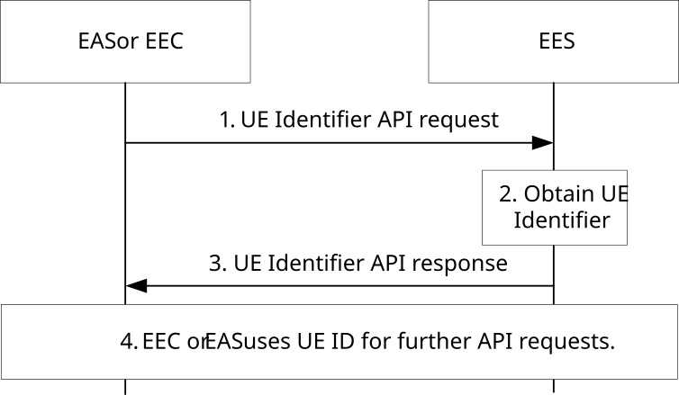

# 8.6.5 UE Identifier API

## 8.6.5.1 General

EES exposes UE Identifier API to the EAS and EEC in order to provide an identifier uniquely identifying a UE. This API is used by an EAS or EEC to obtain the identifier of the UE if the EAS or EEC does not have it (e.g. hasn't already cached). This identifier, called UE ID and defined in clause 7.2.6, is used by the EAS to invoke capability APIs specific to UEs over EDGE-3 and/or EDGE-7 depending on the UE ID type.

The EAS's direct invocation of the UE Identifier API of the EES may result in UE ID not found response (e.g. if the NATed UE's public IPv4 address can't be resolved by the core network). Under such circumstances, the EAS may choose to signal its AC to trigger the UE ID query onto the EEC over EDGE-5 (see clause 8.14.2.6). In turn, the EEC would invoke the EES's UE Identifier API using the UE's CN assigned IP addresses (i.e. IPv4 and/or IPv6) which should result in return of the UE ID to the EEC and from thereon to the AC and the EAS.

NOTE 1: To overcome CN UE's assigned private IP address reuse issue (e.g. UE's private IPv4 reuse by 5GC), the EES would need to be pre-configured with the public IP address range (used by the NAT function over N6) and its associated IP domain.

NOTE 2: EEC retrieval of the UE's IP address from the device is out of scope.

## 8.6.5.2 Procedure

Figure 8.6.5.2-1 illustrates the interactions between the EES and the EAS or EEC.

Pre-conditions:

1\. The EAS or EEC is authorized to discover and to use UE Identifier API provided by the EES.

2\. When the EEC is used to invoke the UE Identifier API with the UE IPv6 address as the input parameter, the UE IPv6 address may or may not be NATed. If NATed however, the IPv6 may not be reused (i.e. assigned to more than one UE simultaneously). If the EEC already has the UE ID (GPSI as per clause 7.2.6), and it needs the Edge UE ID to share with an AC/EAS, this procedure can still be used to retrieve Edge UE ID.

Figure 8.6.5.2-1: UE Identifier API

1\. The EAS or EEC invokes UE Identifier API exposed by the EES. If it is the EAS invoking the API and it recognizes that the UE’s IP address is a public IP address, i.e., the UE is behind a NAT, the Port Number and associated IP address should be included in user information.

2\. The EES uses the received user information in the step 1 (e.g. IP address) and obtains the UE identifier by interacting with NEF as specified in clause 4.15.10 of 3GPP TS 23.502 \[3\]. If it is the EEC invoking the API with only UE IP address, it shall be interpreted by EES that EEC is requesting the UE ID for interaction with EES (hence EES shall use its own AF Identifier towards NEF and consequently the UE ID is EES specific). When the EES needs to interact with the NEF's Nnef_UEId_Get (see TS 23.502 clause 4.15.10 "AF specific UE ID retrieval") as per EAS request, the EES may use either its own AF Identifier or EASID as AF Identifier instead of its own AF Identifier.

3\. The EES provides the UE identifier to the EAS or to EEC (i.e. whichever invoked the API). The UE identifier returned in the response which is referred to as UE ID may be the 3GPP Core Network assigned UE ID (aka AF-specific UE ID; see TS 23.502 clause 4.15.10) or the EES-generated Edge UE ID as defined in clause 7.2.9. If UE ID (GPSI as per clause 7.2.6) is included in the request received from EEC, the EES can provide the Edge UE ID based on the received UE ID and step 2 can be skipped. For EEC requesting the UE ID for interaction with EES, the EES returns its 3GPP Core Network assigned UE ID (aka AF specific UE ID, which is a GPSI in the form of an External ID as per clause 7.2.6) to the EEC.

NOTE 1: User consent aspect on sharing the AF specific UE identifier with particular EAS is described in 3GPP TS 33.558 \[23\].

4\. The EAS uses the UE ID received in step 3 to invoke capability exposure API(s) provided by the EES over EDGE-3 and/or EDGE-7 depending on the UE ID type. The EEC can use the UE ID which is EES specific received in step 3 to invoke API(s) provided by the EES over EDGE-1 reference point.

NOTE 2: UE ID of type CN-assigned can be used over EDGE-1, EDGE-3 and EDGE-7 whereas the UE ID of type EES-generated Edge UE ID can be used over EDGE-3 only.

## 8.6.5.3 Information flows

### 8.6.5.3.1 General

The following information flows are specified for UE Identifier API:

\- UE Identifier request and response.

### 8.6.5.3.2 UE Identifier API request

Table 8.6.5.3.2-1 describes information elements for the UE Identifier API request from the EAS or EEC to the EES.

Table 8.6.5.3.2-1: UE Identifier API request

<table>
<colgroup>
<col style="width: 24%" />
<col style="width: 10%" />
<col style="width: 65%" />
</colgroup>
<thead>
<tr class="header">
<th>Information element</th>
<th>Status</th>
<th>Description</th>
</tr>
</thead>
<tbody>
<tr class="odd">
<td>Requestor Identifier (NOTE 4)</td>
<td>O</td>
<td>Identifier of the requestor (i.e. EASID or EECID).</td>
</tr>
<tr class="even">
<td>User information (NOTE 1) (NOTE 3)</td>
<td>O</td>
<td>Information about the User or UE available in the EAS or EEC, e.g. IP address.</td>
</tr>
<tr class="odd">
<td>
UE ID

(NOTE 2) (NOTE 3)
</td>
<td>O</td>
<td>UE ID in the form of GPSI as per clause 7.2.6.</td>
</tr>
<tr class="even">
<td>
EAS ID list

(NOTE 4)
</td>
<td>O</td>
<td>Identifier of the EAS(s) for which the UE IDs are requested for by EAS or EEC given the User information (e.g. IP address).</td>
</tr>
<tr class="odd">
<td>EAS Provider ID</td>
<td>O</td>
<td>Identifier of the ASP that provides the EAS.</td>
</tr>
<tr class="even">
<td>
Application Port ID

(NOTE 5)
</td>
<td>O</td>
<td>Application Port ID, as defined in 3GPP TS 23.502 [3], associated with the EAS.</td>
</tr>
<tr class="odd">
<td>Security Credentials</td>
<td>M</td>
<td>Security credentials of the EAS or EEC.</td>
</tr>
<tr class="even">
<td colspan="3">
NOTE 1: This IE is Mandatory when EAS invoke the UE ID API. When EEC invokes the API, if available, this IE contains both UE’s private IPv6 address (due to the existence of NAT66) and UE’s private IPv4 address. When EAS invokes the API, it may recognize the UE IP address is a public IP address different from the actual UE IP address (private IP address), i.e., the UE is behind a NAT, and should therefore include the Port Number and associated IP address as part of the User information.

NOTE 2: This IE is used when invoked by the EEC and if the EEC have the UE ID already in a form not desired to be shared with the EAS.

NOTE 3: At least one of them shall be present.

NOTE 4: This IE is Mandatory when EAS invoke the UE ID API.

NOTE 5: This IE may only be present when EAS invoke the UE ID API.
</td>
</tr>
</tbody>
</table>

NOTE: It is outside the scope of this release of this specification how to verify the IP address provided in the request and whether the UE-provided IP address is trusted or not.

### 8.6.5.3.3 UE Identifier API response

Table 8.6.5.3.3-1: UE Identifier API response

| Information element | Status | Description                                                                                     |
|---------------------|--------|-------------------------------------------------------------------------------------------------|
| Successful response | O      | Indicates that the UE identifier request was successful.                                        |
| \> UE ID list       | M      | List of all the UE IDs Identifier uniquely identifying the UE(s).                               |
| \>\> UE ID          | M      | AF-specific UE ID or Edge UE ID                                                                 |
| \>\> UE ID type     | M      | Indication whether the UE ID is CN assigned AF-specific UE ID or Edge UE ID.                    |
| \>\> EAS ID         | O      | It is present if the EAS ID was provided in the request (see EAS ID list in Table 8.6.5.3.2-1). |
| Failure response    | O      | Indicates that the UE identifier request failed.                                                |
| \> Cause            | O      | Indicates the cause of UE identifier request failure                                            |

## 8.6.5.4 APIs

### 8.6.5.4.1 General

Table 8.6.5.4.1-1 illustrates the APIs for UE Identifier.

Table 8.6.5.4.1-1: Eees_UE_Identifier API

<table>
<colgroup>
<col style="width: 40%" />
<col style="width: 21%" />
<col style="width: 20%" />
<col style="width: 18%" />
</colgroup>
<thead>
<tr class="header">
<th>API Name</th>
<th>API Operations</th>
<th>
Operation

Semantics
</th>
<th>Consumer(s)</th>
</tr>
</thead>
<tbody>
<tr class="odd">
<td>Eees_UEIdentifier</td>
<td>Get</td>
<td>Request/Response</td>
<td>EAS, EEC</td>
</tr>
</tbody>
</table>

### 8.6.5.4.2 Eees_UEIdentifier_Get operation

**API operation name:** Eees_UEIdentifier_Get

**Description:** The consumer requests identifier of a UE.

**Inputs:** See clause 8.6.5.3.2.

**Outputs:** See clause 8.6.5.3.3*.*

See clause 8.6.5.2 for details of usage of this operation.
