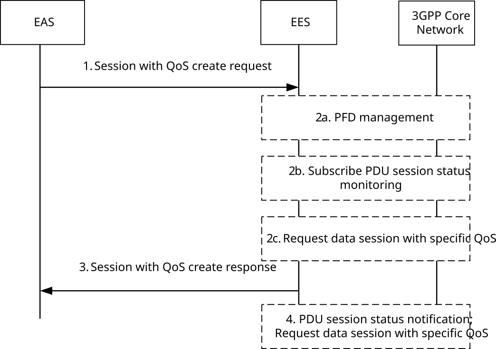
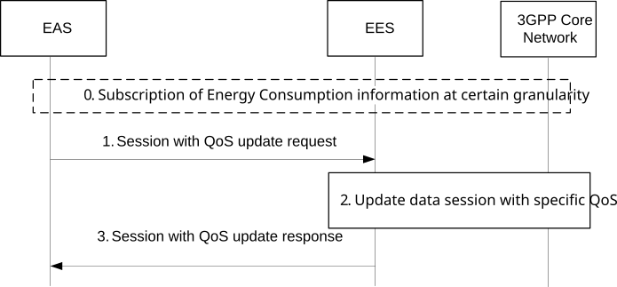
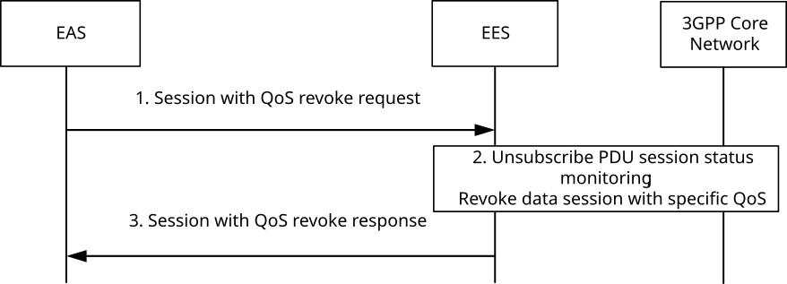
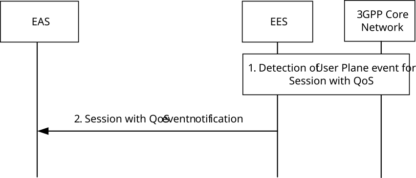

# 8.6.6 Session with QoS API

## 8.6.6.1 General

The EES exposes the Session with QoS API to the EAS in order to support the setup of a data session between AC and EAS with a specific QoS and the modification of the QoS of this data session.

The Session with QoS API exposed by the EES relies on the northbound Policy Authorization Service API exposed by the PCF as specified in 3GPP TS 23.502 \[3\] and 3GPP TS 23.503 \[12\], if the EES is connected to the PCF via the N5 reference point, or on the northbound AF Session with QoS Service API exposed by the NEF as specified in 3GPP TS 23.502 \[3\] and 3GPP TS 23.503 \[12\], if the EES is connected to the PCF via an NEF.

This API supports to apply the required QoS for both ongoing session and future session for a UE or a group of UEs.

The level of support of the Session with QoS API may change due to UE mobility between 5GC and EPC. E.g. QoS monitoring is only applicable in 5GC. If an EES exposes the Session with QoS API to EAS(s) for a UE, the EES monitors such changes and provides the available information to the EAS.

Alternatively to using the API described in the following clauses, the EAS may also act as an AF and directly access the 3GPP Core Network capabilities to request an AF session with QoS (see clause 8.7.2). For any data session between AC and EAS, the EAS shall use only one of these alternatives.

## 8.6.6.2 Procedures

### 8.6.6.2.1 General

### 8.6.6.2.2 Create a session

Figure 8.6.6.2.2-1 illustrates the session with QoS create operation between the EAS and the EES. It is used to request reservation of resources for a data session between AC and EAS with a specific QoS and to subscribe to certain session with QoS event notifications.

Figure 8.6.6.2.2-1: Session with QoS API: create operation

1\. The EAS requests establishment of a data session between the AC and the EAS with a specific QoS (either QoS reference or bandwidth). If the data session can adjust to different QoS parameter combinations, the request may include a list of alternative QoS references in a priority order. The EAS shall include the UE's IP address, UE ID or UE Group ID, the DNN and S-NSSAI used for the data session between AC and EAS. With the same request the EAS subscribes to receive certain session with QoS event notifications (e.g. notifications related to QoS monitoring, usage monitoring for sponsored data connectivity and/or QoS targets can no longer (or can again) be fulfilled).

2\. The EES checks if the EAS is authorized for this operation for the UE. If authorized, then the following services of 3GPP CN may be used by the EES:

a\. the EES invokes the PFD management procedure with the 3GPP Core Network as described in 3GPP TS 23.682 \[17\] and 3GPP TS 23.502 \[3\] with an application id. At least one of the IP flow description, domain description or URI sent by the EAS is used for requesting PFD management service. Further the EES provides the same application id for requesting data session with specific QoS in step 2c or step 4.

NOTE 1: PFD management can be optionally supported in MNO. If EES cannot invoke step 2a, it responds EAS with appropriate error.

NOTE 2: The EES can map the EASID into the application id that is used to invoke the PFD management procedure.

b\. the EES invokes the Event Monitoring service for PDU session status with the 3GPP Core Network, as described in 3GPP TS 23.502 \[3\].

c\. the EES invokes the Policy Authorization Create service or the AF Session with QoS service with the 3GPP Core Network (PCF or NEF, respectively) as described in 3GPP TS 23.501 \[2\] and 3GPP TS 23.502 \[3\], providing the specific QoS (QoS reference or bandwidth) to the PCF as described in 3GPP TS 23.503 \[12\], clause 6.1.3.22. Additionally, the EES may subscribe to notifications of resource allocation outcome and to other events described in clause 6.1.3.18 of 3GPP TS 23.503 \[12\], e.g. notifications of when the QoS targets can no longer (or can again) be fulfilled.

The usage of step 2b and step 2c is as follows:

\- If the request is for a group of UEs identified by the UE Group ID or for a single UE identified by the UE ID, then EES executes step 2b. If UE (single UE or UE group member) already has ongoing PDU session, then UE IP address is retrieved in step 2b. Further the EES executes step 2c; otherwise the EES waits for further notification for PDU session status in step 4.

\- If the request is for a single UE identified by the IP address, then EES executes step 2c.

3\. If the operation in step 2 is successful, the EES responds with a Context ID and a Result. The Context ID is to be used by the EAS for further requests (e.g. session with QoS update requests) pertaining to the same UE. If the EAS is not authorized or any other failure happens during the operation, the EES provides a rejection response with cause information.

4\. When the EES receives the corresponding UE IP address for the single UE or UE group member from the PDU session status notification sent by the 3GPP Core Network, the EES requests data session with specific QoS as described in step 2c.

NOTE 3: The EES will report the resource allocation outcome, e.g. the successful allocation of the Service Data Flow(s) related to the data session, with a separate session with QoS notify operation (see TS 23.503 \[12\], clause 6.1.3.18).

### 8.6.6.2.3 Update a session

Figure 8.6.6.2.3-1 illustrates the session with QoS update request operation between the EAS and the EES. It is used to request a modification of the QoS of the data session between AC and EAS.

Figure 8.6.6.2.3-1: Session with QoS API: update operation

0\. The EAS act as AF to subscribe and receive the energy consumption information at certain granularity (e.g.: target UE or QoS flow) from 5GC as described in clause 4.29 of 3GPP TS 23.502 \[3\], OAM as defined in 3GPP TS 28.533 \[33\] or ESE server. And if the energy consumption information indicates the existence of renewable energy, the EAS may act as AF to request to improve the QoS to have higher user experience.

1\. The EAS requests a modification of the QoS of the data session between the AC and the EAS, e.g. by including a different QoS reference or different bandwidth value. The EAS shall include the Context ID.

> The EAS may also request a modification of the event monitoring by subscribing to new events and updating or removing subscriptions to existing events.
>
> The EAS may consider to request an update of the QoS of the ongoing data session between the AC and the EAS according to the energy related information received in step 0. The different QoS reference or different bandwidth value included in request should reflect the updated QoS parameters or higher user experience compared to the former QoS reference or bandwidth, also considering subscribed QoS values, such as:

\- Increase the flow bitrate (e.g: Maximum Flow Bit Rate or Guaranteed Flow Bit Rate) of both UL/DL to improve the data rate.

\- Lower down the Requested Packet Error Rate to further reduce the possibility of packet loss.

2\. The EES checks if there is a context for the Context ID available and whether the EAS is authorized for this operation. If yes and the UE IP address is known by the EES, the EES invokes the Policy Authorization Update service or AF Session with QoS Update service with the 3GPP Core Network (PCF or NEF, respectively) as described in 3GPP TS 23.501 \[2\] and 3GPP TS 23.502 \[3\], providing the updated information to the PCF or NEF, respectively. The EES may subscribe to additional events or unsubscribe to certain events, if necessary.

3\. If the operation is successful, the EES responds with a Context ID and a Result. If the EAS is not authorized or any other failure happens during the operation, the EES provides a rejection response with cause information.

NOTE: The EES will report the resource allocation outcome, e.g. the successful modification of the Service Data Flow(s) related to the data session, with a separate session with QoS notify operation (see 3GPP TS 23.503 \[12\], clause 6.1.3.18).

### 8.6.6.2.4 Revoke a session

Figure 8.6.6.2.4-1 illustrates the session with QoS revoke operation between the EAS and the EES. It is used to revoke the data session between AC and EAS with a specific QoS and to unsubscribe to the related session with QoS event notifications.

Figure 8.6.6.2.4-1: Session with QoS API: revoke operation

1\. The EAS requests a revoke of the data session with QoS between the AC and the EAS. The EAS shall include the Context ID.

2\. The EES checks if there is a context for the Context ID available and whether the EAS is authorized for this operation. If yes, then the EES unsubscribes from the PDU session status monitoring (if applicable) and invokes the Policy Authorization Delete service or AF Session with QoS Revoke service with the 3GPP Core Network (PCF or NEF, respectively) as described in 3GPP TS 23.501 \[2\] and 3GPP TS 23.502 \[3\]. This deletes the application session context at the PCF or NEF and removes the subscription to any session with QoS event notifications.

3\. If the operation is successful, the EES responds with a Context ID and a Result. If the EAS is not authorized or any other failure happens during the operation, the EES provides a rejection response with cause information.

### 8.6.6.2.5 Notify

Figure 8.6.6.2.5-1 illustrates the notify operation between the EES and the EAS for session with QoS event notifications.

Figure 8.6.6.2.5-1: Session with QoS API: notify operation

1\. The EES detects a user plane event associated with the established session (i.e. it receives a Policy Authorization Notify operation from the PCF or an AF Session with QoS Notify operation from the NEF as described in 3GPP TS 23.501 \[2\] and 3GPP TS 23.502 \[3\]). The EES determines to notify the session with QoS event notification information (e.g., resource allocation outcome or information that the QoS targets can no longer (or can again) be fulfilled) to the EASs which have subscribed to the session with QoS event notification.

2\. The EES sends a session with QoS event notification to the EAS. The EES includes the session with QoS event notification information of the UE.

## 8.6.6.3 Information flows

### 8.6.6.3.1 General

The following information flows are specified for Session with QoS API:

\- Session with QoS create request and response;

\- Session with QoS update request and response;

\- Session with QoS revoke request and response; and

\- Session with QoS event notification.

### 8.6.6.3.2 Session with QoS create request

Table 8.6.6.3.2-1 describes the information elements for a Session with QoS create request from the EAS to the EES.

Table 8.6.6.3.2-1: Session with QoS create request

<table>
<colgroup>
<col style="width: 33%" />
<col style="width: 16%" />
<col style="width: 50%" />
</colgroup>
<tbody>
<tr class="odd">
<td>Information element</td>
<td>Status</td>
<td>Description</td>
</tr>
<tr class="even">
<td>EASID</td>
<td>M</td>
<td>The identifier of the EAS</td>
</tr>
<tr class="odd">
<td>Security credentials</td>
<td>M</td>
<td>Security credentials of the EAS</td>
</tr>
<tr class="even">
<td>UE IP address (NOTE 1)</td>
<td>O</td>
<td>The UE IP address.</td>
</tr>
<tr class="odd">
<td>UE ID (NOTE 1)</td>
<td>O</td>
<td>The identifier of the UE (i.e. GPSI)</td>
</tr>
<tr class="even">
<td>UE Group ID (NOTE 1)</td>
<td>O</td>
<td>Identifies a group of UEs as defined in clause 7.2.7</td>
</tr>
<tr class="odd">
<td>IP flow description (NOTE 4)</td>
<td>O</td>
<td>The IP flow description for the application traffic.</td>
</tr>
<tr class="even">
<td>Domain description (NOTE 4)</td>
<td>O</td>
<td>The domain description including domain name, applicable protocol and matching criteria (e.g. TLS SNI).</td>
</tr>
<tr class="odd">
<td>URI (NOTE 4)</td>
<td>O</td>
<td>Uniform resource identifier. It represents the application traffic URI.</td>
</tr>
<tr class="even">
<td>Requested QoS reference (NOTE 2)</td>
<td>O</td>
<td>Refers to pre-defined QoS information for the data session between AC and EAS (NOTE 3).</td>
</tr>
<tr class="odd">
<td>List of alternative QoS references</td>
<td>O</td>
<td>A list of alternative QoS references, referring to pre-defined QoS information for the data session between AC and EAS and containing one or more QoS reference parameters in a prioritized order (NOTE 3).</td>
</tr>
<tr class="even">
<td>Event list</td>
<td>O</td>
<td>A list of associated events to which the EAS subscribes (see 3GPP TS 23.503 [12], clause 6.1.3.18).</td>
</tr>
<tr class="odd">
<td>&gt; Event specific data</td>
<td>O</td>
<td>
For usage monitoring: the sponsoring information (sponsor id, ASP id).

For QoS monitoring: Target of monitoring (DL, UL or roundtrip packet delay).
</td>
</tr>
<tr class="even">
<td>&gt; Frequency of reporting</td>
<td>O</td>
<td>The reporting frequency (e.g. event triggered) and additional related data (e.g. threshold, minimum waiting time) as described in clause 6.1.3.21 of 3GPP TS 23.503 [12], applicable for QoS monitoring event.</td>
</tr>
<tr class="odd">
<td>Notification Target Address</td>
<td>M</td>
<td>The Notification Target Address (e.g. URL) where the notifications destined for the EAS should be sent to.</td>
</tr>
<tr class="even">
<td>DNN</td>
<td>O</td>
<td>DNN for the data session between AC and EAS</td>
</tr>
<tr class="odd">
<td>S-NSSAI</td>
<td>O</td>
<td>S-NSSAI for the data session between AC and EAS</td>
</tr>
<tr class="even">
<td>Requested bandwidth (NOTE 2)</td>
<td>O</td>
<td>Bandwidth requested for the data session between AC and EAS</td>
</tr>
<tr class="odd">
<td colspan="3">
NOTE 1: Only one of UE IP address, UE ID or UE Group ID shall be provided.

NOTE 2: Only one of requested QoS reference or requested bandwidth shall be provided.

NOTE 3: The pre-defined QoS information may be configured in the EES or in the 3GPP Core Network (see 3GPP TS 23.503 [12], clause 6.1.3.22).

NOTE 4: At least one of these information elements shall be present.
</td>
</tr>
</tbody>
</table>

### 8.6.6.3.3 Session with QoS create response

Table 8.6.6.3.3-1 describes the information elements for a Session with QoS create response from the EES to the EAS.

Table 8.6.6.3.3-1: Session with QoS create response

|                     |        |                                                                                       |
|---------------------|--------|---------------------------------------------------------------------------------------|
| Information element | Status | Description                                                                           |
| Successful response | O      | Indicates that the Session with QoS create request was successful.                    |
| \> Context ID       | M      | Context identifier corresponding to the information stored for the request in the EES |
| Failure response    | O      | Indicates that the Session with QoS create request failed.                            |
| \> Cause            | O      | Indicates the cause of Session with QoS create request failure                        |

### 8.6.6.3.4 Session with QoS update request

Table 8.6.6.3.4-1 describes the information elements for a Session with QoS update request from the EAS to the EES.

Table 8.6.6.3.4-1: Session with QoS update request

<table>
<colgroup>
<col style="width: 33%" />
<col style="width: 16%" />
<col style="width: 50%" />
</colgroup>
<tbody>
<tr class="odd">
<td>Information element</td>
<td>Status</td>
<td>Description</td>
</tr>
<tr class="even">
<td>Security credentials</td>
<td>M</td>
<td>Security credentials of the EAS</td>
</tr>
<tr class="odd">
<td>Context ID</td>
<td>M</td>
<td>Context identifier corresponding to the information stored for the request in the EES.</td>
</tr>
<tr class="even">
<td>Requested QoS reference (NOTE 1)</td>
<td>O</td>
<td>Refers to pre-defined QoS information for the data session between AC and EAS (NOTE 2).</td>
</tr>
<tr class="odd">
<td>List of alternative QoS references</td>
<td>O</td>
<td>A list of alternative QoS references, referring to pre-defined QoS information for the data session between AC and EAS and containing one or more QoS reference parameters in a prioritized order (NOTE 2).</td>
</tr>
<tr class="even">
<td>Event list</td>
<td>O</td>
<td>A list of associated events to which the EAS subscribes (see 3GPP TS 23.503 [12], clause 6.1.3.18).</td>
</tr>
<tr class="odd">
<td>&gt; Event specific data</td>
<td>O</td>
<td>
For usage monitoring: the sponsoring information (sponsor id, ASP id).

For QoS monitoring: Target of monitoring (DL, UL or roundtrip packet delay).
</td>
</tr>
<tr class="even">
<td>&gt; Frequency of reporting</td>
<td>O</td>
<td>The reporting frequency (e.g. event triggered) and additional related data (e.g. threshold, minimum waiting time) as described in clause 6.1.3.21 of 3GPP TS 23.503 [12], applicable for QoS monitoring event.</td>
</tr>
<tr class="odd">
<td>Requested bandwidth (NOTE 1)</td>
<td>O</td>
<td>Bandwidth requested for the data session between AC and EAS</td>
</tr>
<tr class="even">
<td colspan="3">
NOTE 1: Only one of requested QoS reference or requested bandwidth shall be provided.

NOTE 2: The pre-defined QoS information may be configured in the EES or in the 3GPP Core Network (see 3GPP TS 23.503 [12], clause 6.1.3.22).
</td>
</tr>
</tbody>
</table>

### 8.6.6.3.5 Session with QoS update response

Table 8.6.6.3.5-1 describes the information elements for a Session with QoS update response from the EES to the EAS.

Table 8.6.6.3.5-1: Session with QoS update response

|                     |        |                                                                    |
|---------------------|--------|--------------------------------------------------------------------|
| Information element | Status | Description                                                        |
| Successful response | O      | Indicates that the Session with QoS update request was successful. |
| Failure response    | O      | Indicates that the Session with QoS update request failed.         |
| \> Cause            | O      | Indicates the cause of Session with QoS update request failure     |

### 8.6.6.3.6 Session with QoS revoke request

Table 8.6.6.3.6-1 describes the information elements for a Session with QoS revoke request from the EAS to the EES.

Table 8.6.6.3.6-1: Session with QoS event API revoke request

|                      |        |                                                                                       |
|----------------------|--------|---------------------------------------------------------------------------------------|
| Information element  | Status | Description                                                                           |
| Security credentials | M      | Security credentials of the EAS                                                       |
| Context ID           | M      | Context identifier corresponding to the information stored for the request in the EES |

### 8.6.6.3.7 Session with QoS revoke response

Table 8.6.6.3.7-1 describes the information elements for a Session with QoS revoke response from the EES to the EAS.

Table 8.6.6.3.7-1: Session with QoS revoke response

|                     |        |                                                                    |
|---------------------|--------|--------------------------------------------------------------------|
| Information element | Status | Description                                                        |
| Successful response | O      | Indicates that the Session with QoS revoke request was successful. |
| Failure response    | O      | Indicates that the Session with QoS revoke request failed.         |
| \> Cause            | O      | Indicates the cause of Session with QoS revoke request failure     |

### 8.6.6.3.8 Session with QoS event notification

Table 8.6.6.3.8-1 describes the information elements for a Session with QoS event notification from the EES to the EAS.

Table 8.6.6.3.8-1: Session with QoS event notification

<table>
<colgroup>
<col style="width: 33%" />
<col style="width: 16%" />
<col style="width: 50%" />
</colgroup>
<tbody>
<tr class="odd">
<td>Information element</td>
<td>Status</td>
<td>Description</td>
</tr>
<tr class="even">
<td>Context ID</td>
<td>M</td>
<td>Context identifier corresponding to the information stored in the EES during the initial session with QoS create request.</td>
</tr>
<tr class="odd">
<td>Event report (NOTE)</td>
<td>M</td>
<td>Event reporting information as specified in clause 6.1.3.18 of 3GPP TS 23.503 [12].</td>
</tr>
<tr class="even">
<td colspan="3">
NOTE: Only the following events are applicable:

- Reporting Usage for Sponsored Data Connectivity

- Service Data Flow deactivation

- Resource allocation outcome

- QoS targets can no longer (or can again) be fulfilled

- QoS Monitoring parameters
</td>
</tr>
</tbody>
</table>

## 8.6.6.4 APIs

### 8.6.6.4.1 General

Table 8.6.6.4.1-1 illustrates the API for Session with QoS.

Table 8.6.6.4.1-1: Eees_SessionWithQoS API

<table>
<colgroup>
<col style="width: 40%" />
<col style="width: 21%" />
<col style="width: 20%" />
<col style="width: 18%" />
</colgroup>
<thead>
<tr class="header">
<th>API Name</th>
<th>API Operations</th>
<th>
Operation

Semantics
</th>
<th>Consumer(s)</th>
</tr>
</thead>
<tbody>
<tr class="odd">
<td rowspan="4">Eees_SessionWithQoS</td>
<td>Create</td>
<td rowspan="3">Request/Response</td>
<td rowspan="3">EAS</td>
</tr>
<tr class="even">
<td>Update</td>
</tr>
<tr class="odd">
<td>Revoke</td>
</tr>
<tr class="even">
<td>Notify</td>
<td>Subscribe/Notify (NOTE)</td>
<td>EAS</td>
</tr>
<tr class="odd">
<td colspan="4">NOTE: The Subscribe operation is embedded in the Request operation of the Create and Update API operation.</td>
</tr>
</tbody>
</table>

### 8.6.6.4.2 Eees_SessionWithQoS_Create operation

**API operation name:** Eees_SessionWithQoS_Create

**Description:** The consumer requests a data session with the UE with a specific QoS and may also subscribe to certain event notifications related to the user plane traffic.

**Inputs:** See clause 8.6.6.3.2.

**Outputs:** See clause 8.6.6.3.3*.*

See clause 8.6.6.2.2 for details of usage of this operation.

### 8.6.6.4.3 Eees_SessionWithQoS_Update operation

**API operation name:** Eees_SessionWithQoS_Update

**Description:** The consumer requests a modification of the QoS of the data session with the UE and may also update event notifications related to the user plane traffic.

**Inputs:** See clause 8.6.6.3.4.

**Outputs:** See clause 8.6.6.3.5*.*

See clause 8.6.6.2.3 for details of usage of this operation.

### 8.6.6.4.4 Eees_SessionWithQoS_Revoke operation

**API operation name:** Eees_SessionWithQoS_Revoke

**Description:** The consumer requests a revoke of the data session with QoS with the UE and unsubscribes to all related event notifications.

**Inputs:** See clause 8.6.6.3.6.

**Outputs:** See clause 8.6.6.3.7*.*

See clause 8.6.6.2.4 for details of usage of this operation.

### 8.6.6.4.5 Eees_SessionWithQoS_Notify operation

**API operation name:** Eees_SessionWithQoS_Notify

**Description:** The consumer is notified by the EES of an event related to the user plane traffic.

**Inputs:** See clause 8.6.6.3.8.

**Outputs:** None*.*

See clause 8.6.6.2.5 for details of usage of this operation.
