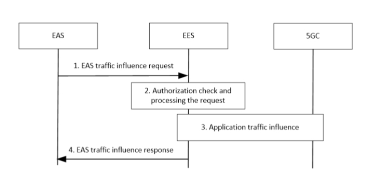
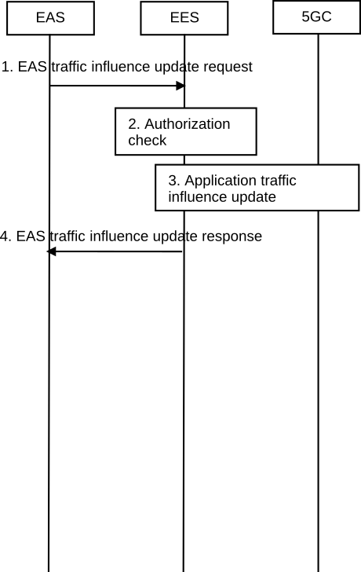
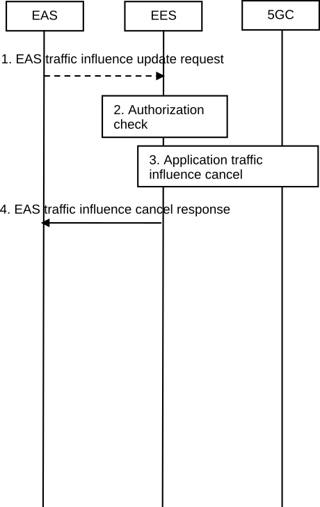

# 8.6.7 Application traffic influence trigger from EAS

## 8.6.7.1 General

An EAS can explicitly request EES to influence the EAS traffic from UE(s) with necessary information. Then the EES can trigger the AF request to influence traffic routing towards the 3GPP CN for one or more UE(s) accessing the EAS.

## 8.6.7.2 Procedure

### 8.6.7.2.1 Procedure of application traffic influence trigger from EAS

Figure 8.6.7.2.1-1 illustrates the procedure of application traffic influence trigger from EAS.

Figure 8.6.7.2.1-1: Application traffic influence trigger from EAS

1\. The EAS sends an EAS traffic influence request.

2\. The EES performs an authorization check to verify whether the EAS has the authorization to request application traffic influence.

3\. Upon successful authorization, the EES includes transaction ID, target DNAI, traffic descriptor information and N6 routing information at target DNAI in the Nnef_TrafficInfluence_Create Request to the NEF, or Npcf_PolicyAuthorization_Create Request to the PCF, to influence the traffic for EAS as described in 3GPP TS 23.501 \[2\], clause 5.6.7.1.

NOTE: If EAS Deployment Information has been made available to the 3GPP core network via the Nnef_EASDeployment service as specified in 3GPP TS 23.502 \[3\], including N6 delay measurement assistance information, the EES provides “Indication of considering N6 delay” in the request to influence the traffic for EAS.

4\. The EES sends the EAS traffic influence response.

### 8.6.7.2.2 Procedure of application traffic influence update trigger from EAS

Figure 8.6.7.2.2-1 illustrates the procedure of application traffic influence update trigger from EAS.

Figure 8.6.7.2.2-1: Application traffic influence update trigger from EAS

1\. The EAS sends an EAS traffic influence update request providing the corresponding transaction ID, and updated target UE Identifier(s).

2\. The EES performs an authorization check to verify whether the EAS has the authorization to request application traffic influence update.

3\. Upon successful authorization, the EES do the update accordingly. For those UE(s) to be deleted, the EES invokes the Nnef_TrafficInfluence_Delete or Npcf_PolicyAuthorization_Delete Request to delete the original request to delete the traffic influence for EAS. For those UE(s) to be added, the EES invokes the Nnef_TrafficInfluence_Create or Npcf_PolicyAuthorization_Create.

4\. The EES sends the EAS traffic influence update response.

### 8.6.7.2.3 Procedure of application traffic influence cancellation trigger from EAS

Figure 8.6.7.2.3-1 illustrates the procedure of application traffic influence cancellation trigger from EAS.

Figure 8.6.7.2.3-1: Application traffic influence cancellation trigger from EAS

1\. The EAS sends an EAS traffic influence cancellation request providing the corresponding transaction ID.

2\. The EES performs an authorization check to verify whether the EAS has the authorization to request application traffic influence cancellation.

3\. Upon successful authorization, the EES includes transaction ID in the Nnef_TrafficInfluence_Delete Request to the NEF, or Npcf_PolicyAuthorization_Delete Request to the PCF, to delete the traffic influence for EAS as described in 3GPP TS 23.501, clause 5.6.7.1.

4\. The EES sends the EAS traffic influence cancellation response.

## 8.6.7.3 Information flows

### 8.6.7.3.1 General

The following information flows are specified for application traffic influence trigger from EAS:

\- Application traffic influence trigger from EAS request and response.

\- Application traffic influence update trigger from EAS request and response.

\- Application traffic influence cancellation trigger from EAS request and response.

### 8.6.7.3.2 Application traffic influence trigger from EAS request

Table 8.6.7.3.2-1: application traffic influence trigger from EAS request

| Information element     | Status | Description                                                                                    |
|-------------------------|--------|------------------------------------------------------------------------------------------------|
| EASID                   | M      | Identifier of the EAS                                                                          |
| Security credentials    | M      | Security credentials resulting from a successful authorization for the edge computing service. |
| Target UE Identifier(s) | M      | Indicates the target UE(s) or any UE.                                                          |

### 8.6.7.3.3 Application traffic influence trigger from EAS response

Table 8.6.7.3.3-1: application traffic influence trigger from EAS response

| Information element | Status | Description                                           |
|---------------------|--------|-------------------------------------------------------|
| Successful response | O      | Indicates that the traffic influence was successful.  |
| \>Transaction ID    | M      | Identifier of the traffic influence transaction used. |
| Failure response    | O      | Indicates that the traffic influence has failed.      |
| \> Cause            | O      | Indicates the cause of failure                        |

### 8.6.7.3.4 Application traffic influence update trigger from EAS request

Table 8.6.7.3.4-1: application traffic influence update trigger from EAS request

| Information element             | Status | Description                                                                                    |
|---------------------------------|--------|------------------------------------------------------------------------------------------------|
| EASID                           | M      | Identifier of the EAS                                                                          |
| Security credentials            | M      | Security credentials resulting from a successful authorization for the edge computing service. |
| Updated target UE Identifier(s) | M      | Indicates the updated target UE(s) or any UE.                                                  |
| Transaction ID                  | M      | Indicates the target transaction that is to be updated.                                        |

### 8.6.7.3.5 Application traffic influence update trigger from EAS response

Table 8.6.7.3.5-1: application traffic influence update trigger from EAS response

| Information element | Status | Description                                          |
|---------------------|--------|------------------------------------------------------|
| Successful response | O      | Indicates that the traffic influence was successful. |
| Failure response    | O      | Indicates that the traffic influence has failed.     |
| \> Cause            | O      | Indicates the cause of failure                       |

### 8.6.7.3.6 Application traffic influence cancellation trigger from EAS request

Table 8.6.7.3.6-1: application traffic influence cancellation trigger from EAS request

| Information element  | Status | Description                                                                                    |
|----------------------|--------|------------------------------------------------------------------------------------------------|
| EASID                | M      | Identifier of the EAS                                                                          |
| Security credentials | M      | Security credentials resulting from a successful authorization for the edge computing service. |
| Transaction ID       | M      | Indicates the target transaction that is to be updated.                                        |

### 8.6.7.3.7 Application traffic influence cancellation trigger from EAS response

Table 8.6.7.3.7-1: application traffic influence cancellation trigger from EAS response

| Information element | Status | Description                                                  |
|---------------------|--------|--------------------------------------------------------------|
| Successful response | O      | Indicates that the traffic influence request was successful. |
| Failure response    | O      | Indicates that the traffic influence request has failed.     |
| \> Cause            | O      | Indicates the cause of failure                               |

## 8.6.7.4 APIs

### 8.6.7.4.1 General

Table 8.6.7.4.1-1 illustrates the APIs for application traffic influence trigger from EAS.

Table 8.6.7.4.1-1: Eees_TrafficInfluenceEAS API

<table>
<colgroup>
<col style="width: 40%" />
<col style="width: 21%" />
<col style="width: 20%" />
<col style="width: 18%" />
</colgroup>
<thead>
<tr class="header">
<th>API Name</th>
<th>API Operations</th>
<th>
Operation

Semantics
</th>
<th>Consumer(s)</th>
</tr>
</thead>
<tbody>
<tr class="odd">
<td rowspan="3">Eees_TrafficInfluenceEAS</td>
<td>Create</td>
<td>Request/Response</td>
<td>EAS</td>
</tr>
<tr class="even">
<td>Update</td>
<td>Request/Response</td>
<td>EAS</td>
</tr>
<tr class="odd">
<td>Cancellation</td>
<td>Request/Response</td>
<td>EAS</td>
</tr>
</tbody>
</table>

### 8.6.7.4.2 Eees_TrafficInfluenceEAS_Create operation

**API operation name:** Eees_TrafficInfluenceEAS_Create

**Description:** The consumer requests traffic influence for EAS via EES.

**Inputs:** See clause 8.6.7.3.2.

**Outputs:** See clause 8.6.7.3.3*.*

See clause 8.6.7.2.1 for details of usage of this operation.

### 8.6.7.4.3 Eees_TrafficInfluenceEAS_Update operation

**API operation name:** Eees_TrafficInfluenceEAS_Update

**Description:** The consumer requests to update traffic influence for EAS via EES.

**Inputs:** See clause 8.6.7.3.4.

**Outputs:** See clause 8.6.7.3.5*.*

See clause 8.6.7.2.2 for details of usage of this operation.

### 8.6.7.4.4 Eees_TrafficInfluenceEAS_Cancellation operation

**API operation name:** Eees_TrafficInfluenceEAS_Cancellation

**Description:** The consumer requests to cancel traffic influence for EAS via EES.

**Inputs:** See clause 8.6.7.3.6.

**Outputs:** See clause 8.6.7.3.7*.*

See clause 8.6.7.2.3 for details of usage of this operation.
