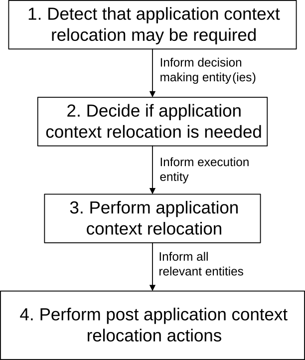

# 8.8.1 General

## 8.8.1.1 High level overview

When a UE moves to a new location, different EASs can be more suitable for serving the ACs in the UE. Such transitions can result from a non-mobility event of UE also, requiring support from the enabling layer to maintain the continuity of the service.

This clause describes the features that support service continuity for ACs in the UE to minimize service interruption while replacing the S-EAS, with a T-EAS.

Generally, one AC on the UE has one associated application context at the S-EAS. To support service continuity, this application context is transferred from the S-EAS to a T-EAS.

The capabilities for supporting service continuity provided at the Edge Enabler Layer may consider various application layer scenarios in which there may be involvement of AC and one or more EAS(s).

Following intra-EDN, inter-EDN, between EDN and Cloud, and LADN (overlapping LADN service areas) related scenarios are supported for service continuity:

\- UE mobility, including predictive or expected UE mobility;

\- Overload situations in S-EAS or EDN; and

\- Maintenance aspects such as graceful shutdown of an EAS.

NOTE 1: The scenarios which require ACR for service continuity, cannot use non-overlapping LADNs.

NOTE 2: Overload situations in S-EAS or EDN can be captured based on edge load analytics via utilizing SEAL ADAE capability (see clauses 6.7 and 8.8 of TS 23.436 \[28\]), which provide statistics or predictions on the expected load of S-EAS or EDN.

NOTE 3: The ACR between EDN and the Cloud may be triggered if no suitable target EAS is found.

To support the need of ACR, following entity roles are identified:

\- detection entity, detecting or predicting the need of ACR;

\- decision-making entity, deciding that the ACR is required; and

\- execution entity, executing ACR.

A detection entity detects the need, or potential need, for ACR by monitoring various aspects, such as UE's location or predicted/expected UE location or receiving notification of user plane path change, and indicates to the decision-making entity to determine if the ACR is required. The EEC, EES and EAS can potentially perform the detection role.

A decision-making entity determines that ACR is required and instructs the execution entity to perform ACR. The decision-making entity makes a ACR decision to start the ACR execution. In different scenarios of ACR in 8.8.2, the EEC, EAS, EES can potentially perform the decision role respectively.

An execution entity performs ACR as and when instructed by the decision-making entity. ACR execution starts with T-EAS discovery, which can be triggered by EEC, EAS and EES.

NOTE 3: After a decision that another EAS is to serve the UE, the S-EAS can decide if the existing Application Context is transferred to the new EAS.

The EAS may utilize the following capabilities provided by the EES for supporting service continuity at the application layer:

\- Subscribe to service continuity related events and receive corresponding notifications;

\- Discover the T-EAS; and

\- ACR from a S-EAS to a T-EAS.

The EES can utilize the following capabilities provided by the ECS for supporting service continuity at the application layer:

\- Retrieve the T-EES.

After successful ACR:

\- The EES is informed of the completion by the EAS; and

\- The EEC is informed of the completion by the EES.

In general, a number of steps are required in order to perform ACR. The potential roles of an edge enablement layer in ACR include:

\- providing detection events;

\- selecting the T-EAS(s); and

\- supporting the transfer of the application context from the S-EAS(s) to the T-EAS(s).

If the UE is connected to the 5GC, the EES/EAS acting as AF may utilize AF traffic influence functionality from the 3GPP CN as specified in 3GPP TS 23.502 \[3\].

A high level overview of ACR is illustrated in Figure 8.8.1.1-1.

Figure 8.8.1.1-1: High level overview of ACR

ACR can be performed for service continuity planning, which means that the first three steps in Figure 8.8.1.1-1 detection, decision and execution, are performed as defined in clause 8.8.1.2, e.g. when the UE is predicted to move outside the service area of the serving EAS. In such a case the T-EAS is expected to provide service to the UE when it moves to the expected location.

EES can handle multiple ACR requests simultaneously. When there are multiple simultaneous ACR, the ACR shall be uniquely identified by ACID, EEC ID (or UE ID), S-EAS endpoint and T-EAS endpoint.

## 8.8.1.1A UE movement trigger for ACR

UE movement is one possible trigger for ACR (others are user plane path change, load balancing). The EEC, EAS, and EES detect UE mobility related to ACR as follows.

The EEC may detect the need, or potential need, for ACR by checking whether the UE has moved or is predicted to move outside the service area (see clause 7.3.3) of its S-EAS. The service area can be provided to the EEC by either the ECS during Service Provisioning or EES during EAS Discovery. For the PDU Session of SSC mode 3, if the UE receives PDU Session Modification Command as specified in clause 4.3.5.2 of TS 23.502 \[3\], the EEC may determine that the ACR is required. For IPv6 multi-homed PDU Session of SSC mode 3, the EEC may determine that ACR is required if the UE is notified of the existence and availability of a new IPv6 prefix as specified in clause 4.3.5.3 of 3GPP TS 23.502 \[3\]. The EEC may determine if the ACR is required by detecting that the e2e tunnel server used for application traffic is changed.

NOTE: For IPv6 multi-homed PDU Session of SSC mode 3, the EEC can be aware of the notification about the IPv6 prefix configuration due to change of PSA UPF based on the UE implementation.

The EAS may detect the need, or potential need, for ACR by subscribing to the "out of service area" ACR management event described in clause 8.6.3 or using the UE location API described in clause 8.6.2.

The EES may detect the need, or potential need, for ACR by subscribing to the monitoring event UE mobility (TS 23.502 \[3\] clause 4.15.3) e.g. for area of interest equivalent to the service area of the subscribing EAS. For this purpose, the EES utilizes the service area of the EAS in the EAS profile if the EAS Geographical Service Area and/or EAS Topological Service Area is provided when the EAS registers with the EES.

## 8.8.1.2 ACR with service continuity planning

Service continuity planning is an Edge Enabler Layer value-add feature of providing support for seamless service continuity, when information about planned, projected, or anticipated behaviour is available at EESs or provided by EECs.

To implement this functionality an EES may utilize:

\- information provided by the EEC e.g., AC Schedule, Expected AC Geographical Service Area, Expected AC Service KPIs, Preferred ECSP list; and

\- 3GPP core network capabilities utilized by EES as described in clause 8.10.3.

In service continuity planning, the Application Context may be duplicated and sent from the S‑EAS to the T‑EAS before the UE moves to the expected location. In this case, the Application Contexts in S‑EAS are transferred to the T EAS when the Application Context is updated until the AC connects to the T-EAS.

NOTE 1: The information elements of the Application Context and how the Application Context is transferred from the S‑EAS to the T‑EAS is up to implementation of the application.

NOTE 2: In the case of EELManagedACR, the Application Context transmission is accomplished using the same mechanism as when transferring the context from the S‑EES to the T‑EES.

For additional details on service continuity planning for ACR, see clauses 8.8.2.2, 8.8.2.3, 8.8.2.4, 8.8.2.5 and 8.8.2.6.

## 8.8.1.3 Unused contexts handling during ACR including service continuity planning

The interval between ACT initiation and ACR status update message from EAS to EES (i.e. taking the context into use) can be significant (e.g. in the predicted case). During this interval, the following events are possible:

a\) The UE remains communicating with the S-EAS, e.g. the UE does not move to the service area of the T-EAS; or

b\) The UE moves to a service area served by a different T-EAS (other than the T-EAS towards which the ACR was initiated).

For the ACRs initiated by the EEC, in case of events a) and b) the EEC should re-send an ACR request with the information of the current ACR and the updated information as described in clause 8.8.3.4 and defined in clause 8.8.4.4. For a) if the action is initiation the EEC sets T-EAS endpoint under ACR initiation action to indicate the S-EAS. For b) if the action is initiation the UE sets T-EAS endpoint under ACR initiation action to the new T-EAS.

NOTE: Timeouts if required for discarding unused contexts for ACR scenarios can be specified in stage 3.

## 8.8.1.4 Modification of ACR parameters during ACR for service continuity planning

During an ACR for service continuity planning, the circumstances can change which results in the changes in the parameters related to ACR. In such cases modification of the ACR will be required. For example, the EEC or EES can monitor the UE’s mobility and obtain updates in the predicted location or other ACR parameters e.g. prediction expiration time.

For ACRs initiated by the S-EES, the S-EES may detect a change of the expected UE behaviour. In particular, S-EES acting as AF, may receive a UE location report or a monitoring event report from 5GC (assuming that S-EES has subscribed to consume 5GC services like LCS or NEF monitoring events related to UE actual location, or UE mobility analytics from NWDAF). In case of a change in ACR parameters, e.g. prediction expiration time, the S-EES performs ACR parameter information procedure as described in clause 8.8.3.9 to send the updated parameters to T-EES and T-EAS

For the ACRs initiated by the EEC, the EEC/AC may detect a change of the expected UE location. For example, EEC may detect the UE location update as a result of a UE mobility event or obtain an indication from the AC that the expected UE location or UE mobility or both are changed. In this case, in case of a change in ACR parameters, e.g. prediction expiration time, the EEC launches ACR with action "ACR modification" with the information identifying the current ACR and the updated parameters as described in clause 8.8.3.4 and defined in clause 8.8.4.4. If the request is to the S-EES, the S-EES performs ACR parameter information procedure as described in clause 8.8.3.9 to send the updated parameters to T-EES and T-EAS.

If the ACR modification requires the change of T-EAS, this case is described in clause 8.8.1.3.

## 8.8.1.5 Service continuity between CAS and EAS

Service continuity between CAS and EAS can be supported with CES or without CES, corresponding to the architecture options described in clause 6.2d and 6.2c.

ACR scenarios between CAS and EAS are described in clause 8.8.2A and clause 8.8.2B.

## 8.8.1.6 Service continuity for EAS bundle

This clause describes solution of relocating EASs in a bundle together instead of individual relocation for AC-EAS sessions one by one. To avoid ACR being triggered for each EAS in a bundle with different initiators (e.g. EAS 1 and EAS 2 in a bundle trigger ACR simultaneously), a main EAS may be used and a main EES is used correspondingly. The main EAS or EES is responsible for ACR detection and initiation in the network side. The main EAS information is sent to EEL and the main EES is the EES registering the main EAS.

NOTE 1: ASP can have requirement of the dependencies between bundled EAS(s) when provisioning them for any deployment scenario, and indicate whether the affinity between them as strong (co-deployment is essential) or weak (co-deployment is only "nice to have").

NOTE 2: It is possible that some EASs in a bundle do not need relocation because the UE can still be served by these EASs. A deployment example is both EASs providing services covering the whole city and EASs providing services covering city district are serving the AC as an EAS bundle, and when UE moves from one district to another district in the city, only EASs serving the district from where UE is moving out need relocation.

NOTE 3: In the proxy type of bundle, the main EAS is the connecting EAS serving the AC.

NOTE 4: In current release of the specification, the main EAS is selected by ASP.
