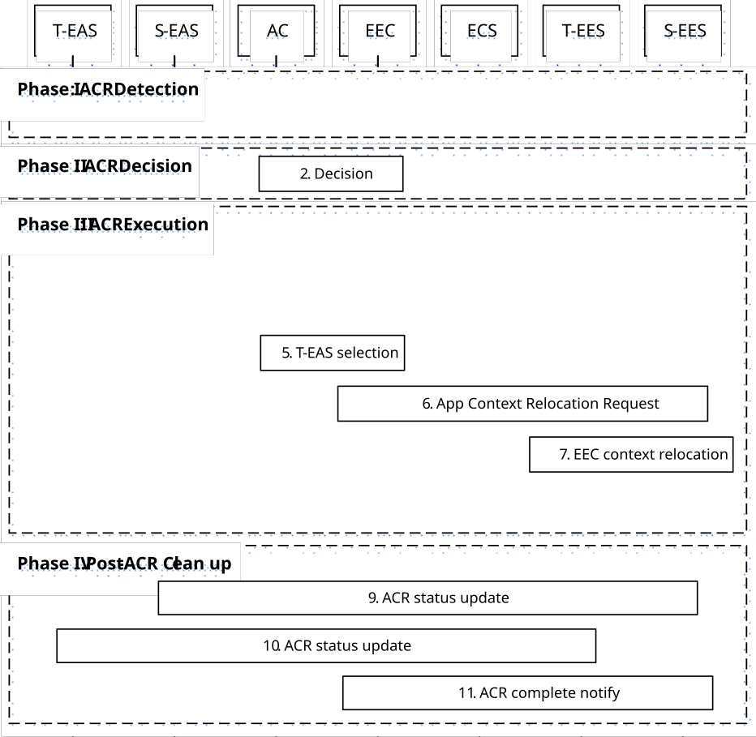

# 8.8.2.2 Initiation by EEC using regular EAS Discovery

In this scenario, ACR is a result of the UE moving to, or the UE expecting to move to, a new location which is outside the service area of the serving EAS. The EEC is triggered as a result of the UE's movement as described in 8.8.1.1A or by an AC as described in clause 8.14.2.4.

This scenario is based on Service Provisioning (as specified in clause 8.3) and EAS Discovery (as specified in clause 8.5) procedures to discover the T-EES and EAS that shall serve the AC as a result of the UE's new location, and that shall receive the Application Context from the serving EAS.

This scenario relies on the EDGE-5 interface between the EEC and AC.

Pre-conditions:

1\. The AC in the UE already has a connection to a corresponding S-EAS;

2\. The preconditions listed in clause 8.3.3.2.2 with regards to the EEC are fulfilled; and

3\. The EEC is triggered when it obtains the UE's new location or is triggered by another entity such as an ECS notification or AC trigger.

NOTE 1: This scenario is applicable only for an Edge-aware AC and EAS.

Figure 8.8.2.2-1: ACR initiated by the EEC and AC

Phase I: ACR Detection

1\. The EEC detects the UE location update as a result of a UE mobility event and is provided with the UE's new location as described in clause 8.8.1.1. The EEC can also detect an expected or predicted UE location in the future as described in clause 8.8.1.1. If a e2e tunnel is used in the UE for application, the EEC can also detect the tunnel server update as described in clause 8.8.1.1A.

NOTE 2: If the EEC is triggered by an external entity such as by a notification from the ECS, a list of new EESs (to be used as T-EESs) is provided by that notification and step 3 below is skipped.

Phase II: ACR Decision

2\. Either the AC or the EEC makes the decision to perform the ACR. If the EEC has received information of on-going ACR, then it should not initiate an ACR with the same ACR identity uniquely identified by ACID, EEC ID (or UE ID), S-EAS endpoint and T-EAS endpoint again per clause 8.8.3.5.3.

NOTE 3: Which applications require ACR can be decided based on the application profile, e.g. requirement of service continuity of the application.

If the change in UE's location does not trigger a need to change the serving EAS, steps 3 onwards are skipped. The EEC remains connected to the serving EES(s) and the AC remains connected to its corresponding serving EAS.

Phase III: ACR Execution

3\. The EEC performs Service Provisioning (as specified in clause 8.3) for all active applications that require ACR. Service Provisioning procedure results in a list of T-EESs that are relevant to the supplied applications and the new location of the UE and/or new tunnel server used by the UE. When in step 1 the ACR for service continuity planning is triggered, then the Connectivity information and UE Location in the Service Provisioning procedure (as specified in clause 8.3) contains the expected Connectivity information and expected UE Location.

> If Service Provisioning results in no T-EES, and if ACR to CAS is supported, then the procedure for ACR with CAS applies as specified in clause 8.8.2A.2.

4\. The EEC performs EAS discovery (as specified in clause 8.5) for the desired T-EASs by querying the T-EESs that were established in step 3 (or provided in the notification from the ECS – if it was the trigger). If EEC registration configuration for the EESs established in step 2 indicates that EEC registration is required, the EEC performs EEC registration with the EESs (as specified in clause 8.4.2.2.2) before sending the EAS discovery request. Step 5 is skipped if EAS discovery procedure results in only one discovered T-EAS.

When in step 1 the ACR for service continuity planning is triggered, and the "General context holding time duration" is included in the replied EAS discovery response, the EEC can make ACR request before it reaches respective T-EAS service area within the time period indicated by the IE.

5\. The AC and EEC select the T-EAS to be used for the application traffic.

NOTE 4: Several EEC registrations with different EESs may result from T-EAS discovery process during a single ACR operation.

6\. The EEC performs ACR launching procedure (as described in clause 8.8.3.4) to the S-EES with predicted/expected UE location or Expected AC Geographical Service Area, the ACR action indicating ACR initiation and the corresponding ACR initiation data (without the need to notify the EAS). When the S-EES receives the predicted/expected UE location or Expected AC Geographical Service Area from the EEC, then the S-EES will determine to monitor the UE mobility. The S-EES may apply the AF traffic influence with the N6 routing information of the T-EAS in the 3GPP Core Network (if applicable), as described in clause 8.8.3.4. If the EEC has not subscribed to receive ACR information notifications for ACR complete events from the S-EES, the EEC subscribes for the notifications as described in clause 8.8.3.5.2.

NOTE 5: It is expected that the AC will inform EAS about UE location monitoring is not needed

7\. If the T-EES is different than the S-EES and the EEC Context at the S-EES is not stale, the S-EES initiates EEC Context Push relocation with the T-EES as described in clause 8.9.2.3. Otherwise, if the T-EES is the same as the S-EES, EEC Context Push relocation is skipped.

8\. The AC is triggered by the EEC to start ACT. The AC decides to initiate the transfer of application context from the S-EAS to the T-EAS. There may be different ways of transferring context and they are all outside the scope of this specification.

When in step 1 the ACR for service continuity planning has been triggered, the AC connects to the T-EAS when the UE moves to the predicted location. Otherwise, the rest of this step is skipped.

After the ACT is completed, the AC remains connected to the T-EAS and disconnects from the S-EAS; the EEC is informed of the completion.

NOTE 6: Whether and how the AC initiates the ACT is out of scope of the present document

> When in step 1 the ACR has been triggered for service continuity planning, if the UE does not move to the expected/predicted location the EEC does not connect to T-EES, the AC does not connect to the T-EAS.

NOTE 7: The S-EAS or T-EAS can further decide to terminate the ACR, and the T-EAS can discard the application context based on information received from EEL and/or other methods (e.g. monitoring the location of the UE). It is up to the implementation of the S-EAS and T-EAS whether and how to make such a decision.

> NOTE 8: It is out of scope of this specification how the AC informs the S-EAS and T-EAS that ACT was part of service continuity planning. When in step 1 the ACR for service continuity planning is triggered, the S-EAS and the T-EAS can wait for the UE to move to the predicted location before they perform the Post ACR Clean up steps 9 and 10 if it is the EAS monitoring whether the UE moves to the predicted/expected location. When the S-EAS and the T-EAS do not wait for the UE (e.g., if the UE does not move to the predicted location), the S-EAS and the T-EAS can perform the Post ACR Clean up with failure messages.

NOTE 9: If the S-EAS and T-EAS are main EASs forming proxy bundle, other EASs of the bundle may transfer the application contexts in this step. How to execute ACT is out of scope of this document.

Phase IV: Post-ACR Clean up

9\. The S-EAS sends the ACR status update message to the S-EES as specified in clause 8.8.3.8.

10\. The T-EAS sends the ACR status update message to the T-EES as specified in clause 8.8.3.8. If the status indicates a successful ACT, and that the EEC Context relocation procedure was attempted but failed, then the T-EES indicates the failure to the T-EAS with the ACR status update response.

NOTE 10: If the EDGE-3 subscription initialization result indicates failure, then the EAS can perform the required EDGE-3 subscriptions at the T-EES.

NOTE 11: Steps 9 and 10 can occur in any order.

11\. If the status in step 9 indicates a successful ACT, for non-planning case the S-EES sends the ACR information notification (ACR complete) message immediately to the EEC to confirm that the ACR has completed as specified in clause 8.8.3.5.3. For the service continuity planning case, if it is EES monitors the UE mobility, then only when S-EES detects the UE has moved to the predicted/expected UE location or Expected AC Geographical Service Area and the status in step 9 indicates a successful ACT, then the S-EES sends ACR information notification (ACR complete) message to the EEC indicating that UE has moved to the predicted location when the ACR type is service continuity planning. If the EEC Context relocation procedure was attempted, then the notification includes EEC context relocation status IE, indicating the result of the EEC context relocation procedure. If the EEC context relocation status indicates that the EEC context relocation was not successful, then the EEC may perform the required EDGE-1 operations such as create subscriptions at the T-EES.
