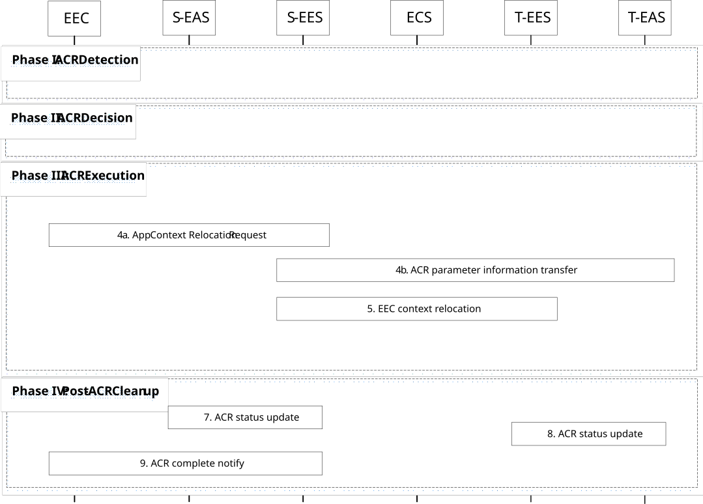

# 8.8.2.3 EEC executed ACR via S-EES

In this scenario, the EEC is triggered as a result of the UE's movement as described in 8.8.1.1A or by an AC as described in clause 8.14.2.4. Figure 8.8.2.3-1 illustrates the EEC executing ACR via the S-EES.

Pre-condition:

1\. The AC at the UE already has a connection to the S-EAS; and

2\. The EEC is able to communicate with the S-EES.

Figure 8.8.2.3-1: EEC executed ACR

Phase I: ACR Detection

1\. The EEC detects that ACR may be required as described in clause 8.8.1.1. The EEC may detect that ACR may be required for an expected or predicted UE location in the future as described in clause 8.8.1.1A. The EEC may also detect that ACR may be required for the tunnel server update as described in clause 8.8.1.1A.

Phase II: ACR Decision

2\. The EEC decides to proceed required procedures for triggering ACR. If the EEC has received information of on-going ACR, then it should not initiate an ACR with the same ACR identity uniquely identified by ACID, EEC ID (or UE ID), S-EAS endpoint and T-EAS endpoint again per clause 8.8.3.5.3.

Phase III: ACR Execution

3\. The EEC determines the T-EES by using the provisioned information or performing service provisioning procedure per clause 8.3 of the present document. When in step 1 the ACR for service continuity planning is triggered, then the Connectivity information and UE Location in the Service Provisioning (as specified in clause 8.3) procedure contains the expected Connectivity information and expected UE Location. If the UE is within the service area of the T-EES, upon selecting T-EES the UE may need to establish a new PDU connection to the target EDN. If EEC registration configuration for the T-EES indicates that EEC registration is required, the EEC performs EEC registration with the selected T-EES as specified in clause 8.4.2.2.2. The EEC can then discover and select T-EAS by performing EAS Discovery with the T-EES per clause 8.5.2 of the present document.

If service provisioning results in no T-EES, and if ACR to CAS is supported, then the procedure for ACR with CAS applies as specified in clause 8.8.2A.3.

When in step 1 the ACR for service continuity planning is triggered, and the "General context holding time duration" is included in the replied EAS discovery response, the EEC can make ACR request before it reaches respective T-EAS service area within the time period indicated by the IE.

NOTE 1: Several EEC registrations with different EESs may result from T-EAS discovery process during a single ACR operation.

4a. The EEC performs ACR launching procedure (as described in clause 8.8.3.4) to the S-EES with predicted/expected UE location or Expected AC Geographical Service Area, the ACR action indicating ACR initiation and the corresponding ACR initiation data (with the need to notify the EAS). The S-EES authorises the request from the EEC. The S-EES decides to execute ACR based on the information received from the EEC, EEC context and/or EAS profile. The S-EES may apply the AF traffic influence with the N6 routing information of the T-EAS in the 3GPP Core Network (if applicable) and sends the ACR management notification for the "ACT start" event to the S-EAS, as described in clause 8.6.3, to initiate ACT between the S-EAS and the T-EAS. In ACT start, the S-EES includes indication of service continuity planning if the S-EES determine to monitor UE mobility. If the EEC has not subscribed to receive ACR information notifications for ACR complete events from the S-EES, the EEC subscribes for the notifications as described in clause 8.8.3.5.2.

4b. If the ACR request in step 4a includes ACR parameters, e.g. Prediction expiration time, the S-EES performs ACR parameter information procedure by sending the ACR parameter information request to the T-EES as described in clause 8.8.3.9.

> 5\. If the T-EES is different than the S-EES and the EEC Context at the S-EES is not stale, the S-EES initiates EEC Context Push relocation with the T-EES as described in clause 8.9.2.3. Otherwise, if the T-EES is the same as the S-EES, EEC Context Push relocation is skipped.

6\. The S-EAS transfers the application context to the T-EAS at implementation specific time. This process is out of scope of the present specification.

When in step 1 the ACR has been triggered for service continuity planning, if the UE does not move to the predicted location, the EEC does not connect to T-EES, the AC does not connect to the T-EAS.

NOTE 2: The S-EAS or T-EAS can further decide to terminate the ACR, and the T-EAS can discard the application context based on information received from EEL and/or other methods (e.g. monitoring the location of the UE). It is up to the implementation of the S-EAS and T-EAS whether and how to make such a decision.

NOTE 3: When in step 1 the ACR for service continuity planning is triggered, the S-EAS and the T-EAS can wait for the UE to move to the predicted location before they perform the Post ACR Clean up steps 7 and 8 if it is the EAS monitoring whether the UE moves to the predicted/expected location. When the S-EAS and the T-EAS do not wait for the UE (e.g., if the UE does not move to the predicted location), the S-EAS and the T-EAS can perform the Post ACR Clean up with failure messages.

NOTE 4: If the S-EAS and T-EAS are main EASs forming proxy bundle, other EASs of the bundle may transfer the application contexts in this step. How to execute ACT is out of scope of this document.

Phase IV: Post-ACR Clean up

7\. The S-EAS sends the ACR status update message to the S-EES as specified in clause 8.8.3.8.

8\. The T-EAS sends the ACR status update message to the T-EES as specified in clause 8.8.3.8. If the status indicates a successful ACT, and that the EEC Context relocation procedure was attempted but failed, then the T-EES indicates the failure to the T-EAS with the ACR status update response.

NOTE 5: If the EDGE-3 subscription initialization result indicates failure, then the EAS can perform the required EDGE-3 subscriptions at the T-EES.

NOTE 6: Steps 7 and 8 can occur in any order.

9\. If the status in step 7 indicates a successful ACT, for non-planning case the S-EES sends the ACR information notification (ACR complete) message immediately to the EEC to confirm that the ACR has completed as specified in clause 8.8.3.5.3. For the service continuity planning case, if the EES monitors the UE mobility, then only when S-EES detects the UE has moved to the predicted/expected UE location or Expected AC Geographical Service Area and the status in step 7 indicates a successful ACT, then the S-EES sends ACR information notification (ACR complete) message to the EEC indicating that UE has moved to the predicted location when the ACR type is service continuity planning. If the EEC Context relocation procedure was attempted, then the notification includes EEC context relocation status IE, indicating the result of the EEC context relocation procedure. If the EEC context relocation status indicates that the EEC context relocation was not successful, then the EEC may perform the required EDGE-1 operations such as create subscriptions at the T-EES.
