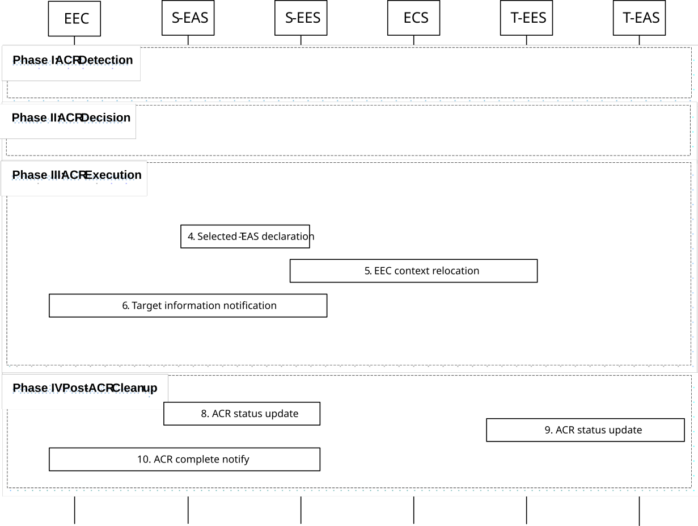

# 8.8.2.4 S-EAS decided ACR scenario

In this scenario, the S-EAS may detect the need of ACR locally or is notified by the S-EES (as described in clause 8.6.3.2.3) via ACR management notifications or UE location notifications as described in clause 8.8.1.1A. The S-EAS make the decision about whether to perform the ACR, and starts the ACR at a proper time.

NOTE 1: For this clause, S-EAS either supports ACR detection capability or performs subscription for ACR management event to EES.Pre-conditions:

1\. The S-EAS may depend on the receipt ACR management events from the S-EES, e.g. "user plane path change" events or "out of service area" events or "ACR monitoring" events as described in clause 8.6.3, to detect the need for an ACR. The S-EAS may also depend on the receipt of UE location notification from the S-EES as described in clause 8.6.2.2.3, to detect the need for an ACR. For the following procedure it is assumed that the S-EAS has subscribed to continuously receive the respective events from the S-EES; and

2\. The EEC has subscribed to receive ACR information notifications for target information notification events and ACR complete events from the S-EES, as described in clause 8.8.3.5.2.

Figure 8.8.2.4-1: S-EAS decided ACR

S-EAS decided ACR is outlined with four main phases: detection, decision, execution and clean up.

Phase I: ACR Detection

1\. The S-EAS either receives ACR management notifications from S-EES source Edge Enabler Server indicating that ACR may be required ("ACR monitoring" event or "out of service area" event), or self detects the need for ACR (e.g. upon receipt of a "user plane path change" event or UE location notification). If the ACR management notification indicates "ACR monitoring" event, then the notification will also contain the T-EAS information (see clause 8.6.3.2.3). The S-EAS may detect that ACR may be required for an expected or predicted UE location in the future as described in clause 8.8.1.1A.

NOTE 2: How the S-EAS self detects the local need for ACR is outside the scope of this specification.

Phase II: ACR Decision

2\. The S-EAS makes the decision to perform the ACR. If the S-EAS has received information of on-going ACR, then it should not initiate an ACR with the same ACR identity uniquely identified by ACID, EEC ID (or UE ID), S-EAS endpoint and T-EAS endpoint again per clause 8.6.3.2.3.

NOTE 3: How the S-EAS determines when to start the ACR is outside the scope of this specification. The ASP can have service agreement with ECSP regarding which EES API to use for ACR detection.

Phase III: ACR Execution

3\. The S-EAS discovers the T-EAS as described in clause 8.8.3.2. When in step 1 the ACR has been triggered for service continuity planning, then UE Location and Target DNAI and tunnel information in the Retrieve T-EES procedure contain the expected UE Location and expected Target DNAI and tunnel information. After S-EAS determines the T-EAS to use, the S-EAS may apply the AF traffic influence with the N6 routing information of the T-EAS in the 3GPP Core Network (if applicable).

> If T-EAS discovery results in no T-EAS, and if ACR to CAS is supported, then the procedure for ACR with CAS applies as specified in clause 8.8.2A.4.
>
> 4\. The S-EAS sends selected T-EAS declaration message to S-EES, to inform S-EES the determined T-EAS to use as described in clause 8.8.3.7. The S-EAS may send the ACID and Predicted/Expected UE location or Expected AC Geographical Service Area to the EES. When the EES receives the predicted/expected UE location or Expected AC Geographical Service Area from the EAS, then the EES will determine to monitor the UE mobility.
>
> In the case of S-EAS overload or maintenance, the S-EAS includes list of UEs for which ACR is required in the Selected T-EAS declaration message to the S-EES to indicate S-EES to perform ACR for UEs in the group.
>
> 5\. If the T-EES is different than the S-EES and the EEC Context at the S-EES is not stale, the S-EES initiates EEC Context Push relocation with the T-EES as described in clause 8.9.2.3. If ACR is initiated for common EAS, S-EES may initiate EEC context push relocation for EECs in the identified UEs for the application group. Otherwise, if the T-EES is the same as the S-EES, EEC Context Push relocation is skipped.

6\. Based on the T-EAS selection information received from the S-EAS, the S-EES sends the target information notification to the EEC as described in clause 8.8.3.5.3. The selected T-EES may be included in the target information and the ACID which corresponds to the selected target EAS is included in the notification sent to the EEC as described in clause 8.8.3.5.3.

If ACR is initiated for a list of UEs, the S-EES sends the ACR information notification (Target information notification) message to EEC for the identified UEs.

NOTE 4: Step 6 can be performed after step 4. The S-EES can send target information notification to the EEC immediately after having the target information in order to avoid EEC to initiate another ACR with the same identity.

7\. The S-EAS transfers the application context to the T-EAS selected in step 3. This process is out of scope of the present specification.

> If ACR is initiated for common EAS with list of UEs, then application contexts for all UEs are transferred to T-EAS.
>
> When in step 1 the ACR has been triggered for service continuity planning, if the UE does not move to the predicted location, the EEC does not connect to T-EES, the AC does not connect to the T-EAS.

NOTE 5: The S-EAS or T-EAS can further decide to terminate the ACR, and the T-EAS can discard the application context based on information received from EEL and/or other methods (e.g. monitoring the location of the UE). It is up to the implementation of the S-EAS and T-EAS whether and how to make such a decision.

NOTE 6: When in step 1 the ACR has been triggered for service continuity planning, the S-EAS and the T-EAS can wait for the UE to move to the predicted location before they perform the Post ACR Clean up steps 8 and 9 if it is the EAS monitoring whether the UE moves to the predicted/expected location. When the S-EAS and the T-EAS do not wait for the UE (e.g., if the UE does not move to the predicted location), the S-EAS and the T-EAS can perform Post ACR Clean up with failure messages.

NOTE 7: If the S-EAS and T-EAS are main EASs forming proxy bundle, other EASs of the bundle may transfer the application contexts in this step. How to execute ACT is out of scope of this document.

Phase IV: Post-ACR clean up

8\. The S-EAS sends the ACR status update message to the S-EES as specified in clause 8.8.3.8. In the case of S-EAS overload or maintenance, the S-EAS includes a list of UEs in the ACR status update message for which ACT is successful.

9\. The T-EAS sends the ACR status update message to the T-EES as specified in clause 8.8.3.8. If the status indicates a successful ACT, and that the EEC Context relocation procedure was attempted but failed, then the T-EES indicates the failure to the T-EAS with the ACR status update response. In the case of S-EAS overload or maintenance, the T-EAS includes a list of UEs in the ACR status update message for which ACT is successful.

NOTE 8: If the EDGE-3 subscription initialization result indicates failure, then the EAS can perform the required EDGE-3 subscriptions at the T-EES.

NOTE 9: Steps 8 and 9 can occur in any order.

10\. If the status in step 8 indicates a successful ACT, for non-planning case the S-EES sends the ACR information notification (ACR complete) message immediately to the EEC to confirm that the ACR has completed as specified in clause 8.8.3.5.3. For the service continuity planning case, if it is EES monitors the UE mobility, then only when S-EES detects the UE has moved to the predicted/expected UE location or Expected AC Geographical Service Area and the status in step 8 indicates a successful ACT, then the S-EES sends ACR information notification (ACR complete) message to the EEC indicating that UE has moved to the predicted location when the ACR type is service continuity planning. If the EEC Context relocation procedure was attempted, then the notification includes EEC context relocation status IE, indicating the result of the EEC context relocation procedure. If the EEC context relocation status indicates that the EEC context relocation was not successful, then the EEC may perform the required EDGE-1 operations such as create subscriptions at the T-EES.

If ACR is initiated for a list of UEs, the S-EES sends the ACR information notification (ACR complete) message to EEC for the identified UEs.
