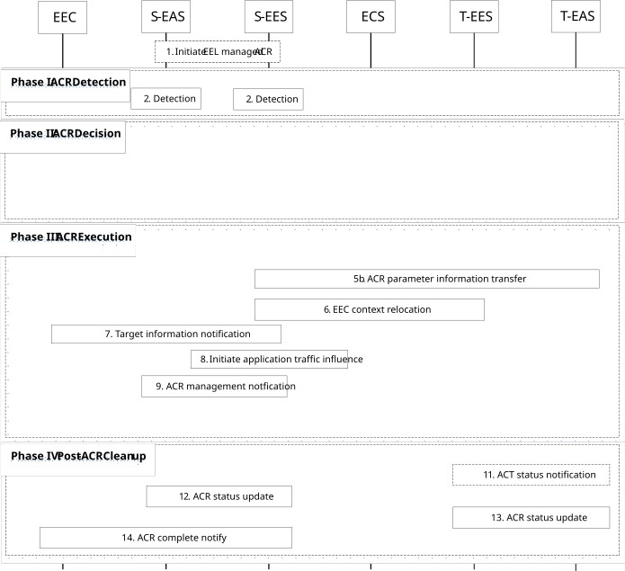

# 8.8.2.5 S-EES executed ACR

Figure 8.8.2.5-1 illustrates the S-EES detecting, deciding and executing ACR from the S-EAS to the T-EAS. This may include EELManagedACR by S-EES when initiated by S-EAS as per clause 8.8.3.6. The EEC or the S-EAS may also detect the ACR as illustrated in figure 8.8.2.5-1.

NOTE 1: For this clause, S-EAS either supports ACR detection capability or performs subscription for ACR management event to EES.

Pre-condition:

1\. The AC at the UE already has a connection to the S-EAS;

2\. The EEC is able to communicate with the S-EES;

3\. The EEC has subscribed to receive ACR information notifications for target information notification events and ACR complete events from the S-EES, as described in clause 8.8.3.5.2;

4\. The S-EAS optionally subscribed to receive ACR management notifications for "ACR facilitation" "out of service area" events to the S-EES, in order to enable detection at S-EAS.

5\. The S-EES optionally subscribed to the monitoring event UE mobility for area of interest equivalent to the service area of the S-EAS as described in clause 8.8.1.1A.

> 6\. In case of EELManagedACR, the T-EAS has subscribed to receive ACT status notifications as described in clause 8.8.3.6.2.3.
>
> 7\. S-EES has optionally subscribed to ADAE server to receive edge load analytics as specified in clauses 6.7 and 8.8 of TS 23.436 \[28\].

Figure 8.8.2.5-1: S-EES executed ACR

1\. The S-EAS may initiate EELManagedACR with S-EES as specified in clause 8.8.3.6. The S-EAS and S-EES negotiate an address of the Application Context storage to S-EES. The S-EAS puts the Application Context at this address which can be further accessed by the S-EES when the ACT is required.

In the EELManagedACR case, the S-EES executes steps 2 (i.e., S-EES is the detection entity), 4, 5, 6, 7, 8, 9, 10, 11, 13 and 14. Rest of steps are skipped.

Phase I: ACR Detection

2\. Detection entities (S-EAS, S-EES, EEC) detect that ACR may be required and identify the ACID and Predicted/Expected UE location or Expected AC Geographical Service Area or by an S-EES subscription to the monitoring event UE mobility for area of interest as described in clause 8.8.1.1A. The detection by the S-EES may be triggered by the User Plane path change notification received from the 3GPP Core Network due to S-EAS request for "ACR facilitation" event (see clause 8.6.3) or due to receiving an EELManagedACR request in step 1. The S-EES detection may also be triggered due to EDN overload based on the edge load analytics information received from ADAES by procedure described in clause 8.8.3.11 or due to "out of service area" event (described in clause 8.6.3).

> The detection entity may detect that ACR may be required for an expected or predicted UE location in the future as described in clause 8.8.1.1A.

Phase II: ACR Decision

3\. The detection entity performs ACR launching procedure (as described in clause 8.8.3.4) with the ACR action indicating ACR determination and the corresponding ACR determination data. If the EEC or S-EAS detect the ACR event, the EEC or S-EAS may inform S-EES with ACID, and predicted/expected UE location or Expected AC Geographical Service Area in the ACR launching procedure. The EEC may also detect a tunnel server update and inform the S-EES with the new tunnel information.

For S-EAS detected case, the S-EAS includes list of UEs for which ACR is required in the ACR request to indicate S-EES to perform ACR for UEs in the group as the S-EAS is overloaded and may not meet to KPIs for common EAS.

For S-EES detected case, the S-EES may detect that ACR may be required based on edge performance of load analytics of the S-EAS receved in Edge analytics Notification from ADAE server as specified in clause 8.8.3.7 of 3GPP TS 23.436 \[28\].

4\. The S-EES authorises the message if received. The S-EES decides to execute ACR based on the information received or local detection, and the information of EEC context or EAS profile, and then proceed the below steps. When the S-EES receives the predicted/expected UE location or Expected AC Geographical Service Area from the EEC or the EAS in ACR determination, or the S-EES received service continuity planning from EAS in ACR facilitation event subscription, then the S-EES will determine to monitor the UE mobility. If S-EES has received information of on-going ACR, then it should not initiate an ACR with the same ACR identity uniquely identified by ACID, EEC ID (or UE ID), S-EAS endpoint and T-EAS endpoint again per clause 8.6.3.2.3.

For S-EES detected case, if the ACR is decided for the common EAS, the S-EES determines list of all UEs of the application group ID that are currently connected to S-EAS.

Phase III: ACR Execution

5a. The S-EES determines T-EES and T-EAS via the Discover T-EAS procedure in clause 8.8.3.2 of the present document. When in step 2 the ACR has been triggered for service continuity planning, then UE Location and Target DNAI and tunnel information provided in the Retrieve T-EES procedure contain the expected UE Location and expected Target DNAI and tunnel information. The S-EES may decide not to perform ACR if T-EAS is not available.

> If T-EAS discovery results in no T-EAS, and if ACR to CAS is supported, then the procedure for ACR with CAS applies as specified in clause 8.8.2A.5.

5b. If required, the S-EES performs ACR parameter information procedure by sending the ACR parameter information request to the T-EES as described in clause 8.8.3.9. For example, when the ACR is for service continuity planning, and the S-EES has received it in ACR launch in step 2, the S-EES sends ACR parameter information request which includes Prediction expiration time.

> 6\. If the T-EES is different than the S-EES and the EEC Context at the S-EES is not stale, the S-EES initiates EEC Context Push relocation with the T-EES as described in clause 8.9.2.3. If ACR is initiated for common EAS, S-EES may initiate EEC context push relocation for EECs in the identified UEs for the application group.
>
> Otherwise, if the T-EES is the same as the S-EES, EEC Context Push relocation is skipped.

7\. The S-EES sends the target information notification to the EEC as described in clause 8.8.3.5.3.

NOTE 2: Step 7 can be performed after step 5. The S-EES can send target information notification to the EEC immediately after having the target information in order to avoid EEC to initiate another ACR with the same identity

8\. The S-EES may apply the AF traffic influence with the N6 routing information of the T-EAS in the 3GPP Core Network (if applicable).

9\. The S-EES sends the ACR management notification (e.g. as notification for "ACR facilitation" event or "ACT start" event as described in clause 8.6.3 or due to step 1) to the S-EAS to initiate ACT between the S-EAS and the T-EAS. For S-EES detected case, the notification includes list of UEs for which ACT from S-EAS to T-EAS is required as the S-EAS is not aware of the list of UEs identified for the ACR.

10\. The Application Context is transferred from S-EAS to the T-EAS at implementation specific time. In the case of EELManagedACR, the S-EES accesses the Application Context from the address as per step 1 and the S-EES and T-EES engage in the ACT from S-EAS to the T-EAS (obtained as per step 5) in a secure way. Further the T-EAS accesses the Application Context made available by the T-EES. If S-EAS performs the ACT directly with T-EAS, the specification of such process is out of scope of the present document.

For S-EES detected case, the S-EAS initiates application context transfer towards T-EAS for all ACs for the received list of UE(s) in the notification.

NOTE 3: The Application Context is encrypted and protected by the application layer. The S-EES and the T-EES engage in the packet level transport of the Application Context and they have no visibility to the content of the Application Context.

When in step 2 the ACR has been triggered for service continuity planning, if the UE does not move to the predicted location, the EEC does not connect to T-EES, the AC does not connect to the T-EAS.

NOTE 3: The S-EAS or T-EAS can further decide to terminate the ACR, and the T-EAS can discard the application context based on information received from EEL and/or other methods (e.g. monitoring the location of the UE). It is up to the implementation of the S-EAS and T-EAS whether and how to make such a decision.

NOTE 4: When in step 2 the ACR has been triggered for service continuity planning, the S-EAS and the T-EAS can wait for the UE to move to the predicted location before they perform the Post ACR Clean up steps 12 and 13 if it is the EAS monitoring whether the UE moves to the predicted or expected location. When the S-EAS and the T-EAS do not wait for the UE (e.g., if the UE does not move to the predicted location), the S-EAS and the T-EAS can perform Post ACR Clean up with failure messages.

NOTE 5: If the S-EAS and T-EAS are main EASs forming proxy bundle, other EASs of the bundle may transfer the application contexts in this step. How to execute ACT is out of scope of this document.

Phase IV: Post-ACR Clean up

11\. In case of EELManagedACR, once the ACT is successful, the T-EES sends an ACT status notification to the T-EAS as described in clause 8.8.3.6.2.4, indicating that the Application Context is available.

12\. The S-EAS sends the ACR status update message to the S-EES as specified in clause 8.8.3.8. In the case of S-EAS overload or maintenance, the S-EAS includes a list of UEs (which are part of the application group) in the ACR status update message for which ACT is successful.

13\. The T-EAS sends the ACR status update message to the T-EES as specified in clause 8.8.3.8. If the status indicates a successful ACT, and that the EEC Context relocation procedure was attempted but failed, then the T-EES indicates the failure to the T-EAS with the ACR status update response. In the case of S-EAS overload or maintenance, the T-EAS includes a list of UEs (which are part of the application group) in the ACR status update message for which ACT is successful.

NOTE 6: If the EDGE-3 subscription initialization result indicates failure, then the EAS can perform the required EDGE-3 subscriptions at the T-EES.

NOTE 7: Steps 12 and 13 can occur in any order.

14\. If the status in step 12 indicates a successful ACT or in the EELManagedACR case, the S-EES sends the ACR information notification (ACR complete) message immediately to the EEC to confirm that the ACR has completed as specified in clause 8.8.3.5.3. For the service continuity planning case, if it is EES monitors the UE mobility, then only when S-EES detects the UE has moved to the predicted/expected UE location or Expected AC Geographical Service Area and the status in step 12 indicates a successful ACT, then the S-EES sends ACR information notification (ACR complete) message to the EEC when the ACR type is service continuity planning. If the EEC Context relocation procedure was attempted, then the notification includes EEC context relocation status IE, indicating the result of the EEC context relocation procedure. If the EEC context relocation status indicates that the EEC context relocation was not successful, then the EEC may perform the required EDGE-1 operations such as create subscriptions at the T-EES.

If ACR is initiated for common EAS, the S-EES sends the ACR information notification (ACR complete) message to EEC for the identified UEs.

NOTE 8: The Application Client mechanism to support switchover of the application traffic to T-EAS is out of scope of the specification.
