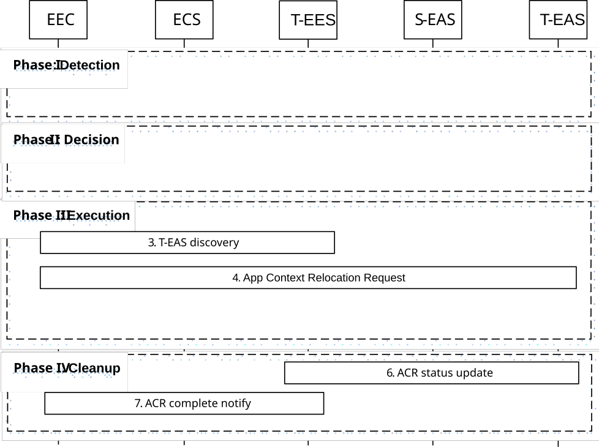

# 8.8.2.6 EEC executed ACR via T-EES

In this scenario, the EEC is triggered as a result of the UE's movement as described in 8.8.1.1A or by an AC as described in clause 8.14.2.4. Figure 8.8.2.6-1 illustrates the EEC executing ACR via the T-EES.

Pre-condition:

1\. The EEC has the S-EAS information that serves the AC.

Figure 8.8.2.6-1: EEC executed ACR via T-EES

Phase I: ACR Detection

1\. The EEC detects that ACR may be required as described in clause 8.8.1.1. The EEC may detect that ACR may be required for an expected or predicted UE location in the future as described in clause 8.8.1.1A. The EEC may also detect that ACR may be required for the tunnel server update as described in clause 8.8.1.1A.

Phase II: ACR Decision

2\. The EEC decides to proceed with required procedures for ACR. If the EEC has received information of on-going ACR, then it should not initiate an ACR with the same ACR identity uniquely identified by ACID, EEC ID (or UE ID), S-EAS endpoint and T-EAS endpoint again per clause 8.8.3.5.3.

NOTE 1: If supported, the AC can be involved in the decision. It is out of scope of the present document how the AC is involved.

Phase III: ACR Execution

3\. The EEC determines the T-EES by using the provisioned information or performing service provisioning procedure per clause 8.3. When in step 1 the ACR for service continuity planning is triggered, then the Connectivity information and UE Location used in the service provisioning procedure contain the expected Connectivity information and expected UE Location. If the UE is within the service area of the T-EES, upon selecting the T-EES the UE may need to establish a new PDU connection to the target EDN. If EEC registration configuration for the T-EES indicates that EEC registration is required, the EEC performs registration with the selected T-EES as specified in clause 8.4.2.2.2. The EEC performs EAS Discovery with the T-EES per clause 8.5.2.

When in step 1 the ACR for service continuity planning is triggered, and the "General context holding time duration" is included in the replied EAS discovery response, the EEC can make ACR request before it reaches respective T-EAS service area within the time period indicated by the IE.

NOTE 2: Several EEC registrations with different EESs may result from T-EAS discovery process during a single ACR operation.

4\. The EEC performs ACR launching procedure (as described in clause 8.8.3.4) to the T-EES with predicted/expected UE location or Expected AC Geographical Service Area, the ACR action indicating ACR initiation and the corresponding ACR initiation data (with the need to notify the EAS). When the T-EES receives the predicted/expected UE location or Expected AC Geographical Service Area from the EEC, then the T-EES will determine to monitor the UE mobility. If the received ACR initiation request contains an EEC context ID and the S-EES Endpoint, the T-EES performs an EEC Context Pull relocation (clause 8.9.2.2). The T-EES may apply the AF traffic influence with the N6 routing information of the T-EAS in the 3GPP Core Network (if applicable). Then the T-EES sends the ACR management notification with "ACT start" event message to the T-EAS, the T-EES includes indication of service continuity planning if the T-EES determines to monitor UE mobility during post-ACR phase. If the ACR request in ACR launching procedure includes ACR parameters, e.g. Prediction expiration time, the T-EES includes the ACR parameters in the notification to T-EAS. The EEC also subscribes to receive ACR information notifications for ACR complete events from the T-EES, as described in clause 8.8.3.5.2.

5\. The T-EAS initiates ACT between the S-EAS and the T-EAS. This process is out of scope of the present specification.

When in step 1 the ACR has been triggered for service continuity planning, if the UE does not move to the predicted location the EEC does not connect to T-EES, the AC does not connect to the T-EAS.

NOTE 3: The S-EAS or T-EAS can further decide to terminate the ACR, and the T-EAS can discard the application context based on information received from EEL and/or other methods (e.g. monitoring the location of the UE). It is up to the implementation of the S-EAS and T-EAS whether and how to make such a decision.

NOTE 4: When in step 1 the ACR has been triggered for service continuity planning, the S-EAS and the T-EAS can wait for the UE to move to the predicted location before the T-EAS performs the Post ACR Clean up step 6 if it is the EAS monitoring whether the UE moves to the predicted/expected location. When the S-EAS and the T-EAS do not wait for the UE (e.g., if the UE does not move to the predicted location), the T-EAS can perform Post ACR Clean up with failure messages.

> NOTE 5: If the S-EAS and T-EAS are main EASs forming proxy bundle, other EASs of the bundle may transfer the application contexts in this step. How to execute ACT is out of scope of this document.

Phase IV: Post-ACR clean up

6\. The T-EAS sends the ACR status update message to the T-EES as specified in clause 8.8.3.8. If the status indicates a successful ACT, and that the EEC Context relocation procedure was attempted but failed, then the T-EES indicates the failure to the T-EAS with the ACR status update response.

NOTE 6: If the EDGE-3 subscription initialization result indicates failure, then the EAS can perform the required EDGE-3 subscriptions at the T-EES.

7\. The T-EES immediately sends the ACR information notification (ACR complete) message to the EEC as described in clause 8.8.3.5.3 for non-planning case. For the service continuity planning case, if it is EES monitors the UE mobility, then only when T-EES detects the UE has moved to the predicted/expected UE location or Expected AC Geographical Service Area and the status in step 6 indicates a successful ACT, then the S-EES sends ACR information notification (ACR complete) message to the EEC indicating that UE has moved to the predicted location when the ACR type is service continuity planning. If the EEC Context relocation procedure was attempted, then the notification includes EEC context relocation status IE, indicating the result of the EEC context relocation procedure. If the EEC context relocation status indicates that the EEC context relocation was not successful, then the EEC may perform the required EDGE-1 operations such as create subscriptions at the T-EES.

If the procedure fails after step 4, it will be terminated with an appropriate cause in the ACR information notification to the EEC in step 7. The EEC may then proceed attempting to obtain services from the T-EAS discovered in step 3 without service continuity support. Alternatively, the EEC may resume the present procedure starting with step 4 and selecting a different T-EES discovered in step 3 with EAS service continuity support.

NOTE 7: The support of ACR between EDNs operated by different ECSPs is dependent on business agreement between the ECSPs.
