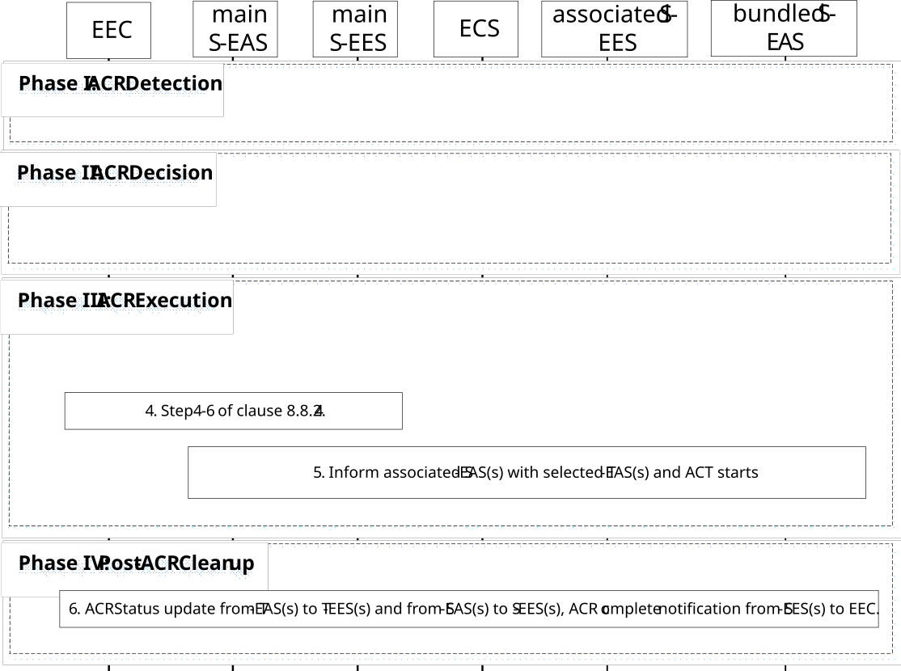

# 8.8.2.8 ACR for EAS bundle, executed by S-EAS

In this scenario, the main S-EAS executes and triggers necessary ACR for all AC-EAS service session(s) in a bundle.

This scenario description is same as described for figure 8.8.2.4-1 except for the following clarifications:

Pre-condition:

1\. The main S-EAS may depend on the receipt of ACR management events from its S-EES, e.g. "user plane path change" events or "ACR monitoring" events as described in clause 8.6.3, to detect the need for an ACR. The main S-EAS may also depend on the receipt of UE location notification from its S-EES as described in clause 8.6.2.2.3, to detect the need for an ACR. For the following procedure it is assumed that the main S-EAS has subscribed to continuously receive the respective events; and

2\. The EEC has subscribed to receive ACR information notifications for target information notification events and ACR complete events from S-EESs serving the EAS bundle, as described in clause 8.8.3.5.2.

Figure 8.8.2.8-1: S-EAS executed ACR for EAS bundle

Phase I: ACR Detection

1\. ACR is detected, the procedure is same as step 1 of clause 8.8.2.4.

Phase II: ACR Decision

2\. The main S-EAS performs ACR decision for bundled EASs.

NOTE 1: The main S-EAS is aware of all bundle EASs service area and/or DNAIs so it can decide whether to perform ACR for the corresponding EASs.

Phase III: ACR Execution

3\. The main S-EAS discovers from all candidate T-EAS(s) in EAS bundle as described in clause 8.8.3.2. If the affinity is set to strong, then T-EASs are from the same EDN. The main S-EAS may apply AF traffic influence for all bundled T-EAS(s).

NOTE: T-EAS(s) should be within the same EDN as preferred if EAS affinity is preferred, or different EDNs if no T-EAS(s) in same EDN available, if the EAS affinity is set to weak.

4\. The procedure is same as step 4 to step 6 of clause 8.8.2.4. The main S-EAS sends selected T-EAS declaration message to the main S-EES with the selected T-EASs, the main S-EES sends selected T-EAS(s) to the EEC.

5\. The main S-EES informs associated S-EESs with bundled T-EASs. Then ACT starts between the S-EAS(s) and T-EAS(s) in a bundle requiring service continuity.

Phase IV: Post-ACR Clean up

6\. During post-ACR, all S-EASs and T-EASs send ACR status update to S-EES and T-EES, respectively, as described in step 8 and step 9 of clause 8.8.2.4. The EEC collects ACR complete notifications from all S-EESs and ACR for EAS bundle is completed.
