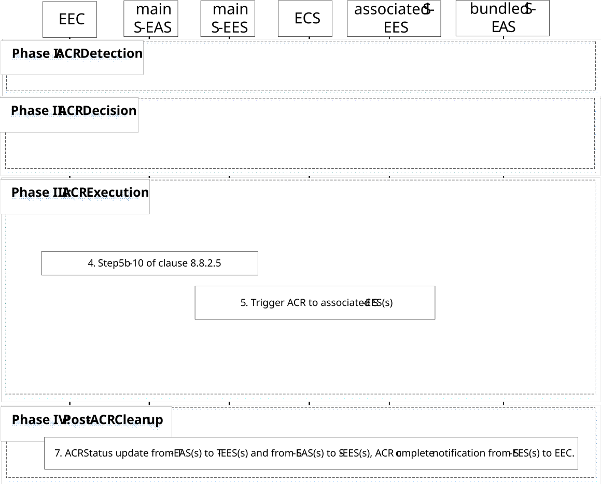

# 8.8.2.9 ACR for EAS bundle, executed by S-EES

In this scenario, a main S-EES (serving a main S-EAS) executes and triggers necessary ACR for AC-EAS service session(s) in a bundle.

This scenario description is same as described for figure 8.8.2.5-1 except for the following clarifications:

Pre-condition:

1\. The AC at the UE already has a connection with S-EASs in a bundle;

2\. The EEC subscribes to receive ACR information notifications for target information notification events and ACR complete events from S-EESs serving the EAS bundle, as described in clause 8.8.3.5.2;

3\. The main S-EAS may subscribe to receive ACR management notifications for "ACR facilitation" events to the main S-EES, in order to enable ACR detection at the main S-EES.

Figure 8.8.2.9-1: S-EES executed ACR for EAS bundle

Phase I: ACR Detection

1\. The main S-EES detects the need for ACR, the procedure is same as step 2 of clause 8.8.2.5.

Phase II: ACR Decision

2\. The main S-EES performs ACR decision for bundled EASs.

NOTE 1: The main S-EES is aware of all bundle EASs service area and/or DNAIs so it can decide whether to perform ACR for the corresponding EASs.

Phase III: ACR Execution

3\. The main S-EES discovers all candidate T-EAS(s) in EAS bundle as described in clause 8.8.3.2. If the affinity is set to strong, then T-EASs are from the same EDN.

NOTE 2: T-EAS(s) should be within the same EDN as preferred if EAS affinity is preferred, or different EDNs if no T-EAS(s) in same EDN available, if the EAS affinity is set to weak.

4\. The procedure is same as step 5b to step 10 of clause 8.8.2.5. The main S-EES sends selected T-EAS(s) to the EEC, triggers application traffic influence for T-EAS(s) and notifies the main S-EAS with selected T-EAS of the same EAS service. The main S-EES may notify more S-EAS(s) with selected T-EAS of the corresponding EAS service.

5\. The main S-EES performs ACR launching procedure (as described in clause 8.8.3.4) with the ACR action indicating ACR initiation and the corresponding ACR initiation data to the associated S-EES(s).

6\. The associated S-EES(s) notifies the corresponding bundled S-EAS(s) and ACT starts between the S-EAS(s) and T-EAS(s) in a bundle requiring service continuity.

Phase IV: Post-ACR Clean up

7\. During post-ACR, all S-EASs and T-EASs send ACR status update to S-EES and T-EES, respectively, as described in step 12 and step 13 of clause 8.8.2.5. The EEC collects ACR complete notifications from all S-EESs and ACR for EAS bundle is completed.
