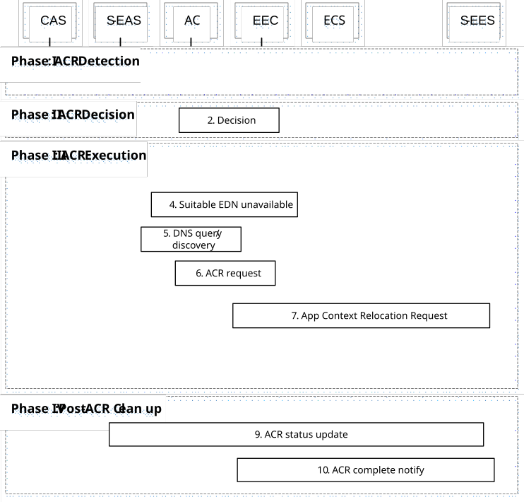
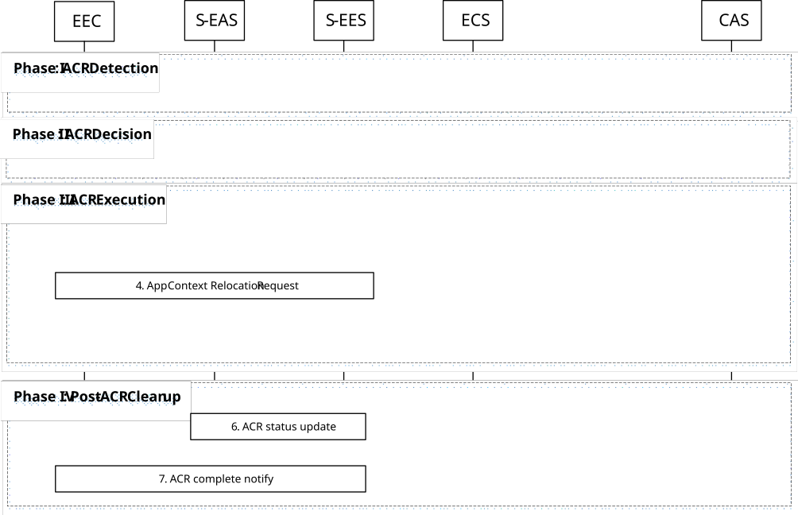
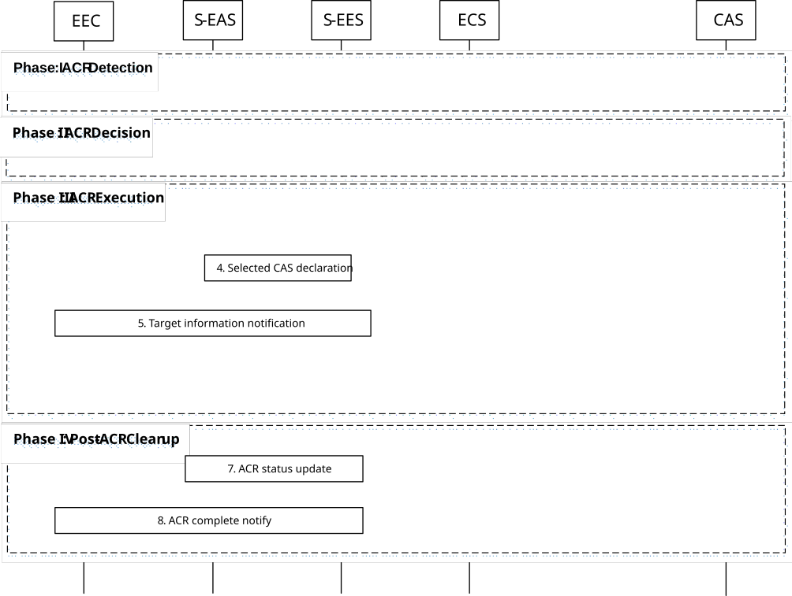
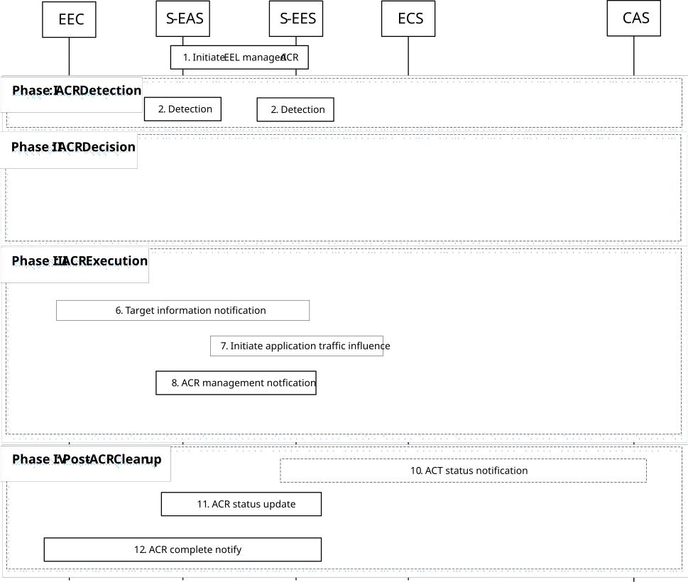
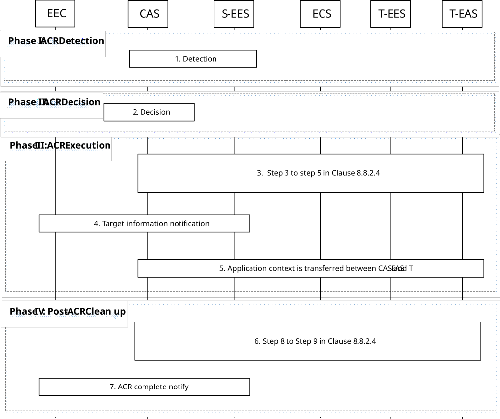

# 8.8.2A Scenarios for ACR between EAS and CAS

## 8.8.2A.1 General

Service continuity between CAS and EAS is supported without CES, corresponding to the architecture options described in clause 6.2c. The ACR can be triggered by a change or expected change in UE location or in case of an overload situation or maintenance aspects in the S-EAS or EDN if no suitable target EAS is found as described in clause 8.8.1.1 depending on the scenario.

To facilitate future ACRs from the CAS back to EAS, the EEC may request and receive an AF-specific UE ID or Edge UE ID from the S-EES as described in clause 8.6.5, which can be used by the CAS to perform EAS discovery on the S-EES when there is an ACR from CAS back to an EAS. The EEC may also request to subscribe to notifications from the S-EES via the SEAL notification management service as described in clause 9.1 to receive ACR notifications if the EEC is no longer within reach from the S-EES.

## 8.8.2A.2 Enabling ACR with CAS - Initiation by EEC using regular EAS Discovery

In this scenario, ACR is a result of the UE moving to, or the UE expecting to move to, a new location which is outside the service area of the serving EAS. It further relies on the EEC being triggered as a result of the UE's movement.

This scenario is based on Service Provisioning (as specified in clause 8.3) and DNS procedures to discover the CAS that shall serve the AC as a result of the UE's new location, and that shall receive the Application Context from the serving EASs. The scenario below describes the relocation of a single application context to a CAS. However, it should be repeated for each active AC in the UE for which EAS or EDN is not available on that UE location.

This scenario description is same as described for figure 8.8.2.2-1 except for the following clarifications:

Pre-conditions: Same pre-conditions apply described for figure 8.8.2.2-1.

Figure 8.8.2A.2-1: Enabling ACR with CAS - Initiation by EEC using regular EAS Discovery

Phase I: ACR Detection

1\. Same as step 1 described for figure 8.8.2.2-1.

Phase II: ACR Decision

2\. Same as step 2 described for figure 8.8.2.2-1.

Phase III: ACR Execution

3\. The EEC performs Service Provisioning (as specified in clause 8.3) for all active applications that require ACR. Since the location of the UE has changed, this procedure results in unavailability of T-EESs that are relevant to the supplied applications and the new location of the UE.

4\. If the change in the UE's location triggers a need to change the S-EAS but the EEC is not provided with a T-EAS, the EEC informs the AC of the unavailability of a suitable EDN for the new location of the UE.

5\. The AC triggers the UE to perform DNS resolution for the CAS relevant for the AC. The UE may need to establish a new PDU connection to the CAS.

6\. The AC sends ACR request to the EEC and the EEC responds ACR response to the AC.

7\. The EEC performs ACR launching procedure (as described in clause 8.8.3.4) to the S-EES with the ACR action indicating ACR initiation and the corresponding ACR initiation data (along with the details of the CAS and without the need to notify the EAS). The S-EES may apply the AF traffic influence with the N6 routing information of the CAS in the 3GPP Core Network (if applicable), as described in clause 8.8.3.4. Based on the received CAS information, the S-EES informs the CAS with the S-EES endpoint information by selected EES declaration request as described in clause 8.8.3.10.

8\. The AC is triggered by the EEC to start ACT. The AC decides to initiate the transfer of application context from the S-EAS to the CAS.

After the ACT is completed, the AC remains connected to the CAS and disconnects from the S-EAS; the EEC is informed of the completion of the ACT.

The S-EAS or CAS can further decide to terminate the ACR, and the CAS can discard the application context (e.g. based on monitoring the location of the UE). It is up to the implementation of the S-EAS and CAS whether and how to make such a decision.

Phase IV: Post-ACR Clean up

9\. Same as step 9 described for figure 8.8.2.2-1.

10\. Same as step 11 described for figure 8.8.2-1.

## 8.8.2A.3 Enabling ACR with CAS - EEC executed ACR via S-EES

In this scenario, the EEC is triggered as a result of the UE's movement as described in clause 8.8.1.1A. Figure 8.8.2A.3-1 illustrates the EEC executing ACR via the S-EES.

This scenario description is same as described for figure 8.8.2.3-1 except for the following clarifications:

Pre-conditions: Same pre-conditions apply described for figure 8.8.2.3-1.

Figure 8.8.2A.3-1: Enabling ACR with CAS - EEC executed ACR via S-EES

Phase I: ACR Detection

1\. Same as step 1 described for figure 8.8.2.3-1.

Phase II: ACR Decision

2\. Same as step 2 described for figure 8.8.2.3-1.

Phase III: ACR Execution

3\. The EEC performs Service Provisioning (as specified in clause 8.3) for all active applications that require ACR. Since the location of the UE has changed, this procedure results in unavailability of T-EESs that are relevant to the supplied applications and the new location of the UE. Service provisioning or discovery of relevant T-EAS may not result in EES configuration or T-EAS is not discovered respectively. If no T-EES is available based on service provisioning response, the AC or EECtriggers the UE to perform DNS resolution for the cloud application server relevant for the AC as described in clause 8.14.2.5.3, 8.14.3.12 and 8.14.3.15. The UE may need to establish a new PDU connection to the CAS.

4\. The EEC performs ACR launching procedure (as described in clause 8.8.3.4) to the S-EES with the ACR action indicating ACR initiation and the corresponding ACR initiation data (along with the details of the CAS and with the need to notify the EAS). The S-EES authorises the request from the EEC. The S-EES decides to execute ACR based on the information received from the EEC and/or EAS profile. The S-EES may apply the AF traffic influence with the N6 routing information of the CAS in the 3GPP Core Network (if applicable) and sends the ACR management notification for the "ACT start" event to the S-EAS, as described in clause 8.6.3, to initiate ACT between the S-EAS and the CAS. Based on the received CAS information, the S-EES informs the CAS with the S-EES endpoint information by selected EES declaration request as described in clause 8.8.3.10. If the EEC has not subscribed to receive ACR information notifications for ACR complete events from the S-EES, the EEC subscribes for the notifications as described in clause 8.8.3.5.2.

5\. The S-EAS transfers the application context to the CAS at implementation specific time. This process is out of scope of the present specification.

NOTE 1: The S-EAS or CAS can further decide to terminate the ACR, and the CAS can discard the application context based on information received from EEL and/or other methods (e.g. monitoring the location of the UE). It is up to the implementation of the S-EAS and CAS whether and how to make such a decision.

Phase IV: Post-ACR Clean up

6\. Same as step 7 described for figure 8.8.2.3-1.

7\. Same as step 9 described for figure 8.8.2.3-1.

NOTE 2: The CAS can perform capability exposure subscription with 3GPP CN directly, upon receiving the application context, which may be helpful for handling future ACR scenarios e.g. ACR from cloud to edge.

## 8.8.2A.4 Enabling ACR with CAS - S-EAS decided ACR

In this scenario, the S-EAS may detect the need of ACR locally or is notified by the S-EES via ACR management notifications for "ACR monitoring" events. The S-EAS make the decision about whether to perform the ACR, and starts the ACR at a proper time.

This scenario description is same as described for figure 8.8.2.4-1 except for the following clarifications:

Pre-conditions: Same pre-conditions apply described for figure 8.8.2.4-1.

Figure 8.8.2A.4-1: Enabling ACR with CAS - S-EAS decided ACR scenario

S-EAS decided ACR is outlined with four main phases: detection, decision, execution and clean up.

Phase I: ACR Detection

1\. Same as step 1 described for figure 8.8.2.4-1.

Phase II: ACR Decision

2\. Same as step 2 described for figure 8.8.2.4-1.

Phase III: ACR Execution

3\. If the ACR required is self detected, the S-EAS requests the S-EES to discover the targets. When S-EES determines that no relevant EAS is available for the UE's location, the discovery response returns T-EAS discovery failure. After S-EAS determines to use CAS and performs the DNS query/discovery, the S-EAS may apply the AF traffic influence with the N6 routing information of the CAS in the 3GPP Core Network (if applicable).

4\. The S-EAS sends selected CAS declaration message to S-EES, to inform S-EES the determined CAS to use as described in clause 8.8.3.7, where T-EAS in that procedure is assumed to be CAS. Based on the received CAS information, the S-EES informs the CAS with the S-EES endpoint information by selected EES declaration request as described in clause 8.8.3.10.

5\. Based on the CAS selection information received from the S-EAS, the S-EES sends the target information notification to the EEC as described in clause 8.8.3.5.3.

6\. The S-EAS transfers the application context to the CAS selected in step 3. This process is out of scope of the present specification.

NOTE 1: The S-EAS or CAS can further decide to terminate the ACR, and the CAS can discard the application context based on information received from EEL and/or other methods (e.g. monitoring the location of the UE). It is up to the implementation of the S-EAS and CAS whether and how to make such a decision.

Phase IV: Post-ACR Clean up

7\. Same as step 8 described for figure 8.8.2.4-1.

8\. Same as step 10 described for figure 8.8.2-1.

NOTE 2: The CAS can perform capability exposure subscription with 3GPP CN directly, upon receiving the application context, which may be helpful for handling future ACR scenarios e.g. ACR from cloud to edge.

## 8.8.2A.5 Enabling ACR with CAS - S-EES executed ACR

Figure 8.8.2A.5-1 illustrates the S-EES detecting, deciding and executing ACR from the S-EAS to the CAS. This may include EELManagedACR by S-EES when initiated by S-EAS as per clause 8.8.3.6.

This scenario description is same as described for figure 8.8.2.5-1 except for the following clarifications:

Pre-conditions: Same pre-conditions apply described for figure 8.8.2.5-1, with the clarification that T-EAS is CAS and pre-condition 5 for EELManagedACR is not applicable.

Figure 8.8.2A.5-1: Enabling ACR with CAS - S-EES executed ACR

1\. Same as step 1 described for figure 8.8.2.5-1.

Phase I: ACR Detection

2\. Same as step 2 described for figure 8.8.2.5-1.

Phase II: ACR Decision

3\. Same as step 3 described for figure 8.8.2.5-1.

4 Same as step 4 described for figure 8.8.2.5-1.

Phase III: ACR Execution

5\. The S-EES determines the targets via the Discover T-EAS procedure in clause 8.8.3.2.

If T-EAS discovery fails, then S-EES triggers DNS query message using the endpoint information (e.g., FQDN) in the S-EAS profile (e.g., EASID).

Based on the determination of CAS, the S-EES informs the CAS with the S-EES endpoint information by selected EES declaration request as described in clause 8.8.3.10. For EELmanagedACR, the CAS subscribe to S-EES to receive ACT status notifications.

6\. Same as step 7 described for figure 8.8.2.5-1.

7\. The S-EES may apply the AF traffic influence with the N6 routing information of the CAS in the 3GPP Core Network (if applicable).

8\. The S-EES sends the ACR management notification (e.g. as notification for "ACR facilitation" event or "ACT start" event as described in clause 8.6.3 or due to step 1) to the S-EAS to initiate ACT between the S-EAS and the CAS.

9\. The Application Context is transferred from S-EAS to the CAS at implementation specific time. In the case of EELManagedACR, the S-EES accesses the Application Context from the address as per step 1 and the S-EES either engage in the ACT from S-EAS to the CAS (obtained as per step 5) in a secure way. Further the CAS accesses the Application Context. The S-EAS may also perform the ACT directly with CAS, the specification of such process is out of scope of the present document.

NOTE 1: The Application Context is encrypted and protected by the application layer. The S-EES engages in the packet level transport of the Application Context and has no visibility to the content of the Application Context.

NOTE 2: The S-EAS or CAS can further decide to terminate the ACR, and the CAS can discard the application context based on information received from EEL and/or other methods (e.g. monitoring the location of the UE). It is up to the implementation of the S-EAS and CAS whether and how to make such a decision.

Phase IV: Post-ACR Clean up

10\. Same as step 11 described for figure 8.8.2.5-1.

11\. Same as step 12 described for figure 8.8.2.5-1.

12\. If the status in step 11 indicates a successful ACT, the S-EES sends the ACR information notification (ACR complete) message to the EEC to confirm that the ACR has completed as specified in clause 8.8.3.5.3.

NOTE 3: The Application Client mechanism to support switchover of the application traffic to CAS is out of scope of the specification.

## 8.8.2A.6 CAS decided ACR scenario via last S-EES

In this scenario, the CAS detects the need for ACR and makes the decision about whether to perform the ACR and starts the ACR at a proper time.

During the ACR execution phase, the CAS may need to determine an EES in the service area of the EEC before continuing with T-EAS discovery. The CAS may send the EAS discovery request to the S-EES that selects an appropriate T-EES and T-EAS as per clause 8.8.3.2 where the CAS acts as a S-EAS.

Pre-conditions:

\- The CAS has a business relationship with the ECSP, otherwise, the EES will reject the CAS request during authorization.

\- Prior to being connected to the CAS, the EEC was connected to an S-EES that may still hold its context and the CAS knows the S-EES (e.g. as in clause 8.8.3.10 when ACR is performed from EAS to CAS).

\- AC has obtained the UE ID as per clause 8.14.2.6 and forwarded it to the CAS while performing ACR from EAS to CAS as described in clause 8.8.2A.1 or the CAS knows UE ID having used the procedure defined in clause 8.6.5.

Figure 8.8.2A.6-1: CAS decided ACR with T-EAS Discovery via S-EES

**Phase I: ACR Detection**

1\. The CAS detects the need for ACR. The CAS either receives ACR management notifications from S-EES indicating that ACR may be required ("ACR monitoring" event), or self detects the need for ACR (e.g. upon receipt of a "user plane path change" event).

**Phase II: ACR Decision**

2\. The CAS makes the decision to perform the ACR.

**Phase III: ACR Execution**

3\. Same as steps 3 to 5 in clause 8.8.2.4 where the CAS acts as an S-EAS and it may provide the UE ID in the T-EAS discovery request for the S-EES to identify the UE during discovery. If ACR monitoring event is used in step 1, the T-EAS discovery in step 3 of clause 8.8.2.4 is skipped by the CAS.

4\. If the S-EES can communicate with the EEC, step 6 from clause 8.8.2.4 is performed to notify the EEC of the selected T-EES. Otherwise, the notification is sent to the EEC via the SEAL notification management service as described in clause 9.1 if the EEC has subscribed to receive notifications from the S-EES or via Application Triggering via core network.

5\. Same as step 7 in clause 8.8.2.4 where the CAS acts as an S-EAS.

**Phase IV: Post-ACR Clean up**

6\. Same as step 8 to step 9 in clause 8.8.2.4 where the CAS acts as an S-EAS.

7\. If the S-EES can communicate with the EEC, step 10 from clause 8.8.2.4 is performed. Otherwise, the notification is sent to the EEC via the SEAL notification management service as described in clause 9.1 if the EEC has subscribed to receive notifications from the S-EES or via Application Triggering via core network.
