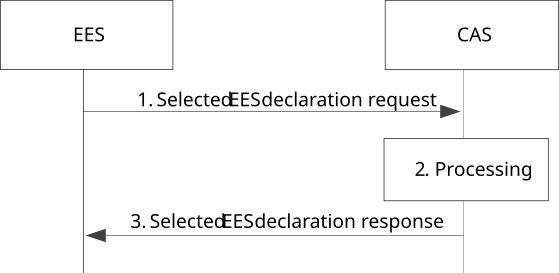

# 8.8.3.10 Selected EES declaration

The selected EES declaration request is triggered when an ACR is performed from EAS to CAS.

Figure 8.8.3.10-1 illustrates the interactions between the EES and the CAS for the selected EES declaration.

Pre-conditions:

1\. A serving EES is selected for the EEC and the serving EES decides to inform CAS. The serving EES is the last EES serving the EEC during the ACR from EAS to CAS.

2\. AC has requested and forwarded the UE ID as per clause 8.14.2.6 while performing ACR from EAS to CAS as described in clause 8.8.2A or the CAS knows UE ID using procedure defined in clause 8.6.5.

Figure 8.8.3.10-1: Selected EES declaration procedure

1\. The EES sends Selected EES declaration request message to the CAS. The request includes the information of the selected EES and may include ACID to indicate which AC the EES is intended for.

2\. The CAS checks whether the requesting EES is authorized to perform operation. If authorized, the CAS stores the received information.

3\. The CAS responds the request with Selected EES notification declaration response message.

The CAS, after knowing the selected EES for the UE, may subscribe to receive ACT status notifications as described in clause 8.8.3.6.2.3 for EELManagedACR, or trigger service continuity procedures towards the selected EES.
