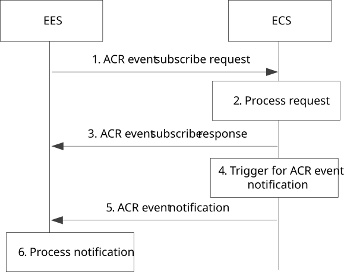

# 8.8.3.11 ACR event subscription and notification procedure

Figure 8.8.3.11-1 illustrates the procedure for the EES to subscribe ACR event exposure service from the ECS and the procedure for the EES to receive ACR event notification from the ECS.

Pre-condition:

1\. The EES is registered with the ECS.

Figure 8.8.3.11-1: Subscribe and notify ACR event procedure

1\. The EES involved in edge application facilitation (e.g. being informed by EEC with EAS information provisioning with EAS selection) subscribes to ECS provided ACR event exposure service.

For EDN overload event, the EDN information is included for ECS to monitor EDN load.

2\. If the request is authorized, the ECS processes the request.

For EDN overload event, the ECS subscribed to ADAES edge load analytics (statistics or prediction) as specified in clause 8.8.2.1 of TS 23.436 \[28\]) for monitoring EDN load.

NOTE: The ECS updates the existing ADAES edge load analytics subscription if new EES request for EDN overload of the same EDN is received later.

3\. The ECS responds the EES with ACR event subscribe response.

4\. An event occurs at the ECS that satisfies trigger conditions for notification.

For EDN overload event, the ECS is notified by the ADAES for EDN load stats information. If the ECS detects that the EDN identified by DNN and DNAI(s) is overloaded, the ECS determines impacted EES(s) of the same EDN. The ECS also determines a relocation ratio that will mitigate the EDN overload situation for the impacted EES(s).

5\. The ECS notifies each impacted EES with EDN overload event in ECS event notification.

6\. Based on the received relocation ratio, the EES determines applications to be relocated and also impacted UEs (and EECs). Further, the EES continues with ACR execution phase as described in clause 8.8.2.5 for each impacted EEC in UE.

The EES may unsubscribe ACR events by sending an ACR event unsubscribe request to the ECS, then the ECS terminates corresponding subscription and responds with ACR event unsubscribe response.
