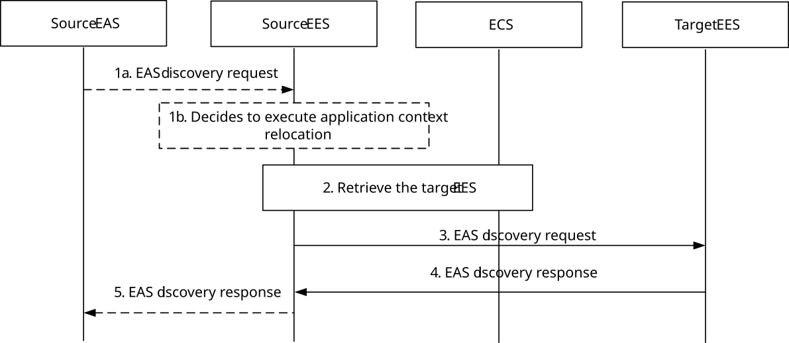

# 8.8.3.2 Discover T-EAS

Figure 8.8.3.2-1 illustrates the procedure for fetching T-EAS information. This procedure may be utilized by a S-EAS, which undertakes the transfer of application context information to a T-EAS directly, or can be invoked by the S-EES itself on deciding to execute ACR.

T-EAS discovery procedure also supports EAS retrieval which enables a S-EAS to obtain T-EAS(s) serving the application group so that the S-EAS can start communication with obtained EAS(s) for EAS content synchronization.

Pre-conditions:

1\. Information related to the EES is available with the S-EAS, if the procedure is triggered by the S-EAS.

Figure 8.8.3.2-1: Discover T-EAS

1a. The S-EAS sends the EAS discovery request to the S-EES or the S-EES decides to execute the ACR based on the “ACR management” events as described in clause 8.6.3. The EAS discovery request from the S-EAS includes the requestor identifier \[EASID\] along with the security credentials and includes EAS discovery filter matching its EAS profile. If target DNAI or candidate DNAIs for common EAS case is available at the S-EAS via User Plane Path change event, the S-EAS provides the S-EES with the target DNAI or candidate DNAIs. If target tunnel information is available at the S-EAS via User Plane Path change event, the S-EAS provides the S-EES with the target tunnel information. The S-EAS also includes an EAS service continuity support indicator indicating that the S‑EAS decided ACR according to clause 8.8.2.4 is to be used for the ACR. The S-EAS includes the bundle ID and bundle type indicating the proxy bundle case to which the S-EAS belongs to. The request may include prediction expiration time.

> The EAS may send EAS discovery request with EAS ID, Application Group ID and EAS content synchronization support, which indicates the request to obtain EAS(s) currently serving the Application Group ID with the requested EAS ID in order to perform EAS content synchronization.
>
> The Application group ID is included in the EAS discovery request if the S-EAS wants to discover a common T-EAS for UE in the group due to UE's movement.
>
> If the EAS discovery request is triggered by S-EAS due to overload or maintenance reason for the Application Group, the S-EAS also includes list of UE IDs in the EAS discovery request.

NOTE 1: The trigger condition to invoke the Discover T-EAS API is up to application service logic, which is out of scope of this specification.

1b. The S-EES either receive the target DNAI and/or target tunnel information for T-EES discovery from the step 1a or by the user plane management event notification from the core network.

2\. If the request is received from the S-EAS, the S-EES checks whether the requesting EAS is authorized to perform the discovery operation.

> If Application Group ID and EAS content synchronization support in EAS characteristics are received and the ECS-ER is available, the S-EES checks with the ECS-ER with the received EAS ID and Application Group ID and obtains a list of EAS(s) supporting EAS content synchronization and serving the application group for the desired application service identified by the EAS ID as described in clause 8.20. Step 2 to step 4 are skipped.
>
> If the UE location is not known to the S-EES or provided by the S-EAS request, then the S-EES may interact with 3GPP core network to retrieve the UE location. If the S-EES decided to execute the ACR or when the requesting EAS is authorized, the S-EES checks if there exists a T-EAS information (registered or cached) that can satisfy the requesting EAS information, target DNAI, target tunnel information, additional query filters and the Expected AC Service KPIs and the Minimum required AC Service KPIs if received from the EEC during the EAS discovery or from the S-EAS in step 1. In this case, the S-EES may collect Edge load performances from ADAES or OAM to find T-EAS(s) that satisfies the Expected AC service KPIs or the Minimum required AC Service KPIs. The S-EES may determine the use of statistics or prediction for evaluating KPIs based on the situation of the T-EAS discovery. If target tunnel information is received, the S-EES additionally takes the target tunnel information into consideration in identifying T-EAS(s). For instance, the IP address(es) of identified T-EAS(s) needs to be topologically close to the IP address of the target tunnel server. The S-EES also considers resource consumption needs for the list of UEs (e.g. received in step 1a) when identifying T-EAS(s). If Application Group ID is not received and if the S-EES finds the T-EAS(s) in the cached or registered information, the flow either continues with step 5 for the S-EAS triggered discovery or stops for the S-EES decided ACR execution, else the S-EES retrieves the T-EES address from the ECS as specified in clause 8.8.3.3 and continues with step 3.

If UE ID list is available in the S-EES (e.g. received in step 1a or known by the S-EES via other means):

\- for UE(s) not in the overlapping EDN area (e.g. UE is not in the common S-EAS service area), the S-EES tries to identify a T-EAS within locally registered EAS(s) based on UE location, EAS discovery filters and application group profile.

\- for UE(s) in the overlapping EDN area, the S-EES checks if there is available common S-EAS in each EDN which has overlapping EDN area with the current UE related EDN by using procedure described in clause 8.20.2.2 when common EAS information is available at S-EES or ECS-ER. If any common EAS is found, the S-EES decides whether to select an available common EAS or locally registered T-EAS as common EAS considering UE location, EAS discovery filters, application group profile, and E2E response time and continues with step 5; otherwise, the S-EES tries to identify a T-EAS within locally registered EAS(s).

Updating common EAS with registered T-EAS in the ECS-ER is needed as described in clause 8.20.2.5 when locally registered T-EAS is selected by the S-EES. If no registered T-EAS can be found, the S-EES continues with step 5.

> If Application group ID is available in the S-EES (e.g. received in step 1a or ACR management event subscription), the S-EES retrieves T-EES information and corresponding EDN connection information from the ECS as described in clause 8.8.3.3.
>
> If Prediction expiration time is provided then the EES may determine whether to identify the instantiable but not instantiated EAS as T-EAS based on Prediction expiration time and the predicted EAS deployment time information obtained from ADAES as specified in clause 8.11 of TS 23.436 \[28\] or from local configured maximum EAS deployment time.

3\. The S-EES invokes the EAS discovery request on the T-EES retrieved from the ECS. The EAS discovery request includes the requestor identifier \[EESID\] along with the security credentials and includes EAS discovery filter. In the EAS discovery filter, the S-EES may include prediction expiration time, the Expected AC Service KPIs and the Minimum required AC Service KPIs if received from the EEC during the EAS discovery or from the S-EAS in step 1. If target tunnel information is available at the S-EES (e.g. received from S-EAS in step 1a or by the user plane management event notification from the core network), the S-EES provides the T-EES with the target tunnel information.

The S-EES also includes the EEC service continuity support indicator received from the EEC during EAS discovery. If in step 1 the S-EES received an EAS service continuity support indicator from the S-EAS, then the S-EES includes this EAS service continuity support indicator and its own EES service continuity support indicator indicating the ACR scenarios supported by the EES. If in step 1 the S-EES decided to execute the ACR, the S-EES includes the EAS service continuity support indicator received from the S-EAS during EAS registration and includes an EES service continuity support indicator indicating that the S‑EES executed ACR according to clause 8.8.2.5 is to be used for the ACR.

Upon receiving the request, the T-EES may trigger the ECSP management system to instantiate the T-EAS that matches with EAS discovery filter IEs (e.g. ACID) as in clause 8.12.

4\. The T-EES discovers the T-EAS(s) and responds with the discovered T-EAS information to the S-EES. To filter T-EAS(s), the T-EES utilizes the discovery filters (e.g. Expected AC Service KPIs and the Minimum required AC Service KPIs) and the indications which ACR scenarios are supported by the AC, the EEC, the T-EES and the S-EAS. If T-EES gets the Expected AC service KPIs or the Minimum required AC Service KPIs, the T-EES may collect edge load analytics from ADAES (as specified in clause 8.8.2 of TS 23.436 \[28\]) or performance data from OAM to find T-EAS(s) that satisfies the Expected AC service KPIs or the Minimum required AC Service KPIs. The T-EES may determine the use of statistics or prediction for evaluating KPIs based on the situation of the T-EAS discovery. The S-EES may cache the T-EAS information.

> When the T-EES accepts the request and determines to trigger the EAS instantiation, then the response may indicate that the EAS instantiation is in progress so that the detailed EAS profile information will be available later. When S-EES receives the EAS instantiation in progress indication, the S-EES may send EAS discovery subscription request message if not subscribed yet or send EAS discovery request message later to the T-EES for obtaining updated EAS information.
>
> When the bundle EAS information (i.e. list of EASID) is provided and the bundle type indicating the direct bundle, and the S-EES received associated T-EES(s) along with part of EAS ID list in the step2 from the ECS, then the S-EES discover the target direct bundle EAS(s) which belongs to same EDN for all the associated S-EES(s). The request message contains direct bundle EAS(s) information (i.e. list of EASID and direct bundle type) , then the T-EES determines the direct bundle T-EAS(s) based on the bundle EAS information (e.g. list of EASIDs). Then the S-EES receives the direct bundle T-EAS(s) information from each associated T-EES(s).

NOTE 2: T-EES(s) may belongs to same EDN.

NOTE 3: The edge load analytics from ADAES can be either statistics or predictions on the T-EAS.

NOTE 4: The statistical KPI value can be used for both normal ACR and service continuity planning.

If target tunnel information is received, the T-EES additionally takes the target tunnel information into consideration in identifying T-EAS(s). For instance, the IP address(es) of identified T-EAS(s) needs to be topologically close to the IP address of the target tunnel server.

> When the ECS-ER is available and common EAS information corresponding to the Application Group ID (received in step 1a or ACR management event subscription) is not available, then the S-EES identifies one T-EAS for the application group and interacts with the ECS-ER to store the common EAS information as described in clause 8.20.2.3. If common EAS information is already available corresponding to the Application Group ID in the repository, then the ECS-ER returns the common EAS information to the S-EES as described in clause 8.20.2.3.

5\. If the request was received from the S-EAS, the S-EES responds to the S-EAS with the discovered T-EAS Information.

> For responding to the S-EAS which is requesting EAS(s) serving the application group for EAS content synchronization purpose, only EAS endpoint and EAS ID are included in EAS profile of Discovered EAS list.
