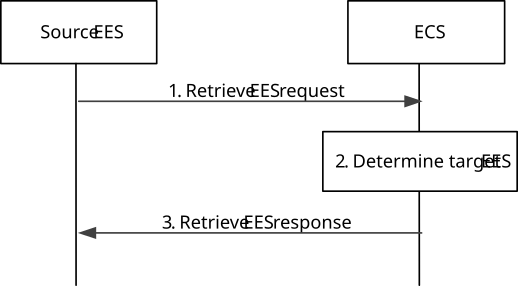

# 8.8.3.3 Retrieve T-EES procedure

Figure 8.8.3.3-1 illustrates the procedure for the S-EES to retrieve the T-EES information from the ECS. This procedure is also applicable for the CES to retrieve the T-EES information.

Pre-condition:

1\. The S-EES has been pre-configured with the address of the ECS; and

2\. The AC at the UE already has on-going application traffic with the S-EAS.

Figure 8.8.3.3-1: Retrieve T-EES procedure

1\. The S-EES sends the Retrieve EES request (UE location information or UE identity, EASID of the S-EAS, bundle ID, bundle type (i.e. proxy bundle case), target DNAI/candidate DNAI(s) for common EAS case and UE connectivity information) to the ECS in order to identify the T-EES which has an EAS available to serve the given AC in the UE. For obtaining announcement EES list, the Retrieve EES request includes application group id. The request message may also contain the AC, EEC service continuity support information. If target tunnel information is available at the S-EES, then the S-EES provides also the tunnel information to the ECS.

2\. If the request contains the UE identity (e.g. GPSI) but the UE location is not known to the ECS, then the ECS interacts with 3GPP core network to retrieve the UE location. The ECS determines T-EES(s) as per the parameters (e.g. EASID, target DNAI) in the request and the UE location information. If the request message contains the AC, EEC service continuity support information, then the ECS may identify the T-EES taking the AC, EEC, T-EES service continuity support into consideration. The ECS may take the EAS(s) load information corresponding to the EASIDs registered with EES in the EDN(s) or use ADAES Edge load analytics as specified in clause 8.8.2 of TS 23.436 \[28\]) to take EDN load into consideration in identifying T-EES(s). When the bundle ID and is provided and bundle type indicating the proxy bundle case then the ECS can identify the T-EES based on the bundle ID in the EES profile and in the request message to ensure T-EAS is able to invoke the required proxy bundle EAS(s) as the S-EAS does.

If the Prediction expiration time is provided then the ECS may determine whether to identify T-EES with the instantiable but not instantiated EAS based on Prediction expiration time and predicted EAS deployment time information obtained from ADAES as specified in clause 8.11 of TS 23.436 \[28\] or from local configured maximum EAS deployment time.

If no ECS-ER is available and when the Retrieve EES request includes application group id to the ECS then the request EES list retrieval is for the announcement of common EAS, ECS determines the list of EESs serving the EASs (with same EASID) for the Group ID included in the Retrieve EES request.

If the ECS does not identify any suitable EES(s) based on EDN configuration available at the ECS and UE’s location, the ECS determines a partner ECS that may satisfy the requirements. Based on ECSP policy, the ECS may use preconfigured or OAM configured information about the partner ECSs or ECS discovery via ECS-ER as specified in clause 8.17.2.3 or both.

If required by the ECSP policies, the ECS may use service provisioning information retrieval procedure as specified in clause 8.17.2.4 to obtain service provisioning information from the partner ECS.

> When the bundle EAS information is provided, then if bundle EAS information includes a list of EASIDs, then the ECS identifies the one or more T-EES associated with the same EDN which support all of the EASs within the same EDN based on the EES EDN information obtained in the EES profile and bundle EAS information (e.g. list of EASIDs).

NOTE 1: T-EES(s) may belongs to same EDN.

If tunnel information is received, the ECS additionally takes the tunnel information into consideration in identifying EES(s). For instance, the IP address(es) of identified EES(s) needs to be topologically close to the IP address of the tunnel server.

3\. The ECS sends the Retrieve EES response. If the ECS has determined the EDN configuration information, the retrieve EES response includes the list of EDN configuration information to the S-EES. The list of EDN configuration information includes the EDN details with the endpoint information of T-EES(s) as described in table 8.3.3.3.3-2. If the ECS has determined suitable partner ECS(s) instead, the retrieve EES response includes a list of ECS configuration information.

> The ECS may provide associated T-EES(s) information (one or more T-EES information) to the S-EES in the Retrieve T-EES response along with the bundle EAS information (i.e. list of EASIDs). When S-EES receives multiple associated T-EES(s), then each associated T-EES information is provided along with the part of the EAS ID list.

If the retrieve EES response contains a list of ECS configuration information, the S-EES may initiate retrieve T-EES procedure with one or more ECS(s) listed in the retrieve EES response.

NOTE 2: The Retrieve EES request initiated by the S-EES can be restricted only to its registered ECS.
