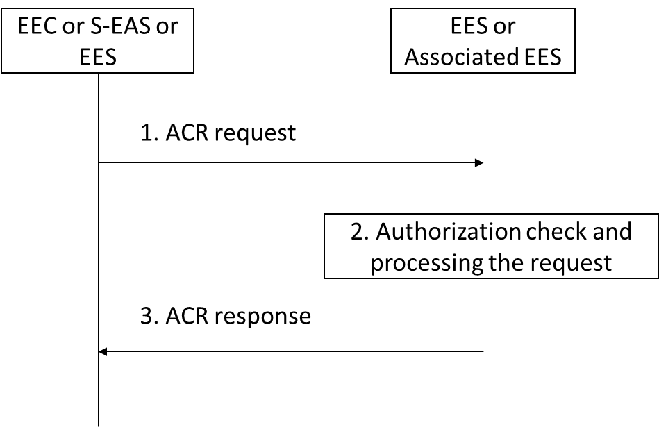

# 8.8.3.4 ACR launching procedure

Figure 8.8.3.4-1 illustrates the ACR launching procedure by the EEC or the S‑EAS or the S-EES.

If this procedure is triggered by the EEC, depending on the ACR action indicated in the ACR request, the procedure is used for ACR initiation, ACR determination or ACR modification which is described in clause 8.8.1.4. The procedure of the ACR initiation can be re-sent as described in clause 8.8.1.3 to cancel an ACR.

If this procedure is triggered by the S‑EAS, the procedure is used for ACR determination.

If this procedure is triggered by the S-EES to the associated S-EES(s), this procedure is used for the direct bundle EAS case.

Pre-condition:

For EEC as consumer:

1\. The EEC has been authorized to communicate with the EES as specified in clause 8.11, if the procedure is triggered by the EEC.

For S-EAS as consumer:

1\. Information related to the S‑EES is available with the S-EAS.

For EES as consumer:

1\. The S-EES obtained the associated S-EES(s) information as specified in clause 8.15.2.2.

Figure 8.8.3.4-1: ACR launching procedure

1\. The EEC or the S‑EAS sends an ACR request message to the EES in order to start ACR. The ACR request message may include Predicted/Expected UE location or Expected AC Geographical Service Area to indicate that the EES should detect whether the UE has moves to the Predicted/Expected UE location or Expected AC Geographical Service Area or not in ACR clean-up phase. The ACR request message includes ACR action to indicate either ACR initiation request or ACR determination request. If the procedure is triggered by the S‑EAS, the ACR request message is only for ACR determination.

An ACR request for ACR initiation sent by the EEC:

\- includes an indication of whether the EEC requests the EES to perform EAS notification; and

\- provides information used by EES to perform AF traffic influence as in 3GPP TS 23 501 \[2\].The EEC sent ACR request for ACR initiation shall include the simultaneous EAS connectivity information in service continuity (see table 8.8.4.4-1) if previously received as part of the AC profile.

An ACR request for ACR determination sent either by the EEC or the EAS informs the EES that the need for ACR has been detected by the requestor.

An ACR request for ACR modification sent by the EEC:

\- includes IDs to identify the ACR that is requested to be modified; and

\- includes the ACR parameters to be modified.

An ACR request for direct bundle EAS case sent by the S-EES:

\- includes direct bundle T-EAS(s) received in step 4 in 8.8.3.2 related to the associated S-EES(s) based on the EASID, which EASID of the associated S-EES is corresponding to the direct bundle T-EAS(s) profile.

2\. The EES checks if the requestor is authorized for this operation. If authorized, the EES processes the request and performs the required operations.

If the request in step 1 is for ACR initiation:

\- the EES may use information provided in the request to apply the AF traffic influence with the N6 routing information of the T-EAS in the 3GPP Core Network (if applicable), as described in 3GPP TS 23.501 \[2\], clause 5.6.7.1; and

NOTE 1: The simultaneous EAS connectivity information sent by EES is used to maintain both S-PSA and T-PSA in supporting simultaneous connectivity with both S-EAS and T-EAS during the service continuity as described in clause 6.3.4 of 3GPP TS 23.548 \[20\].

NOTE 2: If the EES is notified from the 3GPP CN that the simultaneous EAS connectivity information is not supported as described in 3GPP TS 23.502 \[3\] during the invocation procedure of AF traffic influence API, then the EES should be aware of that the simultaneous EAS connectivity is not supported and provide the response indicating simultaneous EAS connectivity unsupported to the EAS or EEC.

\- if the EAS notification indication in ACR initiation data is provided in the step 1 request and the EAS has subscribed to receive such notification, the EES shall notify the EAS indicated in the ACR initiation data about the need to start ACR by sending an ACR management notification for the "ACT start" event, as described in clause 8.6.3.

If the request in step 1 is for ACR determination, the EES decides to execute ACR as described in clause 8.8.2.5.

If the request in step 1 includes Previous T-EAS Endpoint:

\- if the previous EAS notification indication is provided in the step 1 request and the EAS has subscribed to receive such notification, the EES shall notify the EAS about the cancellation of the ACR with the previous T-EAS by sending an ACR management notification for the "ACT stop" event, as described in clause 8.6.3.

\- The EAS will inform the remote EAS about application context cancellation, which is outside the scope of this specification. The T-EAS sends the ACR status update message to the T-EES which will include failed result with an appropriate cause indicating the reason for the failure.

If the request in step 1 is for ACR modification:

\- the EES identifies the ACR to be modified based on the ID parameters in the request in step 1. If the request in step 1 is to the S-EES, the S-EES performs the ACR parameter information procedure as described in clause 8.8.3.9. If the request in step 1 is to the T-EES, and if the T-EAS has subscribed to receive ACR notifications, the T-EES shall notify the T-EAS by sending an ACR management notification, with "ACT start" event including ACR parameters from the request in step 1, e.g. Prediction expiration time.

If the request in step1 is for direct bundle EAS case, then the associated T-EES may use received direct bundle T-EAS(s) for ACR.

3\. The EES responds to the requestor's request with an ACR response message.

> If the request in step 1 includes simultaneous EAS connectivity information in service continuity and if the EES is notified from the 3GPP CN that the simultaneous EAS connectivity is not supported as described in 3GPP TS 23.502 \[3\] and step 2, then the EES provides the response indicating that simultaneous EAS connectivity is not supported to the S-EAS or EEC.

In case of re-sending ACR initiation, if serving EES was changed and EEC context was relocated, the T-EES can clean up any relocated EEC context either indicated in the re-sent ACR request for scenario described in clause 8.8.2.6 or upon reception of the ACR status update with failed result from T-EAS for other scenarios.
