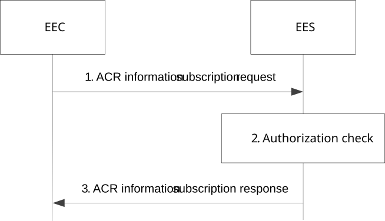
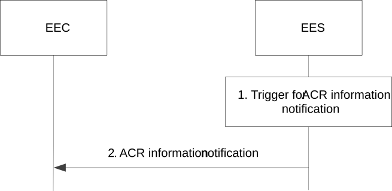
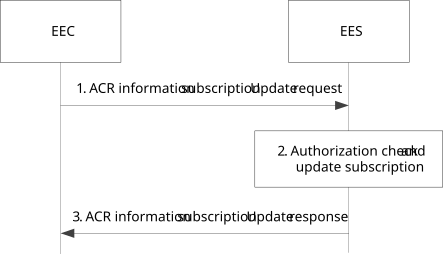
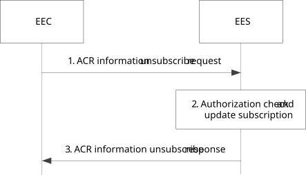

# 8.8.3.5 ACR information subscription

## 8.8.3.5.1 General

Clause 8.8.3.5.2 and clause 8.8.3.5.3 together illustrate the ACR information procedure based on Subscribe/Notify model.

The ACR information procedure is utilized as a building block for a part of Post-ACR Clean up in clause 8.8.2 and Target information notification.

## 8.8.3.5.2 Subscribe

Figure 8.8.3.5.2-1 illustrates the ACR information subscription procedure between the EEC and the EES.

Pre-conditions:

1\. The EEC has received information (e.g. URI, IP address) related to the EES;

2\. The EEC has received appropriate security credentials authorizing it to communicate with the EES as specified in clause 8.11; and

3\. The EEC has optionally acquired a Notification Target Address to be used in its subscriptions to notifications.

NOTE: How the EEC acquires the notification target address or a notification channel URI to receive the notifications is out of scope of this release. The notification target address can terminate at the EEC (e.g. in an IoT device) if the deployment supports EEC reachability, or it can terminate at a push notification service. Details of the push notification service are out of scope of this release.

Figure 8.8.3.5.2-1: ACR information subscription

1\. The EEC sends an ACR information subscription request to the EES. The request from EEC may include the ACIDs to indicate to the EES which ACs are served by the EEC that need to receive ACR information via EEL.

2\. Upon receiving the request from the EEC, the EES checks if the EEC is authorized to subscribe ACR information about the requested EAS(s). If the request is authorized, the EES creates and stores the subscription for ACR information.

3\. The EES sends an ACR information subscription response to the EEC, which includes the subscription identifier and may include the expiration time, indicating when the subscription will automatically expire. To maintain the subscription, the EEC shall send an ACR information subscription update request prior to the expiration time. If an ACR information subscription update request is not received prior to the expiration time, the EES shall treat the EEC as implicitly unsubscribed.

## 8.8.3.5.3 Notify

Figure 8.8.3.5.3-1 illustrates the ACR information notification procedure between the EEC and the EES, which can be used by the EES to notify the EEC of the following:

\- target information, i.e. the details of the selected T-EAS and, if required, the selected T-EES, during ACR as described in clauses 8.8.2.4 and 8.8.2.5;

NOTE: The T-EAS and T-EES information can be used to determine the PDU session(s) to provide connectivity to the T-EAS and the T-EES. If the ACR does not require change in EES, i.e. T-EES is same as S-EES, then the T-EES information can be skipped.

\- ACR complete events.

Pre-conditions:

1\. The EEC has subscribed with the EES for the ACR information as specified in clause 8.8.3.5.2.

Figure 8.8.3.5.3-1: ACR information notification

1\. An event (e.g. ACR complete, or Target information notification) occurs at the EES that satisfies trigger conditions for providing ACR information to a subscribed EEC.

2\. The EES sends an ACR information notification to the EEC with the ACR information determined in step 1. The ACR information notification may include ACID to indicate the application context relocation of the AC is complete. If the S-EES has received the successful EEC Context Push response from T-EES, along with registration ID and the registration expiration time in the EEC Context Push relocation procedure, then the ACR information notification towards EEC also includes the registration ID and registration expiration time under EEC context relocation status (for successful status). Upon receiving the target information notification to indicate start of the ACR execution, the EEC avoids triggering a second ACR execution for the same ACR identity (ACID, UE ID, S-EAS endpoint and T-EAS endpoint) until the current ACR execution is completed.

If during the ACR the EES has received the successful EEC Context Push response from the T-EES and the EEC Context Push response includes T-EES selected ACR scenario list in the EEC Context Push relocation procedure, then the ACR information notification towards the EEC includes the list from T-EES as the selected ACR scenario list under EEC context relocation status (for successful status). Upon receiving the ACR complete notification, if the selected ACR scenario list is not available (for successful status), the EEC may either select ACR scenario considering the supported ACR scenarios of AC, EEC, T-EES and T-EAS or request T-EES to select list of ACR scenarios as specified in clause 8.15.

NOTE: After the ACR complete notification, the selection of the new list of selected ACR scenarios by the EEC or requested by the EEC to the T-EES can be used for handling future ACR scenarios.

After the ACR complete notification with successful ACR, if the ACR complete notification indicates that EEC context relocation has failed the EEC can trigger EAS Information provisioning procedure to perform a re-selection of the ACR scenarios.

If EEC context does not exist, after the ACR complete notification with successful ACR, the EEC can trigger EAS Information provisioning procedure to select the ACR scenarios.

## 8.8.3.5.4 Subscription update

Figure 8.8.3.5.4-1 illustrates the ACR information subscription update procedure between the EEC and the EES.

Pre-conditions:

1\. The EEC has subscribed with the EES for the ACR information as specified in clause 8.8.3.5.2.

Figure 8.8.3.5.4-1: ACR information subscription update

1\. The EEC sends an ACR information subscription update request to the EES.

2\. Upon receiving the request from the EEC, the EES checks if the EEC is authorized for the operation. If authorized, the EES updates the subscription.

3\. The EES sends an ACR information subscription update response to the EEC.

## 8.8.3.5.5 Unsubscribe

Figure 8.8.3.5.5-1 illustrates the ACR information unsubscribe procedure between the EEC and the EES.

Pre-conditions:

1\. The EEC has subscribed with the EES for the ACR information as specified in clause 8.8.3.5.2.

Figure 8.8.3.5.5-1: ACR information unsubscribe

1\. The EEC sends an ACR information unsubscribe request to the EES.

2\. Upon receiving the request from the EEC, the EES checks if the EEC is authorized for the operation. If authorized, the EES terminates the subscription of the EEC.

3\. The EES sends an ACR information unsubscribe response to the EEC.
