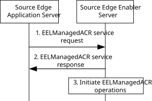
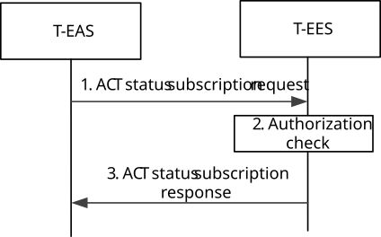
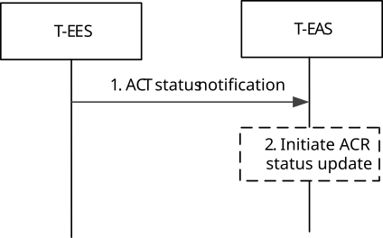

# 8.8.3.6 EELManagedACR procedure

## 8.8.3.6.1 General

This clause introduces a procedure for ACR performed by the Edge Enabler Servers.

When S-EES receives a request for EELManagedACR from S-EAS, the S-EES performs the service operations for the service continuity including detecting the event which may trigger the ACR, making the ACR decision, discovering the T-EAS, accessing and transferring the Application Context to the T-EES/T-EAS, notifying the T-EAS about the available Application Context, notifying the 3GPP network about ACR information, notifying the EEC about the T-EAS information (as per EEC subscription).

The EELManagedACR procedure is designed as an asynchronous operation wherein the S-EES will generate notifications (e.g. failure of any ACR related operation) to the S-EAS while performing the ACR operations.

## 8.8.3.6.2 Procedure

### 8.8.3.6.2.1 General

This clause describes the procedures for S-EAS to request for EELManagedACR and for T-EAS to subscribe for ACT status notification.

### 8.8.3.6.2.2 ACR request

Figure 8.8.3.6.2.2-1 illustrates the procedure for EELManagedACR performed by the Edge Enabler Servers.

Pre-conditions:

1\. Information related to the S-EES is available with the S-EAS.

2\. The T-EAS has subscribed to the ACR related event from the T-EES.

3\. The EEC has subscribed to the ACR related event from the S-EES.

Figure 8.8.3.6.2.2-1: ACR procedure

1\. The S-EAS sends an EELManagedACR service request (UE identifier, EAS characteristics for ACR) to request the S-EES to handle all the service operations of the ACR. The S-EAS may initiate this request with S-EES based on different triggers (e.g. when Application Client is connecting to the S-EAS). An address for accessing the Application Context may be provided if available, which allows the S-EES to access the Application Context generated by the S-EAS for ACT.

2\. The S-EES checks whether the requesting EAS is authorized to perform the operation. If it is authorized, the S-EES responds with an EELManagedACR service response. If no address for accessing Application Context is provided by S-EAS in step 1, then the S-EES provides an address for storing the Application Context by S-EAS.

NOTE: How the EES accesses the Application Context related to the EAS from the address of the Application Context storage is up to implementation and outside the scope of the present document.

3\. The S-EES determines the EELManagedACR operations to be executed as specified in clause 8.8.2.5.

### 8.8.3.6.2.3 ACT status subscription

Figure 8.8.3.6.2.3-1 illustrates the procedure for T-EAS to subscribe for ACT status during EELManagedACR.

Figure 8.8.3.6.2.3-1: ACR procedure

1\. The T-EAS sends an ACT status subscription request to the T-EES.

2\. The T-EES checks whether the requesting T-EAS is authorized to perform the operation. If it is authorized, the T-EES creates the subscription.

3\. The T-EES responds with the ACT status subscription response

### 8.8.3.6.2.4 ACT status notification

Figure 8.8.3.6.2.4-1 illustrates the procedure for T-EES to notify the T-EAS about the status of ACT during EELManagedACR.

Pre-conditions:

1\. ACT between the S-EES and T-EES has been completed.

Figure 8.8.3.6.2.4-1: ACR procedure

1\. The T-EES sends ACT status notification to the T-EAS, notifying about the status of the ACT between the Application Context received from the S-EES.

2\. On receiving a notification about successful ACT, the T-EAS may initiate the ACR status update procedure as described in clause 8.8.3.8.
