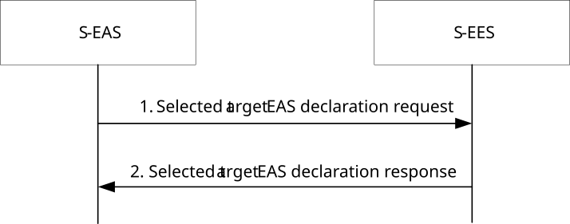

# 8.8.3.7 Selected T-EAS declaration

Figure 8.8.3.7-1 illustrates the interactions between the S-EAS and the S-EES for the selected T-EAS declaration.

Pre-conditions:

1\. The S-EAS has discovered and selected the T-EAS as described in clause 8.8.3.2.

Figure 8.8.3.7-1: Selected target EAS declaration procedure

1\. The S-EAS sends Selected target EAS declaration request message to the S-EES. The request includes the information of the selected T-EAS and may include ACID to indicate which AC the T-EAS is intended for.

2\. The S-EES checks whether the requesting EAS is authorized to perform operation. If authorized, the S-EES responds to the received request with Selected target EAS notification declaration response message. The S-EES also determines the selected T-EES based on the declared T-EAS selection, then S-EES checks whether the EEC (serving the ACs) has subscribed for ACR related information.
