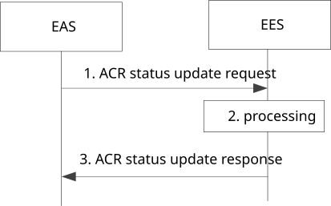

# 8.8.3.8 ACR status update procedure

Figure 8.8.3.8-1 illustrates the procedure for ACR status update, which is triggered by the S-EAS or the T-EAS. In the post-ACR clean up phase of service continuity scenarios described in clause 8.8.2, this procedure may be used by EAS to indicate the status of ACT to their registrar EESs; or used by the T-EAS to update the notification target address and allow the T-EES to indicate the status of EDGE-3 subscription relocation to the T-EAS including subscription ID update for EDGE-3 subscriptions; or both.

Pre-condition:

1\. The ACT procedure between the S-EAS and the T-EAS is either successfully completed or failed.

Figure 8.8.3.8-1: ACR status update procedure

1\. The EAS sends ACR status update request message to the EES, the request may include the ACT result (success or failure). When sent by the T-EAS, the request may include a list of EDGE-3 subscription ID(s) and Notification Target Address for which the T-EAS wants to update. In case of EELManagedACR, the ACT result is not included by the T-EAS.

2\. If the request is authorized by the EES, the EES processes the request. When sent by the T-EAS, if the EDGE-3 subscriptions are available in the T-EES or were successfully relocated during the EEC context relocation procedure, the T-EES updates the Notification Target Address if provided by the T-EAS and may update the list of EDGE-3 subscription ID(s) for the EDGE-3 subscriptions.

> When the ACR status update request message of step 1 includes the ACT result, it shall also include the UEID and endpoint information of the other EAS involved in the ACT. The EES uses UEID and EAS endpoint information to identify the corresponding ACR. In cases where the ACT result indicates failure of the ACR (i.e. failure with a cause indicating cancellation of the ACR), the T-EES which receives the ACR status update request message removes the transferred EEC context.

3\. The EES responds with ACR status update response message to the EAS.If the EEC context has been established and during the ACR the T-EES has provided the Selected ACR Scenario list to the S-EES as a result of a successful push context response as per clause 8.9.2.3, after the successful ACR the T-EES updates the Session Context IE within the EEC Context in Table 8.2.8-1 by replacing Selected ACR scenario list with the Selected ACR Scenario list in the push context response. The T-EES may send the ACR Selection notification to the T-EAS if the T-EAS has subscribed to such a notification.

NOTE: If EES is not changed during ACR, the T-EES and S-EES are the same server.
